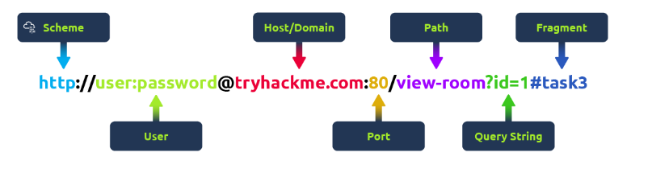
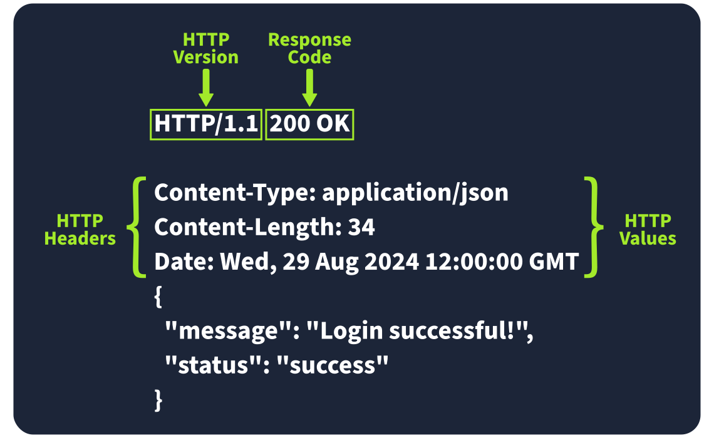

# Web Application Basics


## Mục lục

1. [Task 1: Introduction](#task-1-introduction)
2. [Task 2: Web Application Overview](#task-2-web-application-overview)
3. [Task 3: Uniform Resource Locator](#task-3-uniform-resource-locator)
4. [Task 4: HTTP Messages](#task-4-http-messages)
5. [Task 5: HTTP Request - Request Line and Methods](#task-5-http-request---request-line-and-methods)
6. [Task 6: HTTP Request - Headers and Body](#task-6-http-request---headers-and-body)
7. [Task 7: HTTP Response: Status Line and Status Codes](#task-7-http-response-status-line-and-status-codes)
8. [Task 8: HTTP Response: Headers and Body](#task-8-http-response-headers-and-body)

---

## Nội dung


# Task 1: Introduction
**Giới thiệu**

Chào mừng đến với *Web Application Basics*! Trong phòng học này, chúng ta sẽ đi qua các yếu tố chính của một ứng dụng web, chẳng hạn như URL, các yêu cầu HTTP và phản hồi. Đây là nội dung hoàn hảo nếu bạn mới bắt đầu và muốn nắm bắt những kiến thức cơ bản, hoặc nếu bạn muốn xây dựng hay làm việc với các ứng dụng web.

---

**Mục tiêu học tập**

Sau khi hoàn thành phòng học này, bạn sẽ:

* Hiểu ứng dụng web là gì và cách nó chạy trong trình duyệt web.
* Phân tích các thành phần của một URL và thấy cách nó giúp truy cập tài nguyên web.
* Học cách hoạt động của các yêu cầu (request) và phản hồi (response) HTTP.
* Làm quen với các loại phương thức yêu cầu HTTP khác nhau.
* Hiểu ý nghĩa của các mã phản hồi HTTP khác nhau.
* Tìm hiểu cách các header HTTP hoạt động và tại sao chúng quan trọng đối với bảo mật.

---

# Task 2: Web Application Overview

Hãy tưởng tượng một phép so sánh: một ứng dụng web giống như một hành tinh. Phi hành gia du hành đến hành tinh để khám phá bề mặt của nó, tương tự như cách ai đó sử dụng trình duyệt web để khám phá hoặc duyệt một ứng dụng web. Mặc dù chúng ta chỉ thấy bề mặt của hành tinh, nhưng bên dưới bề mặt có rất nhiều hoạt động. Bạn có thể hình dung toàn bộ hành tinh giống như một web server với nhiều thứ diễn ra bên dưới, nhưng tất cả những gì chúng ta thường thấy chỉ là bề mặt của các trang web hoặc ứng dụng. Giờ đây chúng ta sẽ khám phá các thành phần cấu thành một ứng dụng web.

---

## Front End

**Front End** có thể được coi giống như bề mặt của hành tinh, nơi mà phi hành gia có thể nhìn thấy và tương tác theo các quy luật tự nhiên. Một ứng dụng web sẽ có giao diện người dùng tương tác với nó và sử dụng nhiều công nghệ như **HTML, CSS và JavaScript** để thực hiện điều đó.

---

**HTML** (Hypertext Markup Language) là nền tảng cơ bản của ứng dụng web. Đây là tập hợp các chỉ dẫn hoặc đoạn mã hướng dẫn trình duyệt web hiển thị nội dung gì và hiển thị như thế nào. Nó có thể được so sánh với những sinh vật đơn giản sống trên hành tinh; các sinh vật này có **DNA**, chính là tập hợp hướng dẫn cách chúng được tạo ra.

---

**CSS** (Cascading Style Sheets) trong ứng dụng web mô tả giao diện chuẩn, chẳng hạn như màu sắc, kiểu chữ, bố cục. Tiếp tục với phép so sánh DNA, CSS có thể được coi như những phần DNA mô tả màu sắc, hình dạng, kích thước và kết cấu của sinh vật đơn giản.

---

**JS** (JavaScript) là một phần của front end trong ứng dụng web, cho phép thực hiện các hoạt động phức tạp hơn trong trình duyệt. Trong khi HTML được coi là tập chỉ dẫn đơn giản về những gì cần hiển thị, thì JavaScript là một tập chỉ dẫn nâng cao hơn, cho phép đưa ra lựa chọn và quyết định về những gì sẽ hiển thị. Trong phép so sánh hành tinh, JavaScript có thể được coi là bộ não của một sinh vật tiên tiến, cho phép đưa ra quyết định dựa trên việc có cái gì và cách cái đó tương tác với nó.

## Back End

**Back End** của một ứng dụng web là những thứ bạn không nhìn thấy trong trình duyệt web nhưng lại rất quan trọng để ứng dụng hoạt động. Trên một hành tinh, đó là những thứ không thể nhìn thấy như: các cấu trúc giúp tòa nhà đứng vững, không khí, và lực hấp dẫn giữ cho con người đứng trên mặt đất.

---

**Database**
Là nơi thông tin có thể được lưu trữ, chỉnh sửa và truy xuất. Một ứng dụng web có thể cần lưu và lấy lại thông tin về sở thích của người dùng — ví dụ: hiển thị hay không hiển thị một nội dung nào đó; thông tin này sẽ được lưu trong cơ sở dữ liệu. Trên hành tinh, có thể có những cư dân tiên tiến hơn lưu trữ thông tin về vị trí bản đồ, viết nhật ký hoặc lưu trữ sách trong thư viện, hồ sơ trong tủ tài liệu.

---

**Infrastructure**
Có nhiều thành phần hạ tầng khác hỗ trợ ứng dụng web, chẳng hạn như web server, application server, lưu trữ, các thiết bị mạng, và phần mềm khác hỗ trợ ứng dụng. Trên hành tinh, chúng có thể được ví như những con đường, những chiếc xe chạy trên đường, và nhiên liệu để xe vận hành.

---

**WAF** (Web Application Firewall)
Là một thành phần tùy chọn của ứng dụng web. Nó giúp lọc các yêu cầu nguy hiểm trước khi đến Web Server và cung cấp một lớp bảo vệ. Điều này có thể được so sánh với khí quyển của hành tinh, nơi bảo vệ cư dân khỏi các tia UV có hại.

---

## Tóm tắt

Có nhiều thành phần tham gia vào việc triển khai một ứng dụng web. Các thành phần **Front End** như HTML, CSS, và JavaScript tập trung vào trải nghiệm bên trong trình duyệt. Các thành phần **Back End** như Web Server, Database hay WAF là động cơ bên dưới bề mặt, cho phép ứng dụng web hoạt động. Phần giới thiệu đơn giản này sẽ được mở rộng thêm trong các nhiệm vụ tiếp theo.

## Câu hỏi

**Trả lời các câu hỏi dưới đây**

1. Thành phần nào trên máy tính chịu trách nhiệm lưu trữ và cung cấp nội dung cho các ứng dụng web?

   → **web server** (máy chủ web)

2. Công cụ nào được sử dụng để truy cập và tương tác với các ứng dụng web?

   → **web browser** (trình duyệt web)

3. Thành phần nào hoạt động như một lớp bảo vệ, lọc lưu lượng truy cập đến để chặn các cuộc tấn công độc hại và đảm bảo an ninh cho ứng dụng web?

   → **web application firewall** (tường lửa ứng dụng web)

---

# Task 3: Uniform Resource Locator

>Bộ định vị tài nguyên thống nhất (Uniform Resource Locator - URL)

**Uniform Resource Locator (URL)** là một địa chỉ web cho phép bạn truy cập tất cả các loại nội dung trực tuyến — cho dù đó là một trang web, một video, một bức ảnh, hay phương tiện khác. Nó hướng dẫn trình duyệt của bạn đến đúng vị trí trên Internet.

---

## Cấu trúc của một URL (Anatomy of a URL)

Ví dụ:



* **Scheme** (Giao thức): `http://`
* **User** (Người dùng): `user:password`
* **Host/Domain** (Máy chủ/Tên miền): `tryhackme.com`
* **Port** (Cổng): `:80`
* **Path** (Đường dẫn): `/view-room`
* **Query String** (Chuỗi truy vấn): `?id=1`
* **Fragment** (Đoạn/Thẻ): `#task3`

---

Hãy nghĩ một URL được tạo thành từ nhiều phần, mỗi phần đóng vai trò khác nhau trong việc giúp bạn tìm đúng tài nguyên. Hiểu cách các phần này kết hợp với nhau rất quan trọng cho việc duyệt web, phát triển ứng dụng web, và thậm chí khắc phục sự cố.

Dưới đây là phần phân tích các thành phần chính:

---

**Scheme**
Scheme là giao thức được dùng để truy cập trang web. Phổ biến nhất là **HTTP** (HyperText Transfer Protocol) và **HTTPS** (Hypertext Transfer Protocol Secure). HTTPS an toàn hơn vì nó mã hóa kết nối, đó là lý do các trình duyệt và chuyên gia bảo mật khuyên dùng. Các trang web thường bắt buộc dùng HTTPS để tăng cường bảo vệ.

---

**User**
Một số URL có thể chứa thông tin đăng nhập của người dùng (thường là tên đăng nhập) cho các trang yêu cầu xác thực. Điều này thường xuất hiện trong URL cần thông tin để truy cập một số tài nguyên. Tuy nhiên, ngày nay điều này hiếm gặp vì đặt thông tin đăng nhập trong URL không an toàn — nó có thể làm lộ dữ liệu nhạy cảm, gây rủi ro bảo mật.

---

**Host/Domain**
Host hoặc domain là phần quan trọng nhất của URL vì nó cho bạn biết đang truy cập website nào. Mỗi tên miền phải là duy nhất và được đăng ký thông qua nhà đăng ký tên miền. Từ góc độ bảo mật, cần chú ý đến các tên miền gần giống thật nhưng có khác biệt nhỏ (gọi là **typosquatting**). Các tên miền giả này thường được dùng trong tấn công **phishing** để lừa người dùng cung cấp thông tin nhạy cảm.

---

**Port**
Số cổng (port number) giúp trình duyệt kết nối đúng dịch vụ trên máy chủ web. Nó giống như việc cho máy chủ biết nên dùng “cửa” nào để giao tiếp. Số cổng có thể từ 1 đến 65.535, nhưng phổ biến nhất là:

* **80** cho HTTP
* **443** cho HTTPS

---

**Path**
Path (đường dẫn) chỉ đến tệp hoặc trang cụ thể trên máy chủ mà bạn muốn truy cập. Nó giống như bản đồ hướng dẫn trình duyệt đi đâu. Các website cần bảo mật đường dẫn này để đảm bảo chỉ người dùng được ủy quyền mới có thể truy cập tài nguyên nhạy cảm.

---

**Query String**
Query string là phần của URL bắt đầu bằng dấu hỏi chấm (?). Nó thường được dùng cho các thuật ngữ tìm kiếm hoặc dữ liệu nhập từ biểu mẫu. Vì người dùng có thể chỉnh sửa query string, nên cần xử lý an toàn để tránh các cuộc tấn công như **injection**, nơi mã độc có thể được thêm vào.

---

**Fragment**
Fragment bắt đầu bằng ký hiệu thăng (#) và giúp chỉ đến một phần cụ thể của trang web — ví dụ như nhảy trực tiếp đến một tiêu đề hoặc bảng. Người dùng cũng có thể chỉnh sửa fragment, nên tương tự như query string, cần kiểm tra và làm sạch dữ liệu tại đây để tránh các vấn đề như tấn công injection.

## Câu hỏi

**Trả lời các câu hỏi dưới đây**

1. Giao thức nào cung cấp truyền thông được mã hóa để đảm bảo việc truyền dữ liệu an toàn giữa trình duyệt web và máy chủ web?
  
   → **HTTPS** 

2. Thuật ngữ nào mô tả việc đăng ký tên miền là các biến thể viết sai chính tả của những website phổ biến nhằm khai thác lỗi người dùng và có thể tham gia vào các hoạt động gian lận?
 
   → **Typosquatting** 

3. Phần nào của URL được dùng để truyền thêm thông tin, chẳng hạn như từ khóa tìm kiếm hoặc dữ liệu nhập vào biểu mẫu, đến máy chủ web?

  → **Query String** 

---

# Task 4: HTTP Messages
>Thông điệp HTTP

Thông điệp HTTP là các gói dữ liệu được trao đổi giữa người dùng (client) và máy chủ web. Những thông điệp này rất quan trọng để hiểu cách các ứng dụng web hoạt động vì chúng cho thấy cách yêu cầu của người dùng và phản hồi của máy chủ được truyền đạt.

Hãy tưởng tượng một ví dụ về một **HTTP Request** và một **HTTP Response**, nơi bạn có thể thấy các phần chính như phương thức (method), URL, header và mã trạng thái (status code). Đây chính là những yếu tố làm cho sự tương tác client–server trở nên khả thi.

Có hai loại thông điệp **HTTP**:

* **HTTP Requests**: Được gửi bởi người dùng để kích hoạt các hành động trên ứng dụng web.
* **HTTP Responses**: Được gửi bởi máy chủ để phản hồi lại yêu cầu của người dùng.


Mỗi thông điệp tuân theo một định dạng cụ thể giúp cả người dùng và máy chủ giao tiếp trơn tru.

---

**Start Line**
Dòng bắt đầu giống như phần mở đầu của thông điệp. Nó cho biết loại thông điệp đang được gửi — liệu đó là một yêu cầu từ người dùng hay một phản hồi từ máy chủ. Dòng này cũng đưa ra các chi tiết quan trọng về cách thông điệp cần được xử lý.

---

**Headers**
Header được tạo thành từ các cặp khóa-giá trị cung cấp thông tin bổ sung về thông điệp HTTP. Chúng đưa ra chỉ dẫn cho cả client và server khi xử lý yêu cầu hoặc phản hồi. Các header này bao quát nhiều thứ, như bảo mật, loại nội dung, và nhiều thông tin khác, giúp cho việc giao tiếp diễn ra mượt mà.

---

**Empty Line**
Dòng trống là một vạch ngăn cách nhỏ chia header và body. Nó rất quan trọng vì cho biết header kết thúc ở đâu và nội dung thực sự của thông điệp bắt đầu từ đâu. Nếu không có dòng trống này, thông điệp có thể bị rối loạn và client hoặc server có thể hiểu sai, gây ra lỗi.

---

**Body**
Body là nơi chứa dữ liệu thực tế. Trong một request, body có thể bao gồm dữ liệu mà người dùng muốn gửi đến server (như dữ liệu từ form). Trong một response, đây là nơi server đưa nội dung mà người dùng yêu cầu (ví dụ: một trang web hoặc dữ liệu API).

---

## Tại sao việc hiểu các thông điệp HTTP lại quan trọng

* Đây là nền tảng của cách các ứng dụng web giao tiếp. Nếu được cấu trúc đúng, mọi thứ sẽ vận hành trơn tru.
* Hiểu cách chúng hoạt động sẽ giúp bạn chẩn đoán các vấn đề trong giao tiếp web, có nghĩa là cải thiện hiệu năng và độ tin cậy của ứng dụng web.
* Nó cũng rất quan trọng cho bảo mật. Hiểu các thông điệp HTTP giúp bạn triển khai các biện pháp bảo mật mạnh mẽ để bảo vệ dữ liệu trong quá trình truyền tải.

## Câu hỏi

**Trả lời các câu hỏi dưới đây**

1. Thông điệp HTTP nào được máy chủ web trả về sau khi xử lý yêu cầu của client?

   → **HTTP response**

2. Trong một thông điệp HTTP, phần nào đi sau headers?

   → **Empty Line** (dòng trống)

---

# Task 5: HTTP Request - Request Line and Methods
>Yêu cầu HTTP: Dòng yêu cầu và các phương thức

**HTTP request** là những gì một người dùng gửi đến máy chủ web để tương tác với một ứng dụng web và thực hiện một hành động nào đó. Vì những yêu cầu này thường là điểm tiếp xúc đầu tiên giữa người dùng và máy chủ web, nên việc hiểu cách chúng hoạt động là vô cùng quan trọng — đặc biệt nếu bạn quan tâm đến an ninh mạng.

---


Ví dụ về một HTTP request:

* **HTTP Method**: `GET`
* **Path**: `/user/login.html`
* **HTTP Version**: `HTTP/1.1`

**HTTP Headers**:

```
Host: tryhackme.com
User-Agent: Mozilla/5.0
Accept: */*
Accept-Language: en-US,en;q=0.5
Connection: keep-alive
```

---

Hãy tưởng tượng một HTTP request hiển thị các phần chính như:

* **Method** (ví dụ: GET hoặc POST)
* **Path** (ví dụ: /login)
* **Version** (ví dụ: HTTP/1.1)

Những thành phần này tạo nên những yếu tố cơ bản về cách một client (người dùng) giao tiếp với máy chủ.

## Request Line

Request Line (hoặc dòng bắt đầu) là phần đầu tiên của một yêu cầu HTTP và cho máy chủ biết nó đang xử lý loại yêu cầu nào. Nó có ba phần chính: phương thức **HTTP**, đường dẫn **URL**, và phiên bản **HTTP**.

**Ví dụ:**

```
METHOD /path HTTP/version
```

---

## HTTP Methods

HTTP Methods cho máy chủ biết hành động mà người dùng muốn thực hiện trên tài nguyên được xác định bởi đường dẫn URL. Dưới đây là một số phương thức phổ biến nhất và các vấn đề bảo mật có thể gặp phải:

* **GET**
  Được sử dụng để lấy dữ liệu từ máy chủ mà không thực hiện bất kỳ thay đổi nào. *Nhắc nhở!* Đảm bảo rằng bạn chỉ hiển thị dữ liệu mà người dùng được phép xem. Tránh đưa thông tin nhạy cảm như token hoặc mật khẩu trong các yêu cầu GET vì chúng có thể hiển thị dưới dạng văn bản thuần.

* **POST**
  Gửi dữ liệu đến máy chủ, thường là để tạo hoặc cập nhật một cái gì đó. *Nhắc nhở!* Luôn xác thực và làm sạch dữ liệu đầu vào để tránh các cuộc tấn công như SQL injection hoặc XSS.

* **PUT**
  Thay thế hoặc cập nhật một cái gì đó trên máy chủ. *Nhắc nhở!* Đảm bảo rằng người dùng được ủy quyền để thực hiện thay đổi trước khi chấp nhận yêu cầu.

* **DELETE**
  Xóa một cái gì đó khỏi máy chủ. *Nhắc nhở!* Cũng giống như với PUT, hãy đảm bảo rằng chỉ những người dùng được ủy quyền mới có thể xóa tài nguyên.

---

Ngoài những phương thức phổ biến này, còn có một vài phương thức khác được sử dụng trong các trường hợp cụ thể:

* **PATCH**
  Cập nhật một phần của tài nguyên. Nó hữu ích để thực hiện những thay đổi nhỏ mà không thay thế toàn bộ, nhưng luôn xác thực dữ liệu để tránh sự không nhất quán.

* **HEAD**
  Hoạt động giống như GET nhưng chỉ lấy header, không phải toàn bộ nội dung. Nó hữu ích để kiểm tra metadata mà không cần tải toàn bộ phản hồi.

* **OPTIONS**
  Cho bạn biết những phương thức nào có sẵn cho một tài nguyên cụ thể, giúp client hiểu được họ có thể làm gì với máy chủ.

* **TRACE**
  Tương tự như OPTIONS, nó cho thấy những phương thức nào được cho phép, thường dùng để gỡ lỗi. Nhiều máy chủ vô hiệu hóa nó vì lý do bảo mật.

* **CONNECT**
  Được sử dụng để tạo một kết nối an toàn, như cho HTTPS. Nó không phổ biến nhưng rất quan trọng cho giao tiếp được mã hóa.

---

Mỗi phương thức này đều có tập hợp các quy tắc bảo mật riêng. Ví dụ, các yêu cầu PATCH phải được xác thực để tránh sự không nhất quán, và OPTIONS cũng như TRACE nên được tắt nếu không cần để tránh các rủi ro bảo mật có thể xảy ra.

## Đường dẫn URL (URL Path)

**URL path** cho máy chủ biết nơi tìm tài nguyên mà người dùng đang yêu cầu. Ví dụ, trong URL

```
https://tryhackme.com/api/users/123
```

đường dẫn **/api/users/123** xác định một người dùng cụ thể.

Kẻ tấn công thường cố gắng thao túng đường dẫn URL để khai thác lỗ hổng, vì vậy điều quan trọng là phải:

* Xác thực đường dẫn URL để ngăn truy cập trái phép.
* Làm sạch đường dẫn để tránh các cuộc tấn công injection.
* Bảo vệ dữ liệu nhạy cảm bằng cách thực hiện các đánh giá rủi ro và quyền riêng tư.

Tuân theo các thực hành này sẽ giúp bảo vệ ứng dụng web của bạn khỏi các cuộc tấn công phổ biến.

---

## Phiên bản HTTP (HTTP Version)

**HTTP version** cho thấy phiên bản giao thức được sử dụng để giao tiếp giữa client và server. Sau đây là tóm tắt nhanh về những phiên bản phổ biến nhất:

* **HTTP/0.9** (1991)
  Phiên bản đầu tiên, chỉ hỗ trợ các yêu cầu GET.

* **HTTP/1.0** (1996)
  Thêm header và hỗ trợ tốt hơn cho các loại nội dung khác nhau, cải thiện caching.

* **HTTP/1.1** (1997)
  Giới thiệu kết nối lâu dài, truyền dữ liệu theo từng khối, và caching tốt hơn. Vẫn còn được sử dụng phổ biến hiện nay.

* **HTTP/2** (2015)
  Giới thiệu các tính năng như multiplexing, nén header, và ưu tiên hóa để cải thiện tốc độ.

* **HTTP/3** (2022)
  Xây dựng dựa trên HTTP/2, nhưng sử dụng giao thức mới QUIC để tăng tốc độ và bảo mật cho các kết nối.

Mặc dù **HTTP/2** và **HTTP/3** mang lại tốc độ và bảo mật tốt hơn, nhưng nhiều hệ thống vẫn sử dụng **HTTP/1.1** vì nó được hỗ trợ rộng rãi và tương thích với hầu hết các thiết lập hiện có. Tuy nhiên, việc nâng cấp lên HTTP/2 hoặc HTTP/3 có thể mang lại những cải thiện đáng kể về hiệu năng và bảo mật khi các hệ thống dần áp dụng chúng.

---

## Câu hỏi

**Trả lời các câu hỏi dưới đây**

1. Phiên bản giao thức HTTP nào đã được áp dụng rộng rãi và vẫn là phiên bản được sử dụng phổ biến nhất cho giao tiếp web, nổi tiếng với việc giới thiệu các tính năng như kết nối lâu dài và truyền dữ liệu theo từng khối?

   → **HTTP/1.1** 

2. Phương thức yêu cầu HTTP nào mô tả các tùy chọn giao tiếp cho tài nguyên đích, cho phép client xác định những phương thức HTTP nào được máy chủ web hỗ trợ?

   → **OPTIONS** 

3. Trong một yêu cầu HTTP, thành phần nào chỉ định tài nguyên hoặc endpoint cụ thể trên máy chủ web mà client đang yêu cầu, thường xuất hiện sau tên miền trong URL?

   → **URL Path** 

---

# Task 6: HTTP Request - Headers and Body
>Header yêu cầu (Request Headers)

Request Headers cho phép truyền thêm thông tin đến máy chủ web về yêu cầu. Một số header phổ biến như sau:

---

**Các Request Header phổ biến**

| Request Header   | Ví dụ                                                                            | Mô tả                                                                          |
| ---------------- | -------------------------------------------------------------------------------- | ------------------------------------------------------------------------------ |
| **Host**         | `Host: tryhackme.com`                                                            | Chỉ định tên của máy chủ web mà yêu cầu hướng đến.                             |
| **User-Agent**   | `User-Agent: Mozilla/5.0`                                                        | Chia sẻ thông tin về trình duyệt web mà yêu cầu được gửi từ đó.                |
| **Referer**      | `Referer: https://www.google.com/`                                               | Chỉ ra URL mà yêu cầu được gửi từ đó.                                          |
| **Cookie**       | `Cookie: user_type=student; room=introtowebapplication; room_status=in_progress` | Thông tin mà máy chủ web trước đó đã yêu cầu trình duyệt lưu trữ trong cookie. |
| **Content-Type** | `Content-Type: application/json`                                                 | Mô tả loại hoặc định dạng dữ liệu trong yêu cầu.                               |

## Request Body

Trong các yêu cầu HTTP như **POST** và **PUT**, khi dữ liệu được gửi tới máy chủ web thay vì được yêu cầu từ máy chủ web, dữ liệu đó nằm trong **HTTP Request Body**.
Định dạng của dữ liệu có thể có nhiều hình thức khác nhau, nhưng một số dạng phổ biến là: **URL Encoded, Form Data, JSON, hoặc XML**.

---

* **URL Encoded (application/x-www-form-urlencoded)**
  Một định dạng trong đó dữ liệu được cấu trúc thành các cặp **key=value**.
  Nhiều cặp được phân tách bằng ký hiệu **&**, ví dụ:

  ```
  key1=value1&key2=value2
  ```

  Các ký tự đặc biệt sẽ được mã hóa theo chuẩn percent-encoded.

- Ví dụ:

```bash
POST /profile HTTP/1.1
Host: tryhackme.com
User-Agent: Mozilla/5.0
Content-Type: application/x-www-form-urlencoded
Content-Length: 33

name=Aleksandra&age=27&country=US
```

* **Form Data (multipart/form-data)**
  Cho phép nhiều khối dữ liệu được gửi đi, trong đó mỗi khối được phân tách bằng một chuỗi ranh giới (*boundary string*). Chuỗi ranh giới này được định nghĩa trong chính header của yêu cầu.
  Kiểu định dạng này có thể được dùng để gửi dữ liệu nhị phân, chẳng hạn như khi tải tệp hoặc hình ảnh lên máy chủ web.

- Ví dụ: 

```bash
POST /upload HTTP/1.1
Host: tryhackme.com
User-Agent: Mozilla/5.0
Content-Type: multipart/form-data; boundary=----WebKitFormBoundary7MA4YWxkTrZu0gW

----WebKitFormBoundary7MA4YWxkTrZu0gW
Content-Disposition: form-data; name="username"

aleksandra
----WebKitFormBoundary7MA4YWxkTrZu0gW
Content-Disposition: form-data; name="profile_pic"; filename="aleksandra.jpg"
Content-Type: image/jpeg

[Binary Data Here representing the image]
----WebKitFormBoundary7MA4YWxkTrZu0gW--
```

* **JSON (application/json)**
  Trong định dạng này, dữ liệu có thể được gửi bằng cách sử dụng cấu trúc **JSON** (JavaScript Object Notation).
  Dữ liệu được định dạng theo cặp *tên\:giá trị*.
  Nhiều cặp được phân tách bằng dấu phẩy, tất cả nằm trong dấu ngoặc nhọn `{ }`.

- Ví dụ:

```bash
POST /api/user HTTP/1.1
Host: tryhackme.com
User-Agent: Mozilla/5.0
Content-Type: application/json
Content-Length: 62

{
    "name": "Aleksandra",
    "age": 27,
    "country": "US"
}
```

* **XML (application/xml)**
  Trong định dạng **XML**, dữ liệu được cấu trúc bên trong các nhãn gọi là *tags*, có thẻ mở và thẻ đóng.
  Các nhãn này có thể được lồng vào nhau.
  Bạn có thể thấy trong ví dụ bên dưới phần mở và đóng của thẻ để gửi thông tin về một người dùng tên là **Aleksandra**.

- Ví dụ:

```bash
POST /api/user HTTP/1.1
Host: tryhackme.com
User-Agent: Mozilla/5.0
Content-Type: application/xml
Content-Length: 124

<user>
    <name>Aleksandra</name>
    <age>27</age>
    <country>US</country>
</user>
```

---

## Trả lời câu hỏi

**Trả lời các câu hỏi bên dưới**

1. **HTTP request header nào chỉ định tên miền của máy chủ web mà request đang được gửi đến?**
   
   >Host

2. **Kiểu nội dung (content type) mặc định cho việc gửi form trong một HTTP request, nơi dữ liệu được mã hóa dưới dạng cặp key=value trong chuỗi query là gì?**
   
   >application/x-www-form-urlencoded

3. **Phần nào của một HTTP request chứa thông tin bổ sung như host, user agent, và content type, hướng dẫn máy chủ web cách xử lý request?**
  
   >Request Headers

---

# Task 7: HTTP Response: Status Line and Status Codes
Khi bạn tương tác với một ứng dụng web, máy chủ sẽ gửi lại một **HTTP response** để cho bạn biết liệu yêu cầu của bạn có thành công hay có điều gì đó sai. Các phản hồi này bao gồm một **status code** và một giải thích ngắn (gọi là **Reason Phrase**) cung cấp cái nhìn sâu hơn về cách máy chủ xử lý yêu cầu của bạn.

## Dòng Trạng Thái

Dòng đầu tiên trong mỗi HTTP response được gọi là **Status Line**. Nó cung cấp cho bạn ba thông tin chính:

1. **HTTP Version**: Điều này cho bạn biết phiên bản HTTP nào đang được sử dụng.
2. **Status Code**: Một số gồm ba chữ số cho thấy kết quả của yêu cầu của bạn.
3. **Reason Phrase**: Một thông điệp ngắn giải thích mã trạng thái bằng ngôn ngữ dễ hiểu.

Vì chúng ta đã đề cập đến các Phiên bản HTTP trong Task 5, hãy tập trung vào **Status Codes** và **Reason Phrases** ở đây.

## Mã Trạng Thái và Cụm Từ Giải Thích

**Status Code** là con số cho bạn biết yêu cầu có thành công hay thất bại, trong khi **Reason Phrase** giải thích điều gì đã xảy ra. Những mã này chia thành năm loại chính:

* **Informational Responses (100–199)**
  Những mã này có nghĩa là máy chủ đã nhận được một phần của yêu cầu và đang chờ phần còn lại. Đây là tín hiệu “tiếp tục”.

* **Successful Responses (200–299)**
  Những mã này có nghĩa là mọi thứ đã hoạt động như mong đợi. Máy chủ đã xử lý yêu cầu và gửi lại dữ liệu được yêu cầu.

* **Redirection Messages (300–399)**
  Những mã này cho bạn biết rằng tài nguyên bạn yêu cầu đã được chuyển đến một vị trí khác, thường cung cấp URL mới.

* **Client Error Responses (400–499)**
  Những mã này cho thấy có sự cố với yêu cầu. Có thể URL sai, hoặc bạn thiếu một số thông tin cần thiết, như xác thực.

* **Server Error Responses (500–599)**
  Những mã này có nghĩa là máy chủ đã gặp sự cố khi cố gắng thực hiện yêu cầu. Đây thường là vấn đề phía máy chủ và không phải lỗi của client.

## Các Mã Trạng Thái Phổ Biến

Dưới đây là một số mã trạng thái thường gặp nhất:

**100 (Continue)**
Máy chủ đã nhận được phần đầu tiên của yêu cầu và sẵn sàng nhận phần còn lại.

**200 (OK)**
Yêu cầu đã thành công và máy chủ đang gửi lại tài nguyên được yêu cầu.

**301 (Moved Permanently)**
Tài nguyên bạn yêu cầu đã được di chuyển vĩnh viễn đến một URL mới. Hãy sử dụng URL mới từ bây giờ.

**404 (Not Found)**
Máy chủ không thể tìm thấy tài nguyên tại URL đã cho. Hãy kiểm tra lại địa chỉ bạn nhập.

**500 (Internal Server Error)**
Có sự cố xảy ra ở phía máy chủ và nó không thể xử lý yêu cầu của bạn.

## Câu hỏi

**1. Phần nào của phản hồi HTTP cung cấp phiên bản HTTP, mã trạng thái và một giải thích ngắn gọn về kết quả của phản hồi?**
>Dòng Trạng Thái (Status Line)

**2. Loại mã phản hồi HTTP nào cho biết máy chủ web gặp sự cố nội bộ hoặc không thể hoàn thành yêu cầu của máy khách?**
>Phản hồi Lỗi Máy chủ (Server Error Responses)

**3. Mã trạng thái HTTP nào cho biết tài nguyên được yêu cầu không thể tìm thấy trên máy chủ web?**
>404

---

# Task 8: HTTP Response: Headers and Body

## Tiêu đề Phản hồi (Response Headers)

Khi một máy chủ web phản hồi một yêu cầu HTTP, nó bao gồm **HTTP response headers**, vốn về cơ bản là các cặp khóa-giá trị. Các tiêu đề này cung cấp thông tin quan trọng về phản hồi và cho máy khách (thường là trình duyệt) biết cách xử lý nó.

Hãy hình dung một ví dụ về phản hồi HTTP với các tiêu đề được làm nổi bật. Các tiêu đề chính như **Content-Type**, **Content-Length**, và **Date** cung cấp cho chúng ta những chi tiết quan trọng về phản hồi mà máy chủ gửi lại.



## Các Tiêu đề Phản hồi Bắt buộc (Required Response Headers)

Một số tiêu đề phản hồi rất quan trọng để đảm bảo phản hồi HTTP hoạt động đúng cách. Chúng cung cấp thông tin thiết yếu mà cả máy khách và máy chủ cần để xử lý mọi thứ chính xác. Dưới đây là một vài tiêu đề quan trọng:

* **Date:**
  *Ví dụ:* `Date: Fri, 23 Aug 2024 10:43:21 GMT`
  Tiêu đề này cho biết chính xác ngày và giờ khi phản hồi được tạo ra bởi máy chủ.

* **Content-Type:**
  *Ví dụ:* `Content-Type: text/html; charset=utf-8`
  Nó cho máy khách biết loại nội dung nào đang nhận, ví dụ như HTML, JSON hay thứ khác. Nó cũng bao gồm bộ ký tự (như UTF-8) để giúp trình duyệt hiển thị đúng.

* **Server:**
  *Ví dụ:* `Server: nginx`
  Tiêu đề này cho thấy loại phần mềm máy chủ nào đang xử lý yêu cầu. Nó hữu ích cho việc gỡ lỗi, nhưng cũng có thể tiết lộ thông tin về máy chủ có thể hữu ích cho kẻ tấn công, vì vậy nhiều người thường xóa hoặc ẩn tiêu đề này.

---

## Các Tiêu đề Phản hồi Thông dụng Khác (Other Common Response Headers)

Ngoài các tiêu đề thiết yếu, còn có một số tiêu đề thông dụng khác cung cấp thêm hướng dẫn cho máy khách hoặc trình duyệt và giúp kiểm soát cách phản hồi nên được xử lý.

* **Set-Cookie:**
  *Ví dụ:* `Set-Cookie: sessionId=38af1337es7a8`
  Gửi cookie từ máy chủ đến máy khách, sau đó máy khách lưu trữ và gửi lại trong các yêu cầu tương lai. Để bảo mật, cookie nên được đặt với cờ **HttpOnly** (ngăn truy cập bằng JavaScript) và cờ **Secure** (chỉ gửi qua HTTPS).

* **Cache-Control:**
  *Ví dụ:* `Cache-Control: max-age=600`
  Tiêu đề này cho máy khách biết trong bao lâu nó có thể lưu trữ (cache) phản hồi trước khi cần kiểm tra lại với máy chủ. Nó cũng có thể ngăn thông tin nhạy cảm bị lưu trữ nếu cần (sử dụng `no-cache`).

* **Location:**
  *Ví dụ:* `Location: /index.html`
  Được sử dụng trong các phản hồi chuyển hướng (3xx). Nó cho máy khách biết cần đến đâu tiếp theo nếu tài nguyên đã được di chuyển. Nếu người dùng có thể chỉnh sửa tiêu đề này trong khi gửi yêu cầu, cần kiểm tra và làm sạch để tránh lỗ hổng chuyển hướng mở, nơi kẻ tấn công có thể chuyển hướng người dùng đến các trang web độc hại.

## Thân Phản hồi (Response Body)

**HTTP response body** là nơi chứa dữ liệu thực tế — những thứ như HTML, JSON, hình ảnh, v.v. mà máy chủ gửi lại cho máy khách.

Để ngăn **các cuộc tấn công chèn mã (injection attacks)** như **Cross-Site Scripting (XSS)**, luôn luôn cần làm sạch (sanitise) và thoát (escape) mọi dữ liệu (đặc biệt là nội dung do người dùng tạo ra) trước khi đưa nó vào phản hồi.

