# JavaScript Essentials

## Mục lục

1. [Task 1: Introduction](#task-1-introduction)
2. [Task 2: Essential Concepts](#task-2-essential-concepts)
3. [Task 3: JavaScript Overview](#task-3-javascript-overview)
4. [Task 4: Integrating JavaScript in HTML](#task-4-integrating-javascript-in-html)
5. [Task 5: Abusing Dialogue Functions](#task-5-abusing-dialogue-functions)
6. [Task 6: Bypassing Control Flow Statements](#task-6-bypassing-control-flow-statements)
7. [Task 7: Exploring Minified Files](#task-7-exploring-minified-files)


## Nội dung


# Task 1: Introduction
>Giới thiệu

JavaScript (JS) là một ngôn ngữ kịch bản phổ biến cho phép các nhà phát triển web thêm các tính năng tương tác vào các trang web chứa HTML và CSS (trình bày). Khi các phần tử HTML được tạo, bạn có thể thêm các tính năng tương tác như xác thực, hành động onClick, hoạt ảnh, v.v. thông qua JS. Việc học ngôn ngữ này cũng quan trọng không kém so với HTML và CSS. Các tập lệnh JS chủ yếu được sử dụng với HTML.

Phòng học này được thiết kế như một cái nhìn tổng quan giới thiệu về JS, đặc biệt phù hợp cho người mới bắt đầu với ít kinh nghiệm về JS. Trọng tâm chính là dạy các kiến thức cơ bản của JS từ góc độ an ninh mạng và cách tin tặc lợi dụng các chức năng hợp pháp để đạt được mục đích độc hại.

Mục tiêu học tập

* Hiểu những kiến thức cơ bản về JS
* Tích hợp JS trong HTML
* Lạm dụng hàm đối thoại
* Vượt qua các câu lệnh điều khiển luồng
* Khám phá các tệp đã được thu nhỏ

---

# Task 2: Essential Concepts
>Các khái niệm cơ bản

JavaScript (JS) là một công nghệ cốt lõi của phát triển web, chạy ở phía client để thêm tính tương tác, xử lý đầu vào của người dùng và thao tác với DOM (Document Object Model). JS rất linh hoạt và có thể được sử dụng như một ngôn ngữ thủ tục cũng như hướng đối tượng. Một số khái niệm cơ bản bao gồm:

* **Biến (Variables):** Lưu trữ giá trị dữ liệu và có thể được khai báo bằng `var`, `let`, hoặc `const`.

* **Kiểu dữ liệu (Data Types):** Bao gồm chuỗi (string), số (number), boolean, đối tượng (object) và mảng (array). JavaScript là ngôn ngữ kiểu động, nghĩa là kiểu dữ liệu được xác định khi chạy chương trình.

* **Hàm (Functions):** Khối mã được định nghĩa để thực hiện các tác vụ cụ thể và có thể tái sử dụng với nhiều đầu vào khác nhau.

Ví dụ mã:

```javascript
let age = 25;
let name = "Alice";
function greet(person) {
    console.log("Hello, " + person + "!");
}
greet(name); // Outputs: "Hello, Alice!"
```

---

## Functions


Một hàm đại diện cho một khối mã được thiết kế để thực hiện một tác vụ cụ thể. Bên trong một hàm, bạn nhóm lại những đoạn mã cần thực hiện một tác vụ tương tự.

Ví dụ, bạn đang phát triển một ứng dụng web trong đó cần in kết quả của học sinh trên trang web. Trường hợp lý tưởng là tạo ra một hàm `PrintResult(rollNum)` sẽ nhận số báo danh của học sinh làm tham số.

```html
<script>
        function PrintResult(rollNum) {
            alert("Username with roll number " + rollNum + " has passed the exam");
            // any other logic to display the result
        }

for (let i = 0; i < 100; i++) {
            PrintResult(rollNumbers[i]);
        }
    </script>
```

Vậy nên, thay vì viết cùng một đoạn mã in cho tất cả học sinh, chúng ta sẽ sử dụng một hàm đơn giản để in kết quả.


## Loops - Vòng lặp

Vòng lặp cho phép bạn chạy một khối mã nhiều lần miễn là điều kiện còn `true`. Các vòng lặp phổ biến trong JS là `for`, `while` và `do...while`, được sử dụng để lặp lại các tác vụ, giống như duyệt qua một danh sách các mục.

Ví dụ, nếu chúng ta muốn in kết quả của 100 học sinh, ta có thể gọi hàm `PrintResult(rollNum)` 100 lần bằng cách viết nó 100 lần, hoặc có thể tạo một vòng lặp lặp từ 1 đến 100 và sẽ gọi hàm `PrintResult(rollNum)` như minh họa bên dưới.

```html
<script>
        function PrintResult(rollNum) {
            alert("Username with roll number " + rollNum + " has passed the exam");
            // any other logic to display the result
        }

for (let i = 0; i < 100; i++) {
            PrintResult(rollNumbers[i]);
        }
    </script>
```

## Chu trình Yêu cầu – Phản hồi

Trong phát triển web, chu trình yêu cầu – phản hồi diễn ra khi trình duyệt của người dùng (client) gửi một yêu cầu đến máy chủ web, và máy chủ phản hồi lại với thông tin được yêu cầu. Thông tin này có thể là một trang web, dữ liệu hoặc các tài nguyên khác. Bạn có thể tìm hiểu thêm về nó tại đây.

## Câu hỏi

**Thuật ngữ nào cho phép bạn chạy một khối mã nhiều lần miễn là nó còn là một điều kiện?**
> Loop

---

# Task 3: JavaScript Overview
>Tổng quan về JavaScript

JavaScript thường được thực thi trực tiếp trong trình duyệt web, cho phép các nhà phát triển kiểm tra và thao tác mã theo thời gian thực. Sử dụng **Console** của Google Chrome là một cách nhanh chóng để kiểm thử và gỡ lỗi mã JavaScript:

1. Mở Developer Tools của Chrome (**Ctrl + Shift + I** trên Windows hoặc **Cmd + Option + I** trên Mac).
2. Điều hướng đến tab **Console** để nhập lệnh JavaScript trực tiếp.

**Ví dụ lệnh:**

```javascript
console.log("Hello, World!"); // In ra "Hello, World!" trên console
```

JavaScript chủ yếu được thực thi phía client (trình duyệt), giúp dễ dàng kiểm tra và tương tác với HTML trực tiếp trong trình duyệt. Chúng ta sẽ sử dụng tính năng **Chrome Console** để chạy chương trình JS đầu tiên, cho phép viết và thực thi mã JS một cách dễ dàng mà không cần công cụ bổ sung.

**Các bước bắt đầu:**

* Mở **Google Chrome** bằng cách nhấp vào biểu tượng **Google Chrome** trên màn hình Desktop của máy ảo (VM).

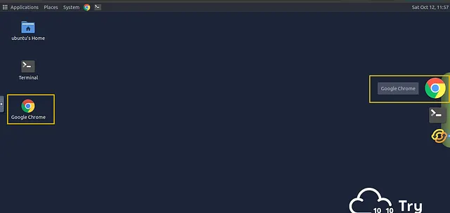

* Khi Chrome đã mở, nhấn **Ctrl + Shift + I** để mở **Console** hoặc nhấp chuột phải vào bất kỳ đâu trên trang và chọn **Inspect**.

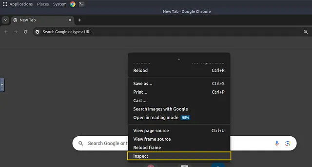

* Sau đó, nhấp vào tab **Console**. Bảng điều khiển này cho phép bạn chạy mã JS trực tiếp trong trình duyệt mà không cần cài đặt thêm phần mềm.

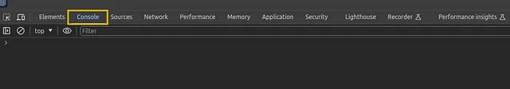

* Hãy tạo một chương trình JS đơn giản cộng hai số và hiển thị kết quả. Dưới đây là đoạn mã:

```javascript
let x = 5;
let y = 10;
let result = x + y;
console.log("The result is: " + result);
```

* Trong đoạn mã trên, `x` và `y` là các biến lưu giữ số. `x + y` là một biểu thức cộng hai số lại với nhau, trong khi `console.log` là một hàm dùng để in kết quả ra bảng điều khiển.

* Sao chép đoạn mã trên và dán vào bảng điều khiển bằng cách nhấn phím `Ctrl + V`. Sau khi dán, nhấn `Enter`. Bạn sẽ thấy kết quả hiển thị như sau:

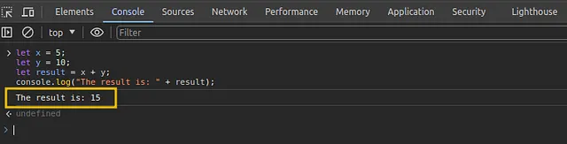

## Câu hỏi

Trả lời các câu hỏi dưới đây

**Câu hỏi:** Kết quả của đoạn mã sẽ là gì nếu giá trị của `x` được thay đổi thành 10?

**Trả lời:** Kết quả là: 20

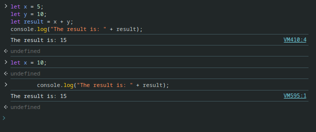

---

**Câu hỏi:** JavaScript là ngôn ngữ biên dịch hay thông dịch?

**Trả lời:** Thông dịch

# Task 4: Integrating JavaScript in HTML
>Tích hợp JavaScript vào HTML

JavaScript có thể được tích hợp vào HTML để thêm tính tương tác trực tiếp vào các trang web, bằng cách sử dụng:

* **JavaScript nội bộ (Internal JavaScript):** Đặt bên trong thẻ `<script>` trong tệp HTML.
* **JavaScript bên ngoài (External JavaScript):** Liên kết dưới dạng một tệp `.js` riêng biệt, giúp cải thiện khả năng tổ chức và bảo trì mã.

## Internal JavaScript 

Được viết trực tiếp bên trong các thẻ `<script>` trong tài liệu HTML.

Để tạo một tài liệu HTML với JS nội bộ, tạo tệp `internal.html`.

Thêm nội dung code như sau:

```html
<!DOCTYPE html>
<html lang="en">
<head>
    <title>Internal JS</title>
</head>
<body>
    <h1>Addition of Two Numbers</h1>
    <p id="result"></p>
<script>
        let x = 5;
        let y = 10;
        let result = x + y;
        document.getElementById("result").innerHTML = "The result is: " + result;
    </script>
</body>
</html>
```
Sau đó nhấn đúp chuột

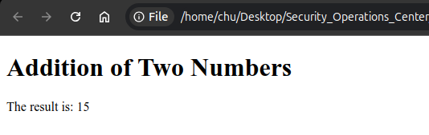


Trong tài liệu HTML này, chúng ta đang sử dụng **JS nội bộ**, nghĩa là mã được đặt trực tiếp bên trong tệp HTML trong thẻ `<script>`. Script thực hiện một tác vụ đơn giản: nó cộng hai số (x và y) rồi hiển thị kết quả trên trang web.

JS tương tác với HTML bằng cách chọn một phần tử (`<p> with id="result"`) và cập nhật nội dung của nó bằng lệnh:

```js
document.getElementById("result").innerHTML
```

JS nội bộ này được thực thi khi trình duyệt tải tệp HTML.

---

## JavaScript bên ngoài (External JavaScript):

Được đặt trong một tệp `.js` riêng và liên kết trong HTML bằng cách sử dụng thuộc tính `src` trong thẻ `<script>`.

Chúng ta sẽ sử dụng cùng ví dụ trên cho JS bên ngoài nhưng tách mã JS ra một tệp khác.

Đầu tiên, hãy tạo một tệp mới có tên **script.js** và lưu nó trên **Desktop** với đoạn mã sau:

```js
let x = 5;
let y = 10;
let result = x + y;
document.getElementById("result").innerHTML = "The result is: " + result;
```

Tiếp theo, tạo một tệp mới có tên **external.html** và dán đoạn mã sau (lưu ý rằng mã HTML giống hệt như ví dụ trước):

```html
<!DOCTYPE html>
<html lang="en">
<head>
    <meta charset="UTF-8">
    <meta name="viewport" content="width=device-width, initial-scale=1.0">
    <title>External JS</title>
</head>
<body>
    <h1>Addition of Two Numbers</h1>
    <p id="result"></p>
    <!-- Link to the external JS file -->
    <script src="script.js"></script>
</body>
</html>
```


Bây giờ, hãy nhấp đúp vào tệp **external.html** và kiểm tra kết quả. Bạn có thấy sự khác biệt nào không? Không, kết quả vẫn giống như trong ví dụ trước.

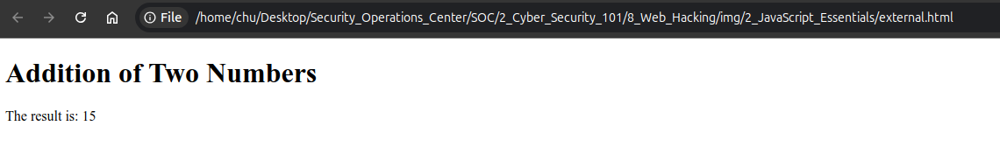

## Ví dụ Internal JavaScript:

```html
<!DOCTYPE html>
<html>
<body>
    <h1>Result of Addition</h1>
    <p id="result"></p>
    <script>
        let x = 5, y = 10;
        document.getElementById("result").innerHTML = "The result is: " + (x + y);
    </script>
</body>
</html>
```

---

**Xác minh Internal hay External JS**

Khi kiểm thử bảo mật một ứng dụng web, việc kiểm tra xem trang web sử dụng Internal hay External JS là rất quan trọng. Điều này có thể dễ dàng xác minh bằng cách xem mã nguồn của trang.
Để làm điều này, mở trang **external\_test.html** nằm trong thư mục **exercise** bằng **Chrome**, nhấp chuột phải vào bất kỳ đâu trên trang, và chọn **View Page Source**.

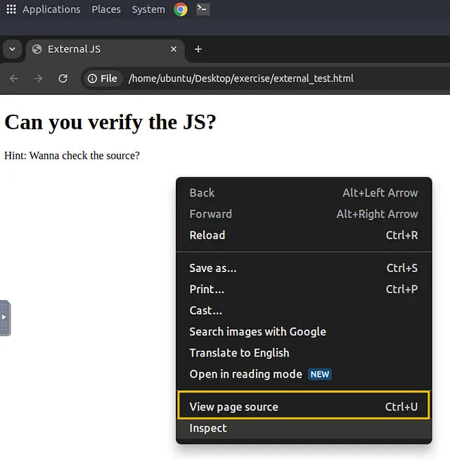

Điều này sẽ hiển thị mã HTML của trang đã render. Bên trong mã nguồn, bất kỳ JS nào được viết trực tiếp trên trang sẽ xuất hiện giữa các thẻ `<script>` mà không có thuộc tính `src`. Nếu bạn thấy thẻ `<script>` có thuộc tính `src`, điều đó cho biết trang đang tải External JS từ một file riêng biệt.

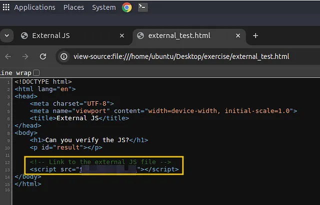

Để biết ví dụ thực tế, hãy truy cập https://tryhackme.com trên trình duyệt của bạn và kiểm tra mã nguồn để xác định cách trang web tải JS nội bộ và từ các nguồn bên ngoài.

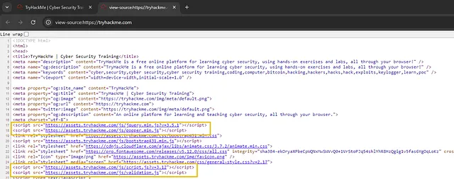

## Câu hỏi

**Trả lời các câu hỏi dưới đây**

**Loại tích hợp JavaScript nào đặt mã trực tiếp trong tài liệu HTML?**

Trả lời: Internal

**Phương pháp nào tốt hơn để tái sử dụng JS trên nhiều trang web?**

Trả lời: External

**Tên của file JS bên ngoài được gọi bởi *external\_test.html* là gì?**

Trả lời: thm\_external.js

**Thuộc tính nào liên kết một file JS bên ngoài trong thẻ `<script>`?**

Trả lời: src

---

# Task 5: Abusing Dialogue Functions

JavaScript cung cấp các hàm như `alert`, `prompt`, và `confirm` để hiển thị thông báo và thu thập dữ liệu từ người dùng. Những hàm này đôi khi bị khai thác trong tấn công lừa đảo (phishing) hoặc kỹ nghệ xã hội (social engineering), khiến người dùng phải tương tác với các hộp thoại không đáng tin cậy.

* `alert("Hello!");` : Mở một hộp thoại cảnh báo với nội dung "Hello!".
* `prompt("Enter your name:");` : Yêu cầu người dùng nhập thông tin.
* `confirm("Are you sure?");` : Hiển thị hộp thoại với các nút "OK" và "Cancel", thường được dùng để xác nhận.

## Alert:

```js
alert("Hello, THM"); // Displays an alert box with the message
```

## Prompt:

```js
let name = prompt("Enter your name:");
alert("Hello " + name); // Displays a personalized greeting
```

## Confirm:

```js
let isSure = confirm("Proceed?");
console.log(isSure); // Logs true if OK, false if Cancel
```

## Example Use of Dialogue Functions:

```js
alert("Warning: You are entering a secure area."); // Simple alert box
let userName = prompt("Please enter your name:");
if (userName) {
    alert("Welcome, " + userName);
}
let confirmAction = confirm("Do you agree to the terms?");
if (confirmAction) {
    alert("Thank you for agreeing.");
} else {
    alert("You did not agree.");
}
```


```javascript
alert("Warning: You are entering a secure area."); // Simple alert box
```

 Hiển thị một hộp thoại cảnh báo với nội dung: **"Warning: You are entering a secure area."**. Người dùng chỉ có thể bấm **OK** để đóng hộp thoại.

```javascript
let userName = prompt("Please enter your name:");
```

 Hiển thị một hộp thoại yêu cầu người dùng nhập dữ liệu. Ở đây, người dùng được yêu cầu nhập **tên**. Kết quả nhập vào sẽ được lưu vào biến `userName`.

```javascript
if (userName) {
    alert("Welcome, " + userName);
}
```

 Kiểm tra xem người dùng có nhập tên hay không.

* Nếu có nhập → hiện thông báo chào mừng: **"Welcome, \[tên bạn]"**.
* Nếu bỏ trống → không hiện gì.

```javascript
let confirmAction = confirm("Do you agree to the terms?");
```

 Hiển thị hộp thoại xác nhận với câu hỏi: **"Do you agree to the terms?"** và hai nút **OK** và **Cancel**.

* Nếu bấm OK → `confirmAction = true`.
* Nếu bấm Cancel → `confirmAction = false`.

```javascript
if (confirmAction) {
    alert("Thank you for agreeing.");
} else {
    alert("You did not agree.");
}
```

 Kiểm tra kết quả:

* Nếu người dùng đồng ý (OK) → hiện thông báo: **"Thank you for agreeing."**
* Nếu không đồng ý (Cancel) → hiện thông báo: **"You did not agree."**

---

# Task 6: Bypassing Control Flow Statements
>Vượt qua các câu lệnh điều khiển luồng

Luồng điều khiển trong JavaScript có thể được thao túng bằng cách sử dụng các câu lệnh như `if-else`, `switch` và nhiều loại vòng lặp khác nhau (`for`, `while`). Bằng cách kiểm soát luồng, các nhà phát triển có thể tạo ra các hành vi có điều kiện dựa trên đầu vào của người dùng hoặc các điều kiện khác.

## If-Else Statement:

```js
let age = prompt("Enter your age:");
if (age >= 18) {
    console.log("Adult");
} else {
    console.log("Minor");
}
```

## For Loop:

```js
for (let i = 0; i < 5; i++) {
    console.log("Count: " + i); // Prints "Count: 0" to "Count: 4"
}
```

## Switch Statement Example:

```js
let day = prompt("Enter a day (1-7):");
switch(day) {
    case '1':
        alert("It's Monday!");
        break;
    case '2':
        alert("It's Tuesday!");
        break;
    // Additional cases can go here
    default:
        alert("Not a valid day.");
}
```

# Task 7: Exploring Minified Files
>Khám phá các tệp đã được nén (Minified Files)

Mã JavaScript thường được **nén (minified)** để giảm kích thước tệp bằng cách loại bỏ tất cả các ký tự không cần thiết (ví dụ: khoảng trắng, chú thích) mà không ảnh hưởng đến chức năng. Việc nén giúp tệp tải nhanh hơn nhưng lại khó đọc hơn.

**Làm rối mã (Obfuscation)** đi xa hơn, khiến mã rất khó hiểu, thường được sử dụng trong môi trường sản xuất để bảo vệ quyền sở hữu trí tuệ hoặc ngăn chặn việc thao túng mã.

## Ví dụ thực tế

Tạo một tệp trên **Desktop** của máy ảo (VM) đính kèm với tên **hello.html** và dán vào đoạn mã HTML sau:

```html
<!DOCTYPE html>
<html lang="en">
<head>
    <title>Obfuscated JS Code</title>
</head>
<body>
    <h1>Obfuscated JS Code</h1>
    <script src="hello.js"></script>
</body>
</html>
```

Sau đó, tạo một tệp khác có tên hello.js và thêm đoạn mã sau:

```js
function hi() {
  alert("Welcome to THM");
}
hi();
```

Kết quả:

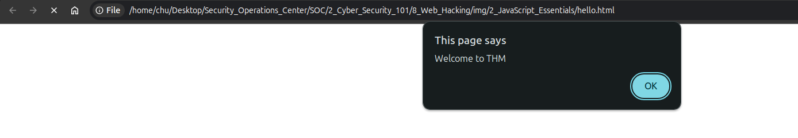

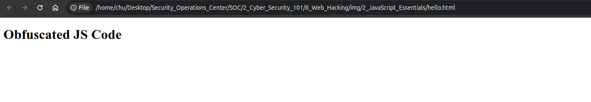

Nhấn **OK** để đóng hộp thoại cảnh báo. Nhấp chuột phải vào bất kỳ chỗ nào trên trang và chọn **Inspect** để mở công cụ dành cho nhà phát triển.

Trong công cụ này, điều hướng đến tab **Sources** và nhấp vào tệp **hello.js** để xem mã nguồn.

Bạn sẽ thấy rằng mã JS rất dễ truy cập và có thể xem được, như minh họa dưới đây:

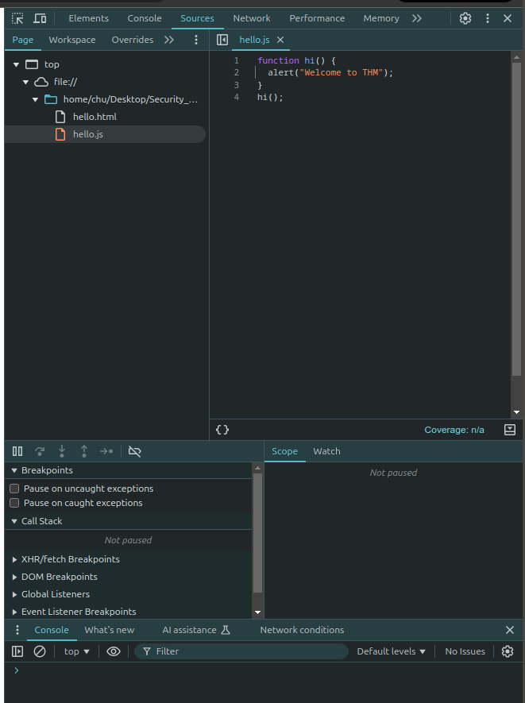

## Làm rối mã trong thực tế

Bây giờ, chúng ta sẽ thử **nén (minify)** và **làm rối (obfuscate)** mã JS bằng một công cụ trực tuyến.
Truy cập vào [**website**](https://codebeautify.org/) và sao chép nội dung của tệp `hello.js`, sau đó dán chúng vào hộp thoại trên trang web.

Công cụ này sẽ nén và làm rối mã, biến nó thành một chuỗi ký tự khó hiểu như hiển thị bên dưới:

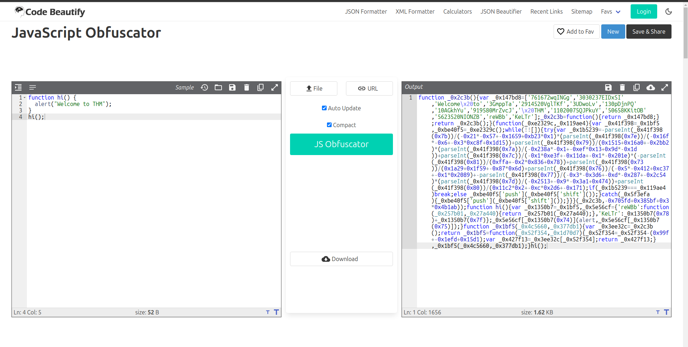

Nhưng nếu chúng tôi nói với bạn rằng những ký tự khó hiểu này vẫn là mã **hoạt động đầy đủ** thì sao?
Điểm khác biệt duy nhất là chúng không thể đọc được bởi con người, nhưng trình duyệt vẫn có thể thực thi chúng một cách chính xác.

Trang web đã chuyển đổi mã JS của chúng ta thành dạng sau:

```bash
function _0x2c3b(){var _0x147bd8=['761672wqINGg','3030237EIDxSI','Welcome\x20to','3GmppTa','2914520VglTKf','3UDwoLv','130pDjnPQ','10AGkhYu','919580MrZvcJ','\x20THM','11020075QJPkuY','50658KKitOB','5623520NIONZB','reWBb','KeLTr'];_0x2c3b=function(){return _0x147bd8;};return _0x2c3b();}(function(_0xe2329c,_0x119ae4){var _0x41f398=_0x1bf5,_0xbe40f5=_0xe2329c();while(!![]){try{var _0x1b5239=-parseInt(_0x41f398(0x7b))/(-0x21*-0x57+-0x1659+0xb23*0x1)*(parseInt(_0x41f398(0x7e))/(-0x16f*-0x6+-0x3*0xc8f+0x1d15))+parseInt(_0x41f398(0x79))/(0x1515+0x16a0+-0x2bb2)*(parseInt(_0x41f398(0x7a))/(-0x238a*-0x1+-0xef*0x13+0x9d*-0x1d))+parseInt(_0x41f398(0x7c))/(-0x1*0xe3f+-0x11da+-0x1*-0x201e)*(-parseInt(_0x41f398(0x81))/(0xffa+-0x2*0x836+0x78))+parseInt(_0x41f398(0x73))/(0x1a29+0x1f59+-0x87*0x6d)+parseInt(_0x41f398(0x76))/(-0x5*-0x412+0xc37+-0x1*0x2089)+-parseInt(_0x41f398(0x77))/(-0x3*-0x3d6+-0xd*-0x287+-0x2c54)*(parseInt(_0x41f398(0x7d))/(-0x2513+-0x9*-0x3a1+0x474))+parseInt(_0x41f398(0x80))/(0x11c2*0x2+-0xc*0x2d6+-0x171);if(_0x1b5239===_0x119ae4)break;else _0xbe40f5['push'](_0xbe40f5['shift']());}catch(_0x5f3efa){_0xbe40f5['push'](_0xbe40f5['shift']());}}}(_0x2c3b,-0x705fd+0x385bf+0x3*0x4b1ab));function hi(){var _0x1350b7=_0x1bf5,_0x5e56cf={'reWBb':function(_0x257b01,_0x27a440){return _0x257b01(_0x27a440);},'KeLTr':_0x1350b7(0x78)+_0x1350b7(0x7f)};_0x5e56cf[_0x1350b7(0x74)](alert,_0x5e56cf[_0x1350b7(0x75)]);}function _0x1bf5(_0x4c5660,_0x377db1){var _0x3ee32c=_0x2c3b();return _0x1bf5=function(_0x52f354,_0x1d70d7){_0x52f354=_0x52f354-(0x99f+-0x1efd+0x15d1);var _0x427f13=_0x3ee32c[_0x52f354];return _0x427f13;},_0x1bf5(_0x4c5660,_0x377db1);}hi();
```
Nhấn nút **Copy to Clipboard** (được đánh dấu là **2** trong hình trên) như hiển thị trên trang web. Sau đó, xóa nội dung hiện tại của tệp `hello.js` trên VM đã đính kèm và dán nội dung đã được làm rối (obfuscated) vào tệp.

Tải lại tệp `hello.html` trong Google Chrome và kiểm tra lại mã nguồn dưới tab **Sources**. Bạn sẽ nhận thấy rằng mã hiện tại đã bị làm rối nhưng vẫn hoạt động chính xác như trước.

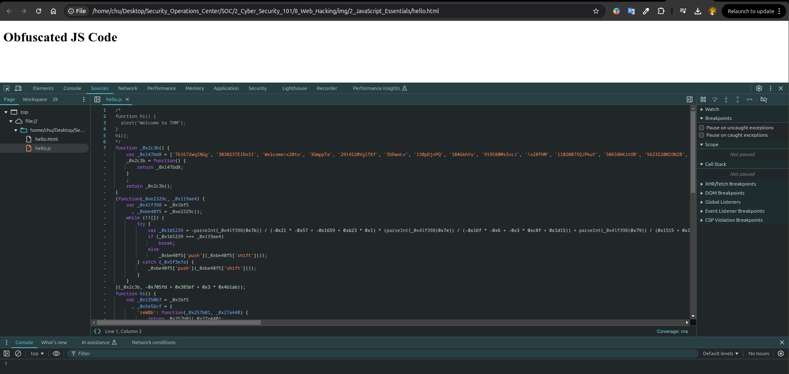

Công cụ giải mã: Các công cụ như [JS Beautifier](https://beautifier.io/) có thể giúp giải mã mã để phân tích.

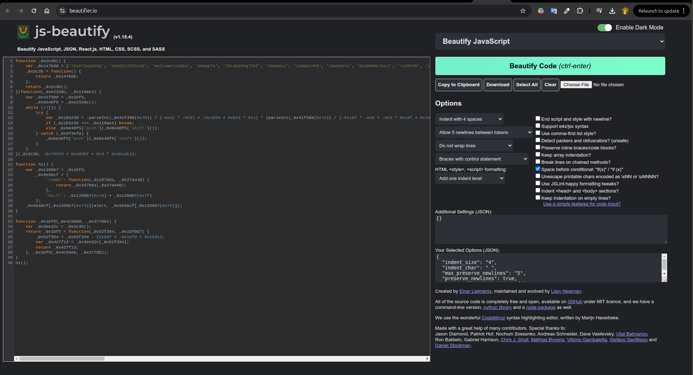

## Câu hỏi

**Trả lời các câu hỏi dưới đây**

**Câu hỏi:** Thông báo cảnh báo (alert) nào được hiển thị sau khi chạy tệp *hello.html*?

**Trả lời:** Welcome to THM

**Câu hỏi:** Giá trị của biến *age* trong đoạn mã đã bị làm rối (obfuscated) sau đây là gì?

```
age=0x1*0x247e+0x35*-0x2e+-0x1ae3;
```

**Trả lời:** 21

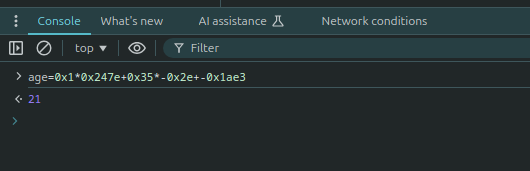

---

**Thực hành tốt nhất**

Thực hiện các thực hành tốt nhất trong JavaScript có thể ngăn ngừa các lỗ hổng bảo mật phổ biến và cải thiện chất lượng mã:

* **Xác thực phía máy chủ (Server–Side Validation):** Tránh chỉ dựa vào xác thực phía client để ngăn chặn việc giả mạo dữ liệu.
* **Làm sạch đầu vào người dùng (Sanitize User Inputs):** Điều này rất cần thiết để tránh các cuộc tấn công XSS (Cross-Site Scripting).
* **Sử dụng thư viện ngoài an toàn (Use Secure External Libraries):** Chỉ bao gồm những thư viện đáng tin cậy và thường xuyên được cập nhật.
* **Rút gọn & làm rối mã (Minification & Obfuscation):** Với môi trường sản xuất, hãy rút gọn và làm rối mã để tăng hiệu suất và bảo mật.
* **Không hardcode dữ liệu nhạy cảm (Do Not Hardcode Sensitive Data):** Giữ các API keys, secrets hoặc dữ liệu nhạy cảm khác ngoài mã công khai.

**Ví dụ tránh hardcode dữ liệu nhạy cảm:**

```js
// Thay vì hardcode API keys trong JavaScript:
const API_KEY = "your-api-key"; // Tránh thực hành này
// Hãy cân nhắc lưu trữ chúng một cách an toàn trên phía máy chủ
```

---