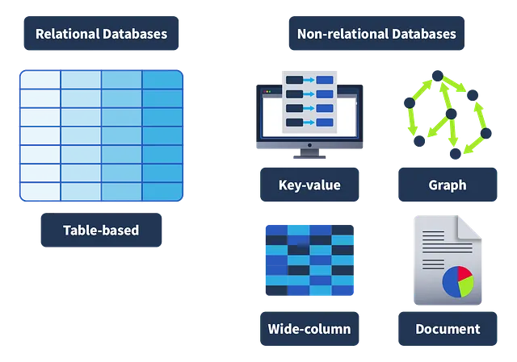
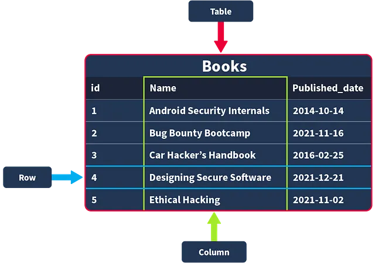
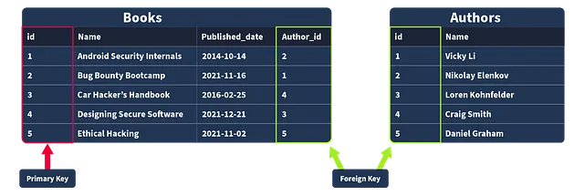

# SQL Fundamentals

## Mục lục
1. [Task 1: Introduction](#task-1-introduction)
2. [Task 2: Databases 101](#task-2-databases-101)

## Nội dung

# Task 1: Introduction

Chào mừng bạn, độc giả thân mến, đến với thế giới hấp dẫn, hơi hỗn loạn và gắn kết sâu sắc giữa **an ninh mạng (cybersecurity)** và **cơ sở dữ liệu (databases)**.
**Hãy tưởng tượng thế này:** Bạn đang dấn thân vào **an ninh mạng**, và — bất ngờ thay! — **cơ sở dữ liệu** ở khắp mọi nơi.
Cho dù bạn đang bảo mật một ứng dụng web, phân tích các mối đe dọa trong **Trung tâm Điều hành An ninh (SOC)**, hay chỉ cố ngăn một người dùng quá tò mò khỏi việc nhìn thấy tất cả dữ liệu hấp dẫn, cơ sở dữ liệu chính là đồng minh đáng tin cậy của bạn… hoặc đôi khi, lại là kẻ thù không đội trời chung.

Với những người táo bạo trong lĩnh vực tấn công an ninh, **cơ sở dữ liệu** giống như một chiếc rương kho báu chỉ chờ một cú **SQL injection** khéo léo để mở ra.
Muốn lấy được dữ liệu ẩn từ một dịch vụ đã bị xâm phạm? Một **truy vấn SQL** được viết tinh vi có thể là chiếc chìa khóa thần kỳ của bạn! Trong khi đó, với những người dũng cảm bảo vệ hệ thống, **cơ sở dữ liệu** chính là nơi bạn săn tìm dấu hiệu của các hoạt động mờ ám. Chúng cũng là **tuyến phòng thủ đầu tiên**, giúp bạn khóa chặt quyền truy cập và ngăn chặn kẻ xấu.

Với sự hiện diện của **cơ sở dữ liệu** ở mọi ngóc ngách trong vũ trụ **an ninh mạng**, việc hiểu được những kiến thức cơ bản là điều tối quan trọng. Vậy nên, hãy sẵn sàng học các thuật ngữ, khái niệm và kiểu dữ liệu thiết yếu tạo nên nền tảng công nghệ này — sau đó bắt đầu với **SQL**, ngôn ngữ giúp bạn nói lưu loát tiếng “cơ sở dữ liệu”.

---

# Task 2: Databases 101

Được rồi, vậy là cơ sở dữ liệu về cơ bản có mặt ở khắp mọi nơi, thu thập đủ loại thông tin về chúng ta, từ chi tiết đăng nhập cho đến thói quen cày phim.
Hãy phân tích thế này: **cơ sở dữ liệu** chỉ đơn giản là một tập hợp dữ liệu được tổ chức, cho dù đó là để lưu trữ tên người dùng và mật khẩu, ghi lại mọi bình luận bạn từng để lại dưới một video mèo, hay theo dõi bạn đã xem lại *The Office* bao nhiêu lần.

Cơ sở dữ liệu chính là “người hùng thầm lặng” đứng sau hầu hết mọi hệ thống và dịch vụ mà chúng ta sử dụng, dù lớn hay nhỏ.

## Relational vs. Non-Relational Databases: Pick Your Fighter

Hãy tưởng tượng có hai loại cơ sở dữ liệu đối đầu nhau: **Cơ sở dữ liệu quan hệ (SQL)** và **Cơ sở dữ liệu phi quan hệ (NoSQL).**

* **Relational Databases - Cơ sở dữ liệu quan hệ:** Hãy nghĩ về chúng như những “mọt sách dữ liệu” siêu ngăn nắp. Mọi thứ được lưu trữ gọn gàng trong các bảng với hàng và cột. Bạn biết chính xác sẽ có thông tin gì, và bạn có thể liên kết các bảng khác nhau với nhau để có thêm ngữ cảnh, ví dụ như kết nối bảng “Người dùng” với bảng “Lịch sử đặt hàng”. Có cấu trúc, dễ dự đoán và rất phù hợp cho những thứ như thương mại điện tử, nơi mà độ chính xác là cực kỳ quan trọng.

* **Non-Relational - Cơ sở dữ liệu phi quan hệ:** Những anh chàng này thì thoải mái hơn, lưu trữ dữ liệu ở dạng linh hoạt, không theo bảng. Có một mớ dữ liệu hỗn tạp không theo cấu trúc chặt chẽ? NoSQL sẽ giúp bạn! Rất phù hợp cho nội dung do người dùng tạo trên mạng xã hội, nơi mà bạn có thể có đủ thứ từ văn bản đến hình ảnh cho đến kiểu dữ liệu “cái gì đây vậy?”.

## Tables, Rows, and Columns: The Building Blocks

Trong cơ sở dữ liệu quan hệ, dữ liệu được tổ chức thành các bảng. Hãy tưởng tượng một bảng có tên “Books” trong cơ sở dữ liệu của một hiệu sách. Mỗi **cột** đại diện cho một mẩu thông tin (như “Tên” hoặc “Ngày xuất bản”), và mỗi **hàng** là một cuốn sách mới. Các kiểu dữ liệu khác nhau (như văn bản, số, ngày tháng) được đặt vào các cột khác nhau, và nếu bạn cố thêm dữ liệu không tương thích — thì không, cơ sở dữ liệu sẽ không chấp nhận.

## Primary and Foreign Keys: Making Data BFFs

* **Khóa chính (Primary Keys):** Đây là các ID duy nhất cho mỗi bản ghi trong một bảng, giống như mã số sinh viên là duy nhất cho mỗi người.

* **Khóa ngoại (Foreign Keys):** Đây là các liên kết giữa các bảng, kết nối thông tin liên quan, ví dụ như ghép “Author ID” trong bảng “Books” với “ID” trong bảng “Authors”. Hãy nghĩ về nó như cách để đảm bảo rằng mỗi cuốn sách đều có một tác giả hợp pháp.

Vậy là xong! Cơ sở dữ liệu chính là “chất keo” giữ cho dữ liệu được kết nối với nhau, dù đó là cho gợi ý xem phim của bạn hay một câu lệnh SQL injection được viết khéo léo (đùa thôi, hãy luôn giữ đạo đức nhé!). Và với nền tảng vững chắc về cơ bản, bạn đã sẵn sàng để xử lý cơ sở dữ liệu như một chuyên gia.

## Câu hỏi

**Câu hỏi:** Bạn nên cân nhắc sử dụng loại cơ sở dữ liệu nào nếu dữ liệu bạn sẽ lưu trữ có định dạng thay đổi rất nhiều?

**Trả lời:** Cơ sở dữ liệu phi quan hệ (Non-relational database)

**Câu hỏi:** Bạn nên cân nhắc sử dụng loại cơ sở dữ liệu nào nếu dữ liệu bạn sẽ lưu trữ đáng tin cậy theo cùng một cấu trúc định dạng?

**Trả lời:** Cơ sở dữ liệu quan hệ (Relational database)

**Câu hỏi:** Trong ví dụ của chúng ta, khi một bản ghi về một cuốn sách được chèn vào bảng “Books”, nó sẽ được biểu diễn dưới dạng một \_\_\_ trong bảng đó?

**Trả lời:** Hàng (row)

**Câu hỏi:** Loại khóa nào cung cấp liên kết từ một bảng sang bảng khác?

**Trả lời:** Khóa ngoại (foreign key)

**Câu hỏi:** Loại khóa nào đảm bảo một bản ghi là duy nhất trong một bảng?

**Trả lời:** Khóa chính (primary key)

---

