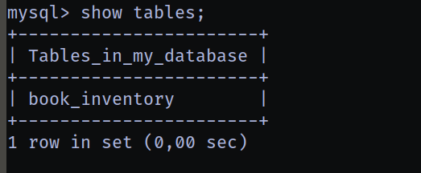

# SQL Fundamentals

## Mục lục
1. [Task 1: Introduction](#task-1-introduction)
2. [Task 2: Databases 101](#task-2-databases-101)
3. [Task 3: SQL](#task-3-sql)
4. [Task 4: Database and Table Statements](#task-4-database-and-table-statements)
5. [Task 5: CRUD Operations](#task-5-crud-operations)
6. [Task 6: Clauses](#task-6-clauses)
7. [Task 7: Operators](#task-7-operators)
8. [Task 8: Functions](#task-8-functions)
9. [Task 9: Conclusion](#task-9-conclusion)

## Nội dung


# Task 1: Introduction


Chào mừng bạn, độc giả thân mến, đến với thế giới hấp dẫn, hơi hỗn loạn và gắn kết sâu sắc giữa **an ninh mạng (cybersecurity)** và **cơ sở dữ liệu (databases)**.
**Hãy tưởng tượng thế này:** Bạn đang dấn thân vào **an ninh mạng**, và — bất ngờ thay! — **cơ sở dữ liệu** ở khắp mọi nơi.
Cho dù bạn đang bảo mật một ứng dụng web, phân tích các mối đe dọa trong **Trung tâm Điều hành An ninh (SOC)**, hay chỉ cố ngăn một người dùng quá tò mò khỏi việc nhìn thấy tất cả dữ liệu hấp dẫn, cơ sở dữ liệu chính là đồng minh đáng tin cậy của bạn… hoặc đôi khi, lại là kẻ thù không đội trời chung.

Với những người táo bạo trong lĩnh vực tấn công an ninh, **cơ sở dữ liệu** giống như một chiếc rương kho báu chỉ chờ một cú **SQL injection** khéo léo để mở ra.
Muốn lấy được dữ liệu ẩn từ một dịch vụ đã bị xâm phạm? Một **truy vấn SQL** được viết tinh vi có thể là chiếc chìa khóa thần kỳ của bạn! Trong khi đó, với những người dũng cảm bảo vệ hệ thống, **cơ sở dữ liệu** chính là nơi bạn săn tìm dấu hiệu của các hoạt động mờ ám. Chúng cũng là **tuyến phòng thủ đầu tiên**, giúp bạn khóa chặt quyền truy cập và ngăn chặn kẻ xấu.

Với sự hiện diện của **cơ sở dữ liệu** ở mọi ngóc ngách trong vũ trụ **an ninh mạng**, việc hiểu được những kiến thức cơ bản là điều tối quan trọng. Vậy nên, hãy sẵn sàng học các thuật ngữ, khái niệm và kiểu dữ liệu thiết yếu tạo nên nền tảng công nghệ này — sau đó bắt đầu với **SQL**, ngôn ngữ giúp bạn nói lưu loát tiếng “cơ sở dữ liệu”.

---

# Task 2: Databases 101

Được rồi, vậy là cơ sở dữ liệu về cơ bản có mặt ở khắp mọi nơi, thu thập đủ loại thông tin về chúng ta, từ chi tiết đăng nhập cho đến thói quen cày phim.
Hãy phân tích thế này: **cơ sở dữ liệu** chỉ đơn giản là một tập hợp dữ liệu được tổ chức, cho dù đó là để lưu trữ tên người dùng và mật khẩu, ghi lại mọi bình luận bạn từng để lại dưới một video mèo, hay theo dõi bạn đã xem lại *The Office* bao nhiêu lần.

Cơ sở dữ liệu chính là “người hùng thầm lặng” đứng sau hầu hết mọi hệ thống và dịch vụ mà chúng ta sử dụng, dù lớn hay nhỏ.

## Relational vs. Non-Relational Databases: Pick Your Fighter


Hãy tưởng tượng có hai loại cơ sở dữ liệu đối đầu nhau: **Cơ sở dữ liệu quan hệ (SQL)** và **Cơ sở dữ liệu phi quan hệ (NoSQL).**

* **Relational Databases - Cơ sở dữ liệu quan hệ:** Hãy nghĩ về chúng như những “mọt sách dữ liệu” siêu ngăn nắp. Mọi thứ được lưu trữ gọn gàng trong các bảng với hàng và cột. Bạn biết chính xác sẽ có thông tin gì, và bạn có thể liên kết các bảng khác nhau với nhau để có thêm ngữ cảnh, ví dụ như kết nối bảng “Người dùng” với bảng “Lịch sử đặt hàng”. Có cấu trúc, dễ dự đoán và rất phù hợp cho những thứ như thương mại điện tử, nơi mà độ chính xác là cực kỳ quan trọng.

* **Non-Relational - Cơ sở dữ liệu phi quan hệ:** Những anh chàng này thì thoải mái hơn, lưu trữ dữ liệu ở dạng linh hoạt, không theo bảng. Có một mớ dữ liệu hỗn tạp không theo cấu trúc chặt chẽ? NoSQL sẽ giúp bạn! Rất phù hợp cho nội dung do người dùng tạo trên mạng xã hội, nơi mà bạn có thể có đủ thứ từ văn bản đến hình ảnh cho đến kiểu dữ liệu “cái gì đây vậy?”.

## Tables, Rows, and Columns: The Building Blocks


Trong cơ sở dữ liệu quan hệ, dữ liệu được tổ chức thành các bảng. Hãy tưởng tượng một bảng có tên “Books” trong cơ sở dữ liệu của một hiệu sách. Mỗi **cột** đại diện cho một mẩu thông tin (như “Tên” hoặc “Ngày xuất bản”), và mỗi **hàng** là một cuốn sách mới. Các kiểu dữ liệu khác nhau (như văn bản, số, ngày tháng) được đặt vào các cột khác nhau, và nếu bạn cố thêm dữ liệu không tương thích — thì không, cơ sở dữ liệu sẽ không chấp nhận.

## Primary and Foreign Keys: Making Data BFFs


* **Khóa chính (Primary Keys):** Đây là các ID duy nhất cho mỗi bản ghi trong một bảng, giống như mã số sinh viên là duy nhất cho mỗi người.

* **Khóa ngoại (Foreign Keys):** Đây là các liên kết giữa các bảng, kết nối thông tin liên quan, ví dụ như ghép “Author ID” trong bảng “Books” với “ID” trong bảng “Authors”. Hãy nghĩ về nó như cách để đảm bảo rằng mỗi cuốn sách đều có một tác giả hợp pháp.

Vậy là xong! Cơ sở dữ liệu chính là “chất keo” giữ cho dữ liệu được kết nối với nhau, dù đó là cho gợi ý xem phim của bạn hay một câu lệnh SQL injection được viết khéo léo (đùa thôi, hãy luôn giữ đạo đức nhé!). Và với nền tảng vững chắc về cơ bản, bạn đã sẵn sàng để xử lý cơ sở dữ liệu như một chuyên gia.

## Câu hỏi

**Câu hỏi:** Bạn nên cân nhắc sử dụng loại cơ sở dữ liệu nào nếu dữ liệu bạn sẽ lưu trữ có định dạng thay đổi rất nhiều?

**Trả lời:** Cơ sở dữ liệu phi quan hệ (Non-relational database)

**Câu hỏi:** Bạn nên cân nhắc sử dụng loại cơ sở dữ liệu nào nếu dữ liệu bạn sẽ lưu trữ đáng tin cậy theo cùng một cấu trúc định dạng?

**Trả lời:** Cơ sở dữ liệu quan hệ (Relational database)

**Câu hỏi:** Trong ví dụ của chúng ta, khi một bản ghi về một cuốn sách được chèn vào bảng “Books”, nó sẽ được biểu diễn dưới dạng một \_\_\_ trong bảng đó?

**Trả lời:** Hàng (row)

**Câu hỏi:** Loại khóa nào cung cấp liên kết từ một bảng sang bảng khác?

**Trả lời:** Khóa ngoại (foreign key)

**Câu hỏi:** Loại khóa nào đảm bảo một bản ghi là duy nhất trong một bảng?

**Trả lời:** Khóa chính (primary key)

---

# Task 3: SQL

Vậy, cơ sở dữ liệu rất tuyệt, nhưng làm thế nào chúng ta **thực sự** làm việc với chúng?
Hãy gặp **SQL — Structured Query Language**, hay như tôi gọi nó là, “Nói chuyện với Cơ sở dữ liệu 101.” SQL cho phép bạn nói cho cơ sở dữ liệu biết phải làm gì: tạo bảng, chèn dữ liệu, cập nhật thông tin, và chạy đủ loại truy vấn. Về cơ bản, **SQL** giống như câu thần chú ma thuật cho các phù thủy dữ liệu!

Trước hết, bạn cần một **Hệ quản trị cơ sở dữ liệu (DBMS)**, đây là phần mềm kết nối giữa bạn và cơ sở dữ liệu. Các **DBMS** phổ biến gồm **MySQL, MongoDB** và **Oracle Database**. Với **SQL** trong bộ công cụ DBMS của bạn, bạn có thể truy vấn, quản lý và thao tác dữ liệu như một chuyên gia.

Vì sao SQL “tuyệt vời”

* **Nhanh như chớp**: SQL có thể kéo ra một lượng dữ liệu khổng lồ chỉ trong vài giây. Không phải chờ lâu, không phiền phức.
* **Siêu đơn giản**: SQL gần như là tiếng Anh thuần túy! Vì vậy, bạn sẽ dành nhiều thời gian hơn cho việc truy vấn dữ liệu thay vì vật lộn với cú pháp.
* **Độ chính xác cao**: Cơ sở dữ liệu quan hệ có cấu trúc nghiêm ngặt, nghĩa là dữ liệu luôn chính xác và dễ quản lý.
* **Linh hoạt tối đa**: Từ tra cứu nhanh cho đến phân tích dữ liệu chuyên sâu, **SQL** đều xử lý được mà không tốn nhiều công sức.

Bắt tay vào làm việc với SQL

Hãy khởi động máy, mở terminal, và gõ:

```bash
sudo apt update
sudo apt --fix-broken install
sudo apt install mysql-server -y
sudo systemctl start mysql
mysql -u root -p
```

```bash
sudo mysql -u root -p
Enter password: 
Welcome to the MySQL monitor.  Commands end with ; or \g.
Your MySQL connection id is 9
Server version: 8.0.43-0ubuntu0.24.04.1 (Ubuntu)

Copyright (c) 2000, 2025, Oracle and/or its affiliates.

Oracle is a registered trademark of Oracle Corporation and/or its
affiliates. Other names may be trademarks of their respective
owners.

Type 'help;' or '\h' for help. Type '\c' to clear the current input statement.

mysql> 

```

---

## Câu hỏi

**Câu hỏi:** Cái gì đóng vai trò như giao diện giữa cơ sở dữ liệu và người dùng cuối?

**Trả lời:** DBMS

**Câu hỏi:** Ngôn ngữ truy vấn nào có thể được sử dụng để tương tác với cơ sở dữ liệu quan hệ?

**Trả lời:** SQL

---

# Task 4: Database and Table Statements

Được rồi, đã đến lúc đi sâu vào các câu lệnh SQL và biến cơ sở dữ liệu từ lý thuyết thành sức mạnh thực tế. Hãy nghĩ về các câu lệnh SQL như những khối xây dựng của một đế chế kiến trúc sư cơ sở dữ liệu — từng câu lệnh “CREATE,” “SHOW,” và “DROP” một.

## Các câu lệnh Database

* **CREATE DATABASE**: Muốn tạo cơ sở dữ liệu mới? Chỉ cần lịch sự yêu cầu SQL với `CREATE DATABASE your_database_name;` Ví dụ:

  ```sql
  CREATE DATABASE thm_bookmarket_db;
  ```

  → thiết lập một thế giới dữ liệu nhỏ mới.

* **SHOW DATABASES**: Muốn biết có những cơ sở dữ liệu nào trên server? `SHOW DATABASES;` sẽ liệt kê tất cả những cái có sẵn, bao gồm cả những cái bí ẩn được cài sẵn như `mysql` và `sys` — giống như “bạn cùng phòng” mặc định của server.


* **USE DATABASE**: Khi đã có cơ sở dữ liệu, bạn cần nói với SQL, “Này, hãy làm việc với cái này nhé” bằng `USE your_database_name;`.

* **DROP DATABASE**: Không còn cần cơ sở dữ liệu đó nữa? `DROP DATABASE` sẽ xóa nó cho bạn (nhưng hãy nhớ kiểm tra kỹ trước khi nhấn Enter).

---

## Các câu lệnh Table

Giờ chúng ta đã có một **database**, hãy lấp đầy nó bằng các **bảng (tables)!**
Bảng giống như các thư mục nơi dữ liệu của bạn được lưu trữ — mọi cơ sở dữ liệu đều có bảng.

**CREATE TABLE:**

* Để thêm một bảng mới, bạn dùng `CREATE TABLE` theo sau bởi tên bảng và chi tiết từng cột. Ví dụ:

```sql
CREATE TABLE book_inventory (
    book_id INT AUTO_INCREMENT PRIMARY KEY,
    book_name VARCHAR(255) NOT NULL,
    publication_date DATE
);
```

* Ở đây, chúng ta đang tạo bảng **book\_inventory** với ba cột.
* `AUTO_INCREMENT` có nghĩa là SQL sẽ tự động tăng số ID cho mỗi cuốn sách.


---

**SHOW TABLES:**

* Muốn xem tất cả các bảng trong cơ sở dữ liệu? Dùng `SHOW TABLES;` — nó sẽ liệt kê ra tất cả. Đây là danh sách điểm danh của bảng.



---

**DESCRIBE:**

* Nếu muốn xem nhanh các cột và kiểu dữ liệu trong một bảng, dùng:
  `DESCRIBE your_table_name;`
  → Giống như chụp X-quang để thấy cấu trúc bảng.


---

**Chỉnh sửa bảng (Modifying Tables):**
**ALTER:**

* Muốn thay đổi bảng? `ALTER TABLE` cho phép thêm, xóa hoặc đổi tên cột.
* Ví dụ, nếu bạn nhận ra mình cần thêm số trang cho mỗi cuốn sách, chỉ cần thêm:

```sql
ALTER TABLE book_inventory ADD page_count INT;
```


---

**DROP TABLE:**

* Xong việc với bảng? Xóa nó bằng:
  `DROP TABLE table_name;`

---

# Task 5: CRUD Operations
**Các thao tác CRUD**

Trong thế giới **cơ sở dữ liệu**, **CRUD** là vua! Bộ tứ quyền lực — **Tạo (Create), Đọc (Read), Cập nhật (Update), Xóa (Delete)** — chính là “cơm ăn áo mặc” của quản lý dữ liệu. Dưới đây là phần tóm tắt từng thao tác, sử dụng bảng *books* của **MySQL** để minh họa trong thực tế. Sẵn sàng chưa? Bắt đầu thôi!

Đầu tiên chúng ta tạo một bảng như sau:

```sql
mysql> create table books(
    -> id int auto_increment primary key,
    -> name varchar(255) not null,
    -> published_date date,
    -> description varchar(255));
Query OK, 0 rows affected (0,02 sec)

mysql> describe books;
+----------------+--------------+------+-----+---------+----------------+
| Field          | Type         | Null | Key | Default | Extra          |
+----------------+--------------+------+-----+---------+----------------+
| id             | int          | NO   | PRI | NULL    | auto_increment |
| name           | varchar(255) | NO   |     | NULL    |                |
| published_date | date         | YES  |     | NULL    |                |
| description    | varchar(255) | YES  |     | NULL    |                |
+----------------+--------------+------+-----+---------+----------------+
4 rows in set (0,00 sec)

```

## Tạo (INSERT)

Tạo bản ghi giống như thêm nguyên liệu tươi mới vào nồi dữ liệu của bạn. Cần một mục nhập mới? `INSERT INTO` sẽ giúp bạn:

```sql
INSERT INTO books (id, name, published_date, description)
VALUES (1, "Android Security Internals", "2014–10–14", "An In-Depth Guide to Android's Security Architecture");
```

```sql
mysql> INSERT INTO books (id, name, published_date, description) VALUES (1, "Android Security Internals", "2014-10-14", "An In-Depth Guide to
 Android's Security Architecture");
Query OK, 1 row affected (0,01 sec
```

Cứ như vậy, một cuốn sách có tên “Android Security Internals” đã được lưu vào bảng sách của chúng ta. Vậy là xong! Dữ liệu mới đã được thêm vào.

## Đọc (SELECT)

Đọc dữ liệu giống như ta vào vai thám tử và khám phá những bí ẩn trong dữ liệu. Câu lệnh **SELECT** cho phép bạn nhìn vào “tâm hồn” của bảng:

```sql
SELECT * FROM books;
```
```sql
mysql> select * from books;
+----+----------------------------+----------------+------------------------------------------------------+
| id | name                       | published_date | description                                          |
+----+----------------------------+----------------+------------------------------------------------------+
|  1 | Android Security Internals | 2014-10-14     | An In-Depth Guide to Android's Security Architecture |
+----+----------------------------+----------------+------------------------------------------------------+
1 row in set (0,00 sec)

```


Lệnh này sẽ lấy **tất cả** các cột, nhưng nếu bạn chỉ muốn lấy chi tiết cụ thể như *name* và *description*, hãy dùng:

```sql
SELECT name, description FROM books;
```

```sql
mysql> select name, description from books;
+----------------------------+------------------------------------------------------+
| name                       | description                                          |
+----------------------------+------------------------------------------------------+
| Android Security Internals | An In-Depth Guide to Android's Security Architecture |
+----------------------------+------------------------------------------------------+
1 row in set (0,00 sec)
```

Hoàn hảo khi bạn chỉ cần phần thông tin nổi bật!

---

## Cập nhật (UPDATE)

Đôi khi dữ liệu thay đổi, và chúng ta phải cập nhật theo! Lệnh **UPDATE** giống như việc chỉnh lại một lỗi chính tả trong câu chuyện:

```sql
UPDATE books
SET description = "An In-Depth Guide to Android's Security Architecture."
WHERE id = 1;
```

Lệnh này sẽ cập nhật phần mô tả cho cuốn sách có **id = 1**. Hãy nhớ chỉ định bản ghi nào cần cập nhật bằng **WHERE**, nếu không thì SQL sẽ “nhiệt tình quá mức” và cập nhật **tất cả mọi thứ**.

```sql
mysql> UPDATE books
    -> SET description = "An In-Depth Guide to Android's Security Architecture."
    -> WHERE id = 1;
Query OK, 1 row affected (0,00 sec)
Rows matched: 1  Changed: 1  Warnings: 0

mysql> select * from books;
+----+----------------------------+----------------+-------------------------------------------------------+
| id | name                       | published_date | description                                           |
+----+----------------------------+----------------+-------------------------------------------------------+
|  1 | Android Security Internals | 2014-10-14     | An In-Depth Guide to Android's Security Architecture. |
+----+----------------------------+----------------+-------------------------------------------------------+
1 row in set (0,00 sec)
```

## Xóa (DELETE)

Xóa dữ liệu giống như việc dọn dẹp bàn của bạn — loại bỏ những gì không còn “mang lại niềm vui”.

```sql
DELETE FROM books WHERE id = 1;
```

Lệnh này sẽ xóa bản ghi có **id = 1** khỏi bảng **books**. Hãy sử dụng **WHERE** một cách cẩn thận ở đây, nếu không bạn có thể phải nói lời tạm biệt với **toàn bộ dữ liệu** của mình!

```sql
mysql> DELETE FROM books WHERE id = 1;
Query OK, 1 row affected (0,01 sec)

mysql> select * from books;
Empty set (0,00 sec)
```

---

# Task 6: Clauses
**Mệnh đề (Clauses)**

Hãy cùng xem một số mệnh đề **SQL** giúp bạn kiểm soát, cho phép cơ sở dữ liệu trả về kết quả theo cách **bạn** muốn. Gặp gỡ **DISTINCT, GROUP BY, ORDER BY, và HAVING** — “biệt đội” giữ cho dữ liệu của bạn sạch sẽ, ngăn nắp và chính xác!

## DISTINCT: Không cho phép trùng lặp!

Có vài dữ liệu bị trùng lặp? **DISTINCT** sẽ giúp bạn lọc chúng ra! Hãy xem ví dụ này:

```sql
SELECT DISTINCT name FROM books;
```

Nếu bạn có hai bản ghi “Ethical Hacking” trong bảng **books**, thì **DISTINCT** sẽ đảm bảo bạn chỉ thấy nó **một lần**. Nó giống như một bảo vệ ngăn không cho dữ liệu trùng lặp vào “câu lạc bộ dữ liệu”!

```sql
mysql> SELECT DISTINCT name FROM books;
+----------------------------+
| name                       |
+----------------------------+
| Android Security Internals |
+----------------------------+
1 row in set (0,00 sec)
```

## GROUP BY: Nhóm dữ liệu

Khi bạn cần tổng hợp dữ liệu, **GROUP BY** là lựa chọn số một. Nó là bí quyết để đếm, tính tổng và nhiều hơn nữa:

```sql
SELECT name, COUNT(*) FROM books GROUP BY name;
```

Với câu lệnh này, bạn sẽ thấy mỗi cuốn sách xuất hiện bao nhiêu lần. Nó giống như việc bạn gom tất cả đôi tất theo màu, để biết chính xác mình có bao nhiêu đôi!

---

## ORDER BY: Sắp xếp theo thứ tự hoàn hảo

Muốn sắp xếp dữ liệu? **ORDER BY** sẽ giúp bạn. Bạn có thể dùng nó để sắp xếp theo thứ tự tăng dần (**ASC**) hoặc giảm dần (**DESC**):

```sql
SELECT * FROM books ORDER BY published_date ASC;
```

Giờ thì sách của bạn sẽ được sắp xếp theo ngày xuất bản, rất hoàn hảo nếu bạn muốn đọc theo thứ tự thời gian! Muốn ngược lại ư? Chỉ cần đổi sang **DESC**.

## HAVING: Bộ lọc cho các nhóm

Khi bạn muốn lọc các nhóm **sau khi** đã nhóm chúng lại, **HAVING** sẽ xuất hiện. Nó giống như “người anh em ngầu” của **WHERE**:

```sql
SELECT name, COUNT(*) FROM books GROUP BY name HAVING name LIKE '%Hack%';
```

Câu lệnh này lọc kết quả của dữ liệu đã nhóm để chỉ hiển thị những cuốn sách có từ “Hack” trong tiêu đề — cho bạn một cái nhìn được lọc theo tiêu chí nhóm.

---

**Tóm tắt nhanh**

* **DISTINCT** — Lọc bỏ dữ liệu trùng lặp.
* **GROUP BY** — Nhóm dữ liệu của bạn để tạo bản tóm tắt.
* **ORDER BY** — Sắp xếp dữ liệu, giống như Netflix sắp xếp “phim mới phát hành”.
* **HAVING** — Lọc dữ liệu đã nhóm dựa trên điều kiện.

---

# Task 7: Operators
**Toán tử**

Các toán tử SQL giống như các nút điều khiển của một bộ lọc dữ liệu mạnh mẽ. Dưới đây là phân tích về các toán tử chính có thể giúp bạn xây dựng các truy vấn trong **SQL** chính xác và hiệu quả hơn.

---

## Toán tử logic

### LIKE:

* Dùng để tìm kiếm một mẫu cụ thể trong một cột.

```sql
SELECT * FROM books WHERE description LIKE "%guide%";
```

* Câu lệnh này trả về các bản ghi có mô tả chứa từ **“guide”**.

### AND:

* Kết hợp nhiều điều kiện và trả về kết quả khi **tất cả** các điều kiện đều đúng.

```sql
SELECT * FROM books WHERE category = "Offensive Security" AND name = "Bug Bounty";
```

* Câu lệnh này tìm các sách trong danh mục **“Offensive Security”** mà có tên chính xác là **“Bug Bounty”**.

---

### OR:

* Kết hợp các điều kiện và trả về kết quả khi **ít nhất một** điều kiện đúng.

```sql
SELECT * FROM books WHERE name LIKE "%Android%" OR name LIKE "%iOS%";
```

* Câu lệnh này lấy ra các bản ghi có tên chứa **“Android”** hoặc **“iOS”**.

---

## NOT:

* Loại bỏ các điều kiện cụ thể.

```sql
SELECT * FROM books WHERE NOT description LIKE "%guide%";
```

* Lệnh này loại bỏ các kết quả mà phần mô tả có chứa từ **“guide”**.

---

## BETWEEN:

* Kiểm tra xem một giá trị có nằm trong một khoảng xác định hay không.

```sql
SELECT * FROM books WHERE id BETWEEN 2 AND 4;
```

* Lệnh này chọn các sách có **ID từ 2 đến 4**.

---

## Toán tử so sánh

### Equal To (=):

* Tìm các giá trị **chính xác**.

```sql
SELECT * FROM books WHERE name = "Designing Secure Software";
```

* Lệnh này tìm các bản ghi có tên chính xác là **“Designing Secure Software.”**

---

### Not Equal To (!=):

* **Loại bỏ** các giá trị cụ thể.

```sql
SELECT * FROM books WHERE category != "Offensive Security";
```

* Lệnh này chọn các bản ghi mà **category** khác với **“Offensive Security.”**

### Less Than (<)

* Tìm các giá trị **nhỏ hơn** một giá trị xác định.

```sql
SELECT * FROM books WHERE published_date < "2020-01-01";
```

* Lệnh này lấy các sách được xuất bản **trước ngày 1 tháng 1 năm 2020**.

---

###  Greater Than (>):


* Tìm các giá trị **lớn hơn** một giá trị xác định.

```sql
SELECT * FROM books WHERE published_date > "2020-01-01";
```

* Lệnh này lấy các sách được xuất bản **sau ngày 1 tháng 1 năm 2020**.

### Less Than or Equal To (<=):

* Chọn các giá trị **nhỏ hơn hoặc bằng** một giá trị xác định.

```sql
SELECT * FROM books WHERE published_date <= "2021-11-15";
```

* Câu lệnh này trả về các sách được xuất bản **vào hoặc trước ngày 15 tháng 11 năm 2021**.

---

### Greater Than or Equal To (>=):

* Chọn các giá trị **lớn hơn hoặc bằng** một giá trị xác định.

```sql
SELECT * FROM books WHERE published_date >= "2021-11-02";
```

* Câu lệnh này hiển thị các sách được xuất bản **vào hoặc sau ngày 2 tháng 11 năm 2021**.

 **Tóm tắt nhanh (Quick Recap):**

* **LIKE** → Lọc dữ liệu theo mẫu trong chuỗi.
* **AND / OR** → Kết hợp nhiều điều kiện.
* **NOT** → Loại trừ những điều kiện cụ thể.
* **BETWEEN** → Tìm giá trị trong một khoảng.
* **Comparison Operators (=, !=, <, >, <=, >=)** → So sánh giá trị chính xác.

 Với các toán tử này trong **SQL toolkit**, bạn có thể lọc dữ liệu chính xác theo nhu cầu, giúp truy vấn mạnh mẽ và chính xác hơn.

---

# Task 8: Functions

Các hàm SQL là những công cụ mạnh mẽ để thao tác dữ liệu, cho phép chúng ta đơn giản hóa truy vấn, biến đổi dữ liệu và thu được thông tin. Đây là hướng dẫn về một số hàm SQL thiết yếu.

## Hàm chuỗi

### CONCAT():

* Nối nhiều chuỗi thành một.

```sql
SELECT CONCAT(name, " is a type of ", category, " book.") AS book_info FROM books;
```

* Câu lệnh này nối tên sách và thể loại sách thành một câu hoàn chỉnh.

### GROUP_CONCAT():

* Nối các giá trị từ nhiều hàng thành một trường duy nhất, hữu ích cho việc nhóm.

```sql
SELECT category, GROUP_CONCAT(name SEPARATOR ", ") AS books FROM books GROUP BY category;
```

* Câu lệnh này nhóm sách theo thể loại, liệt kê các tựa sách trong một chuỗi duy nhất cho mỗi thể loại.

### SUBSTRING():

* Trích xuất một phần của chuỗi bắt đầu tại vị trí được chỉ định.

```sql
SELECT SUBSTRING(published_date, 1, 4) AS published_year FROM books;
```

* Câu lệnh này trích xuất năm từ `published_date`, lưu nó dưới dạng `published_year`.

---

### LENGTH():

* Trả về số lượng ký tự trong một chuỗi (bao gồm cả khoảng trắng và dấu câu).

```sql
SELECT LENGTH(name) AS name_length FROM books;
```

* Câu lệnh này tính toán và hiển thị độ dài của từng tiêu đề sách.

## Hàm tổng hợp

### COUNT():

* Đếm số hàng thỏa mãn điều kiện.

```sql
SELECT COUNT(*) AS total_books FROM books;
```

* Câu lệnh này đếm tổng số sách trong bảng, hiển thị dưới tên `total_books`.

---

### SUM():

* Cộng tất cả các giá trị trong một cột.

```sql
SELECT SUM(price) AS total_price FROM books;
```

* Câu lệnh này tính tổng giá của tất cả các sách.

### MAX():

* Tìm giá trị lớn nhất trong một cột.

```sql
SELECT MAX(published_date) AS latest_book FROM books;
```

* Câu lệnh này lấy ngày xuất bản mới nhất.

---

### MIN():

* Tìm giá trị nhỏ nhất trong một cột.

```sql
SELECT MIN(published_date) AS earliest_book FROM books;
```

* Câu lệnh này lấy ngày xuất bản sớm nhất.

**Tóm tắt**

* **Hàm chuỗi** (*CONCAT, GROUP\_CONCAT, SUBSTRING, LENGTH*): Dùng để thao tác và biến đổi văn bản.

* **Hàm tổng hợp** (*COUNT, SUM, MAX, MIN*): Thực hiện các phép tính trên nhiều hàng, cung cấp cái nhìn tổng quan về dữ liệu.

Với các hàm này, bạn có thể tối ưu hóa các truy vấn SQL để thực hiện biến đổi và tổng hợp dữ liệu một cách hiệu quả.

---

# Task 9: Conclusion

**Cơ sở dữ liệu**

* Tập hợp dữ liệu có tổ chức, có thể truy cập và phân tích. Cơ sở dữ liệu rất quan trọng trong tin học và có tính ứng dụng cao trong đời sống hàng ngày, đặc biệt với các chuyên gia an ninh mạng.

**Các loại cơ sở dữ liệu**

* **Cơ sở dữ liệu quan hệ (Relational Databases):** Lưu trữ dữ liệu dạng bảng có cấu trúc, được tổ chức thành các bảng.
* **Cơ sở dữ liệu phi quan hệ (Non-Relational Databases):** Lưu trữ dữ liệu ở định dạng phi bảng, phù hợp cho dữ liệu phi cấu trúc hoặc bán cấu trúc.

**Cấu trúc cơ sở dữ liệu quan hệ**

* **Bảng, Cột và Hàng:** Thành phần cốt lõi của cơ sở dữ liệu quan hệ.
* **Khóa chính (Primary Keys):** Đảm bảo mỗi bản ghi là duy nhất trong bảng.
* **Khóa ngoại (Foreign Keys):** Thiết lập quan hệ giữa các bảng.
* **Ngôn ngữ SQL:** Một ngôn ngữ đơn giản, mạnh mẽ để tương tác với cơ sở dữ liệu quan hệ.

**Câu lệnh cơ sở dữ liệu và bảng**

* Cho phép tạo và chỉnh sửa cơ sở dữ liệu cũng như bảng.

**Các thao tác CRUD**

* **INSERT:** Thêm bản ghi mới.
* **SELECT:** Truy xuất bản ghi.
* **UPDATE:** Chỉnh sửa bản ghi hiện có.
* **DELETE:** Xóa bản ghi.

**Mệnh đề (Clauses)**

* Dùng để truy xuất, lọc, sắp xếp và nhóm dữ liệu.

**Toán tử và Hàm**

* **Toán tử (Operators):** Cho phép lọc và so sánh dữ liệu.
* **Hàm (Functions):** Hỗ trợ các thao tác, xử lý chuỗi và tính toán tổng hợp giá trị.
