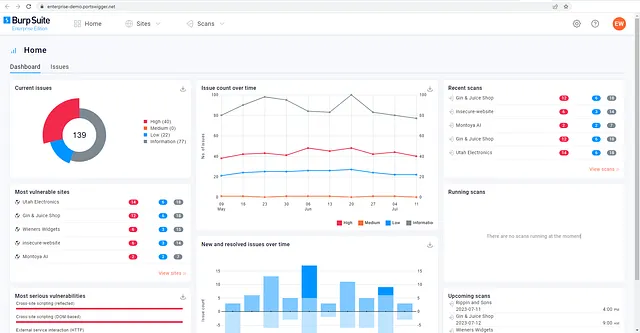
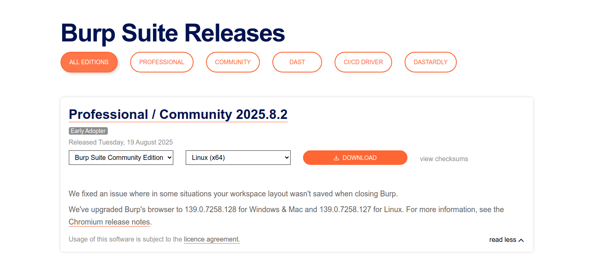

# Burp Suite: The Basics

## Mục lục

1. [Task 1: Introduction](#task-1-introduction)
2. [Task 2: What is Burp Suite](#task-2-what-is-burp-suite)
3. [Task 3: Features of Burp Community](#task-3-features-of-burp-community)
4. [Task 4: Installation](#task-4-installation)

## Nội dung

---

# Task 1: Introduction
**Chào mừng đến với Burp Suite Cơ bản!**

Phòng học này nhằm giúp bạn hiểu những kiến thức cơ bản về Burp Suite – một khung làm việc để kiểm thử bảo mật ứng dụng web. Trọng tâm của chúng ta sẽ xoay quanh các khía cạnh chính sau:

1. Giới thiệu tổng quan về Burp Suite.
2. Cái nhìn toàn diện về các công cụ có sẵn trong khung làm việc.
3. Hướng dẫn chi tiết về quá trình cài đặt Burp Suite trên hệ thống.
4. Cách điều hướng và cấu hình Burp Suite.

Chúng tôi cũng sẽ giới thiệu thành phần cốt lõi của Burp Suite, đó là **Burp Proxy**. Cần lưu ý rằng phòng học này chủ yếu đóng vai trò là tài liệu nền tảng để bạn tiếp thu kiến thức về Burp Suite. Các phòng học tiếp theo trong module Burp sẽ có cách tiếp cận thực hành nhiều hơn. Do đó, phòng học này sẽ nhấn mạnh nhiều hơn vào phần lý thuyết.

Nếu bạn chưa từng sử dụng Burp Suite, khuyến nghị bạn nên đọc kỹ thông tin được cung cấp và chủ động thực hành với công cụ. Việc thử nghiệm là rất cần thiết để nắm vững các khái niệm cơ bản của khung làm việc này. Việc kết hợp thông tin được trình bày tại đây với phần thực hành sẽ giúp bạn xây dựng nền tảng vững chắc cho việc sử dụng framework, hỗ trợ đáng kể cho bạn trong các phòng học tiếp theo.

---

# Task 2: What is Burp Suite
**Burp Suite là gì**

Về cơ bản, Burp Suite là một framework dựa trên Java được thiết kế để cung cấp giải pháp toàn diện cho việc kiểm thử thâm nhập ứng dụng web. Nó đã trở thành công cụ tiêu chuẩn trong ngành để đánh giá bảo mật thực tế của các ứng dụng web và di động, bao gồm cả những ứng dụng dựa vào giao diện lập trình ứng dụng (API).

Nói một cách đơn giản, Burp Suite thu thập và cho phép thao tác toàn bộ lưu lượng HTTP/HTTPS giữa trình duyệt và máy chủ web. Khả năng cốt lõi này tạo thành nền tảng của framework. Bằng cách chặn các yêu cầu, người dùng có thể linh hoạt chuyển hướng chúng đến các thành phần khác nhau trong Burp Suite, mà chúng ta sẽ tìm hiểu trong các phần tiếp theo.

Khả năng chặn, xem và chỉnh sửa các yêu cầu web trước khi chúng đến máy chủ mục tiêu hoặc thậm chí thay đổi phản hồi trước khi chúng được trình duyệt nhận giúp Burp Suite trở thành một công cụ vô giá cho việc kiểm thử thủ công ứng dụng web.

Burp Suite có nhiều phiên bản khác nhau. Trong phạm vi này, chúng ta sẽ tập trung vào **Burp Suite Community Edition**, phiên bản miễn phí cho mục đích phi thương mại trong khuôn khổ pháp luật. Tuy nhiên, cần lưu ý rằng Burp Suite cũng cung cấp các phiên bản **Professional** và **Enterprise**, với các tính năng nâng cao và yêu cầu bản quyền:

---

**1. Burp Suite Professional** là phiên bản không giới hạn của Burp Suite Community. Nó có các tính năng như:

* Trình quét lỗ hổng tự động.
* Fuzzer/brute-forcer không bị giới hạn tốc độ.
* Lưu trữ dự án để sử dụng trong tương lai và tạo báo cáo.
* API tích hợp sẵn để kết nối với các công cụ khác.
* Quyền truy cập không giới hạn để thêm các tiện ích mở rộng mới nhằm tăng chức năng.
* Truy cập Burp Suite Collaborator (cung cấp trình bắt yêu cầu độc nhất, có thể tự triển khai hoặc chạy trên máy chủ thuộc sở hữu của PortSwigger).

 Nói ngắn gọn, Burp Suite Professional là một công cụ cực kỳ mạnh mẽ, thường được các chuyên gia trong lĩnh vực này ưa chuộng.

---

**2. Burp Suite Enterprise** khác biệt so với Community và Professional, chủ yếu được sử dụng cho việc quét liên tục. Nó có trình quét tự động quét định kỳ các ứng dụng web để tìm lỗ hổng, tương tự như công cụ Nessus trong việc quét hạ tầng tự động.

Không giống như các phiên bản khác, vốn cho phép thực hiện tấn công thủ công từ máy cục bộ, **Burp Suite Enterprise** chạy trên máy chủ và liên tục quét các ứng dụng web mục tiêu để phát hiện lỗ hổng tiềm ẩn.

Do yêu cầu cần có bản quyền đối với các phiên bản Professional và Enterprise, chúng ta sẽ tập trung vào các tính năng cốt lõi được cung cấp bởi Burp Suite Community Edition.

**Lưu ý:** Các minh họa được cung cấp sử dụng Burp Suite cho Windows. Tuy nhiên, chức năng vẫn tương đồng với phiên bản được cài đặt trên AttackBox.

---

## Câu hỏi 

**Trả lời các câu hỏi bên dưới**

**2.1** Phiên bản nào của Burp Suite chạy trên máy chủ và cung cấp khả năng quét liên tục cho các ứng dụng web mục tiêu?
**Trả lời:** *Burp Suite Enterprise*

**2.2** Burp Suite thường được sử dụng khi tấn công các ứng dụng web và ứng dụng \_\_\_\_\_\_ .
**Trả lời:** *Mobile*

---

# Task 3: Features of Burp Community
**Các tính năng của Burp Community**

Mặc dù Burp Suite Community cung cấp bộ tính năng hạn chế hơn so với bản Professional, nó vẫn mang đến một loạt công cụ rất hữu ích cho việc kiểm thử ứng dụng web. Hãy cùng khám phá một số tính năng chính:

* **Proxy:** Burp Proxy là phần nổi tiếng nhất của Burp Suite. Nó cho phép chặn và chỉnh sửa các yêu cầu và phản hồi khi tương tác với ứng dụng web.

* **Repeater:** Một tính năng phổ biến khác. Repeater cho phép thu thập, chỉnh sửa và gửi lại cùng một yêu cầu nhiều lần. Chức năng này đặc biệt hữu ích khi xây dựng payload bằng cách thử và sai (ví dụ: SQLi — SQL Injection) hoặc kiểm tra khả năng hoạt động của endpoint để tìm lỗ hổng.

* **Intruder:** Dù có giới hạn tốc độ trong Burp Suite Community, Intruder vẫn cho phép gửi nhiều yêu cầu đến các endpoint. Nó thường được sử dụng cho tấn công brute-force hoặc fuzzing endpoint.

* **Decoder:** Cung cấp dịch vụ giá trị trong việc chuyển đổi dữ liệu. Nó có thể giải mã thông tin thu được hoặc mã hóa payload trước khi gửi đến mục tiêu. Dù có nhiều công cụ thay thế, sử dụng Decoder trong Burp Suite có thể rất hiệu quả.

* **Comparer:** Như tên gọi, Comparer cho phép so sánh hai đoạn dữ liệu ở cấp độ từ hoặc byte. Dù không chỉ riêng Burp Suite mới có, nhưng khả năng gửi trực tiếp các đoạn dữ liệu lớn đến công cụ so sánh chỉ bằng một phím tắt giúp tăng tốc đáng kể quá trình phân tích.

* **Sequencer:** Thường được dùng khi đánh giá độ ngẫu nhiên của các token, chẳng hạn như giá trị session cookie hoặc dữ liệu được tạo ngẫu nhiên. Nếu thuật toán tạo ra các giá trị này không thực sự ngẫu nhiên, nó có thể mở ra khả năng cho các cuộc tấn công nghiêm trọng.

Ngoài các tính năng tích hợp sẵn, mã nguồn Java của Burp Suite hỗ trợ phát triển các tiện ích mở rộng nhằm tăng cường chức năng cho framework. Các tiện ích mở rộng này có thể được viết bằng Java, Python (sử dụng trình thông dịch Java Jython) hoặc Ruby (sử dụng trình thông dịch Java JRuby).

**Burp Suite Extender** cho phép tải nhanh và dễ dàng các tiện ích mở rộng vào framework, trong khi **BApp Store** (chợ tiện ích) cho phép tải xuống các module của bên thứ ba. Một số tiện ích mở rộng có thể yêu cầu bản quyền Professional để tích hợp, nhưng vẫn có rất nhiều tiện ích sẵn có cho Burp Community. Ví dụ: module **Logger++** có thể mở rộng chức năng ghi log tích hợp sẵn của Burp Suite.

## Câu hỏi

**Trả lời các câu hỏi bên dưới**

**3.1** Tính năng nào của Burp Suite cho phép chúng ta chặn các yêu cầu giữa bản thân và mục tiêu?
**Trả lời:** *Proxy*

**3.2** Công cụ nào trong Burp được sử dụng để brute-force một form đăng nhập?
**Trả lời:** *Intruder*

---

# Task 4: Installation

Burp Suite là một trong những công cụ rất hữu ích để sử dụng, dù là cho đánh giá ứng dụng web hay di động, kiểm thử bảo mật (pentesting), săn lỗi bảo mật (bug bounty), hay thậm chí gỡ lỗi các tính năng trong phát triển ứng dụng web. Dưới đây là hướng dẫn cài đặt Burp Suite trên các nền tảng khác nhau:

**Lưu ý:** Nếu bạn sử dụng AttackBox, Burp Suite đã được cài đặt sẵn, vì vậy bạn có thể bỏ qua bước này.

**Tải xuống**
Để tải phiên bản mới nhất của Burp Suite cho các hệ thống khác, bạn có thể nhấn vào nút [**button**](https://portswigger.net/burp/releases) để đến trang tải xuống.

**Kali Linux:** Burp Suite được cài sẵn với Kali Linux. Trong trường hợp bị thiếu trên hệ thống Kali của bạn, bạn có thể dễ dàng cài đặt từ kho apt của Kali.

**Linux, macOS, và Windows:** Đối với các hệ điều hành khác, PortSwigger cung cấp các trình cài đặt riêng cho Burp Suite Community và Burp Suite Professional trên trang tải xuống Burp Suite. Hãy chọn hệ điều hành của bạn trong menu thả xuống và chọn **Burp Suite Community Edition**. Sau đó, nhấn nút **Download** để bắt đầu tải về.

**Cài đặt**

Cài đặt Burp Suite bằng phương pháp phù hợp với hệ điều hành của bạn. Trên Windows, chạy tệp thực thi, trong khi trên Linux, chạy script từ terminal (có hoặc không có `sudo`). Nếu bạn chọn không sử dụng `sudo` khi cài đặt trên Linux, Burp Suite sẽ được cài trong thư mục home của bạn tại:

`~/BurpSuiteCommunity/BurpSuiteCommunity`

và sẽ không được thêm vào biến môi trường **PATH**.

Trình cài đặt cung cấp hướng dẫn rõ ràng, và nhìn chung an toàn khi chấp nhận các thiết lập mặc định. Tuy nhiên, luôn khuyến nghị bạn nên kiểm tra kỹ quá trình cài đặt.

Khi Burp Suite đã được cài đặt thành công, bạn có thể khởi chạy ứng dụng. Trong nhiệm vụ tiếp theo, chúng ta sẽ khám phá bước thiết lập và cấu hình ban đầu.
