# Lab 1 - Ảo hóa và container hóa

# GIỚI THIỆU

**Mục tiêu của công việc là đảm bảo bảo vệ ảo hóa.**

Để đạt được mục tiêu này cần giải quyết các nhiệm vụ sau:

- chọn công nghệ ảo hóa/containerization,
- nghiên cứu các cơ chế bảo vệ của công nghệ đã chọn,
- xác định xem các cơ chế của công nghệ ảo hóa có tuân thủ các yêu cầu pháp lý hay không,
- đảm bảo bảo vệ công nghệ phù hợp với yêu cầu của tài liệu,
- kiểm tra tất cả các cơ chế được thực hiện,

# Khái niệm
- Ảo hóa là việc tạo ra một môi trường điện toán trong đó các máy ảo khác nhau có thể chạy trên cùng một tài nguyên vật lý, hoàn toàn tách biệt với nhau. Nói cách khác, đây là khả năng tạo ra phần mềm tương tự của các đối tượng vật lý khác nhau, chẳng hạn như máy tính, bộ lưu trữ dữ liệu, mạng, máy chủ và ứng dụng. Một ví dụ về điều này là việc sử dụng nhiều hệ điều hành trên một thiết bị, với tất cả các hệ điều hành và quy trình tính toán của chúng tách biệt với nhau.
- Containerization là một phương pháp trong đó mã chương trình được đóng gói thành một tệp thực thi duy nhất cùng với các thư viện và phần phụ thuộc để đảm bảo mã chương trình chạy chính xác. Những tập tin như vậy được gọi là container. Các container có thể được triển khai trong các môi trường khác nhau và được quản lý ở đó. Nếu mã được phát triển trong một môi trường điện toán cụ thể (ví dụ: khi được chuyển sang máy chủ mới), các lỗi liên quan đến sự tinh tế trong cấu hình thường xảy ra. Với việc container hóa, những vấn đề như vậy sẽ ít hơn nhiều. Xét cho cùng, vùng chứa không phụ thuộc vào cài đặt của hệ điều hành chính và có thể chạy trên bất kỳ nền tảng nào hoặc trên đám mây.

# Thực hiện

## 1. Lựa chọn công nghệ ảo hóa/containerization
Trong bài thực hành này, chúng tôi đã chọn công nghệ ảo hóa. Phần mềm ảo hóa được chọn là Oracle VM VirtualBox. Hệ điều hành khách được chọn là Windows 7.

## 2. Nghiên cứu các cơ chế bảo vệ của công nghệ đã chọn
- Khi đánh giá việc tuân thủ các yêu cầu pháp luật, chúng tôi đã dựa trên các khía cạnh bảo mật thông tin, được phân loại theo các đối tượng bảo vệ và mô tả trong Điều 6 của tiêu chuẩn GOST R 56938-2016 "Bảo vệ thông tin khi sử dụng công nghệ ảo hóa" 
  - Bảo vệ các phương tiện tạo và quản lý hạ tầng ảo,
  - Bảo vệ các hệ thống tính toán ảo,
  - Bảo vệ các hệ thống lưu trữ dữ liệu ảo,
  - Bảo vệ các kênh truyền dữ liệu ảo,
  - Bảo vệ các thiết bị xử lý, lưu trữ và truyền dữ liệu ảo,
  - Bảo vệ các phương tiện bảo vệ thông tin ảo và các phương tiện bảo vệ thông tin được thiết kế để sử dụng trong môi trường ảo hóa.

# Theo Quyết định của FSTEC Nga số 17, các hệ thống ảo hóa phải đáp ứng các yêu cầu bảo vệ thông tin (Bảng 1).

[Xem tài liệu gốc ở đây](https://fstec.ru/dokumenty/vse-dokumenty/prikazy/prikaz-fstek-rossii-ot-11-fevralya-2013-g-n-17)

[Xem file pdf]()

**Bảng 1 – Yêu cầu của FSTEC**

| Mã số | Yêu cầu                                                           |
|-------|------------------------------------------------------------------|
| ZSV.1 | Xác thực và định danh người dùng và đối tượng truy cập trong hạ tầng ảo |
| ZSV.2 | Quản lý quyền truy cập của người dùng vào đối tượng trong hạ tầng ảo |
| ZSV.3 | Đăng ký các sự kiện bảo mật trong hạ tầng ảo                    |
| ZSV.4 | Quản lý luồng thông tin giữa các thành phần trong hạ tầng ảo     |
| ZSV.5 | Tải tin cậy máy chủ ảo hóa và các máy ảo                         |
| ZSV.6 | Quản lý di chuyển máy ảo và dữ liệu                               |
| ZSV.7 | Kiểm soát tính toàn vẹn của hạ tầng ảo và cấu hình của nó        |
| ZSV.8 | Sao lưu dữ liệu và dự phòng các thành phần trong hạ tầng ảo      |
| ZSV.9 | Quản lý bảo vệ chống virus trong hạ tầng ảo                      |
| ZSV.10| Phân đoạn hạ tầng ảo để xử lý dữ liệu cá nhân                    |

**Bảng 2 – Các biện pháp bảo vệ trong VirtualBox**

| Mã số | Có áp dụng trong VirtualBox không? |
|-------|-------------------------------------|
| ZSV.1 | Có                                  |
| ZSV.2 | Có                                  |
| ZSV.3 | Có                                  |
| ZSV.4 | Có                                  |
| ZSV.5 | Có                                  |
| ZSV.6 | Có                                  |
| ZSV.7 | Có                                  |
| ZSV.8 | Có                                  |
| ZSV.9 | Không                               |
| ZSV.10| Có                                  |

## Xác định các cơ chế của công nghệ ảo hóa có tuân thủ yêu cầu pháp luật không

### ZSV.1	Xác thực và định danh người dùng và đối tượng truy cập trong hạ tầng ảo

ZSV.1 - Xác thực và định danh người dùng và đối tượng truy cập trong hạ tầng ảo, bao gồm cả quản trị viên quản lý các công cụ ảo hóa.

Trong VirtualBox, việc ghi nhật ký và xác thực có sẵn theo mặc định (Hình 1). 

**Cách thực hiện:** ```click vào biểu tượng có 3 dấu chấm trong máy ảo bạn muốn ghi nhật ký -> Logs```

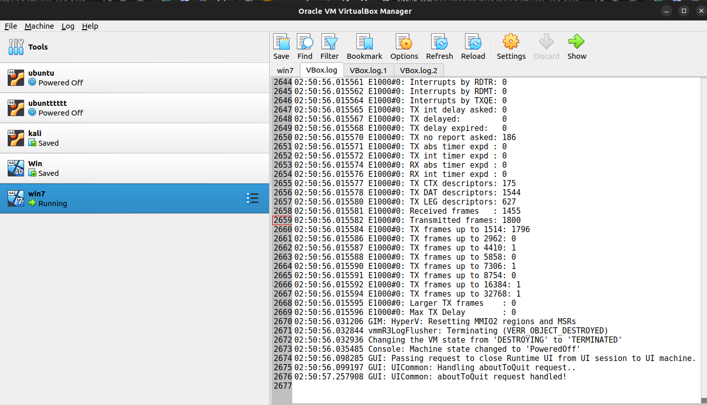

Hình 1 - Nhật ký của VirtualBox

Ngoài ra, bạn có thể thiết lập mật khẩu để đăng nhập vào hệ thống ảo (Hình 2).

**cách thực hiện:** ``` Chọn settings của máy ảo -> General -> Disk Encryption```

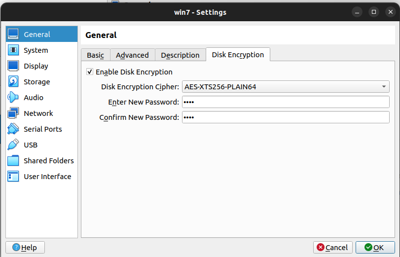

Hình 2 - Cài đặt xác thực để truy cập vào máy ảo


Khi cài đặt hệ thống ảo, có thể tạo mật khẩu để đăng nhập vào hệ điều hành khách (Hình 3).

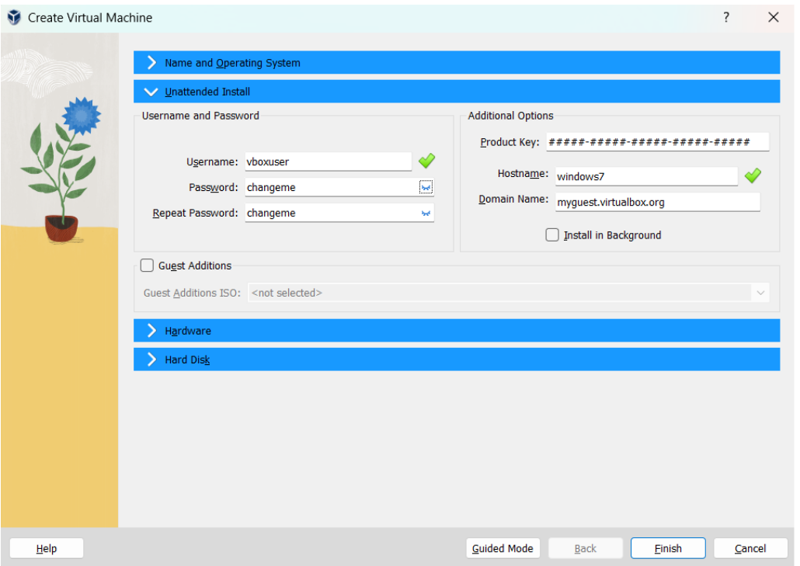

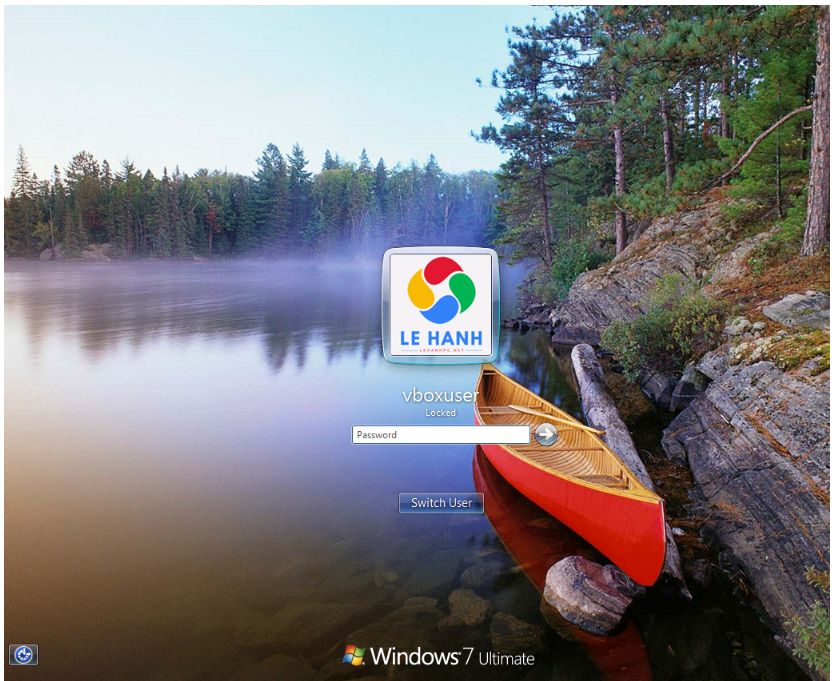

Hình 3 - Yêu cầu mật khẩu trong hệ điều hành khách


## ZSV.2 - Quản lý quyền truy cập của người dùng vào các đối tượng trong hạ tầng ảo, bao gồm cả bên trong máy ảo.

Trong môi trường ảo, có thể thêm tài khoản người dùng và cấp quyền quản trị viên hoặc người dùng thông thường (Hình 4).

**Cách thực hiện:** ``` windows + R -> nhập Control Panel -> User Acconts and Family Safety -> Tại mục User Accounts chọn Add or remove user acconts -> Create new account```

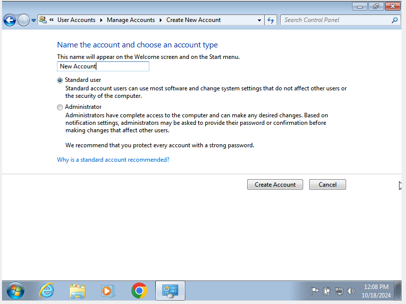

Hình 4 - Tạo tài khoản người dùng khác


## ZSV.3 - Đăng ký các sự kiện bảo mật trong hạ tầng ảo.

Trong VirtualBox và hệ điều hành khách, tính năng ghi nhật ký sự kiện bảo mật có sẵn theo mặc định (Hình 5).

**Cách thực hiện:** ``` windows + R -> nhập eventvwr.msc -> Windows.Logs -> System```

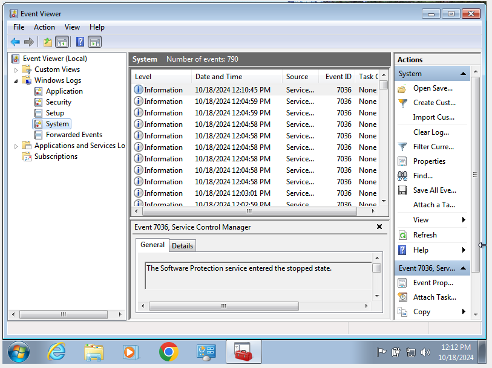

Hình 5 - Ghi nhật ký sự kiện trong Windows 7


## ZSV.4 - Quản lý (lọc, định tuyến, kiểm soát kết nối, truyền một chiều) luồng thông tin giữa các thành phần trong hạ tầng ảo, cũng như qua chu vi hạ tầng ảo.

Trong hệ điều hành khách được sử dụng cho ví dụ này, Firewall của Windows được tích hợp sẵn (Hình 6). Trong đó, có thể tùy chọn chặn và giới hạn lưu lượng vào và ra. Cũng có thể thiết lập các bộ điều hợp bổ sung cho máy ảo trên VirtualBox.

**Cách thực hiện:** ``` windows + R -> nhập wf.msc -> Inbound Rules -> New rule -> Program -> This program path -> browse -> Computer -> Ổ đĩa chứa ứng dung exe -> Program Files -> Ví dụ muốn chọn chrome thì chọn folder chrome -> application -> chrome sau đó đặt tên```

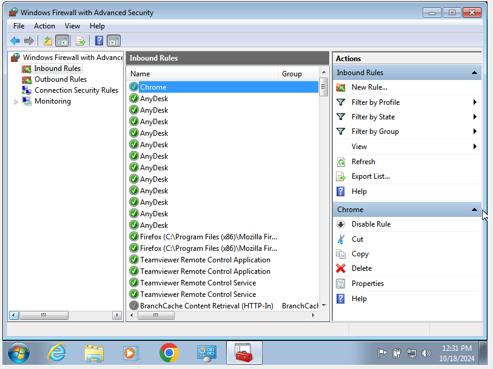

Hình 6 - Cấu hình tường lửa


## ZSV.5 - Tải tin cậy máy chủ ảo hóa, máy ảo (container), và máy chủ quản lý ảo hóa.

Biện pháp này yêu cầu đảm bảo việc tải tin cậy của các máy chủ ảo hóa, máy ảo và các máy chủ quản lý ảo hóa. Biện pháp này chia thành hai phần - một là tải tin cậy các máy chủ vật lý (hypervisor, hệ thống quản lý ảo hóa), và hai là tải tin cậy của máy ảo. Phần thứ nhất thực hiện bằng các phương tiện phần cứng tải tin cậy truyền thống, phần thứ hai chỉ thực hiện qua các công cụ bảo mật ảo hóa bổ sung (Hình 7).

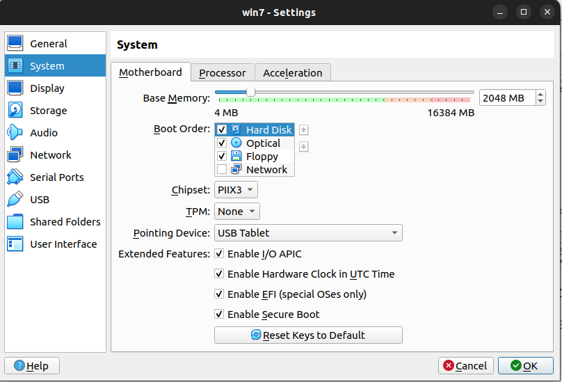

Hình 7 - Cài đặt tải tin cậy

## ZSV.6 - Quản lý di chuyển máy ảo (container) và dữ liệu trên chúng.

Cấu hình của máy ảo có thể xuất sang đám mây. Cũng có thể xuất cấu hình sang hệ thống chính hoặc thiết bị lưu trữ di động (Hình 8).

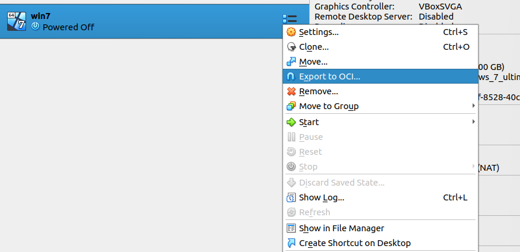

Hình 8 - Xuất cấu hình máy ảo

## ZSV.7 - Kiểm tra tính toàn vẹn của hạ tầng ảo và cấu hình của nó.

Kiểm tra tính toàn vẹn được tích hợp trong VirtualBox. Ví dụ, khi cố gắng sửa đổi tệp với phần mở rộng .vdi và mở máy ảo qua VirtualBox, sẽ gặp lỗi về tính toàn vẹn (Hình 9).

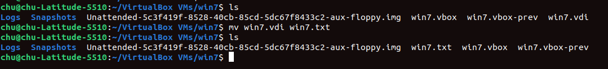

Hình 9.1 - Sửa file .vdi trong máy chính

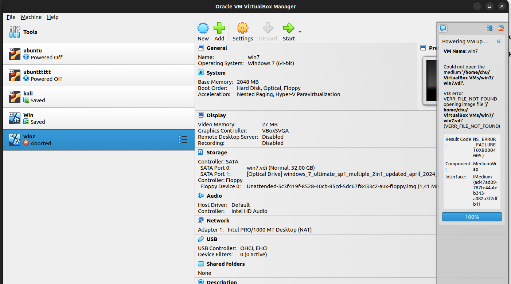

Hình 9.2 - Lỗi khi kiểm tra tính toàn vẹn


## ZSV.8 - Sao lưu dữ liệu, dự phòng các phương tiện kỹ thuật, phần mềm của hạ tầng ảo, cũng như các kênh truyền trong hạ tầng ảo.

Trong VirtualBox, có tính năng sao lưu nội bộ máy ảo - tạo Snapshot (Hình 10).

**Cách thực hiện:** ```Click chuột vào dấu 3 chấm của máy ảo -> snapshots -> take```
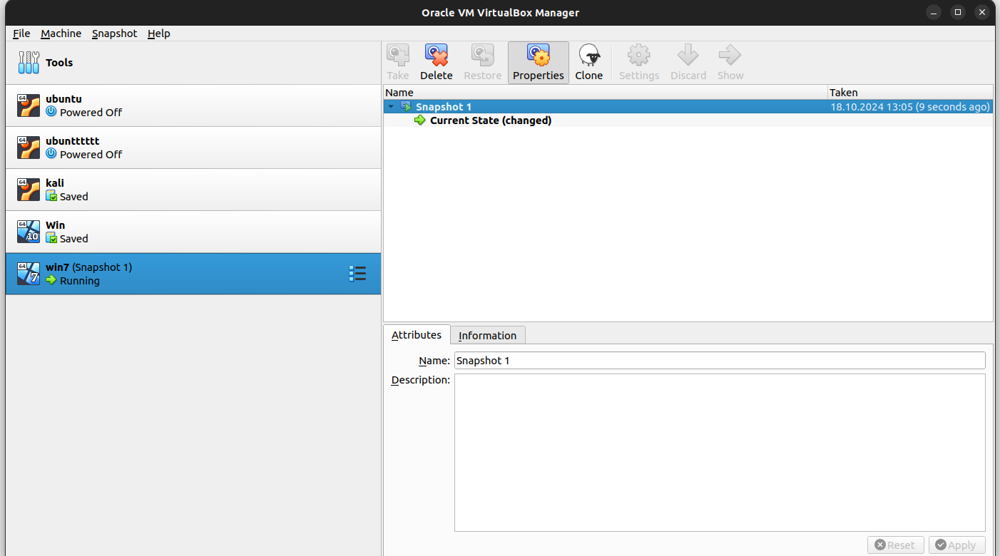

Hình 10 - Tạo Snapshot

Cũng có thể sao chép tệp cấu hình của máy ảo qua "Trình quản lý phương tiện ảo" (Hình 11).
**Cách thực hiện:** ``` Click chuột vào dấu 3 chấm ở mục tools -> media```

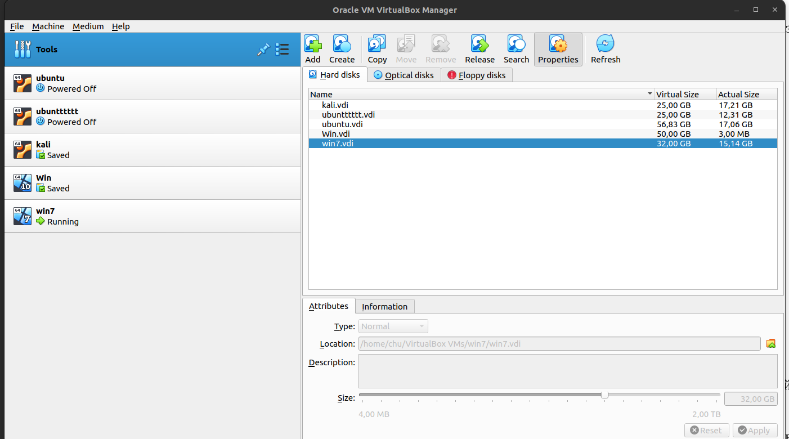

Hình 11 - Sao chép qua trình quản lý phương tiện ảo


## ZSV.9 - Thực hiện và quản lý bảo vệ chống virus trong hạ tầng ảo.

Trong VirtualBox không có sẵn phần mềm chống virus, vì vậy cần tải xuống phần mềm này trong môi trường ảo.

## ZSV.10 - Phân đoạn hạ tầng ảo để xử lý dữ liệu cá nhân của từng người dùng hoặc nhóm người dùng.

Có thể thiết lập quyền truy cập người dùng trên máy ảo, từ đó phân đoạn hạ tầng (Hình 12). Cũng có thể thiết lập các mạng cục bộ khác nhau trong máy ảo (Hình 13).

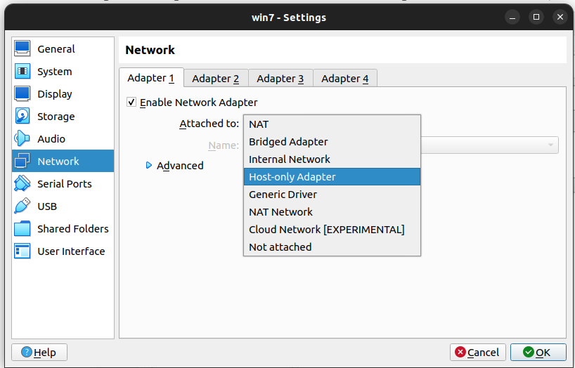

Hình 12 - Phân đoạn mạng

```Trên hệ thống bấm góc trái màn hình -> mũi tên ở nút shut down -> switch user```

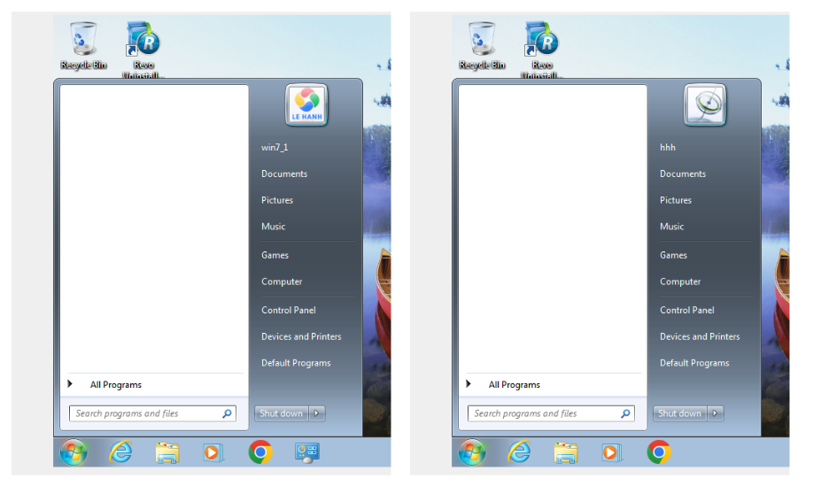

Hình 13 - Phân đoạn kiểm soát truy cập

## Đảm bảo bảo vệ công nghệ theo yêu cầu của tài liệu

Để đảm bảo bảo vệ theo ZSV.9, chúng tôi đã cài đặt phần mềm chống virus 360 Total Security trên máy ảo Windows 7 và kiểm tra hoạt động của nó (Hình 14).

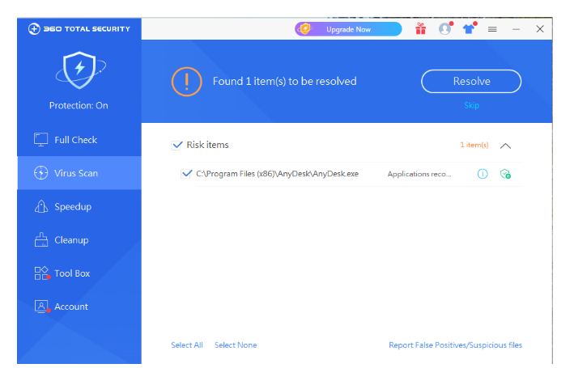

Hình 14 - Hoạt động của phần mềm chống virus


## Tài liệu tham khảo
 DANH SÁCH TÀI LIỆU THAM KHẢO

- GOST R 56938-2016. Bảo vệ thông tin. Bảo vệ thông tin khi sử dụng công nghệ ảo hóa. Các quy định chung: có hiệu lực từ ngày 01-06-2017. – 2 trang.
- Quyết định FSTEC Nga từ ngày 18 tháng 2 năm 2013, số 17.
- Remote Virtual Machines // VirtualBox Manual URL: https://www.virtualbox.org/manual/ch07.html#vbox-auth
u1035 / vbox-vm-backup // GitHub URL: https://github.com/u1035/vbox-vm-backup
