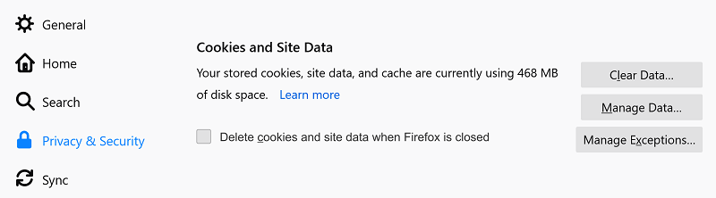
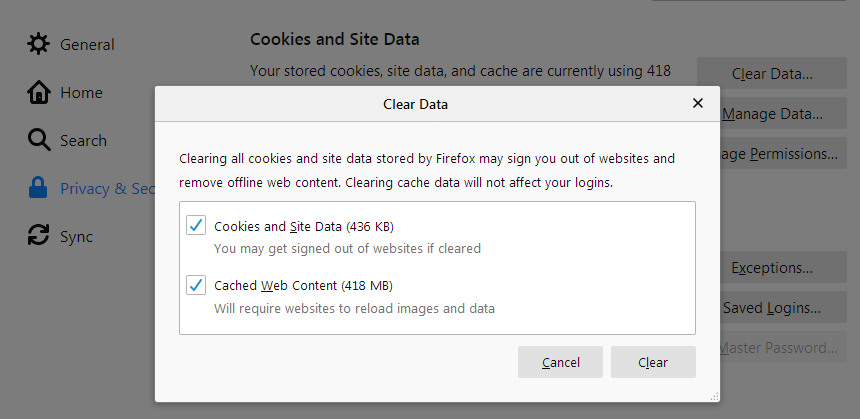
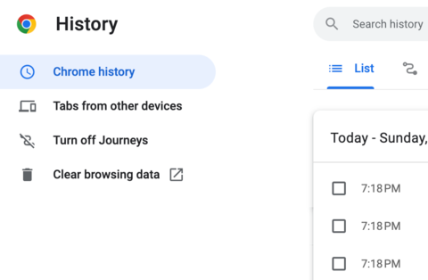
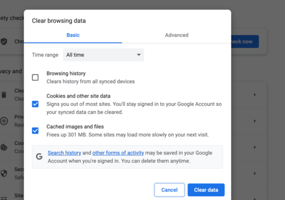
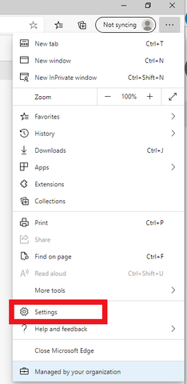
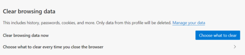
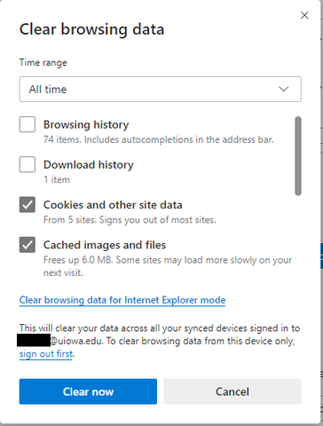

# 1. Cookies là gì?

Cookies là những tập tin được một trang web bất kì gửi đến máy tính của người dùng và được lưu lại thông qua trình duyệt khi người dùng truy cập trang web đó. Cookies được dùng với mục đích phổ biến là để lưu trữ phiên đăng nhập nhằm phục vụ cho mục đích xác thực với website, duy trì trạng thái đăng nhập. Ngoài ra, Cookies còn được dùng để ghi nhớ thông tin trạng thái, ghi nhớ hoạt động người dùng thực hiện trong quá trình truy cập và duyệt một trang web. Cookies cũng được dùng để lưu lại các thông tin khác mà người dùng nhập hay điền vào trang web như tên, địa chỉ, email...

# 2. Các loại Cookies

Cookies được chia ra rất nhiều loại và mỗi loại lại có chức năng khác nhau. Chúng bao gồm:

- **Session Cookies**: Đây là loại Cookies chỉ tồn tại trong bộ nhớ tạm khi bạn khởi động trình duyệt web. Session Cookies không có thời hạn lưu trữ và bị trình duyệt xóa bỏ khi phiên làm việc kết thúc.

- **Persistent Cookies**: Loại Cookies này sẽ tự động bị xóa bỏ sau một khoảng thời gian được thiết lập trước.

- **Secure Cookies**: Loại Cookies này chỉ được gửi và nhận khi giao thức HTTPS được kích hoạt.

- **HTTP-only Cookies**: Loại Cookies này không được truy cập bởi các API từ phía người dùng như JavaScript.

- **Same-site Cookies**: Loại Cookies này chỉ được gửi thông qua các yêu cầu có cùng nguồn gốc từ một tên miền mục tiêu.

- **Third-party Cookies**: Cookies loại này được sử dụng rộng rãi bởi các công ty quảng cáo để thu thập thông tin về hành vi truy cập của người dùng trong những trang web mà họ ghé qua.

- **Super Cookies**: Các đối tượng xấu thường hay tận dụng Super Cookies để ngụy trang các yêu cầu bất hợp pháp thành hợp pháp và đánh lừa người dùng truy cập.

- **Zombie Cookies**: Đây là loại Cookies đã bị xóa nhưng có thể "tái sinh" nhờ một cơ chế đặc biệt để tiếp tục hoạt động.

# 3. Cách hoạt động của Cookies

Cookies được lưu trữ trên máy tính của người dùng dưới dạng một tập tin văn bản nhỏ. Trang web sử dụng Cookies thông qua mã JavaScript để lưu trữ và truy xuất thông tin. Khi người dùng truy cập vào một trang web, trình duyệt sẽ kiểm tra xem có Cookies nào được lưu trữ trong máy tính của người dùng không. Nếu có, trình duyệt sẽ gửi thông tin Cookies này đến trang web để giúp họ hiểu hành vi của người dùng sau khi truy cập.

# 4. Công dụng của Cookies

Cookies có rất nhiều công dụng như:

- **Cải thiện trải nghiệm người dùng**: Cookies giúp các trang web lưu trữ thông tin về người dùng, giúp chúng hiểu được thói quen và sở thích của họ. Điều này giúp các trang web cải thiện trải nghiệm của người dùng, đưa ra nội dung phù hợp hơn.

- **Quản lý giỏ hàng và thanh toán**: Cookies được sử dụng để quản lý giỏ hàng và quá trình thanh toán trên các trang web thương mại điện tử. Cookies lưu trữ thông tin về sản phẩm mà người dùng đã thêm vào giỏ hàng, giúp họ không phải thêm lại từ đầu nếu đóng trình duyệt.

- **Theo dõi và phân tích hành vi người dùng**: Cookies cung cấp cho các trang web thông tin về hành vi của người dùng, giúp họ hiểu được các trang web và nội dung nào được ưa thích nhất. Thông tin này giúp các trang web phát triển nội dung và dịch vụ tốt hơn để đáp ứng nhu cầu của người dùng.

- **Quảng cáo và tiếp thị mục đích**: Cookies được sử dụng để theo dõi hành vi trực tuyến của người dùng và đưa ra quảng cáo mục đích. Những quảng cáo này có thể được tùy chỉnh dựa trên sở thích và thói quen của người dùng trên các trang web khác nhau.

# 5. Những vấn đề khác liên quan đến Cookies

- **Vấn đề bảo mật và riêng tư**: Cookies chứa thông tin về người dùng, do đó chúng cần được bảo vệ và xử lý đúng cách để tránh bị đánh cắp thông tin hoặc sử dụng sai mục đích.

- **Sự cần thiết của việc bật/tắt Cookies trên trình duyệt**: Người dùng có thể tắt Cookies trên trình duyệt của mình, nhưng điều này có thể ảnh hưởng đến trải nghiệm trên một số trang web. Do đó, người dùng cần cân nhắc và hiểu rõ tác động của việc tắt Cookies trên trình duyệt của mình.

- **Chính sách và quy định liên quan đến việc sử dụng Cookies**: Các trang web cần tuân thủ các quy định và chính sách liên quan đến việc sử dụng Cookies nhằm đảm bảo tính bảo mật và sự riêng tư của người dùng.

# 6.  Hướng dẫn xóa Cookies trên các trình duyệt phổ biến

Tất cả các trình duyệt web hiện nay đều có phần xóa lịch sử duyệt web, trong đó có mục xóa Cookies. Mặc dù giao diện menu của từng trình duyệt khác nhau, nhưng đều có mục **Lịch sử** (History) để người dùng dễ dàng xóa Cookies. Thường mục này nằm trong menu chính của trình duyệt, hoặc bạn có thể sử dụng các phím tắt mà nhà sản xuất công bố trên trang chủ của họ.

Dưới đây là hướng dẫn cụ thể cách xóa Cookies trên các trình duyệt phổ biến như **Mozilla Firefox**, **Google Chrome**, và **Microsoft Edge**.

---

## Cách xóa Cookies trên Mozilla Firefox

1. Mở Mozilla Firefox trên máy tính của bạn.
2. Bấm vào nút **Menu** (biểu tượng 3 gạch ngang) và chọn **Settings**.
3. Chọn mục **Privacy & Security**.

4. Trong phần **Cookies and Site Data**, bấm vào nút **Clear Data...**.
5. Cửa sổ **Clear Data** sẽ hiện ra. Tick vào các phần dữ liệu cần xóa, bao gồm **Cookies** nếu muốn. Sau đó, bấm **Clear** để hoàn tất.

---

## Cách xóa Cookies trên Google Chrome

1. Mở Google Chrome trên máy tính của bạn.
2. Bấm vào menu **Tools** (biểu tượng 3 dấu chấm ở góc trên cùng bên phải).
3. Chọn **History**.

4. Chọn **Clear Browsing Data** ở cột bên trái. Trong ô **Time range**, chọn **All time**.
5. Tick vào **Cookies and other site data** cùng với **Cached images and files**. Sau đó bấm nút **Clear data** để hoàn tất.

---

## Cách xóa Cookies trên Microsoft Edge

1. Khởi động Microsoft Edge trên máy tính của bạn.
2. Bấm vào menu **Tools** (biểu tượng 3 chấm nằm ngang), sau đó chọn **Settings**.

3. Bấm vào **Privacy, search, and services** trong menu bên trái.
4. Dưới mục **Clear browsing data**, bấm vào nút **Choose what to clear**.

5. Chọn **Cookies and other site data** và **Cached images and files**.
6. Bấm **Clear now** để hoàn tất.

7. Khởi động lại Microsoft Edge để thay đổi này có hiệu lực.

--- 

Với các hướng dẫn trên, bạn có thể dễ dàng xóa Cookies trên từng trình duyệt để quản lý và bảo vệ thông tin duyệt web của mình.

[Bài Viết Gốc Ỏ Đây](fptshop.com.vn/tin-tuc/danh-gia/cookies-la-gi-157392)
