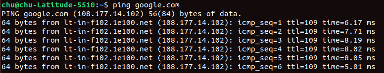

# Ping là gì ?

- Ping (viết tắt của Packet Internet Grouper ). là lệnh cơ bản để kiểm tra xem thiết bị của bạn có truy cập đến địa chỉ cần kiểm tra và mất bao lâu để yêu cầu nhận được phản hồi. Đồng thời khi sử dụng lệnh ping với tên miền, tương đương với việc sẽ kiểm tra được địa chỉ IP thực của trang web đó.  Ping còn được sử dụng để kiểm tra xem thời gian phản hồi từ thiết bị của bạn đến các nhà cung cấp dịch vụ Internet lớn như:
  - FPT: ```ping 210.245.31.130```
  - Viettel: ```ping 203.113.131.1```
  - VNN: ```ping 203.162.4.190```

Ví dụ:



```64 bytes from lt-in-f102.1e100.net (108.177.14.102): icmp_seq=1 ttl=109 time=6.17 ms```

- Phản hồi từ IP 108.177.14.102, gói tin dung lượng 64 bytes, thời gian phản hồi là 6.17 mili giây
- Vậy thế nào là thời gian phản hồi tốt khi kiểm tra lệnh ping :
  - <30 ms - ping tuyệt vời ; hầu như không có độ trễ, rất tốt để xử lý các yêu cầu cần phản hồi nhanh như chơi game online (phản hồi theo thời gian thực).
  - 30 đến 50 ms - ping trung bình; phản hồi trang web vẫn rất nhanh.
  - 50 đến 100 ms - thời gian ping hơi chậm;  web bắt đầu phản hồi chậm khi  truy cập.
  - 100 ms đến 500 ms - ping chậm; ảnh hưởng rõ ràng hơn đến trình duyệt web, load web rất lâu.
  - >500 ms - ping nửa giây trở lên sẽ thêm độ trễ đáng chú ý cho tất cả các yêu cầu; thường xảy ra khi nguồn và đích ở các khu vực khác nhau trên thế giới.

----

- Ping là một trong những công cụ mạng cơ bản nhất hiện có. Ping sử dụng các gói ICMP (Internet Control Message Protocol - Giao thức tin nhắn điều khiển Internet) để xác định hiệu suất kết nối giữa các thiết bị, chẳng hạn như liệu kết nối có tồn tại hay đáng tin cậy hay không.
- Thời gian để các gói ICMP di chuyển giữa các thiết bị được đo bằng ping. Việc đo lường này được thực hiện bằng cách sử dụng gói echo của ICMP và sau đó là phản hồi echo của ICMP từ thiết bị đích.
- Ping có thể được thực hiện với các thiết bị trên mạng, chẳng hạn như mạng gia đình của bạn hoặc các tài nguyên như trang web. Công cụ này có thể dễ dàng sử dụng và được cài đặt trên  Operating Systems  (OSs) như Linux và Windows
- Cú pháp: ```ping IP address or website URL```

[](./img/Ping/Ping_2.png)

- Ở đây chúng ta đang ping một thiết bị có địa chỉ riêng là 192.168.1.254. Ping thông báo cho chúng tôi rằng chúng tôi đã gửi sáu gói ICMP, tất cả đều được nhận với thời gian trung bình là 4,16 mili giây

