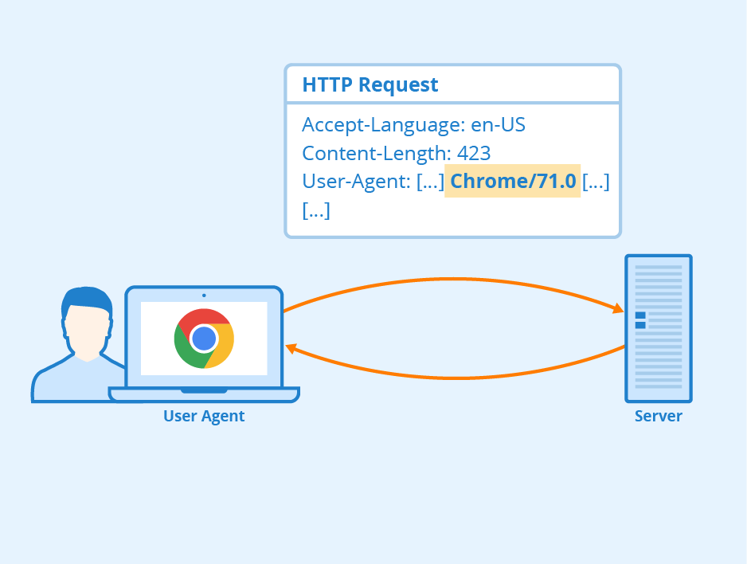
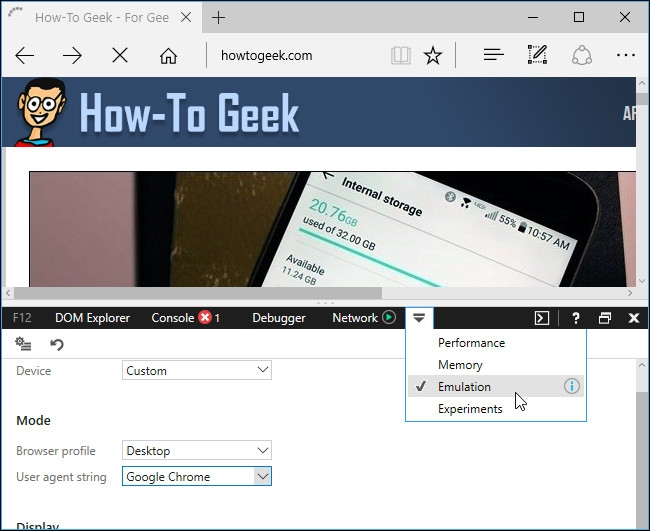

# User Agent là gì?

- User Agent là một phần quan trọng của giao thức HTTP mà trình duyệt gửi đến máy chủ web khi bạn truy cập vào một trang web. Được coi như một “bản thông tin cá nhân” của trình duyệt và thiết bị, User Agent cung cấp cho máy chủ web thông tin cụ thể về môi trường truy cập của người dùng.
- Ngoài tên và phiên bản của trình duyệt, hệ điều hành và loại thiết bị, User Agent cũng có thể bao gồm thông tin về các tính năng hỗ trợ như ngôn ngữ ưa thích, độ phân giải màn hình hay các plugin được cài đặt trên trình duyệt. Nhờ vào thông tin này, máy chủ web có thể tùy chỉnh trải nghiệm trực tuyến cho từng người dùng, cung cấp nội dung cùng giao diện phù hợp với thiết bị và trình duyệt của họ.


- Một ví dụ điển hình của việc sử dụng User Agent là khi một trang web hiển thị một phiên bản tối ưu hóa cho điện thoại di động, khi bạn truy cập từ một điện thoại thông minh, nhưng sẽ hiển thị một giao diện máy tính để bàn khi bạn truy cập từ máy tính.
- Ngoài ra, thông tin từ User Agent cũng có thể được sử dụng cho mục đích phân tích thống kê truy cập, đánh giá hiệu suất và tương thích của trang web trên các trình duyệt hay thiết bị khác nhau. Điều này sẽ giúp các nhà phát triển web hiểu rõ hơn về người dùng của họ, từ đó cung cấp trải nghiệm trực tuyến tốt nhất cho mọi người.



# Ví dụ về chuỗi User Agent

**Dưới đây là một ví dụ về chuỗi User Agent:**

```“Mozilla/5.0 (Windows NT 10.0; Win64; x64) AppleWebKit/537.36 (KHTML, like Gecko) Chrome/60.0.0.3112.113 Safari/537.36.”```

- Trong chuỗi này thì:

  - Mozilla/5.0: Đây là một phần cố định của chuỗi User Agent, chỉ ra rằng trình duyệt đang sử dụng một phiên bản của giao thức Mozilla.
  - Windows NT 10.0; Win64; x64: Đây là thông tin về hệ điều hành và kiến trúc của hệ điều hành. Trình duyệt đang chạy trên Windows 10 64-bit.
  - AppleWebKit/537.36 (KHTML, like Gecko): Thông tin về web engine mà trình duyệt sử dụng để hiển thị nội dung web. Trong trường hợp này, đó là AppleWebKit với số phiên bản 537.36.
  - Chrome/60.0.0.3112.113: Tên và phiên bản của trình duyệt. Trình duyệt là Chrome và đang chạy phiên bản 60.0.0.3112.113.
  - Safari/537.36: Thông tin về trình duyệt phụ, có thể được sử dụng trong một số trường hợp khi trình duyệt dựa trên mã nguồn mở của trình duyệt Safari.

- Chuỗi User Agent này cung cấp cho máy chủ web một cái nhìn tổng quan về trình duyệt, và hệ điều hành mà người dùng đang sử dụng để truy cập vào trang web. Những thông tin này giúp máy chủ web tối ưu hóa trải nghiệm trực tuyến bằng cách cung cấp nội dung phù hợp, đảm bảo tương thích trên các nền tảng và trình duyệt khác nhau.

# Vai trò của User Agent

**User Agent đóng vai trò quan trọng trong trải nghiệm trực tuyến của người dùng, cũng như hoạt động của các trang web thông qua việc:**

- Định dạng nội dung: User Agent cung cấp thông tin chi tiết về trình duyệt hay phiên bản trình duyệt mà người dùng đang sử dụng. Thông tin này giúp máy chủ web hiểu được khả năng và tính năng của trình duyệt, từ đó cung cấp nội dung phù hợp, tối ưu hóa trải nghiệm người dùng.
- Theo dõi và thống kê: Nhờ User Agent, nhà phát triển và quản trị viên có thể thống kê được tỷ lệ truy cập từ các trình duyệt, thiết bị khác nhau, tối ưu hóa trang web và cung cấp trải nghiệm tốt hơn.
- Tương thích: Bằng cách cho phép máy chủ web xác định định dạng nội dung phù hợp cho từng trình duyệt và thiết bị, User Agent đảm bảo rằng trang web hiển thị chính xác, hoạt động mượt trên nhiều trình duyệt khác nhau.
- Tải về tài nguyên: Thông qua User Agent, máy chủ web biết được các tài nguyên mà trình duyệt hỗ trợ như hình ảnh, âm thanh, video và định dạng file khác. Từ những thông tin này, máy chủ web có thể cung cấp các tài nguyên phù hợp với khả năng của trình duyệt.
- Đánh giá tương thích: User Agent cho phép nhà phát triển web kiểm tra, đánh giá tương thích của trang web trên nhiều trình duyệt khác nhau. Sau khi phân tích thông tin User Agent từ các trình duyệt, nhà phát triển có thể điều chỉnh và cải thiện trang web để đảm bảo tính tương thích tốt nhất.

# Tại sao phải đổi User Agent?

- Việc đổi User Agent là một cách hữu ích được nhiều người thực hiện với một số lý do chính sau:

  - Phát triển web: Đổi User Agent sẽ giúp nhà phát triển web kiểm tra trang web của họ trên nhiều trình duyệt khác nhau một cách dễ dàng, nhanh chóng. Điều này giúp họ đảm bảo rằng, trang web hoạt động một cách nhất quán trên mọi nền tảng và trình duyệt.
  - Kiểm tra trải nghiệm trên các thiết bị di động: Bằng cách đổi User Agent, người dùng có thể xem trước trải nghiệm của trang web trên các thiết bị di động, mà không cần thực sự truy cập từ điện thoại hoặc máy tính bảng, giúp họ có thể kiểm tra tính tương thích hay hiển thị của trang web trên các thiết bị di động.
  - Vượt qua hạn chế dựa trên trình duyệt: Thỉnh thoảng, một số trang web có thể từ chối quyền truy cập, nếu họ phát hiện bạn đang sử dụng trình duyệt không được hỗ trợ. Bằng cách thay đổi User Agent, người dùng có thể vượt qua các hạn chế này và truy cập trang web một cách linh hoạt hơn.

- Tuy nhiên, cần lưu ý rằng việc đổi User Agent có thể ảnh hưởng đến quyền riêng tư của người dùng, một số trang web có thể thu thập thông tin từ User Agent để phục vụ các mục đích riêng của họ. Do đó, bạn cần sử dụng User Agent cẩn thận để đảm bảo tính bảo mật cho chính mình.

# Hướng dẫn thay đổi User Agent

## Với Google Chrome

- Để thay đổi User Agent cho trình duyệt Google Chrome, bạn có thể tham khảo các bước sau:

  - Bước 1: Mở trình duyệt Google Chrome trên máy tính của bạn.
  - Bước 2: Nhấp vào biểu tượng menu ba dấu chấm ngang ở góc trên bên phải của trình duyệt.
  - Bước 3: Trong menu xuất hiện, di chuột xuống More Tools và chọn Developer Tools.
  - Bước 4: Hoặc bạn cũng có thể nhấn tổ hợp phím Ctrl + Shift + I trên bàn phím của bạn để mở Developer Tools.


  - Bước 5: Trong Developer Tools, di chuột đến tab Console ở phía trên của cửa sổ.
  - Bước 6: Nếu bạn không thấy tab Console, hãy nhấp vào biểu tượng menu ở góc trên bên phải của Developer Tools và chọn Show Console.
  - Bước 7: Trên tab Console, di chuột xuống và chọn Network Conditions.


  - Bước 8: Trong phần User Agent, bạn sẽ thấy một ô chọn có chữ Select automatically. Bỏ chọn ô này.
  - Bước 9: Bạn có thể chọn một User Agent từ danh sách có sẵn hoặc sao chép và dán một User Agent tùy chỉnh vào ô.


- Lưu ý rằng cài đặt này chỉ tạm thời và chỉ áp dụng cho tab hiện tại của trình duyệt.

## Với Mozilla Firefox

- Dưới đây là các bước để thay đổi User Agent cho trình duyệt Mozilla Firefox:
  - Bước 1: Mở trình duyệt Mozilla Firefox trên máy tính của bạn.
  - Bước 2: Gõ about:config vào thanh địa chỉ của Firefox và nhấn Enter. Bạn sẽ thấy một cảnh báo cẩn thận khi thay đổi cài đặt, vì bạn có thể làm rối tung thiết lập Firefox.


  - Bước 3: Trong trang about:config, bạn có thể sử dụng hộp tìm kiếm để tìm kiếm useragent.
  - Bước 4: Tìm kiếm mục general.useragent.override. Nếu nó không tồn tại trong hệ thống của bạn, bạn có thể tạo nó.


  - Bước 5: Nhấp chuột phải vào trang about:config, di chuột tới New và chọn String.


  - Bước 6: Đặt tên cho tùy chọn mới là general.useragent.override.


  - Bước 7: Nhập User Agent mong muốn của bạn vào ô giá trị của tùy chọn. Bạn có thể tìm User Agent trên các trang web hoặc sử dụng một User Agent chuẩn.


- Lưu ý rằng cài đặt này sẽ áp dụng cho tất cả các tab đang mở và vẫn tồn tại cho đến khi bạn thay đổi nó, ngay cả khi bạn đóng và mở lại Firefox. Để trở lại với User Agent mặc định trên Firefox, bạn chỉ cần nhấp chuột phải vào tùy chọn general.useragent.override và chọn Reset.

## Với Microsoft Edge và Internet Explorer

- Bạn có thể sử dụng công cụ Developer Tools để thay đổi User Agent cho trình duyệt Microsoft Edge và Internet Explorer:
  - Bước 1: Mở trình duyệt Microsoft Edge hoặc Internet Explorer trên máy tính của bạn.
  - Bước 2: Nhấp vào trình đơn cài đặt bằng cách nhấp vào biểu tượng ba chấm ở góc trên bên phải của trình duyệt và chọn F12 Developer Tools. Hoặc bạn có thể chỉ cần nhấn phím F12 trên bàn phím của bạn.


  - Bước 3: Cửa sổ Developer Tools sẽ mở ra ở cuối cửa sổ trình duyệt web. Di chuột và chọn tab Emulation.



  - Bước 4: Trong tab Emulation, bạn sẽ thấy một hộp có tiêu đề User agent string. Nhấp vào hộp này để mở danh sách các User Agent có sẵn.
  - Bước 5: Chọn một User Agent từ danh sách có sẵn nếu bạn muốn sử dụng một trong số các tùy chọn có sẵn.
  - Bước 6: Nếu bạn muốn sử dụng một User Agent tùy chỉnh, bạn có thể chọn tùy chọn Custom trong danh sách chuỗi User Agent, và nhập một User Agent tùy chỉnh vào ô văn bản.
  - Bước 7: Bạn cũng có thể tìm thấy danh sách các User Agent trên các trang web khác nhau nếu bạn cần một User Agent cụ thể.


- Lưu ý cài đặt này chỉ áp dụng cho tab hiện tại và chỉ trong khi cửa sổ F12 Developer Tools đang mở.

## Với Safari

- Bạn có thể làm theo các bước dưới đây để thay đổi User Agent cho trình duyệt Safari:
  
  - Bước 1: Kích hoạt tùy chọn Develop ẩn trong trình đơn Safari bằng cách nhấp vào Safari rồi chọn Preferences.
 


  - Bước 2: Chọn tab Advanced và đảm bảo rằng tùy chọn Show Develop menu in menu bar ở cuối cửa sổ được bật.
  - Bước 3: Nhấp vào Develop trong thanh menu chính của Safari, sau đó chọn User Agent.
  - Bước 4: Trong danh sách hiển thị, chọn User Agent bạn muốn sử dụng. Nếu User Agent mong muốn không có trong danh sách, chọn Other và nhập User Agent tùy chỉnh của bạn.
  - Bước 5: Bạn có thể tìm thấy danh sách các User Agent trên các trang web khác nhau nếu cần.


- Lưu ý tùy chọn này chỉ áp dụng cho tab hiện tại. Các tab mở hoặc sẽ mở trong tương lai sẽ sử dụng User Agent mặc định.

# Một số lưu ý khi thay đổi User Agent

- Khi thực hiện thay đổi User Agent trong trình duyệt, có một số điều quan trọng mà bạn cần lưu ý. Trước hết, đảm bảo rằng việc thay đổi User Agent tuân thủ các điều kiện pháp lý và chính sách của trình duyệt và trang web bạn đang truy cập. Sử dụng User Agent phải hoàn toàn hợp lệ và không được sử dụng để thực hiện các hoạt động vi phạm pháp luật, hoặc xâm phạm đến quyền riêng tư và an ninh của người khác.
- Lưu ý rằng việc thay đổi User Agent có thể làm cho hành vi của bạn dễ dàng bị nhận dạng, bị theo dõi bởi các trang web và dịch vụ trực tuyến khác. Điều này có thể ảnh hưởng đến quyền riêng tư hay thông tin cá nhân của bạn. Hãy cẩn thận và chỉ thay đổi User Agent khi thực sự cần thiết, bên cạnh đó bạn cũng cần nắm vững cách thực hiện an toàn.
- Khi thay đổi User Agent để kiểm tra tính tương thích của trang web trên các trình duyệt và thiết bị khác nhau, hãy nhớ rằng việc mô phỏng User Agent có thể không hoàn toàn chính xác. Các tính năng, hành vi cụ thể của trình duyệt hoặc phiên bản trình duyệt có thể không được mô phỏng đầy đủ, do đó, kết quả có thể khác nhau.
- Cuối cùng, hãy sử dụng chức năng thay đổi User Agent một cách có hệ thống và chỉ khi thực sự cần thiết. Việc thay đổi User Agent quá thường xuyên, hoặc không cần thiết có thể gây phiền toái, ảnh hưởng đến trải nghiệm trực tuyến của bạn.
