## Table of Contents

1. [Introduction](#1-introduction)

1.1. [Linux Structure](#11-linux-structure)

1.2. [Linux Distributions](#12-linux-distributions)

1.3. [Introduction to Shell](#13-introduction-to-shell)

---

2. [The Shell](#2-the-shell)

2.1. [Prompt Description](#21-prompt-description)

2.2. [Getting Help](#22-getting-help)

2.3. [System Information](#23-system-information)

---

3. [Workflow](#3-workflow)

3.1 [Navigation](#31-navigation)

3.2 [Working with Files and Directories](#32-working-with-files-and-directories)

3.3 [Editing Files](#33-editing-files)

3.4 [Find Files and Directories](#34-find-files-and-directories)

3. 5 [File Descriptors and Redirections](#35-file-descriptors-and-redirections)

3.6 [Filter Contents](#36-filter-contents)

3.7 [Regular Expressions](#37-regular-expressions)

3.8 [Permission Management](#38-permission-management)


# 1. Introduction
## 1.1. Linux Structure
**Cấu trúc Linux**


Linux, như bạn có thể đã biết, là một hệ điều hành được sử dụng cho máy tính cá nhân, máy chủ, và thậm chí cả thiết bị di động. Tuy nhiên, Linux đóng vai trò như một trụ cột nền tảng trong an ninh mạng, nổi tiếng với độ ổn định, tính linh hoạt và mã nguồn mở. Trong phần này, chúng ta sẽ tìm hiểu về cấu trúc Linux, lịch sử, triết lý, kiến trúc, và hệ thống phân cấp tệp — những kiến thức thiết yếu đối với bất kỳ chuyên gia an ninh mạng nào. Bạn có thể coi đây như buổi học lái xe đầu tiên với một chiếc xe mới, để hiểu cơ bản về phương tiện, nó gồm những gì, và tại sao nó lại có hình thức như hiện tại.

Trước tiên, hãy định nghĩa Linux là gì. Linux là một hệ điều hành, giống như Windows, macOS, iOS hoặc Android. Hệ điều hành (OS) là phần mềm quản lý tất cả tài nguyên phần cứng của máy tính, giúp giao tiếp giữa các ứng dụng phần mềm và các thành phần phần cứng. Không giống như một số hệ điều hành khác, Linux có nhiều bản phân phối khác nhau — thường được gọi là “distros” — là các phiên bản Linux được tùy chỉnh để phù hợp với nhiều nhu cầu và sở thích khác nhau.

### Lịch sử

Nhiều sự kiện đã dẫn đến việc tạo ra nhân Linux đầu tiên và cuối cùng là hệ điều hành (OS) Linux, bắt đầu từ việc phát hành hệ điều hành Unix bởi Ken Thompson và Dennis Ritchie (cả hai đều làm việc cho AT\&T vào thời điểm đó) vào năm 1970. Berkeley Software Distribution (BSD) được phát hành năm 1977, nhưng do chứa mã nguồn Unix thuộc sở hữu của AT\&T nên một vụ kiện đã hạn chế sự phát triển của BSD. Richard Stallman bắt đầu dự án GNU vào năm 1983 với mục tiêu tạo ra một hệ điều hành miễn phí giống Unix, và một phần công việc của ông dẫn đến việc tạo ra Giấy phép Công cộng GNU (GPL). Các dự án khác trong những năm sau đó đã thất bại trong việc tạo ra một nhân hệ điều hành miễn phí, hoạt động, được chấp nhận rộng rãi cho đến khi nhân Linux ra đời.

Ban đầu, Linux là một dự án cá nhân được bắt đầu vào năm 1991 bởi một sinh viên người Phần Lan tên là Linus Torvalds. Mục tiêu của ông là tạo ra một nhân hệ điều hành mới, miễn phí. Qua nhiều năm, nhân Linux đã phát triển từ một số ít tệp viết bằng C dưới giấy phép cấm phân phối thương mại thành phiên bản mới nhất với hơn 23 triệu dòng mã nguồn (không tính chú thích), được cấp phép theo GNU General Public License v2.

Linux có hơn 600 bản phân phối (hoặc hệ điều hành dựa trên nhân Linux và phần mềm, thư viện hỗ trợ). Một số bản phổ biến và nổi tiếng nhất bao gồm Ubuntu, Debian, Fedora, OpenSUSE, elementary, Manjaro, Gentoo Linux, RedHat và Linux Mint.

Linux thường được coi là an toàn hơn so với các hệ điều hành khác, và mặc dù trước đây đã từng có nhiều lỗ hổng nhân, nhưng điều này ngày càng hiếm gặp. Linux ít bị tấn công bởi phần mềm độc hại hơn so với Windows và thường xuyên được cập nhật. Linux cũng rất ổn định và thường mang lại hiệu suất rất cao cho người dùng cuối. Tuy nhiên, nó có thể khó sử dụng hơn cho người mới bắt đầu và không có nhiều trình điều khiển phần cứng như Windows.

Vì Linux miễn phí và mã nguồn mở, mã nguồn có thể được chỉnh sửa và phân phối thương mại hoặc phi thương mại bởi bất kỳ ai. Các hệ điều hành dựa trên Linux chạy trên máy chủ, máy tính lớn, máy tính để bàn, hệ thống nhúng như bộ định tuyến, TV, máy chơi game và hơn thế nữa. Hệ điều hành Android tổng thể chạy trên điện thoại thông minh và máy tính bảng được xây dựng trên nhân Linux, và vì lý do này, Linux là hệ điều hành được cài đặt rộng rãi nhất.

Linux là một hệ điều hành giống như Windows, iOS, Android hoặc macOS. Hệ điều hành là phần mềm quản lý tất cả tài nguyên phần cứng liên quan đến máy tính của chúng ta, đồng thời quản lý toàn bộ giao tiếp giữa phần mềm và phần cứng. Ngoài ra, còn có nhiều bản phân phối (distro) khác nhau, tương tự như các phiên bản của Windows.

Với các bài thực hành tương tác, chúng ta sẽ truy cập vào Pwnbox, một phiên bản tùy chỉnh của Parrot OS. Đây sẽ là hệ điều hành chính mà chúng ta sẽ làm việc xuyên suốt các mô-đun. Parrot OS là một bản phân phối Linux dựa trên Debian, tập trung vào bảo mật, quyền riêng tư và phát triển.

Hãy tưởng tượng Linux như một công ty thịnh vượng, nơi các bộ phận của nó là những nhân viên tận tụy, mỗi người đảm nhận các vai trò và trách nhiệm cụ thể để duy trì hoạt động trơn tru. Kiến trúc đóng vai trò như cơ cấu tổ chức, phác thảo cách các nhân viên này được sắp xếp thành các phòng ban và cách họ giao tiếp để đạt hiệu quả và năng suất. Triết lý đại diện cho văn hóa và giá trị cốt lõi của công ty, hướng dẫn cách nhân viên làm việc cá nhân và hợp tác, thúc đẩy các nguyên tắc như đơn giản, minh bạch và hợp tác để đạt được mục tiêu chung.

---

### Triết lý

Triết lý của Linux tập trung vào sự đơn giản, tính mô-đun và tính mở. Nó khuyến khích việc xây dựng các chương trình nhỏ, chuyên biệt để thực hiện một nhiệm vụ duy nhất một cách tốt nhất. Các chương trình này có thể được kết hợp theo nhiều cách để thực hiện các thao tác phức tạp, thúc đẩy hiệu quả và tính linh hoạt. Linux tuân theo năm nguyên tắc cốt lõi sau:

| Nguyên tắc                                                                                                                          | Mô tả                                                                                                                                                               |
| ----------------------------------------------------------------------------------------------------------------------------------- | ------------------------------------------------------------------------------------------------------------------------------------------------------------------- |
| **Everything is a file** (Mọi thứ đều là tệp)                                                                                       | Tất cả các tệp cấu hình cho các dịch vụ khác nhau đang chạy trên hệ điều hành Linux đều được lưu trữ trong một hoặc nhiều tệp văn bản.                              |
| **Small, single-purpose programs** (Chương trình nhỏ, chuyên biệt)                                                                  | Linux cung cấp nhiều công cụ khác nhau mà chúng ta sẽ làm việc cùng, có thể kết hợp để hoạt động chung.                                                             |
| **Ability to chain programs together to perform complex tasks** (Khả năng liên kết các chương trình để thực hiện nhiệm vụ phức tạp) | Việc tích hợp và kết hợp các công cụ khác nhau cho phép chúng ta thực hiện nhiều nhiệm vụ lớn và phức tạp, chẳng hạn như xử lý hoặc lọc các kết quả dữ liệu cụ thể. |
| **Avoid captive user interfaces** (Tránh giao diện người dùng bị giới hạn)                                                          | Linux được thiết kế để chủ yếu làm việc với shell (hoặc terminal), giúp người dùng kiểm soát hệ điều hành tốt hơn.                                                  |
| **Configuration data stored in a text file** (Dữ liệu cấu hình được lưu trong tệp văn bản)                                          | Ví dụ về một tệp như vậy là tệp `/etc/passwd`, lưu trữ tất cả người dùng đã được đăng ký trên hệ thống.                                                             |

---

### Thành phần

| Thành phần          | Mô tả                                                                                                                                                                                                                                                                                              |
| ------------------- | -------------------------------------------------------------------------------------------------------------------------------------------------------------------------------------------------------------------------------------------------------------------------------------------------- |
| **Bootloader**      | Một đoạn mã hướng dẫn quá trình khởi động để bắt đầu hệ điều hành. Parrot Linux sử dụng GRUB Bootloader.                                                                                                                                                                                           |
| **OS Kernel**       | Kernel là thành phần chính của hệ điều hành. Nó quản lý tài nguyên cho các thiết bị I/O của hệ thống ở cấp phần cứng.                                                                                                                                                                              |
| **Daemons**         | Các dịch vụ nền được gọi là “daemon” trong Linux. Mục đích của chúng là đảm bảo các chức năng chính như lập lịch, in ấn và đa phương tiện hoạt động đúng cách. Các chương trình nhỏ này được tải sau khi khởi động hoặc đăng nhập vào máy tính.                                                    |
| **OS Shell**        | Trình shell của hệ điều hành hoặc bộ thông dịch ngôn ngữ lệnh (còn gọi là dòng lệnh) là giao diện giữa hệ điều hành và người dùng. Giao diện này cho phép người dùng yêu cầu hệ điều hành thực hiện các tác vụ. Các shell thường dùng gồm Bash, Tcsh/Csh, Ksh, Zsh và Fish.                        |
| **Graphics server** | Cung cấp hệ thống con đồ họa (gọi là “X” hoặc “X-server”) cho phép các chương trình đồ họa chạy cục bộ hoặc từ xa trên hệ thống X-window.                                                                                                                                                          |
| **Window Manager**  | Còn được gọi là giao diện người dùng đồ họa (GUI). Có nhiều tùy chọn như GNOME, KDE, MATE, Unity và Cinnamon. Môi trường desktop thường bao gồm nhiều ứng dụng, như trình duyệt tệp và trình duyệt web, cho phép người dùng truy cập và quản lý các tính năng, dịch vụ cần thiết của hệ điều hành. |
| **Utilities**       | Ứng dụng hoặc tiện ích là các chương trình thực hiện các chức năng cụ thể cho người dùng hoặc cho chương trình khác.                                                                                                                                                                               |

---

### Kiến trúc Linux

Hệ điều hành Linux có thể được chia thành các lớp:

| Lớp                | Mô tả                                                                                                                                                                                                                                                   |
| ------------------ | ------------------------------------------------------------------------------------------------------------------------------------------------------------------------------------------------------------------------------------------------------- |
| **Hardware**       | Các thiết bị ngoại vi như RAM hệ thống, ổ cứng, CPU và các thành phần khác.                                                                                                                                                                             |
| **Kernel**         | Lõi của hệ điều hành Linux, có chức năng ảo hóa và kiểm soát tài nguyên phần cứng như CPU, bộ nhớ được phân bổ, dữ liệu được truy cập… Kernel cung cấp tài nguyên ảo cho mỗi tiến trình và ngăn ngừa/giảm thiểu xung đột giữa các tiến trình khác nhau. |
| **Shell**          | Giao diện dòng lệnh (CLI), còn gọi là shell, cho phép người dùng nhập lệnh để thực thi các chức năng của kernel.                                                                                                                                        |
| **System Utility** | Cung cấp cho người dùng quyền truy cập vào tất cả các chức năng của hệ điều hành.                                                                                                                                                                       |

---

### Cấu trúc hệ thống tệp

Hệ điều hành Linux được tổ chức theo dạng cây phân cấp và được ghi lại trong tiêu chuẩn **Filesystem Hierarchy Standard (FHS)**.
Linux được cấu trúc với các thư mục cấp cao tiêu chuẩn sau:


| **Đường dẫn** | **Mô tả**                                                                                                                                                                                                                                                                                                          |
| ------------- | ------------------------------------------------------------------------------------------------------------------------------------------------------------------------------------------------------------------------------------------------------------------------------------------------------------------ |
| `/`           | Thư mục gốc của hệ thống tệp, chứa tất cả các tệp cần thiết để khởi động hệ điều hành trước khi các hệ thống tệp khác được gắn, cũng như các tệp cần thiết để khởi động các hệ thống tệp khác. Sau khi khởi động, tất cả các hệ thống tệp khác được gắn tại các điểm mount tiêu chuẩn như là thư mục con của root. |
| `/bin`        | Chứa các tệp nhị phân lệnh thiết yếu.                                                                                                                                                                                                                                                                              |
| `/boot`       | Gồm bộ nạp khởi động tĩnh, tệp thực thi nhân (kernel) và các tệp cần thiết để khởi động hệ điều hành Linux.                                                                                                                                                                                                        |
| `/dev`        | Chứa các tệp thiết bị để hỗ trợ truy cập mọi thiết bị phần cứng gắn với hệ thống.                                                                                                                                                                                                                                  |
| `/etc`        | Các tệp cấu hình hệ thống cục bộ. Tệp cấu hình cho ứng dụng đã cài đặt cũng có thể được lưu tại đây.                                                                                                                                                                                                               |
| `/home`       | Mỗi người dùng trên hệ thống có một thư mục con tại đây để lưu trữ dữ liệu.                                                                                                                                                                                                                                        |
| `/lib`        | Các thư viện dùng chung cần thiết cho quá trình khởi động hệ thống.                                                                                                                                                                                                                                                |
| `/media`      | Các thiết bị lưu trữ di động bên ngoài như USB được gắn tại đây.                                                                                                                                                                                                                                                   |
| `/mnt`        | Điểm mount tạm thời cho các hệ thống tệp thông thường.                                                                                                                                                                                                                                                             |
| `/opt`        | Chứa các tệp tùy chọn như các công cụ của bên thứ ba.                                                                                                                                                                                                                                                              |
| `/root`       | Thư mục cá nhân của người dùng root.                                                                                                                                                                                                                                                                               |
| `/sbin`       | Chứa các tệp thực thi dùng cho quản trị hệ thống (các tệp nhị phân hệ thống).                                                                                                                                                                                                                                      |
| `/tmp`        | Hệ điều hành và nhiều chương trình dùng thư mục này để lưu trữ tệp tạm thời. Thư mục này thường bị xóa khi khởi động lại hệ thống và có thể bị xóa bất cứ lúc nào mà không cần cảnh báo.                                                                                                                           |
| `/usr`        | Chứa các tệp thực thi, thư viện, tệp hướng dẫn (man) và các tệp khác.                                                                                                                                                                                                                                              |
| `/var`        | Chứa các tệp dữ liệu thay đổi như tệp nhật ký (log), hộp thư đến, tệp liên quan đến ứng dụng web, tệp cron, và nhiều hơn nữa.                                                                                                                                                                                      |

---

## 1.2. Linux Distributions

**Các bản phân phối Linux**

Các bản phân phối Linux – hay còn gọi là distros – là các hệ điều hành dựa trên nhân Linux. Chúng được sử dụng cho nhiều mục đích khác nhau, từ máy chủ và các thiết bị nhúng cho đến máy tính để bàn và điện thoại di động. Các bản phân phối Linux giống như các nhánh khác nhau của cùng một công ty, mỗi nhánh được điều chỉnh để phục vụ các thị trường hoặc nhóm khách hàng cụ thể. Mặc dù tất cả chúng đều chia sẻ cùng một nhóm thành phần (thành phần nhân), cấu trúc tổ chức và văn hóa công ty, nhưng mỗi bản phân phối lại cung cấp các sản phẩm và dịch vụ riêng biệt (cấu hình và phần mềm), tùy chỉnh trải nghiệm để đáp ứng những nhu cầu đa dạng – tất cả vẫn hoạt động dưới thương hiệu và các nguyên tắc chung của Linux. Mỗi bản phân phối Linux đều khác nhau, có bộ tính năng, gói phần mềm và công cụ riêng. Một số bản phân phối phổ biến bao gồm:

* Ubuntu
* Fedora
* CentOS
* Debian
* Red Hat Enterprise Linux

Nhiều người chọn Linux cho máy tính để bàn vì nó miễn phí, mã nguồn mở và có khả năng tùy biến cao. Ubuntu và Fedora là hai lựa chọn phổ biến dành cho máy tính để bàn và người mới bắt đầu. Nó cũng được sử dụng rộng rãi làm hệ điều hành máy chủ vì tính bảo mật, độ ổn định và khả năng cập nhật thường xuyên và đều đặn. Cuối cùng, với tư cách là các chuyên gia an ninh mạng, họ thường chọn Linux vì nó là mã nguồn mở, đồng nghĩa với việc mã nguồn có thể được kiểm tra và tùy chỉnh. Nhờ sự tùy biến này, chúng ta có thể tối ưu và cấu hình bản phân phối Linux của mình theo cách mong muốn và điều chỉnh cho phù hợp với các trường hợp sử dụng cụ thể nếu cần.

Chúng ta có thể dùng các bản phân phối này ở mọi nơi, bao gồm (máy chủ) web, thiết bị di động, hệ thống nhúng, điện toán đám mây và máy tính để bàn. Đối với các chuyên gia an ninh mạng, một số bản phân phối Linux phổ biến nhất bao gồm nhưng không giới hạn ở:

|                 |        |         |
| --------------- | ------ | ------- |
| ParrotOS        | Ubuntu | Debian  |
| Raspberry Pi OS | CentOS | BackBox |
| BlackArch       | Pentoo |         |

Sự khác biệt chính giữa các bản phân phối Linux nằm ở các gói phần mềm được bao gồm, giao diện người dùng và công cụ sẵn có. Kali Linux là bản phân phối phổ biến nhất dành cho các chuyên gia an ninh mạng, bao gồm nhiều công cụ và gói phần mềm tập trung vào bảo mật. Ubuntu phổ biến với người dùng máy tính để bàn, trong khi Debian phổ biến cho máy chủ và hệ thống nhúng. Cuối cùng, Red Hat Enterprise Linux và CentOS được ưa chuộng cho môi trường điện toán cấp doanh nghiệp.

---

**Debian**

Debian là một bản phân phối Linux được biết đến rộng rãi và được đánh giá cao nhờ tính ổn định và độ tin cậy. Nó được sử dụng cho nhiều mục đích, bao gồm máy tính để bàn, máy chủ và hệ thống nhúng. Debian sử dụng công cụ quản lý gói nâng cao (APT – Advanced Package Tool) để xử lý các bản cập nhật phần mềm và bản vá bảo mật. Hệ thống quản lý gói này giúp hệ thống luôn được cập nhật và bảo mật bằng cách tự động tải xuống và cài đặt các bản cập nhật bảo mật ngay khi có sẵn. Việc này có thể thực hiện thủ công hoặc thiết lập tự động.

Debian có thể khó học hơn so với một số bản phân phối khác, nhưng nó được đánh giá là một trong những bản phân phối Linux linh hoạt và tùy biến nhất. Quá trình cấu hình và cài đặt có thể phức tạp, nhưng nó cũng cung cấp quyền kiểm soát tuyệt đối đối với hệ thống, điều này có thể tốt cho người dùng nâng cao. Càng kiểm soát được nhiều hệ thống Linux, người dùng càng thấy phức tạp hơn. Tuy nhiên, điều đó chỉ có nghĩa là so với các tùy chọn và khả năng mà nó mang lại, việc thực hiện những tác vụ “dễ” có thể mất thời gian hơn so với khi chúng ta học được cách sử dụng một vài lệnh và công cụ cơ bản.

Tính ổn định và độ tin cậy là những điểm mạnh chính của Debian. Bản phân phối này nổi tiếng với các bản hỗ trợ dài hạn, có thể cung cấp các bản cập nhật và bản vá bảo mật trong vòng 5 năm. Điều này đặc biệt quan trọng đối với máy chủ và các hệ thống cần hoạt động liên tục 24/7. Debian có lịch sử lâu dài về bảo mật và độ tin cậy, cùng với cam kết mạnh mẽ đối với quyền riêng tư và an ninh. Debian là một bản phân phối Linux mạnh mẽ và đáng tin cậy, được sử dụng rộng rãi cho nhiều mục đích khác nhau. Nhờ sự ổn định, độ tin cậy và cam kết bảo mật, Debian trở thành lựa chọn hấp dẫn cho nhiều trường hợp sử dụng, bao gồm cả an ninh mạng.

---

## 1.3. Introduction to Shell
**Giới thiệu về Shell**

Việc học cách sử dụng shell của Linux là rất quan trọng, vì có rất nhiều máy chủ được xây dựng dựa trên Linux. Chúng thường được sử dụng vì Linux ít xảy ra lỗi hơn so với máy chủ Windows.

Ví dụ, các máy chủ web thường chạy trên nền tảng Linux. Biết cách sử dụng hệ điều hành để kiểm soát nó một cách hiệu quả đòi hỏi phải hiểu và nắm vững một phần thiết yếu của Linux, đó là **Shell**.

Khi chúng ta lần đầu chuyển từ Windows sang Linux, giao diện sẽ trông giống như thế này:


Một terminal trong Linux, còn được gọi là **shell** hoặc **command line**, cung cấp giao diện nhập/xuất (I/O) dựa trên văn bản giữa người dùng và kernel của hệ điều hành. Thuật ngữ *console* cũng thường được sử dụng nhưng không chỉ một cửa sổ, mà là một màn hình ở chế độ văn bản. Trong cửa sổ terminal, các lệnh có thể được thực thi để điều khiển hệ thống.

Chúng ta có thể coi shell như một giao diện GUI dạng văn bản, nơi ta nhập các lệnh để thực hiện các thao tác như di chuyển đến thư mục khác, làm việc với tệp, và lấy thông tin từ hệ thống nhưng với nhiều khả năng hơn.

---

### Trình giả lập Terminal

Trình giả lập terminal là phần mềm mô phỏng chức năng của một terminal. Nó cho phép sử dụng các chương trình dựa trên văn bản trong môi trường đồ họa (**GUI**). Ngoài ra còn có các giao diện dòng lệnh (**CLI**) chạy như các terminal bổ sung bên trong một terminal. Nói ngắn gọn, terminal đóng vai trò là giao diện tới trình thông dịch shell.

Hãy tưởng tượng bạn đang ở một tòa nhà văn phòng lớn, nơi shell là phòng máy chủ chính xử lý toàn bộ dữ liệu và lệnh của công ty. Terminal giống như bàn tiếp tân, nơi tiếp nhận và chuyển yêu cầu tới phòng máy chủ (shell). Bạn đến bàn tiếp tân (terminal) để gửi hướng dẫn hoặc yêu cầu cho phòng máy chủ.

Bây giờ, giả sử bạn đang làm việc từ xa. Phần mềm giả lập terminal hoạt động như một bàn tiếp tân ảo trên màn hình máy tính của bạn (**GUI**), cho phép bạn tương tác với phòng máy chủ mà không cần có mặt trực tiếp tại văn phòng. Nó mô phỏng chức năng của bàn tiếp tân thật, cho phép bạn sử dụng các chương trình và lệnh dựa trên văn bản trong môi trường đồ họa.

Ngoài ra, các **giao diện dòng lệnh (CLI)** chạy như các terminal bổ sung bên trong một terminal giống như việc bạn có nhiều bàn tiếp tân ảo mở trên màn hình cùng lúc. Mỗi bàn cho phép bạn gửi các hướng dẫn khác nhau tới phòng máy chủ một cách độc lập, nhưng đều thông qua cùng một giao diện chính. Về bản chất, terminal đóng vai trò là cổng giao tiếp để điều khiển các hoạt động cốt lõi do shell quản lý.

Các trình giả lập và công cụ phân luồng terminal là những phần mở rộng hữu ích. Chúng cung cấp nhiều phương pháp và chức năng khác nhau để làm việc với terminal, chẳng hạn như chia terminal thành nhiều cửa sổ, làm việc trong nhiều thư mục, tạo không gian làm việc khác nhau, và nhiều hơn nữa. Một ví dụ về công cụ như vậy là **Tmux**, có thể được sử dụng như sau:


### Shell

Shell được sử dụng phổ biến nhất trong Linux là **Bourne-Again Shell (BASH)**, và là một phần của dự án GNU. Mọi việc chúng ta làm thông qua giao diện đồ họa (GUI) đều có thể thực hiện bằng shell. Shell mang đến cho chúng ta nhiều khả năng hơn để tương tác với các chương trình và tiến trình nhằm lấy thông tin nhanh hơn.

Ngoài ra, nhiều tiến trình có thể được tự động hóa một cách dễ dàng thông qua các script nhỏ hoặc lớn, giúp công việc thủ công trở nên đơn giản hơn nhiều.

Bên cạnh Bash, còn có nhiều loại shell khác như **Tcsh/Csh**, **Ksh**, **Zsh**, **Fish** và các shell khác.

---

# 2. The Shell
## 2.1. Prompt Description
**Mô tả về Prompt**

Prompt trong bash rất dễ hiểu. Theo mặc định, nó hiển thị thông tin như tên người dùng (username – bạn là ai), tên máy tính (hostname), và thư mục/directory mà bạn đang làm việc. Đây là một dòng văn bản xuất hiện trên màn hình để cho bạn biết rằng hệ thống đã sẵn sàng. Prompt xuất hiện trên một dòng mới, và con trỏ (dấu nhấp nháy hoặc ô vuông) sẽ nằm ngay sau đó, chờ bạn nhập lệnh.

Prompt có thể được tùy chỉnh để hiển thị thông tin hữu ích cho người dùng. Cấu trúc có thể trông như sau:

```
<username>@<hostname>:<current working directory>$
```

Thư mục chính (home directory) của một người dùng được đánh dấu bằng dấu ngã `~` và là thư mục mặc định khi đăng nhập.
Ví dụ:

```
<username>@<hostname>:~$
```

Ký hiệu `$` ở đây thể hiện cho người dùng thông thường.

Khi đăng nhập với quyền **root**, ký tự này sẽ đổi thành dấu `#` và có dạng:

```
root@htb:[/htb]#
```

Ví dụ, khi chúng ta tải và chạy shell trên máy mục tiêu, có thể sẽ không thấy tên người dùng, hostname và thư mục hiện tại. Điều này có thể do biến môi trường `PS1` không được đặt đúng. Trong trường hợp này, prompt có thể hiển thị như sau:

* **Prompt của User (không đặc quyền)**

```
$
```

* **Prompt của Root (có đặc quyền)**

```
#
```

Tùy chỉnh prompt có thể là một cách hữu ích để khiến trải nghiệm terminal của bạn trở nên cá nhân hóa và hiệu quả hơn. Nó cũng có thể là một công cụ hỗ trợ tốt cho việc khắc phục sự cố và giải quyết vấn đề, vì nó có thể cung cấp thông tin quan trọng về trạng thái của hệ thống tại bất kỳ thời điểm nào.

Ngoài việc tùy chỉnh prompt, chúng ta còn có thể tùy chỉnh môi trường terminal với các bảng màu khác nhau, phông chữ, và các thiết lập khác để khiến môi trường làm việc trở nên trực quan và dễ sử dụng hơn.

Tuy nhiên, chúng ta cũng thấy sự tương đồng với khi làm việc trên giao diện đồ họa Windows (GUI). Chúng ta đăng nhập với tư cách một người dùng trên một máy tính có tên cụ thể, và biết mình đang ở thư mục nào khi điều hướng trong hệ thống. Bash prompt cũng có thể được tùy chỉnh và thay đổi theo nhu cầu của chúng ta. Việc điều chỉnh bash prompt không nằm trong phạm vi của mô-đun này. Tuy nhiên, chúng ta có thể tham khảo **bash-prompt-generator** và **powerline**, giúp chúng ta có thể điều chỉnh prompt phù hợp với nhu cầu.

---

## 2.2. Getting Help

Khi đã có nền tảng vững chắc về cấu trúc Linux, các bản phân phối khác nhau và mục đích của shell, giờ đây chúng ta có thể bắt đầu áp dụng kiến thức này vào thực tế. Đã đến lúc làm việc trực tiếp với terminal, cũng như học cách tìm kiếm sự trợ giúp khi gặp phải những công cụ không quen thuộc.

Chúng ta sẽ luôn bắt gặp những công cụ hoặc tham số tùy chọn mà mình không nhớ rõ hoặc chưa từng thấy bao giờ. Vì vậy, điều quan trọng là phải biết cách tự tìm hiểu để làm quen với những công cụ đó. Hai cách đầu tiên là **man pages** và **help functions**. Luôn là một ý tưởng tốt khi làm quen với công cụ trước khi sử dụng. Chúng ta cũng sẽ học một số mẹo hay với những công cụ tưởng như không thể làm được. Trong **man pages**, chúng ta sẽ tìm thấy các tài liệu hướng dẫn chi tiết kèm giải thích cụ thể.

---

**Lệnh đầu tiên:**

```bash
Chloe9902@htb[/htb]$ ls
```

Kết quả:

```
cacert.der  Documents  Music  Public  Videos
Desktop     Downloads  Pictures  Templates
```

Lệnh **`ls`** trong Linux và Unix được dùng để liệt kê các tệp và thư mục trong thư mục hiện tại hoặc thư mục được chỉ định, giúp bạn xem bên trong và quản lý tệp hiệu quả hơn. Giống như hầu hết các lệnh Linux khác, **`ls`** có thêm nhiều tùy chọn và tính năng hỗ trợ lọc hoặc định dạng đầu ra theo ý muốn.

Để biết công cụ hoặc lệnh nào có những tùy chọn gì, có nhiều cách để nhận trợ giúp. Một trong số đó là dùng lệnh **`man`**, hiển thị các trang hướng dẫn sử dụng chi tiết cho lệnh đó.

---

**Cú pháp:**

```bash
Chloe9902@htb[/htb]$ man <tool>
```

---

**Ví dụ:**

```bash
Chloe9902@htb[/htb]$ man ls
```

```bash
LS(1)                            User Commands                           LS(1)

NAME
       ls - list directory contents

SYNOPSIS
       ls [OPTION]... [FILE]...

DESCRIPTION
       List  information  about  the FILEs (the current directory by default).
       Sort entries alphabetically if none of -cftuvSUX nor --sort  is  speci‐
       fied.

       Mandatory  arguments  to  long  options are mandatory for short options
       too.

       -a, --all
              do not ignore entries starting with .

       -A, --almost-all
              do not list implied . and ..

       --author
 Manual page ls(1) line 1 (press h for help or q to quit)

```

Sau khi xem qua một số ví dụ, chúng ta cũng có thể nhanh chóng xem các tham số tùy chọn mà không cần đọc toàn bộ tài liệu hướng dẫn. Có nhiều cách để làm điều đó.

---

**Cú pháp:**

```bash
Chloe9902@htb[/htb]$ <tool> --help
```

---
**Ví dụ:**

```bash
Chloe9902@htb[/htb]$ ls --help
```

**Kết quả:**

```
Usage: ls [OPTION]... [FILE]...
List information about the FILEs (the current directory by default).
Sort entries alphabetically if none of -cftuvSUX nor --sort is specified.

Mandatory arguments to long options are mandatory for short options too.
  -a, --all                  do not ignore entries starting with .
  -A, --almost-all           do not list implied . and ..
      --author               with -l, print the author of each file
  -b, --escape               print C-style escapes for nongraphic characters
      --block-size=SIZE      with -l, scale sizes by SIZE when printing them;
                             e.g., '--block-size=M'; see SIZE format below
  -B, --ignore-backups       do not list implied entries ending with ~
  -c                         with -lt: sort by, and show, ctime (time of last
                             modification of file status information);
                             with -l: show ctime and sort by name;
                             otherwise: sort by ctime, newest first
  -C                         list entries by columns
<...>
```

---

Một số công cụ hoặc lệnh như `curl` có thể hiển thị phiên bản rút gọn của phần trợ giúp bằng cách dùng tùy chọn `-h` thay vì `--help`:

---

**Cú pháp:**

```bash
Chloe9902@htb[/htb]$ <tool> -h
```

**Ví dụ:**

```bash
Chloe9902@htb[/htb]$ curl -h

Usage: curl [options...] <url>
     --abstract-unix-socket <path> Connect via abstract Unix domain socket
     --anyauth       Pick any authentication method
 -a, --append        Append to target file when uploading
     --basic         Use HTTP Basic Authentication
     --cacert <file> CA certificate to verify peer against
     --capath <dir>  CA directory to verify peer against
 -E, --cert <certificate[:password]> Client certificate file and password
<SNIP>
```

Như chúng ta có thể thấy, kết quả của mỗi lệnh trong ví dụ này không khác nhau nhiều.
Một công cụ khác có thể hữu ích cho người mới bắt đầu là **`apropos`**.
Mỗi trang hướng dẫn (manual page) có một mô tả ngắn bên trong. Công cụ này tìm kiếm các mô tả đó để tìm những mục có chứa từ khóa đã cho.

---

**Cú pháp:**

```bash
Chloe9902@htb[/htb]$ apropos <từ_khóa>
```

---

**Ví dụ:**

```bash
Chloe9902@htb[/htb]$ apropos sudo
```

Kết quả:

```
sudo (8)         - execute a command as another user
sudo.conf (5)    - configuration for sudo front end
sudo_plugin (8)  - Sudo Plugin API
sudo_root (8)    - How to run administrative commands
sudoedit (8)     - execute a command as another user
sudoers (5)      - default sudo security policy plugin
sudoreplay (8)   - replay sudo session logs
visudo (8)       - edit the sudoers file
```

---

Một nguồn tài nguyên khác hữu ích để nhận trợ giúp nếu chúng ta gặp khó khăn trong việc hiểu một lệnh dài là:
🔗 [https://explainshell.com/](https://explainshell.com/)

---

Tiếp theo, chúng ta sẽ tìm hiểu nhiều lệnh, trong đó có thể có những lệnh mới đối với bạn.
Tuy nhiên, bây giờ bạn đã biết cách tìm kiếm trợ giúp với bất kỳ lệnh nào mà bạn chưa quen hoặc không chắc về các tùy chọn của nó.
Chúng tôi khuyến khích bạn hãy khám phá sự tò mò của mình, dành thời gian để thử nghiệm và tìm hiểu các công cụ được giới thiệu. Điều này luôn là thời gian xứng đáng để đầu tư.

---

## 2.3. System Information
**Thông tin Hệ thống**

Bây giờ, hãy cùng thực hành một số lệnh cơ bản để làm quen với terminal và shell.
Hãy nhớ rằng bạn luôn có thể sử dụng các lệnh **`-h`**, **`--help`**, hoặc **`man`** để nhận trợ giúp khi cần.

Vì chúng ta sẽ làm việc với nhiều hệ thống Linux khác nhau, việc hiểu cấu trúc của chúng bao gồm thông tin hệ thống, tiến trình, cấu hình mạng, cài đặt người dùng/thư mục và các tham số liên quan là rất quan trọng.
Dưới đây là danh sách các công cụ thiết yếu giúp thu thập thông tin này. Hầu hết các công cụ này đều được cài đặt sẵn.
Kiến thức này không chỉ cần cho các tác vụ Linux thường ngày mà còn đóng vai trò quan trọng trong việc đánh giá cấu hình bảo mật, xác định lỗ hổng hoặc ngăn ngừa rủi ro bảo mật tiềm ẩn trong hệ điều hành Linux.

| Lệnh         | Mô tả                                                                                        |
| ------------ | -------------------------------------------------------------------------------------------- |
| **whoami**   | Hiển thị tên người dùng hiện tại.                                                            |
| **id**       | Trả về thông tin nhận dạng của người dùng.                                                   |
| **hostname** | Thiết lập hoặc in tên của máy chủ hiện tại.                                                  |
| **uname**    | In thông tin cơ bản về tên hệ điều hành và phần cứng hệ thống.                               |
| **pwd**      | Trả về tên thư mục làm việc hiện tại.                                                        |
| **ifconfig** | Dùng để gán hoặc xem địa chỉ của giao diện mạng và/hoặc cấu hình các tham số giao diện mạng. |
| **ip**       | Hiển thị hoặc thao tác định tuyến, thiết bị mạng, giao diện và đường hầm.                    |
| **netstat**  | Hiển thị trạng thái mạng.                                                                    |
| **ss**       | Một công cụ khác để kiểm tra socket.                                                         |
| **ps**       | Hiển thị trạng thái các tiến trình.                                                          |
| **who**      | Hiển thị ai đang đăng nhập.                                                                  |
| **env**      | In biến môi trường hoặc thiết lập và thực thi lệnh.                                          |
| **lsblk**    | Liệt kê các thiết bị khối (block devices).                                                   |
| **lsusb**    | Liệt kê các thiết bị USB.                                                                    |
| **lsof**     | Liệt kê các tệp đang mở.                                                                     |
| **lspci**    | Liệt kê các thiết bị PCI.                                                                    |

---

Cuối cùng, hãy cuộn xuống cuối trang, khởi chạy máy mục tiêu, kết nối với nó bằng SSH, sau đó cố gắng làm theo và thực hiện lại càng nhiều ví dụ trong phần này càng tốt.

### Đăng nhập qua SSH

**Secure Shell (SSH)** là một giao thức cho phép các máy khách truy cập và thực thi lệnh hoặc hành động trên máy tính từ xa.
Trên các máy chủ và hệ điều hành dựa trên Unix (bao gồm Linux), SSH là một công cụ tiêu chuẩn được cài đặt sẵn và thường được quản trị viên ưa chuộng để cấu hình, quản lý máy tính từ xa.

SSH là một giao thức lâu đời, đáng tin cậy, không yêu cầu hoặc cung cấp giao diện đồ họa (GUI), hoạt động rất hiệu quả và tiêu tốn ít tài nguyên.
Vì lý do này, nó thường được dùng trong các bài thực hành để bạn có thể thử nghiệm các lệnh và thao tác trong một môi trường an toàn.

Cú pháp kết nối tới máy mục tiêu:

```bash
ssh htb-student@[IP address]
```

---

**Hostname**

Lệnh **`hostname`** sẽ in ra tên của máy tính mà chúng ta đang đăng nhập:

```bash
hostname
```

Ví dụ đầu ra:

```
nixfund
```

---

**Whoami**

Lệnh **`whoami`** cho biết tên người dùng hiện tại.
Điều này rất hữu ích trong kiểm thử bảo mật hoặc khi có quyền truy cập shell đảo ngược, giúp ta biết mình đang chạy với tư cách người dùng nào và liệu người đó có đặc quyền gì không.

```bash
whoami
```

Ví dụ đầu ra:

```
cry0l1t3
```

**Id**

Lệnh **`id`** mở rộng chức năng của `whoami` bằng cách in ra thông tin **ID người dùng (UID)**, **ID nhóm (GID)** và danh sách **các nhóm** mà người dùng thuộc về.

Điều này hữu ích cho cả kiểm thử xâm nhập (pentest) và quản trị viên hệ thống khi cần kiểm tra quyền truy cập và quyền thành viên nhóm.
Ví dụ, trong kết quả dưới đây:

* **Nhóm `hackthebox`**: là nhóm không tiêu chuẩn, có thể cho thấy quyền truy cập đặc biệt.
* **Nhóm `adm`**: cho phép đọc log hệ thống trong `/var/log`, có thể tiết lộ thông tin nhạy cảm.
* **Nhóm `sudo`**: cho phép chạy một số hoặc tất cả lệnh với quyền **root**, giúp leo thang đặc quyền.

```bash
id
```

Kết quả mẫu:

```
uid=1000(cry0l1t3) gid=1000(cry0l1t3) groups=1000(cry0l1t3),1337(hackthebox),4(adm),24(cdrom),27(sudo),30(dip),46(plugdev),116(lpadmin),126(sambashare)
```

---

**Uname**

Lệnh **`uname`** hiển thị thông tin cơ bản về hệ điều hành và phần cứng.
Bạn có thể gõ:

```bash
man uname
```

để xem tài liệu hướng dẫn và các tùy chọn khả dụng của lệnh này.

```bash
UNAME(1)                                    User Commands                                   UNAME(1)

NAME
       uname - print system information

SYNOPSIS
       uname [OPTION]...

DESCRIPTION
       Print certain system information.  With no OPTION, same as -s.

       -a, --all
              print all information, in the following order, except omit -p and -i if unknown:

       -s, --kernel-name
              print the kernel name

       -n, --nodename
              print the network node hostname

       -r, --kernel-release
              print the kernel release

       -v, --kernel-version
              print the kernel version

       -m, --machine
              print the machine hardware name

       -p, --processor
              print the processor type (non-portable)

       -i, --hardware-platform
              print the hardware platform (non-portable)

       -o, --operating-system

```

Chạy `uname -a` sẽ in ra tất cả thông tin về máy theo một thứ tự cụ thể: tên kernel, tên máy chủ, bản phát hành kernel, phiên bản kernel, tên phần cứng của máy, và hệ điều hành. Tùy chọn `-a` sẽ bỏ qua `-p` (loại bộ xử lý) và `-i` (nền tảng phần cứng) nếu chúng không xác định được.

```
cry0l1t3@htb[/htb]$ uname -a

Linux box 4.15.0-99-generic #100-Ubuntu SMP Wed Apr 22 20:32:56 UTC 2020 x86_64 x86_64 x86_64 GNU/Linux
```

Từ lệnh trên, ta có thể thấy tên kernel là **Linux**, tên máy chủ là **box**, bản phát hành kernel là **4.15.0-99-generic**, phiên bản kernel là **#100-Ubuntu SMP Wed Apr 22 20:32:56 UTC 2020**, v.v. Chạy bất kỳ tùy chọn nào riêng lẻ sẽ cho ta phần thông tin cụ thể mà ta quan tâm.

---

### Sử dụng uname để lấy bản phát hành kernel

Giả sử ta muốn in ra bản phát hành kernel để nhanh chóng tìm kiếm các khai thác kernel tiềm năng. Ta có thể gõ `uname -r` để lấy thông tin này.

```
cry0l1t3@htb[/htb]$ uname -r

4.15.0-99-generic
```

Với thông tin này, ta có thể tìm kiếm `"4.15.0-99-generic exploit"`, và kết quả đầu tiên lập tức sẽ xuất hiện hữu ích cho chúng ta.

Chúng ta nên nghiên cứu kỹ các lệnh và hiểu chúng dùng để làm gì và cung cấp thông tin gì. Dù có hơi tốn thời gian, nhưng việc nghiên cứu trang hướng dẫn (manpages) của các lệnh thông dụng sẽ giúp chúng ta học được nhiều điều mà có thể trước đây ta không nghĩ là có thể làm với một lệnh. Thông tin này không chỉ được dùng để làm việc với Linux mà còn được sử dụng sau này để phát hiện lỗ hổng và cấu hình sai trên hệ thống Linux có thể dẫn đến leo thang đặc quyền. Dưới đây là một vài bài tập tùy chọn mà chúng ta có thể giải cho mục đích thực hành, giúp chúng ta làm quen hơn với một số lệnh.


### Về các bài tập Linux

Các bài tập được cung cấp để học hệ điều hành Linux và các lệnh của nó có thể không phải lúc nào cũng rõ ràng ngay về những gì bạn cần làm, và điều đó hoàn toàn bình thường — thậm chí còn là điều không thể tránh khỏi. Như bạn đã học từ phần “Quá trình học tập”, việc học một điều mới có thể khiến bạn thấy không thoải mái và có thể gây căng thẳng. Bạn có thể hình dung điều đó giống như lần đầu tiên bạn ngồi sau tay lái và phải tự lái xe. Khi đó rất căng thẳng vì có quá nhiều thứ bạn phải tập trung cùng lúc. Nhưng bây giờ, khi đã có kinh nghiệm, việc lái xe trở nên dễ dàng hơn, dù rằng bạn không còn học được nhiều như trước. Tương tự, trong phần học này, bạn có thể thấy mình ở trong những tình huống không chắc nên làm gì, nhưng điều đó cũng không sao. Trên hành trình an ninh mạng, bạn sẽ thường xuyên gặp những khoảnh khắc như vậy, và đó là dấu hiệu tích cực cho thấy bạn đang học điều gì đó mới. Vượt qua những thử thách này sẽ giúp bạn tiến bộ, ngay cả khi bạn chưa hoàn toàn giải xong bài tập. Đó mới là mục tiêu cuối cùng — tiến bộ thông qua việc học.

Các bài tập được thiết kế có chủ đích nhằm dần dần đưa bạn ra khỏi vùng kiến thức hiện tại và bước vào lĩnh vực chưa quen thuộc. Tiến trình này được sắp đặt cẩn thận để đảm bảo rằng khi bạn tiếp tục luyện tập, kinh nghiệm và kiến thức của bạn sẽ tự nhiên mở rộng. Dù đôi khi có thể cảm thấy không thoải mái, quá trình này là cần thiết cho sự phát triển. Với mỗi thử thách mới, bạn sẽ vượt ra ngoài những gì mình đã biết, và với nỗ lực đều đặn, bạn sẽ thấy sự hiểu biết và kỹ năng của mình gần như tự động phát triển. Hãy tiếp tục luyện tập, và bạn sẽ dần tự tin hơn cũng như thành thạo hơn trong việc điều hướng những điều chưa biết.

## Các câu hỏi

**1. Find out the machine hardware name and submit it as the answer.**

>x86_64

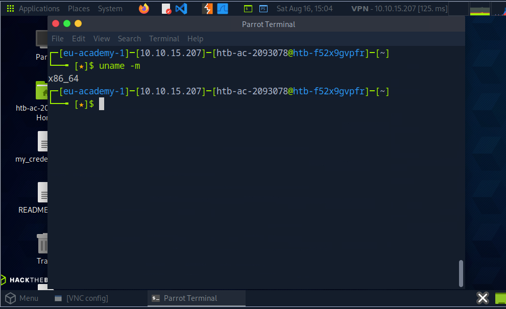

---

**2. What is the path to htb-student's home directory?**

>/home/htb-student

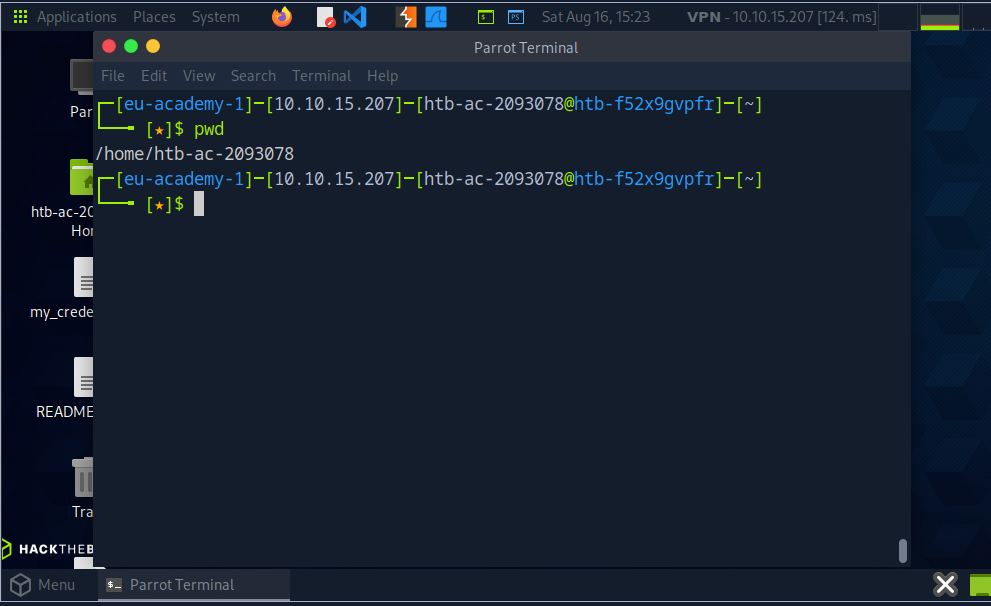

---

**3.  What is the path to the htb-student's mail?** 

>/var/mail/htb-student

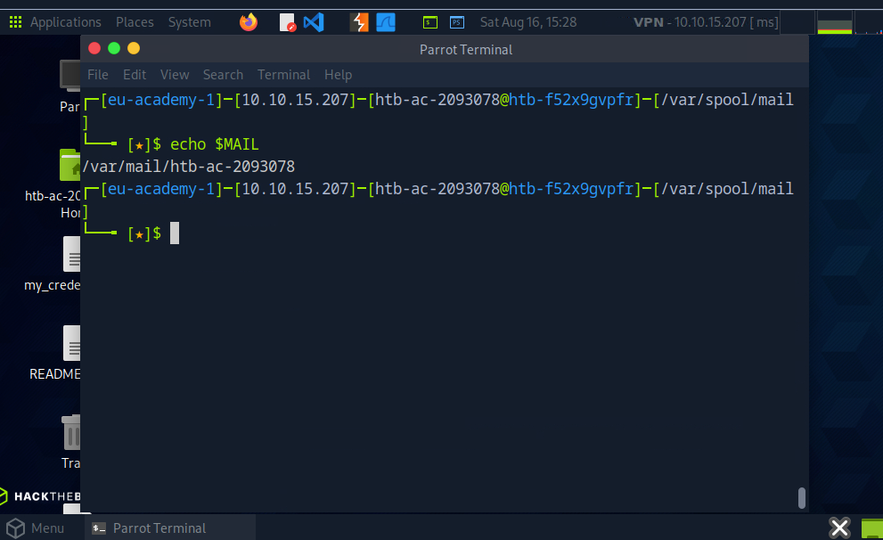

---

**4.  Which shell is specified for the htb-student user?**

>/bin/bash

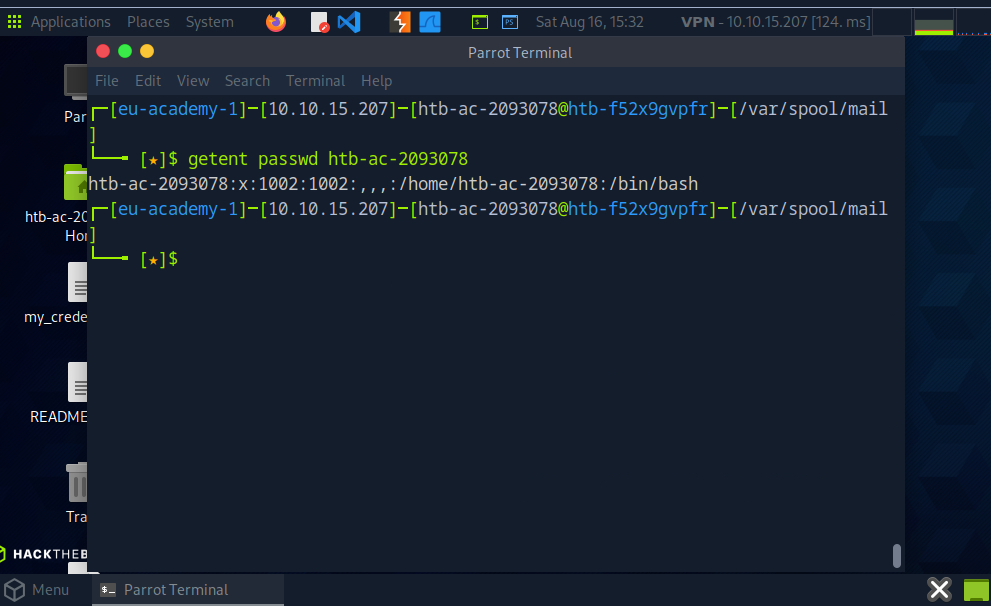

Trường cuối cùng (/bin/bash) chính là shell được chỉ định cho user htb-student 

---

**5. Which kernel release is installed on the system? (Format: 1.22.3)**

Sử dụng các câu lệnh sau:

```uname -r
```

Hoặc

```hostnamectl
```

---

**6.  What is the name of the network interface that MTU is set to 1500?**


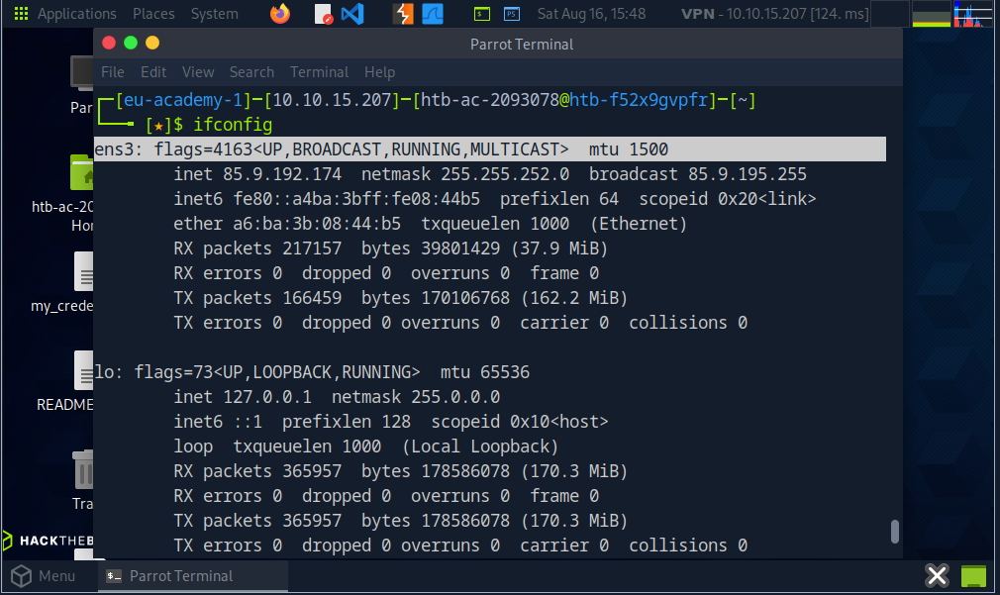

---

# 3. Workflow

## 3.1 Navigation
>Điều hướng

Điều hướng là cần thiết, giống như làm việc với chuột như một người dùng Windows thông thường. Với nó, chúng ta di chuyển khắp hệ thống và làm việc trong các thư mục và với các tệp mà chúng ta cần và muốn. Do đó, chúng ta sử dụng các lệnh và công cụ khác nhau để in ra thông tin về một thư mục hoặc một tệp và có thể sử dụng các tùy chọn nâng cao để tối ưu hóa đầu ra theo nhu cầu của chúng ta.

Một trong những cách tốt nhất để học điều gì đó mới là thử nghiệm với nó. Ở đây, chúng ta sẽ đề cập đến các phần về điều hướng trong Linux, tạo, di chuyển, chỉnh sửa và xóa tệp cũng như thư mục, tìm chúng trong hệ điều hành, các loại tiến trình khác nhau và các bộ mô tả tệp là gì. Chúng ta cũng sẽ tìm các phím tắt để làm việc với shell dễ dàng và thoải mái hơn. Chúng tôi khuyên bạn nên thử nghiệm trên máy ảo (VM) đã cài đặt sẵn. Hãy đảm bảo rằng chúng ta đã tạo một snapshot cho VM để phòng trường hợp hệ thống của chúng ta bị hỏng bất ngờ.

Hãy bắt đầu với phần điều hướng. Trước khi chúng ta di chuyển trong hệ thống, chúng ta cần biết mình đang ở thư mục nào. Chúng ta có thể tìm ra vị trí hiện tại với lệnh `pwd`.

---

Ví dụ:

```bash
cry0l1t3@htb[-]$ pwd
/home/cry0l1t3
```

---

Chỉ cần lệnh `ls` là có thể liệt kê tất cả nội dung bên trong một thư mục. Nó có nhiều tùy chọn bổ sung có thể làm cho việc hiển thị nội dung trong thư mục hiện tại đầy đủ hơn.

---

Ví dụ:

```bash
cry0l1t3@htb[-]$ ls
Desktop  Documents  Downloads  Music  Pictures  Public  Templates  Videos
```

---

Sử dụng nó mà không thêm tùy chọn nào sẽ chỉ hiển thị các thư mục và tệp. Tuy nhiên, chúng ta cũng có thể thêm tùy chọn `-l` để hiển thị nhiều thông tin hơn về các thư mục và tệp đó.

---

Ví dụ:

```bash
cry0l1t3@htb[-]$ ls -l
total 32
drwxr-xr-x 2 cry0l1t3 htbacademy 4096 Nov 13 17:37 Desktop
drwxr-xr-x 2 cry0l1t3 htbacademy 4096 Nov 13 17:34 Documents
drwxr-xr-x 3 cry0l1t3 htbacademy 4096 Nov 13 17:34 Downloads
drwxr-xr-x 2 cry0l1t3 htbacademy 4096 Nov 13 17:34 Music
drwxr-xr-x 2 cry0l1t3 htbacademy 4096 Nov 13 17:34 Pictures
drwxr-xr-x 2 cry0l1t3 htbacademy 4096 Nov 13 17:34 Public
drwxr-xr-x 2 cry0l1t3 htbacademy 4096 Nov 13 17:34 Templates
drwxr-xr-x 2 cry0l1t3 htbacademy 4096 Nov 13 17:34 Videos
```

Trước tiên, chúng ta thấy tổng số block (1024 byte) được các tệp và thư mục trong thư mục hiện tại sử dụng, điều này cho biết tổng dung lượng đã dùng. Điều đó có nghĩa là nó đã sử dụng 32 block \* 1024 byte/block = 32.768 byte (hay 32 KB) dung lượng đĩa. Tiếp theo, chúng ta thấy một vài cột được cấu trúc như sau:

| Nội dung cột     | Mô tả                                                                   |
| ---------------- | ----------------------------------------------------------------------- |
| **drwxr-xr-x**   | Kiểu và quyền                                                           |
| **2**            | Số lượng hard link đến tệp/thư mục                                      |
| **cry0l1t3**     | Chủ sở hữu của tệp/thư mục                                              |
| **htbacademy**   | Nhóm sở hữu của tệp/thư mục                                             |
| **4096**         | Kích thước của tệp hoặc số block được dùng để lưu trữ thông tin thư mục |
| **Nov 13 17:37** | Ngày và giờ                                                             |
| **Desktop**      | Tên thư mục                                                             |

---

Tuy nhiên, chúng ta sẽ không thấy tất cả những gì có trong thư mục này. Một thư mục cũng có thể chứa các tệp ẩn bắt đầu bằng dấu chấm ở đầu tên của nó (ví dụ: `.bashrc` hoặc `.bash_history`).

Do đó, chúng ta cần sử dụng lệnh `ls -la` để liệt kê **tất cả** các tệp trong một thư mục:

---

Ví dụ:

```bash
cry0l1t3@htb[-]$ ls -la
total 403188
drwxr-xr-x  2 cry0l1t3 htbacademy 4096 Nov 13 17:37 .bash_history
drwxr-xr-x  2 cry0l1t3 htbacademy 4096 Nov 13 17:37 .bashrc
...SNIP...
drwxr-xr-x  2 cry0l1t3 htbacademy 4096 Nov 13 17:37 Desktop
drwxr-xr-x  2 cry0l1t3 htbacademy 4096 Nov 13 17:34 Documents
drwxr-xr-x  3 cry0l1t3 htbacademy 4096 Nov 13 03:26 Downloads
drwxr-xr-x  2 cry0l1t3 htbacademy 4096 Nov 13 17:34 Music
drwxr-xr-x  2 cry0l1t3 htbacademy 4096 Nov 13 17:34 Pictures
drwxr-xr-x  2 cry0l1t3 htbacademy 4096 Nov 13 17:34 Public
drwxr-xr-x  2 cry0l1t3 htbacademy 4096 Nov 13 17:34 Templates
drwxr-xr-x  2 cry0l1t3 htbacademy 4096 Nov 13 17:34 Videos
```
Để liệt kê nội dung của một thư mục, chúng ta không nhất thiết phải điều hướng vào đó trước. Chúng ta cũng có thể dùng lệnh `ls` để chỉ định đường dẫn nơi chúng ta muốn biết nội dung.

---

Ví dụ:

```bash
cry0l1t3@htb[-]$ ls -l /var/

total 52
drwxr-xr-x  2 root root   4096 Mai 15 18:54 backups
drwxr-xr-x 18 root root   4096 Nov 15 16:55 cache
drwxrwsrwt  2 root whoopsie 4096 Jul 25  2018 crash
drwxr-xr-x 66 root root   4096 Mai  1 03:08 lib
drwxrwsr-x  2 root staff  4096 Nov 24  2018 local
<SNIP>
```

---

Chúng ta cũng có thể làm điều tương tự để điều hướng đến thư mục. Để di chuyển qua các thư mục, chúng ta sử dụng lệnh `cd`. Hãy thử chuyển sang thư mục `/dev/shm`. Tất nhiên, chúng ta có thể vào thư mục `/dev` trước rồi mới đến `/shm`. Tuy nhiên, chúng ta cũng có thể nhập đầy đủ đường dẫn và nhảy trực tiếp đến đó.

---

Ví dụ:

```bash
cry0l1t3@htb[-]$ cd /dev/shm
cry0l1t3@htb[/dev/shm]$
```

---

Vì trước đó chúng ta ở trong thư mục home, nên có thể nhanh chóng quay lại thư mục vừa rồi bằng lệnh:

---

Ví dụ:

```bash
cry0l1t3@htb[/dev/shm]$ cd -
cry0l1t3@htb[-]$
```

---

Shell cũng cung cấp cho chúng ta chức năng tự động hoàn thành (auto-complete), giúp việc điều hướng dễ dàng hơn. Nếu bây giờ chúng ta gõ `cd /dev/s` và nhấn `[TAB]` hai lần, chúng ta sẽ nhận được tất cả các mục bắt đầu bằng chữ "s" trong thư mục `/dev/`.

---

Ví dụ:

```bash
cry0l1t3@htb[-]$ cd /dev/s [TAB 2x]
shm/  snd/
```

Nếu chúng ta thêm chữ **“h”** vào sau chữ **“s”**, shell sẽ tự động hoàn thành đầu vào bởi vì sẽ không có thư mục nào trong đường dẫn này bắt đầu bằng chữ “sh” ngoài `/shm`. Nếu bây giờ hiển thị tất cả nội dung của thư mục, chúng ta sẽ chỉ thấy những nội dung sau:

---

Ví dụ:

```bash
cry0l1t3@htb[/dev/shm]$ ls -la /dev/shm
total 0
drwxrwxrwt  2 root root   40 Mai 15 18:31 .
drwxr-xr-x 17 root root 4000 Mai 14 20:45 ..
```

---

Mục đầu tiên với dấu chấm đơn (`.`) biểu thị thư mục hiện tại mà chúng ta đang đứng. Mục thứ hai với hai dấu chấm (`..`) biểu thị thư mục cha (`/dev`). Điều này có nghĩa là chúng ta có thể quay lại thư mục cha bằng lệnh:

---

Ví dụ:

```bash
cry0l1t3@htb[/dev/shm]$ cd ..
cry0l1t3@htb[/dev]$
```

---

Vì shell của chúng ta đã chứa khá nhiều lệnh, chúng ta có thể dọn dẹp màn hình bằng lệnh `clear`. Trước hết, hãy quay lại thư mục `/dev/shm` rồi thực thi lệnh `clear` để làm sạch terminal.

---

Ví dụ:

```bash
cry0l1t3@htb[/dev]$ cd shm && clear
```

---

Một cách khác để làm sạch terminal là sử dụng tổ hợp phím **\[Ctrl] + \[L]**.
Chúng ta cũng có thể dùng các phím mũi tên (**↑ hoặc ↓**) để cuộn qua lịch sử các lệnh đã dùng trước đó. Ngoài ra, chúng ta có thể tìm kiếm trong lịch sử lệnh bằng cách dùng phím tắt **\[Ctrl] + \[R]** và nhập một phần nội dung của lệnh mà chúng ta muốn tìm.

---

### Trả lời các câu hỏi

**What is the name of the hidden "history" file in the htb-user's home directory?**

>Sử dụng lệnh `ls -a` hoặc tìm ```find ~ -type f -name "*history"```

---

**What is the index number of the "sudoers" file in the "/etc" directory?**

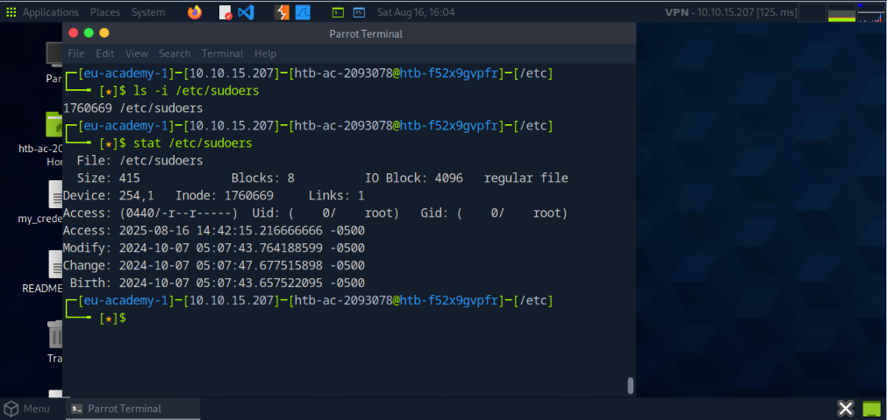

---

## 3.2 Working with Files and Directories
>Làm việc với Tệp và Thư mục

Sự khác biệt chính giữa làm việc với tệp trong Linux so với Windows nằm ở cách chúng ta truy cập và quản lý các tệp đó. Trong Windows, chúng ta thường dùng công cụ đồ họa như Explorer để tìm, mở và chỉnh sửa tệp. Tuy nhiên, trong Linux, terminal mang lại một giải pháp mạnh mẽ hơn, nơi các tệp có thể được truy cập và chỉnh sửa trực tiếp bằng lệnh. Cách này không chỉ nhanh hơn mà còn hiệu quả hơn, vì nó cho phép bạn chỉnh sửa tệp một cách tương tác mà không cần đến các trình soạn thảo như **vim** hoặc **nano**.

Hiệu quả của terminal xuất phát từ khả năng truy cập vào các tệp chỉ với vài lệnh đơn giản, và nó cho phép bạn chỉnh sửa chọn lọc các tệp bằng **biểu thức chính quy (regex)**. Ngoài ra, bạn có thể chạy nhiều lệnh cùng lúc, chuyển hướng đầu ra tới tệp và tự động hóa các tác vụ lặp đi lặp lại, đây là lợi thế lớn khi phải xử lý nhiều tệp cùng lúc. Cách tiếp cận bằng dòng lệnh này giúp quy trình làm việc trở nên gọn gàng, là công cụ vô giá cho những tác vụ vốn sẽ tốn nhiều thời gian hơn nếu làm qua giao diện đồ họa.

Tiếp theo, chúng ta sẽ khám phá cách làm việc với tệp và thư mục để quản lý hiệu quả nội dung trên hệ điều hành.

---

### Tạo, Di chuyển và Sao chép

Bắt đầu bằng việc học cách thực hiện các thao tác chính như tạo, đổi tên, di chuyển, sao chép và xóa tệp. Trước khi thực hiện các lệnh này, trước hết chúng ta cần SSH vào mục tiêu. Bây giờ, giả sử ta muốn tạo một tệp hoặc thư mục mới. Cú pháp như sau:

---

Cú pháp - **touch**

```bash
Ch10ce9902@htb[/htb]$ touch <name>
```

Cú pháp - **mkdir**

```bash
Ch10ce9902@htb[/htb]$ mkdir <name>
```

---

Trong ví dụ tiếp theo, chúng ta sẽ tạo một tệp có tên **info.txt** và một thư mục có tên **Storage**. Để tạo chúng, chúng ta làm theo lệnh và cú pháp như trên.

---

Tạo một tệp rỗng

```bash
Ch10ce9902@htb[/htb]$ touch info.txt
```

Tạo một thư mục

```bash
Ch10ce9902@htb[/htb]$ mkdir Storage
```

Khi tổ chức hệ thống, đôi khi bạn cần tạo nhiều thư mục lồng nhau. Việc chạy lệnh `mkdir` cho từng thư mục sẽ tốn thời gian. Rất may, lệnh `mkdir` có tùy chọn **-p (parents)** cho phép bạn tạo các thư mục cha tự động.

---

Ví dụ:

```bash
Ch10ce9902@htb[/htb]$ mkdir -p Storage/local/user/documents
```

---

Chúng ta có thể xem toàn bộ cấu trúc sau khi tạo các thư mục cha bằng công cụ **tree**.

Ví dụ:

```bash
Ch10ce9902@htb[/htb]$ tree .
.
├── info.txt
└── Storage
    └── Local
        └── user
            └── documents

4 directories, 1 file
```

---

Bạn có thể tạo tệp trực tiếp bên trong các thư mục cụ thể bằng cách chỉ định đường dẫn nơi tệp sẽ được lưu, và có thể dùng dấu chấm (`.`) để chỉ ra rằng bạn muốn bắt đầu từ thư mục hiện tại. Đây là cách thuận tiện để làm việc trong vị trí hiện tại mà không cần nhập toàn bộ đường dẫn.

Ví dụ, để tạo thêm một tệp rỗng khác:

---

Tạo **userinfo.txt**

```bash
Ch10ce9902@htb[/htb]$ touch ./Storage/Local/user/userinfo.txt
```

---

 Kiểm tra lại cấu trúc:

```bash
Ch10ce9902@htb[/htb]$ tree .
.
├── info.txt
└── Storage
    └── Local
        └── user
            ├── documents
            └── userinfo.txt

4 directories, 2 files
```

---

Với lệnh **mv**, chúng ta có thể di chuyển và cũng có thể đổi tên tệp hoặc thư mục. Cú pháp của lệnh này như sau:

 Cú pháp - **mv**

```bash
Ch10ce9902@htb[/htb]$ mv <tệp/thư mục> <tệp/thư mục mới>
```

---

Trước hết, hãy đổi tên tệp **info.txt** thành **information.txt** và sau đó di chuyển nó vào thư mục **Storage**.

Đổi tên tệp

```bash
Ch10ce9902@htb[/htb]$ mv info.txt information.txt
```

---

Tiếp theo, chúng ta sẽ tạo một tệp có tên **readme.txt** trong thư mục hiện tại, rồi sao chép cả hai tệp **information.txt** và **readme.txt** vào thư mục **Storage/**.

Tạo tệp **readme.txt**

```bash
Ch10ce9902@htb[/htb]$ touch readme.txt
```

---

Di chuyển tệp vào thư mục cụ thể

```bash
Ch10ce9902@htb[/htb]$ mv information.txt readme.txt Storage/
```

---

Kiểm tra lại cấu trúc

```bash
Ch10ce9902@htb[/htb]$ tree .
.
└── Storage
    ├── information.txt
    ├── Local
    │   └── user
    │       ├── documents
    │       └── userinfo.txt
    └── readme.txt

4 directories, 3 files
```

Giả sử chúng ta muốn có tệp **readme.txt** trong thư mục **Local/**. Khi đó, ta có thể sao chép nó đến đó bằng cách chỉ định đường dẫn:

---

Sao chép **readme.txt**

```bash
Ch10ce9902@htb[/htb]$ cp Storage/readme.txt Storage/local/
```

---

Bây giờ chúng ta có thể kiểm tra xem tệp đã có trong đó chưa bằng cách sử dụng lại công cụ **tree**.

Kiểm tra cấu trúc

```bash
Ch10ce9902@htb[/htb]$ tree .
.
└── Storage
    ├── information.txt
    ├── local
    │   └── readme.txt
    └── user
        ├── documents
        └── userinfo.txt
└── readme.txt

4 directories, 4 files
```

---

Ngoài các lệnh quản lý tệp cơ bản, còn có nhiều cách mạnh mẽ khác để làm việc với tệp trong Linux, chẳng hạn như dùng **chuyển hướng (redirection)** và **trình soạn thảo văn bản**.

* **Chuyển hướng** cho phép bạn điều khiển luồng dữ liệu đầu vào và đầu ra giữa các lệnh và tệp, giúp việc tạo hoặc chỉnh sửa tệp nhanh hơn và hiệu quả hơn.
* Bạn cũng có thể dùng các trình soạn thảo phổ biến như **vim** hoặc **nano** để chỉnh sửa tương tác.

Chúng ta sẽ khám phá và thảo luận chi tiết hơn về các phương pháp này trong những phần sau. Khi bạn đã quen thuộc với chúng, bạn sẽ có nhiều sự linh hoạt hơn trong việc tạo, chỉnh sửa và quản lý tệp trên hệ thống của mình.

---

💡 **Bài tập tùy chọn:**
Hãy dùng các công cụ đã học để tìm cách xóa tệp và thư mục.
Lưu ý rằng việc tự tìm kiếm thông tin trên mạng là một phần quan trọng của quá trình học tập — điều này không phải gian lận. Bạn không bị kiểm tra ngay bây giờ, mà là đang xây dựng kiến thức cho bản thân. Việc tìm kiếm giải pháp trực tuyến sẽ giúp bạn tiếp xúc với nhiều cách tiếp cận khác nhau, có cái nhìn rộng hơn về cách mọi thứ vận hành, và giúp bạn khám phá ra những phương pháp hiệu quả nhất để giải quyết vấn đề.

### Trả lời các câu hỏi

**1. What is the name of the last modified file in the "/var/backups" directory?**

Dùng lệnh : ```ls -t /var/backups | head -n 1```

Hoặc ```ls -lt /var/backups```

---

**2. What is the inode number of the "shadow.bak" file in the "/var/backups" directory?**

```bash
ls -i /var/backups/shadow.bak
```

---

## 3.3 Editing Files
>Chỉnh sửa tệp

Sau khi học cách tạo tệp và thư mục, hãy tiếp tục với việc chỉnh sửa các tệp này. Có nhiều cách để chỉnh sửa tệp trong Linux, với một số trình soạn thảo văn bản phổ biến nhất là **Vi** và **Vim**. Tuy nhiên, chúng ta sẽ bắt đầu với **Nano**, một trình soạn thảo ít được dùng hơn nhưng dễ hiểu hơn.

Để tạo và chỉnh sửa tệp bằng Nano, bạn có thể chỉ định tên tệp trực tiếp làm tham số đầu tiên khi mở trình soạn thảo. Ví dụ, để tạo và mở một tệp mới có tên **notes.txt**, bạn sẽ dùng lệnh sau:

```bash
Ch10ce9902@htb[/htb]$ nano notes.txt
```

Lệnh này sẽ mở trình soạn thảo **Nano**, cho phép bạn bắt đầu chỉnh sửa tệp **notes.txt** ngay lập tức. Giao diện đơn giản của Nano (còn gọi là *pager*) khiến nó trở thành lựa chọn tuyệt vời để nhanh chóng chỉnh sửa tệp văn bản, đặc biệt khi bạn mới bắt đầu.

---

### Trình soạn thảo Nano

```
GNU nano 2.9.3                 notes.txt

Here we can type everything we want and make our notes.
```

Bên dưới chúng ta thấy hai dòng với mô tả ngắn. Dấu mũ (^) đại diện cho phím **\[CTRL]**. Ví dụ, nếu chúng ta nhấn **\[CTRL] + \[W]**, một dòng **"Search:"** sẽ xuất hiện ở cuối trình soạn thảo, nơi chúng ta có thể nhập từ hoặc cụm từ muốn tìm. Nếu bây giờ tìm từ **"we"** và nhấn **\[ENTER]**, con trỏ sẽ chuyển đến từ khớp đầu tiên.

---

```
GNU nano 2.9.3                 notes.txt

Here we can type everything we want and make our notes.

Search:      notes
```

---

```
GNU nano 2.9.3                 notes.txt

Here we can type everything we want and make our notes.

Search [we]:
```

---

Bây giờ chúng ta có thể lưu tệp bằng cách nhấn **\[CTRL] + \[O]** và xác nhận tên tệp bằng **\[ENTER]**.

```
GNU nano 2.9.3                 notes.txt

Here we can type everything we want and make our notes.

File Name to Write: notes.txt
```

---

Sau khi đã lưu tệp, chúng ta có thể thoát khỏi trình soạn thảo bằng **\[CTRL] + \[X]**.

### Quay lại với Shell

Để xem nội dung của tệp, chúng ta có thể dùng lệnh **cat**.

```bash
Ch10ce9902@htb[/htb]$ cat notes.txt

Here we can type everything we want and make our notes.
```

---

Trên các hệ thống Linux, có một số tệp có thể cực kỳ hữu ích cho những người kiểm thử xâm nhập, do quyền bị cấu hình sai hoặc do quản trị viên thiết lập bảo mật không đủ chặt chẽ.
Một tệp quan trọng như vậy là **/etc/passwd**. Tệp này chứa thông tin cơ bản về người dùng trên hệ thống, chẳng hạn như tên người dùng, ID người dùng (**UIDs**), ID nhóm (**GIDs**), và thư mục home.

Trước đây, tệp **/etc/passwd** cũng lưu trữ các hash mật khẩu, nhưng hiện nay các hash đó thường được lưu trong **/etc/shadow**, vốn có quyền truy cập nghiêm ngặt hơn. Tuy nhiên, nếu quyền truy cập trên **/etc/passwd** hoặc các tệp quan trọng khác không được cấu hình đúng, nó có thể làm lộ thông tin nhạy cảm hoặc dẫn đến cơ hội leo thang đặc quyền.

Đối với các kiểm thử viên xâm nhập, việc xác định các tệp có quyền truy cập hoặc quyền hạn không đúng có thể mang lại thông tin quan trọng về các lỗ hổng tiềm ẩn có thể bị khai thác, chẳng hạn như tài khoản người dùng yếu hoặc quyền truy cập tệp bị cấu hình sai mà lẽ ra phải bị hạn chế. Hiểu rõ các tệp này là điều rất quan trọng khi đánh giá tình trạng bảo mật của một hệ thống.

### VIM

**Vim** là một trình soạn thảo mã nguồn mở cho mọi loại văn bản ASCII, giống như **Nano**. Nó là một bản sao cải tiến của **Vi** trước đó. Vim là một trình soạn thảo cực kỳ mạnh mẽ tập trung vào những điều cốt lõi, cụ thể là chỉnh sửa văn bản.

Đối với các tác vụ vượt xa hơn, Vim cung cấp giao diện với các chương trình bên ngoài như **grep**, **awk**, **sed**, v.v... có thể xử lý các tác vụ cụ thể của chúng tốt hơn nhiều so với khi chức năng đó được triển khai trực tiếp trong một trình soạn thảo. Điều này khiến Vim trở nên nhỏ gọn, nhanh, mạnh mẽ, linh hoạt và ít lỗi hơn.

Vim tuân theo nguyên tắc của Unix: nhiều chương trình chuyên biệt nhỏ được kiểm thử và chứng minh hiệu quả, khi được kết hợp và giao tiếp với nhau sẽ tạo ra một hệ thống linh hoạt và mạnh mẽ.

---

```bash
Ch10ce9902@htb[/htb]$ vim
```

---

Khi mở, Vim hiển thị màn hình mặc định:

```
VIM - Vi IMproved
version 8.0.1453
by Bram Moolenaar et al.
Modified by pkg-vim-maintainers@lists.alioth.debian.org
Vim is open source and freely distributable

Sponsor Vim development!
type  :help sponsor<Enter>    for information

type  :q<Enter>               to exit
type  :help<Enter>  or  <F1>  for on-line help
type  :help version<Enter>    for version info
```

Trái ngược với **Nano**, **Vim** là một trình soạn thảo dạng *modal*, có thể phân biệt giữa đầu vào văn bản và đầu vào lệnh. Vim cung cấp tổng cộng sáu chế độ cơ bản giúp công việc của chúng ta dễ dàng hơn và khiến nó trở thành một trình soạn thảo mạnh mẽ:

| **Chế độ**  | **Mô tả**                                                                                                                                                                                                                   |
| ----------- | --------------------------------------------------------------------------------------------------------------------------------------------------------------------------------------------------------------------------- |
| **Normal**  | Trong chế độ bình thường, tất cả đầu vào được xem là lệnh của trình soạn thảo. Không có sự chèn ký tự đã nhập vào bộ nhớ đệm, như với hầu hết các trình soạn thảo khác. Khi khởi động Vim, chúng ta thường ở chế độ này.    |
| **Insert**  | Ngoại trừ một số trường hợp, tất cả ký tự được nhập sẽ được chèn vào bộ nhớ đệm.                                                                                                                                            |
| **Visual**  | Được dùng để đánh dấu một vùng văn bản liền kề, sẽ được hiển thị nổi bật. Bằng cách di chuyển con trỏ, ta thay đổi vùng đã chọn. Vùng được đánh dấu có thể được chỉnh sửa theo nhiều cách, như xóa, sao chép hoặc thay thế. |
| **Command** | Cho phép nhập lệnh một dòng ở cuối trình soạn thảo. Có thể dùng để sắp xếp, thay thế đoạn văn bản, hoặc xóa chúng.                                                                                                          |
| **Replace** | Trong chế độ thay thế, văn bản mới nhập sẽ ghi đè lên ký tự hiện có tại vị trí con trỏ cho đến khi không còn ký tự cũ nào. Sau đó văn bản mới sẽ được thêm vào.                                                             |
| **Ex**      | Mô phỏng hành vi của trình soạn thảo **Ex**, một trong những tiền nhiệm của Vim. Cung cấp chế độ nơi ta có thể thực thi nhiều lệnh liên tiếp mà không cần quay lại chế độ Normal sau mỗi lệnh.                              |

---

Khi đang mở Vim, ta có thể vào chế độ lệnh bằng cách gõ dấu **":"** rồi gõ **"q"** để thoát Vim.

Ví dụ:

```
:q
```

---

Vim còn cung cấp một công cụ học tuyệt vời gọi là **vimtutor** để luyện tập và làm quen với trình soạn thảo. Ban đầu có thể thấy rất khó và phức tạp, nhưng cảm giác đó sẽ nhanh chóng qua đi.

Hiệu quả mà chúng ta nhận được từ Vim sau khi đã quen thuộc là vô cùng lớn. Việc vào chế độ hướng dẫn trong Vim có thể thực hiện bằng **:Tutor** trong chế độ Command hoặc gõ lệnh **vimtutor** trong shell.

### VimTutor

```bash
Ch10ce9902@htb[/htb]$ vimtutor
```

---

```
=============================================================
=  Welcome to the VIM Tutor  -  Version 1.7                  =
=============================================================

Vim is a very powerful editor that has many commands, too many to
explain in a tutor such as this.  This tutor is designed to describe
enough of the commands that you will be able to easily use Vim as
an all-purpose editor.

The approximate time required to complete the tutor is 25-30 minutes,
depending upon how much time is spent with experimentation.

ATTENTION:
The commands in the lessons will modify the text.  Make a copy of this
file to practice on (if you started "vimtutor" this is already a copy).

It is important to remember that this tutor is set up to teach by
use.  That means that you need to execute the commands to learn them
properly.  If you only read the text, you will forget the commands!

Now, make sure that your Caps-Lock key is NOT depressed and press
the  j  key enough times to move the cursor so that Lesson 1.1
completely fills the screen.
=============================================================
```

---

### Bài tập tùy chọn

Hãy thử sử dụng **vimtutor**. Làm quen với trình soạn thảo và thực nghiệm với các tính năng của nó.

---
## 3.4 Find Files and Directories
>Tìm tệp và thư mục

Việc tìm được các tệp và thư mục mà chúng ta cần là rất quan trọng. Khi đã có quyền truy cập vào một hệ thống dựa trên Linux, việc tìm các tệp cấu hình, các script do người dùng hoặc quản trị viên tạo ra, và các tệp hay thư mục khác sẽ rất cần thiết. Chúng ta không cần phải duyệt thủ công từng thư mục để kiểm tra lần chỉnh sửa cuối cùng, vì có một số công cụ hỗ trợ để làm việc này dễ dàng hơn.

---

### Which

Một trong những công cụ phổ biến là **which**. Công cụ này trả về đường dẫn đến tệp hoặc liên kết sẽ được thực thi. Điều này giúp chúng ta xác định các chương trình cụ thể như **cURL, netcat, wget, python, gcc** có sẵn trên hệ điều hành hay không.

Ví dụ, hãy tìm **Python**:

```bash
Ch10ce9902@htb[/htb]$ which python

/usr/bin/python
```

Nếu chương trình cần tìm không tồn tại, sẽ không hiển thị kết quả nào.

---

### Find

Một công cụ hữu ích khác là **find**. Ngoài chức năng tìm tệp và thư mục, công cụ này còn có khả năng lọc kết quả. Chúng ta có thể sử dụng các tham số lọc như kích thước tệp hoặc ngày tháng. Ta cũng có thể chỉ định tìm riêng tệp hoặc thư mục.

 Cú pháp - find

```bash
Ch10ce9902@htb[/htb]$ find <location> <options>
```

Tiếp theo, chúng ta sẽ xem một ví dụ về lệnh như vậy với nhiều tùy chọn khác nhau.

Hãy xem ví dụ về một lệnh **find** với nhiều tùy chọn cùng lúc sẽ trông như thế nào:

```bash
Ch10ce9902@htb[/htb]$ find / -type f -name *.conf -user root -size +20k -newermt 2020-03-03 -exec ls -al {} \; 2>/dev/null
```

Kết quả:

```
-rw-r--r--  1 root root 136392 Apr 25 20:29 /usr/src/linux-headers-5.5.0-1parrot1-amd64/include/config/auto.conf
-rw-r--r--  1 root root  82290 Apr 25 20:29 /usr/src/linux-headers-5.5.0-1parrot1-amd64/include/config/tristate.conf
-rw-r--r--  1 root root  98513 May  7 14:33 /usr/share/metasploit-framework/data/jtr/repeats32.conf
-rw-r--r--  1 root root  66346 May  7 14:33 /usr/share/metasploit-framework/data/jtr/dynamic.conf
-rw-r--r--  1 root root  69249 May  7 14:33 /usr/share/metasploit-framework/data/jtr/dumb32.conf
-rw-r--r--  1 root root  24255 May  7 14:33 /usr/share/metasploit-framework/data/jtr/repeats16.conf
-rw-r--r--  1 root root  24255 May  7 14:33 /usr/share/metasploit-framework/data/jtr/korelogic.conf
-rwxr-xr-x  1 root root 108534 May  7 14:33 /usr/share/metasploit-framework/data/jtr/john.conf
-rw-r--r--  1 root root  55285 May  7 14:33 /usr/share/metasploit-framework/data/jtr/dumb16.conf
-rw-r--r--  1 root root  21254 May  2 11:59 /usr/share/doc/sqlmap/examples/sqlmap.conf
-rw-r--r--  1 root root  25086 Mar  4 22:04 /etc/dnsmasq.conf
-rw-r--r--  1 root root  21254 May  2 11:59 /etc/sqlmap/sqlmap.conf
```

---

Giải thích các tùy chọn trong lệnh trên

| **Tùy chọn**          | **Mô tả**                                                                                                                                                                                   |
| --------------------- | ------------------------------------------------------------------------------------------------------------------------------------------------------------------------------------------- |
| `-type f`             | Xác định loại đối tượng cần tìm. Ở đây `f` nghĩa là *file*.                                                                                                                                 |
| `-name *.conf`        | Với `-name`, ta chỉ định tên tệp cần tìm. Dấu `*` đại diện cho “tất cả” các tệp có phần mở rộng `.conf`.                                                                                    |
| `-user root`          | Chỉ lọc ra các tệp mà người sở hữu là `root`.                                                                                                                                               |
| `-size +20k`          | Lọc các tệp có dung lượng lớn hơn 20 KB.                                                                                                                                                    |
| `-newermt 2020-03-03` | Chỉ hiển thị các tệp mới hơn ngày đã chỉ định.                                                                                                                                              |
| `-exec ls -al {} \;`  | Thực thi lệnh được chỉ định (ở đây là `ls -al`) cho mỗi kết quả tìm được. `{}` là placeholder cho kết quả. Dấu gạch chéo ngược `\;` để thoát ký tự `;`, nhằm tránh shell kết thúc lệnh sớm. |
| `2>/dev/null`         | Chuyển hướng **STDERR** đến `null device`, đảm bảo rằng lỗi sẽ không hiển thị trên terminal. (Không phải là một tùy chọn của lệnh `find`, mà là của shell).                                 |

### Locate

Việc tìm kiếm toàn bộ hệ thống để xác định tệp và thư mục sẽ mất rất nhiều thời gian. Lệnh **locate** cung cấp cho chúng ta cách nhanh hơn để tìm kiếm trong hệ thống. Khác với lệnh **find**, **locate** làm việc với một cơ sở dữ liệu cục bộ chứa tất cả thông tin về các tệp và thư mục hiện có. Chúng ta có thể cập nhật cơ sở dữ liệu này bằng lệnh sau:

```bash
Ch10ce9902@htb[/htb]$ sudo updatedb
```

---

Nếu bây giờ chúng ta tìm tất cả các tệp có phần mở rộng **".conf"**, bạn sẽ thấy rằng kết quả được trả về nhanh hơn nhiều so với khi dùng **find**.

```bash
Ch10ce9902@htb[/htb]$ locate *.conf

/etc/GeoIP.conf
/etc/NetworkManager/NetworkManager.conf
/etc/UPower/UPower.conf
/etc/adduser.conf
<SNIP>
```

---

Tuy nhiên, công cụ này không có nhiều tùy chọn lọc như **find**. Vì vậy, chúng ta cần cân nhắc khi nào nên dùng **locate** và khi nào nên dùng **find**. Điều đó luôn phụ thuộc vào mục tiêu tìm kiếm của chúng ta.

---

### Bài tập tùy chọn

Hãy thử dùng các công cụ khác nhau và tìm tất cả mọi thứ liên quan đến công cụ **netcat / nc**.

**1. What is the name of the config file that has been created after 2020-03-03 and is smaller than 28k but larger than 25k?**

```bash
find / -type f -name *.conf -user root -size +25k -size -28k -newermt 2020-03-03 -exec ls -al {} \; 2>/dev/null
```

1. **`find /`**
   → Bắt đầu tìm kiếm từ thư mục gốc `/` (toàn bộ hệ thống).

2. **`-type f`**
   → Chỉ tìm file thường (không phải thư mục, link, device...).

3. **`-name *.conf`**
   → Lọc các file có tên kết thúc bằng `.conf` (file cấu hình).
   *(Lưu ý: nên viết `-name "*.conf"` để tránh shell tự expand tên file trước khi chạy `find`.)*

4. **`-user root`**
   → Chỉ lấy các file có chủ sở hữu (owner) là `root`.

5. **`-size +25k`**
   → Kích thước file **lớn hơn 25 KB**.

6. **`-size -28k`**
   → Kích thước file **nhỏ hơn 28 KB**.
   ⇒ Kết hợp hai cái lại → lấy file có size **từ 25 KB đến 28 KB**.

7. **`-newermt 2020-03-03`**
   → Chỉ lấy các file có **ngày sửa đổi (modification time) sau 2020-03-03**.
   (`mt` = modification time, `newer` = mới hơn).

8. **`-exec ls -al {} \;`**
   → Với mỗi file tìm được, thực thi lệnh `ls -al` để hiển thị chi tiết: quyền, owner, group, dung lượng, ngày giờ sửa đổi, và tên file.

   * `{}` → đại diện cho đường dẫn file tìm được.
   * `\;` → kết thúc lệnh `-exec`.

9. **`2>/dev/null`**
   → Chuyển hướng toàn bộ thông báo lỗi (stderr, file descriptor 2) vào `/dev/null`, để tránh hiện ra màn hình (ví dụ: lỗi "Permission denied" khi `find` quét các thư mục bị hạn chế).

---


**2. How many files exist on the system that have the ".bak" extension?**


```bash
find / -type f -name *.bak 2>/dev/null | nl
```

Giải thích:

* `find / -type f -name *.bak` → tìm tất cả file có đuôi `.bak` trong toàn hệ thống.
* `2>/dev/null` → bỏ qua các thông báo lỗi (ví dụ `Permission denied`).
* `| nl` → đánh số dòng đầu ra (number lines).

---

**3.  Submit the full path of the "xxd" binary.**

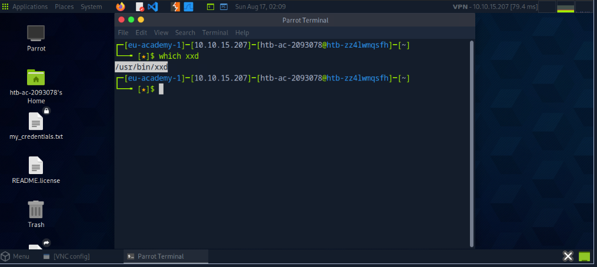

---

## 3.5 File Descriptors and Redirections
> Bộ mô tả tệp và Chuyển hướng

Một **bộ mô tả tệp (FD)** trong hệ điều hành Unix/Linux là một tham chiếu do kernel quản lý, cho phép hệ thống quản lý các hoạt động **Input/Output (I/O)**. Nó hoạt động như một định danh duy nhất cho một tệp mở, socket, hoặc bất kỳ tài nguyên I/O nào khác. Trong hệ điều hành Windows, điều này được gọi là **file handle**. Về cơ bản, bộ mô tả tệp là cách hệ thống theo dõi các kết nối I/O đang hoạt động, chẳng hạn như đọc hoặc ghi vào một tệp.

Hãy hình dung nó giống như một **phiếu gửi đồ** mà bạn nhận được khi gửi áo khoác ở phòng giữ đồ. Phiếu (bộ mô tả tệp) đại diện cho kết nối của bạn với áo khoác (tệp hoặc tài nguyên), và bất cứ khi nào bạn cần lấy lại áo (thực hiện I/O), bạn đưa phiếu cho nhân viên (hệ điều hành), người biết chính xác áo của bạn ở đâu (tài nguyên mà bộ mô tả tệp tham chiếu tới). Nếu không có phiếu, bạn sẽ không thể dễ dàng tìm lại áo trong số nhiều áo được lưu trữ, cũng giống như hệ điều hành sẽ không biết cần tương tác với tài nguyên nào nếu không có bộ mô tả tệp.

Đây là lý do tại sao bộ mô tả tệp lại quan trọng và việc hiểu chúng là rất cần thiết khi đi vào các ví dụ sắp tới.

---

 Mặc định, ba bộ mô tả tệp đầu tiên trong Linux là:

1. **Luồng dữ liệu cho đầu vào**

   * **STDIN = 0**

2. **Luồng dữ liệu cho đầu ra**

   * **STDOUT = 1**

3. **Luồng dữ liệu cho đầu ra liên quan đến lỗi xảy ra**

   * **STDERR = 2**

---

### STDIN và STDOUT

Hãy xem một ví dụ với **cat**.
Khi chạy **cat**, chúng ta đưa cho chương trình đang chạy đầu vào chuẩn (**STDIN - FD 0**), được đánh dấu màu xanh lá, trong trường hợp này là “SOME INPUT”. Ngay khi chúng ta xác nhận đầu vào bằng **\[ENTER]**, nó sẽ được trả về cho terminal dưới dạng đầu ra chuẩn (**STDOUT - FD 1**), được đánh dấu màu đỏ.

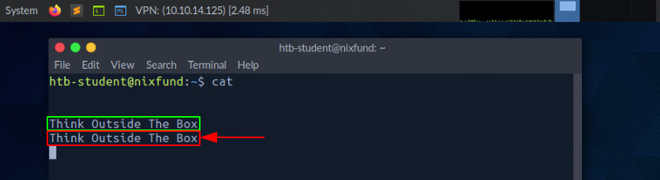

### STDOUT và STDERR

Trong ví dụ tiếp theo, bằng cách sử dụng lệnh **find**, chúng ta sẽ thấy đầu ra chuẩn (**STDOUT - FD 1**) được đánh dấu **màu xanh lá**, và lỗi chuẩn (**STDERR - FD 2**) được đánh dấu **màu đỏ**.

```bash
Ch10ce9902@htb[/htb]$ find /etc/ -name shadow
```

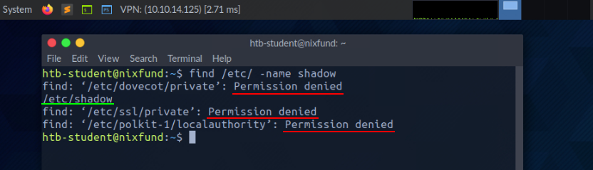

Trong trường hợp này, lỗi sẽ được đánh dấu và hiển thị với thông báo **"Permission denied"**.
Chúng ta có thể xử lý điều này bằng cách **chuyển hướng bộ mô tả tệp cho lỗi (FD 2 - STDERR) đến `/dev/null`**.
Theo cách này, các lỗi phát sinh sẽ được chuyển vào "thiết bị null", nơi sẽ loại bỏ toàn bộ dữ liệu.

```bash
Ch10ce9902@htb[/htb]$ find /etc/ -name shadow 2>/dev/null
```

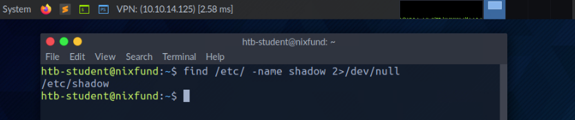

Ở ví dụ này, tất cả lỗi (**STDERR**) trước đó được hiển thị với thông báo **"Permission denied"** đã không còn xuất hiện nữa.
Kết quả duy nhất chúng ta thấy bây giờ là **standard output (STDOUT)**, và ta cũng có thể **chuyển hướng đầu ra này vào một file** (ví dụ `results.txt`).

Như vậy, file `results.txt` sẽ chỉ chứa kết quả đầu ra chuẩn mà không bao gồm lỗi.

```bash
Ch10ce9902@htb[/htb]$ find /etc/ -name shadow 2>/dev/null > results.txt
```
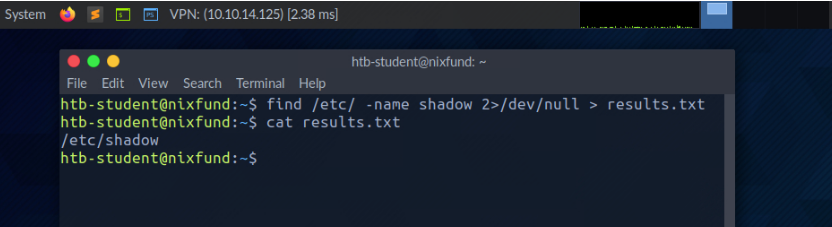

### Chuyển hướng STDOUT và STDERR sang các tệp riêng biệt

Chúng ta nên để ý rằng chúng ta đã không sử dụng một số trước dấu lớn hơn (`>`) trong ví dụ trước. Đó là bởi vì khi đó chúng ta đã chuyển hướng tất cả các lỗi chuẩn đến **"null device"**, và đầu ra duy nhất chúng ta nhận được là đầu ra chuẩn (**FD 1 – STDOUT**).

Để chính xác hơn, chúng ta sẽ chuyển hướng lỗi chuẩn (**FD 2 – STDERR**) và đầu ra chuẩn (**FD 1 – STDOUT**) sang các tệp khác nhau.

```bash
Ch10ce9902@htb[/htb]$ find /etc/ -name shadow 2> stderr.txt 1> stdout.txt
```
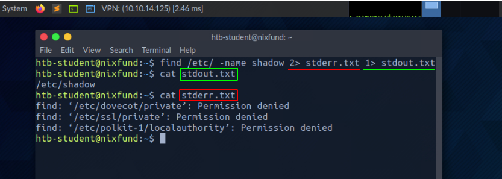

### Chuyển hướng STDIN

Như chúng ta đã thấy, kết hợp với các bộ mô tả tệp, chúng ta có thể chuyển hướng lỗi và đầu ra bằng ký tự dấu lớn hơn (`>`). Điều này cũng hoạt động với dấu nhỏ hơn (`<`). Tuy nhiên, dấu nhỏ hơn phục vụ như là đầu vào chuẩn (**FD 0 – STDIN**).

Các ký tự này có thể được xem như “hướng” dưới dạng một mũi tên cho chúng ta biết **“từ đâu”** và **“đến đâu”** dữ liệu sẽ được chuyển hướng.

Chúng ta sử dụng lệnh `cat` để dùng nội dung của tệp **stdout.txt** làm **STDIN**.

```bash
Ch10ce9902@htb[/htb]$ cat < stdout.txt
```

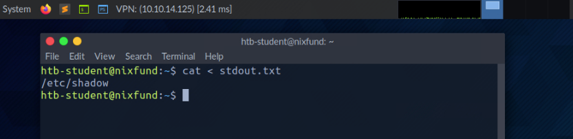

### Chuyển hướng STDOUT và ghi thêm vào một tệp

Khi chúng ta dùng dấu lớn hơn (`>`) để chuyển hướng **STDOUT**, một tệp mới sẽ tự động được tạo nếu nó chưa tồn tại. Nếu tệp này đã tồn tại, nó sẽ bị ghi đè mà không cần hỏi xác nhận.

Nếu chúng ta muốn **ghi thêm** (append) **STDOUT** vào tệp hiện có, ta có thể dùng dấu lớn hơn kép (`>>`).

```bash
Ch10ce9902@htb[/htb]$ find /etc/ -name passwd >> stdout.txt 2>/dev/null
```

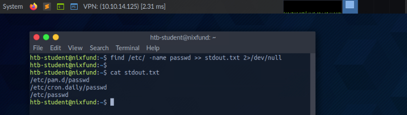

### Chuyển hướng luồng STDIN vào một tệp

Chúng ta cũng có thể dùng ký hiệu nhỏ hơn kép (`<<`) để thêm dữ liệu từ **STDIN** thông qua một luồng. Ta có thể dùng chức năng gọi là **End-Of-File (EOF)** trong hệ thống Linux, nó xác định điểm kết thúc của đầu vào.

Trong ví dụ tiếp theo, ta sẽ dùng lệnh `cat` để đọc dữ liệu từ luồng và chuyển nó vào một tệp gọi là **stream.txt**.

```bash
Ch10ce9902@htb[/htb]$ cat << EOF > stream.txt
```

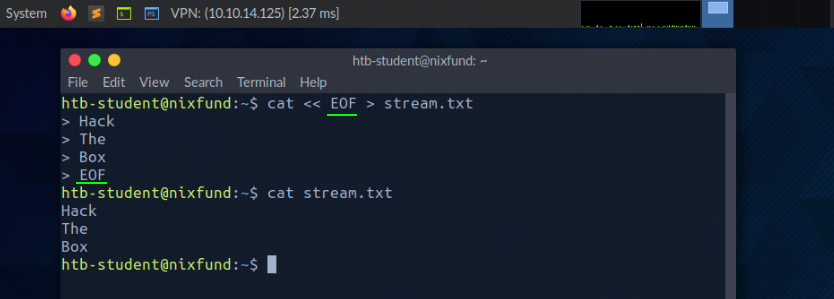

### Pipes

Một cách khác để chuyển hướng **STDOUT** là dùng **pipes (`|`)**. Pipes rất hữu ích khi ta muốn dùng đầu ra (**STDOUT**) của một chương trình làm đầu vào (**STDIN**) cho chương trình khác.

Một trong những công cụ thường dùng nhất là **`grep`**, được dùng để lọc **STDOUT** theo mẫu mà ta định nghĩa.

Trong ví dụ dưới đây, ta dùng lệnh **`find`** để tìm tất cả các tệp trong thư mục `/etc/` có phần mở rộng là `.conf`. Bất kỳ lỗi nào cũng được chuyển hướng đến **"null device"** (`/dev/null`). Sau đó, với **`grep`**, ta lọc kết quả và chỉ hiển thị những dòng có chứa chuỗi **"systemd"**.

```bash
Ch10ce9902@htb[/htb]$ find /etc/ -name *.conf 2>/dev/null | grep systemd
```

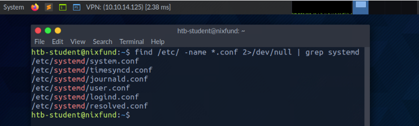

Các chuyển hướng hoạt động không chỉ một lần. Ta có thể dùng kết quả đã thu được để chuyển tiếp đến một chương trình khác.

Trong ví dụ sau, ta sẽ dùng công cụ gọi là **`wc`**, công cụ này sẽ đếm tổng số kết quả thu được.

```bash
Ch10ce9902@htb[/htb]$ find /etc/ -name *.conf 2>/dev/null | grep systemd | wc -l
```

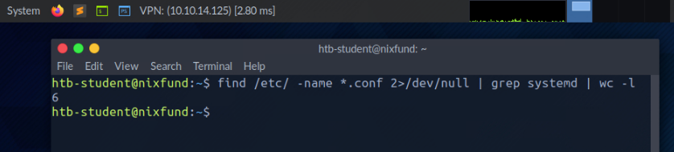

Giờ đây, khi đã có hiểu biết cơ bản về mô tả tệp, chuyển hướng và đường ống, chúng ta có thể cấu trúc các lệnh hiệu quả hơn để trích xuất chính xác thông tin cần thiết. Kiến thức này cho phép chúng ta điều khiển luồng dữ liệu đầu vào và đầu ra giữa các tệp, quy trình và hệ thống, giúp chúng ta xử lý dữ liệu hiệu quả hơn. Bằng cách tận dụng các công cụ này, chúng ta có thể sắp xếp hợp lý các tác vụ, tránh các bước không cần thiết và làm việc với tệp và tài nguyên hệ thống một cách có tổ chức và hiệu quả hơn nhiều, từ đó nâng cao năng suất và độ chính xác trong việc quản lý vận hành.

### Trả lời các câu hỏi

**1. How many files exist on the system that have the ".log" file extension?**


```bash
find / -type f -name *.log 2>/dev/null | nl
```

Giải thích chi tiết từng phần:

1. **`find /`**

   * Bắt đầu tìm kiếm từ thư mục gốc (`/`).

2. **`-type f`**

   * Chỉ tìm các tệp thường (file), bỏ qua thư mục, link, thiết bị,…

3. **`-name *.log`**

   * Lọc các file có tên khớp với mẫu `*.log` (tức là tất cả file có phần mở rộng `.log`).

4. **`2>/dev/null`**

   * Chuyển hướng (redirect) toàn bộ thông báo lỗi (luồng **stderr**, tức là số 2) vào `/dev/null` để bỏ qua chúng.
   * Điều này giúp tránh hiện ra các lỗi "Permission denied" khi `find` đi vào những thư mục không có quyền đọc.

5. **`| nl`**

   * Kết quả danh sách các file `.log` tìm được sẽ được truyền qua (`|`) cho lệnh `nl`.
   * Lệnh `nl` (number lines) sẽ **đánh số dòng** cho từng kết quả hiển thị.

---

**2.  How many total packages are installed on the target system?**


```bash
apt list --installed | grep -c "installed"
```

Giải thích chi tiết:

1. **`apt list --installed`**

   * Hiển thị danh sách tất cả các gói đã được cài đặt trên hệ thống bằng `apt`.
   * Mỗi dòng trong kết quả thường có dạng:

     ```
     tên-gói/phiên-bản trạng-thái
     ```

     ví dụ:

     ```
     bash/focal,now 5.0-6ubuntu1.2 amd64 [installed]
     ```

2. **`| grep -c "installed"`**

   * `grep "installed"` lọc ra những dòng có chứa chữ `"installed"`.
   * Tùy chọn `-c` (count) sẽ **đếm số dòng** khớp với mẫu.
   * Do tất cả các gói đã cài đặt đều có chữ `"installed"`, nên kết quả sẽ là **tổng số gói đã cài**.

---

## 3.6 Filter Contents
>Lọc Nội Dung

Trong phần trước, chúng ta đã khám phá cách sử dụng chuyển hướng để gửi đầu ra của một chương trình sang một chương trình khác để xử lý tiếp. Bây giờ, hãy nói về việc đọc tệp trực tiếp từ dòng lệnh, mà không cần mở trình soạn thảo văn bản.

Có hai công cụ mạnh mẽ cho việc này – **more** và **less**. Chúng được gọi là **pager**, và cho phép bạn xem nội dung của một tệp theo cách tương tác, từng màn hình một. Mặc dù cả hai công cụ có mục đích tương tự, nhưng chúng có một số khác biệt trong chức năng, sẽ được đề cập sau.

Với **more** và **less**, bạn có thể dễ dàng cuộn qua các tệp lớn, tìm kiếm văn bản, và điều hướng tiến hoặc lùi mà không làm thay đổi chính tệp. Điều này đặc biệt hữu ích khi bạn làm việc với log lớn hoặc các tệp văn bản không gói gọn vừa trong một màn hình.

Mục tiêu của phần này là học cách lọc nội dung và xử lý đầu ra được chuyển hướng từ các lệnh trước đó. Nhưng trước khi đi sâu vào lọc, ta cần làm quen với một số công cụ và lệnh cơ bản, được thiết kế đặc biệt để làm việc với dữ liệu văn bản một cách hiệu quả và mạnh mẽ.

Trước khi bắt đầu lọc đầu ra, hãy xem qua một số công cụ nền tảng sẽ giúp bạn lọc và xử lý văn bản. Các công cụ này rất quan trọng khi làm việc với lượng dữ liệu lớn hoặc khi cần tự động hóa các tác vụ như tìm kiếm, sắp xếp, hay xử lý thông tin.

Hãy cùng xem một số ví dụ để hiểu rõ hơn cách các công cụ này hoạt động trên thực tế.

---

### More

```bash
Ch10ce9902@htb[/htb]$ cat /etc/passwd | more
```

Tệp **/etc/passwd** trong Linux giống như một danh bạ điện thoại cho người dùng trên hệ thống. Nó chứa chi tiết như:

* tên người dùng,
* ID người dùng,
* ID nhóm,
* thư mục home,
* shell mặc định họ sử dụng.

Sau khi đọc nội dung tệp bằng lệnh `cat` và chuyển hướng nó sang `more`, **pager** sẽ mở ra và ta sẽ bắt đầu ngay từ đầu của tệp.

Ví dụ hiển thị:

```
root:x:0:0:root:/root:/bin/bash
daemon:x:1:1:daemon:/usr/sbin:/usr/sbin/nologin
bin:x:2:2:bin:/bin:/usr/sbin/nologin
sys:x:3:3:sys:/dev:/usr/sbin/nologin
sync:x:4:65534:sync:/bin:/bin/sync
<SNIP>
--More--
```

Với phím **\[q]**, bạn có thể thoát khỏi **pager**. Lưu ý rằng đầu ra vẫn còn trong terminal.

### Less

Nếu ta xem công cụ **less**, ta sẽ nhận thấy trong trang hướng dẫn rằng nó có nhiều tính năng hơn **more**.

```bash
Ch10ce9902@htb[/htb]$ less /etc/passwd
```

Cách hiển thị gần giống với **more**.

Ví dụ:

```
root:x:0:0:root:/root:/bin/bash
daemon:x:1:1:daemon:/usr/sbin:/usr/sbin/nologin
bin:x:2:2:bin:/bin:/usr/sbin/nologin
sys:x:3:3:sys:/dev:/usr/sbin/nologin
sync:x:4:65534:sync:/bin:/bin/sync
<SNIP>
:
```

Khi đóng **less** bằng phím **\[q]**, ta sẽ thấy rằng đầu ra mà ta vừa xem **không còn hiển thị lại** trong terminal, khác với **more**.

---

### Head

Đôi khi, ta chỉ muốn xem những dòng đầu tiên hoặc cuối cùng của tệp. Nếu chỉ muốn lấy **một số dòng đầu tiên** của tệp, ta có thể dùng công cụ **head**.
Mặc định, **head** sẽ in ra 10 dòng đầu tiên của tệp (hoặc input), trừ khi được chỉ định số dòng khác.

```bash
Ch10ce9902@htb[/htb]$ head /etc/passwd
```

Kết quả:

```
root:x:0:0:root:/root:/bin/bash
daemon:x:1:1:daemon:/usr/sbin:/usr/sbin/nologin
bin:x:2:2:bin:/bin:/usr/sbin/nologin
sys:x:3:3:sys:/dev:/usr/sbin/nologin
sync:x:4:65534:sync:/bin:/bin/sync
games:x:5:60:games:/usr/games:/usr/sbin/nologin
man:x:6:12:man:/var/cache/man:/usr/sbin/nologin
lp:x:7:7:lp:/var/spool/lpd:/usr/sbin/nologin
mail:x:8:8:mail:/var/mail:/usr/sbin/nologin
news:x:9:9:news:/var/spool/news:/usr/sbin/nologin
```

### Tail

Nếu chúng ta chỉ muốn xem phần cuối cùng của một tệp hoặc kết quả, ta có thể sử dụng công cụ tương tự với `head` gọi là `tail`, công cụ này sẽ trả về **mười** dòng cuối cùng.

```bash
Chloe9920@htb[/htb]$ tail /etc/passwd
miredo:x:115:65534::/var/run/miredo:/usr/sbin/nologin
usbmux:x:116:46:usbmux daemon,,,:/var/lib/usbmux:/usr/sbin/nologin
rtkit:x:117:119:RealtimeKit,,,:/proc:/usr/sbin/nologin
nm-openvpn:x:118:120:NetworkManager OpenVPN,,,:/var/lib/NetworkManager:/usr/sbin/nologin
nm-openconnect:x:119:121:NetworkManager OpenConnect plugin,,,:/var/lib/NetworkManager:/usr/sbin/nologin
pulse:x:120:122:PulseAudio daemon,,,:/var/run/pulse:/usr/sbin/nologin
beef-xss:x:121:124::/var/lib/beef-xss:/usr/sbin/nologin
lightdm:x:122:125:Light Display Manager:/var/lib/lightdm:/bin/false
ioda-agent:x:999:998::/home/ioda-agent:/bin/false
user6:x:1000:1000::/home/user6:/bin/bash
```

Sẽ rất hữu ích nếu chúng ta khám phá các tùy chọn có sẵn mà những công cụ này cung cấp và thử nghiệm với chúng.

---

### Sort

Tùy thuộc vào kết quả và tệp nào được xử lý, chúng hiếm khi được sắp xếp. Thông thường cần phải sắp xếp kết quả mong muốn theo thứ tự **chữ cái** hoặc **số** để có cái nhìn tổng quan hơn. Để làm điều này, ta có thể sử dụng công cụ gọi là `sort`.

```bash
Chloe9920@htb[/htb]$ cat /etc/passwd | sort
_apt:x:104:65534::/nonexistent:/usr/sbin/nologin
backup:x:34:34:backup:/var/backups:/usr/sbin/nologin
bin:x:2:2:bin:/bin:/usr/sbin/nologin
crypt1blk3:x:1001:1001::/home/crypt1blk3:/bin/bash
daemon:x:1:1:daemon:/usr/sbin:/usr/sbin/nologin
dnsmasq:x:107:65534:dnsmasq,,,:/var/lib/misc:/usr/sbin/nologin
dovecot:x:111:117:Dovecot mail server,,,:/usr/lib/dovecot:/usr/sbin/nologin
dovenull:x:115:118:Dovecot login user,,,:/nonexistent:/usr/sbin/nologin
ftp:x:113:65534::/srv/ftp:/usr/sbin/nologin
games:x:5:60:games:/usr/games:/usr/sbin/nologin
gnats:x:41:41:Gnats Bug-Reporting System (admin):/var/lib/gnats:/usr/sbin/nologin
htb-student:x:1002:1002:/home/htb-student:/bin/bash
<SNIP>
```

Như chúng ta có thể thấy, đầu ra giờ đây không còn bắt đầu với `root` nữa mà đã được sắp xếp theo thứ tự bảng chữ cái.

### Grep

Trong nhiều trường hợp, chúng ta sẽ cần tìm kiếm các kết quả cụ thể khớp với mẫu mà mình định nghĩa. Một trong những công cụ phổ biến nhất cho mục đích này là **grep**, công cụ này cung cấp nhiều tính năng mạnh mẽ để tìm kiếm theo mẫu.

Ví dụ, chúng ta có thể dùng `grep` để tìm những người dùng có **shell mặc định** được đặt là `/bin/bash`.

```bash
Chloe9920@htb[/htb]$ cat /etc/passwd | grep "/bin/bash"

root:x:0:0:root:/root:/bin/bash
mrb3n:x:1000:1000:mrb3n:/home/mrb3n:/bin/bash
cry0l1t3:x:1001:1001::/home/cry0l1t3:/bin/bash
htb-student:x:1002:1002::/home/htb-student:/bin/bash
```

Đây chỉ là một ví dụ về cách `grep` có thể được sử dụng để lọc dữ liệu một cách hiệu quả dựa trên các mẫu được định sẵn. Một khả năng khác là **loại trừ** các kết quả cụ thể. Để làm điều này, ta dùng tùy chọn `-v` với `grep`.

Trong ví dụ tiếp theo, ta loại bỏ tất cả người dùng đã vô hiệu hóa shell mặc định bằng `/bin/false` hoặc `/usr/sbin/nologin`.

```bash
Chloe9920@htb[/htb]$ cat /etc/passwd | grep -v "false\|nologin"

root:x:0:0:root:/root:/bin/bash
sync:x:4:65534:sync:/bin:/bin/sync
postgres:x:111:117:PostgreSQL administrator,,,:/var/lib/postgresql:/bin/bash
user6:x:1000:1000::/home/user6:/bin/bash
```

---

### Cut

Một số kết quả cụ thể có thể được phân tách bởi các ký tự khác nhau gọi là **dấu phân cách (delimiter)**. Trong trường hợp này, ta cần biết cách loại bỏ dấu phân cách và chỉ hiển thị các từ ở vị trí được chỉ định. Một trong những công cụ có thể dùng cho việc này là **cut**.

Ở ví dụ dưới đây, ta sử dụng tùy chọn `-d` để đặt dấu phân cách là dấu hai chấm `:` và dùng tùy chọn `-f` để xác định vị trí trên dòng muốn hiển thị trong kết quả.

```bash
Chloe9920@htb[/htb]$ cat /etc/passwd | grep -v "false\|nologin" | cut -d":" -f1

root
sync
postgres
mrb3n
cry0l1t3
htb-student
```

Kết quả trả về là danh sách tên người dùng đã được lọc ra.

### Tr

Một khả năng khác để thay thế các ký tự nhất định trong một dòng bằng những ký tự do chúng ta chỉ định là công cụ **tr**.
Ở tùy chọn đầu tiên, ta xác định ký tự cần thay thế, và ở tùy chọn thứ hai, ta định nghĩa ký tự muốn thay thế bằng.

Trong ví dụ tiếp theo, ta thay thế dấu hai chấm `:` bằng khoảng trắng.

```bash
Chloe9920@htb[/htb]$ cat /etc/passwd | grep -v "false\|nologin" | tr ":" " "

root x 0 0 root /root /bin/bash
sync x 4 65534 sync /bin /bin/sync
postgres x 111 117 PostgreSQL administrator,,, /var/lib/postgresql /bin/bash
mrb3n x 1000 1000 mrb3n /home/mrb3n /bin/bash
cry0l1t3 x 1001 1001 /home/cry0l1t3 /bin/bash
htb-student x 1002 1002 /home/htb-student /bin/bash
```

---

### Column

Vì kết quả tìm kiếm thường khó nhìn, công cụ **column** rất phù hợp để hiển thị kết quả dưới dạng bảng, sử dụng tùy chọn `-t`.

```bash
Chloe9920@htb[/htb]$ cat /etc/passwd | grep -v "false\|nologin" | tr ":" " " | column -t

root        x   0     0     root          /root             /bin/bash
sync        x   4     65534 sync          /bin              /bin/sync
postgres    x   111   117   PostgreSQL    administrator,,,  /var/lib/postgresql  /bin/bash
mrb3n       x   1000  1000  mrb3n         /home/mrb3n       /bin/bash
cry0l1t3    x   1001  1001                 /home/cry0l1t3   /bin/bash
htb-student x   1002  1002                 /home/htb-student /bin/bash
```

---

### Awk

Như ta có thể thấy, dòng của người dùng **postgres** có nhiều cột hơn bình thường.
Để đơn giản hóa việc sắp xếp kết quả này, lập trình với **(g)awk** rất hữu ích, vì nó cho phép ta hiển thị cột đầu tiên (`$1`) và cột cuối cùng (`$NF`) của mỗi dòng.

```bash
Chloe9920@htb[/htb]$ cat /etc/passwd | grep -v "false\|nologin" | tr ":" " " | awk '{print $1, $NF}'

root        /bin/bash
sync        /bin/sync
postgres    /bin/bash
mrb3n       /bin/bash
cry0l1t3    /bin/bash
htb-student /bin/bash
```

### Sed

Sẽ có những lúc chúng ta muốn thay đổi các tên cụ thể trong toàn bộ tệp hoặc đầu vào chuẩn. Một trong những công cụ chúng ta có thể sử dụng cho việc này là trình chỉnh sửa luồng gọi là **sed**. Một trong những cách sử dụng phổ biến nhất là thay thế văn bản. Ở đây, **sed** tìm các mẫu mà chúng ta đã định nghĩa dưới dạng biểu thức chính quy (regex) và thay thế chúng bằng một mẫu khác mà chúng ta cũng đã định nghĩa.

Hãy gắn bó với kết quả cuối cùng và giả sử chúng ta muốn thay thế từ **"bin"** bằng **"HTB"**.

Cờ **"s"** ở đầu dùng cho lệnh thay thế. Sau đó, chúng ta chỉ định mẫu mà ta muốn thay thế. Sau dấu gạch chéo `/`, chúng ta nhập mẫu mà ta muốn dùng làm thay thế ở vị trí thứ ba. Cuối cùng, chúng ta dùng cờ **"g"**, có nghĩa là thay thế tất cả các lần khớp.

```bash
Chloe9920@htb[/htb]$ cat /etc/passwd | grep -v "false\|nologin" | tr ":" " " | awk '{print $1, $NF}' | sed 's/bin/HTB/g'

root        /HTB/bash
sync        /HTB/sync
postgres    /HTB/bash
mrb3n       /HTB/bash
cry0l1t3    /HTB/bash
htb-student /HTB/bash
```

---

### Wc

Cuối cùng nhưng không kém phần quan trọng, sẽ thường hữu ích khi biết có bao nhiêu kết quả khớp thành công. Để tránh đếm thủ công các dòng hoặc ký tự, chúng ta có thể sử dụng công cụ **wc**. Với tùy chọn **"-l"**, chúng ta chỉ định rằng chỉ các dòng được đếm.

```bash
Chloe9920@htb[/htb]$ cat /etc/passwd | grep -v "false\|nologin" | tr ":" " " | awk '{print $1, $NF}' | wc -l

6
```

### Practice

Hãy nhớ rằng có rất nhiều công cụ khác mà bạn có thể sử dụng và kết hợp trong suốt quá trình học tập. Rất khuyến khích bạn khám phá các công cụ thay thế cho những tác vụ cụ thể để mở rộng kỹ năng, vì có thể bạn sẽ tìm thấy những lựa chọn phù hợp hơn với sở thích và quy trình làm việc của mình. Không có giới hạn cứng nhắc, vì vậy hãy thoải mái khám phá những khả năng khác nhau và tận dụng kho tài nguyên phong phú được chia sẻ trong cộng đồng.

Ban đầu, có thể sẽ hơi choáng ngợp khi phải làm việc với quá nhiều công cụ và chức năng khác nhau nếu ta chưa quen với chúng. Hãy dành thời gian và thử nghiệm với các công cụ. Xem qua trang **man** (`man <tool>`) hoặc gọi phần trợ giúp (`<tool> -h` hoặc `<tool> --help`). Cách tốt nhất để làm quen với tất cả các công cụ là thực hành. Hãy cố gắng sử dụng chúng càng nhiều càng tốt, và chúng ta sẽ có thể lọc nhiều thứ một cách trực quan chỉ sau một thời gian ngắn.

Dưới đây là một số bài tập tùy chọn chúng ta có thể dùng để cải thiện kỹ năng lọc dữ liệu và làm quen hơn với terminal và các lệnh.
Tệp mà chúng ta sẽ cần làm việc là tệp **/etc/passwd** trên máy **target** và ta có thể dùng bất kỳ lệnh nào đã được trình bày ở trên.
Mục tiêu là lọc và hiển thị **chỉ những nội dung cụ thể**. Hãy đọc tệp và lọc nội dung sao cho chúng ta chỉ thấy:

1. Một dòng có tên người dùng **cry0l1t3**.
2. Các tên người dùng.
3. Tên người dùng **cry0l1t3** và UID của anh ta.
4. Tên người dùng **cry0l1t3** và UID của anh ta, phân tách bằng dấu **phẩy (,)**.
5. Tên người dùng **cry0l1t3**, UID, và shell mặc định, tất cả phân tách bằng dấu **phẩy (,)**.
6. Tất cả người dùng cùng với UID và shell mặc định, tất cả phân tách bằng dấu **phẩy (,)**.
7. Tất cả người dùng cùng với UID và shell mặc định, tất cả phân tách bằng dấu **phẩy (,)**, và loại bỏ những dòng chứa **nologin** hoặc **false**.
8. Tất cả người dùng cùng với UID và shell mặc định, tất cả phân tách bằng dấu **phẩy (,)**, loại bỏ những dòng chứa **nologin**, và **đếm số dòng** trong kết quả đã lọc.


### Trả lời các câu hỏi

**1. How many services are listening on the target system on all interfaces? (Not on localhost and IPv4 only)**

```bash
netstat -ln4 | grep LISTEN | grep -v 127 | wc -l
```

Giải thích chi tiết từng phần:

1. **`netstat -ln4`**

   * `netstat`: hiển thị các kết nối mạng, socket, cổng đang mở.
   * `-l` : chỉ hiển thị các socket đang **LISTEN** (đang chờ kết nối đến).
   * `-n` : hiển thị địa chỉ và cổng ở dạng số (không dịch sang tên dịch vụ).
   * `-4` : chỉ hiển thị địa chỉ IPv4 (bỏ qua IPv6).

    Kết quả ở bước này: danh sách các cổng IPv4 đang lắng nghe.

2. **`| grep LISTEN`**

   * Lọc ra các dòng có trạng thái **LISTEN** (thường để chắc chắn chỉ lấy socket đang mở chờ kết nối).

3. **`| grep -v 127`**

   * `-v` nghĩa là **loại bỏ** những dòng khớp mẫu.
   * Ở đây loại bỏ các dòng chứa `127` (tức là loại bỏ cổng chỉ lắng nghe trên **localhost 127.0.0.1**).
   * Như vậy chỉ giữ lại các cổng **nghe trên địa chỉ IP bên ngoài** (có thể truy cập từ mạng khác).

4. **`| wc -l`**

   * Đếm số dòng còn lại, tức là **số lượng cổng đang mở và lắng nghe từ bên ngoài (không phải chỉ nội bộ localhost)**.

---

**2. Determine what user the ProFTPd server is running under. Submit the username as the answer.**

```bash
ps aux | grep "proftpd"
```

Giải thích từng phần:

1. **`ps aux`**

   * `ps`: hiển thị các tiến trình đang chạy.
   * `a`: hiển thị tiến trình của tất cả người dùng.
   * `u`: hiển thị chi tiết dưới dạng “user-oriented” (có cột user, CPU, RAM, thời gian, lệnh).
   * `x`: hiển thị cả các tiến trình **không gắn với terminal** (daemon, service).

    Kết quả: danh sách toàn bộ tiến trình đang chạy kèm thông tin.

2. **`| grep "proftpd"`**

   * Lọc ra các dòng chứa từ khóa `"proftpd"`.
   * `proftpd` là một **FTP server daemon** (ProFTPD).

    Kết quả: chỉ hiện các tiến trình liên quan đến dịch vụ **ProFTPD**.

---

**3.  Use cURL from your Pwnbox (not the target machine) to obtain the source code of the "https://www.inlanefreight.com" website and filter all unique paths (https://www.inlanefreight.com/directory" or "/another/directory") of that domain. Submit the number of these paths as the answer.**

```bash
curl https://www.inlanefreight.com/ | grep -Po "https://www\.inlanefreight\.com/[^\"]*" | sort -u | wc -l
```

Giải thích chi tiết:

1. **`curl https://www.inlanefreight.com/`**

   * Tải nội dung HTML của trang web `https://www.inlanefreight.com/`.
   * Mặc định `curl` sẽ in toàn bộ HTML ra stdout (màn hình).

2. **`| grep -Po "https://www\.inlanefreight\.com/[^\"]*"`**

   * `grep` lọc ra các chuỗi phù hợp với regex.
   * `-P`: dùng Perl regex.
   * `-o`: chỉ in phần khớp regex, không in cả dòng.
   * Biểu thức regex `"https://www\.inlanefreight\.com/[^\"]*"` nghĩa là:

     * Bắt đầu bằng chuỗi `https://www.inlanefreight.com/`.
     * Sau đó là mọi ký tự **không phải dấu `"`** (`[^\"]*`).
   * Tóm lại: trích xuất **các đường link nội bộ (internal links) thuộc domain inlanefreight.com** từ HTML.

3. **`| sort -u`**

   * Sắp xếp kết quả theo thứ tự và loại bỏ trùng lặp (`-u` = unique).

4. **`| wc -l`**

   * Đếm số dòng còn lại, tức là **số lượng link nội bộ duy nhất được tìm thấy trên trang web**.

---

## 3.7 Regular Expressions

Biểu thức chính quy (**RegEx**) giống như nghệ thuật tạo ra các bản thiết kế chính xác để tìm kiếm mẫu trong văn bản hoặc tệp. Chúng cho phép bạn tìm, thay thế và thao tác dữ liệu với độ chính xác đáng kinh ngạc.
Hãy nghĩ về RegEx như một bộ lọc có thể tùy chỉnh cao, giúp bạn sàng lọc qua các chuỗi văn bản, tìm chính xác những gì bạn cần — dù là phân tích dữ liệu, xác thực đầu vào, hay thực hiện các thao tác tìm kiếm nâng cao.

Cốt lõi của biểu thức chính quy là một chuỗi ký tự và ký hiệu kết hợp với nhau để tạo thành một mẫu tìm kiếm. Các mẫu này thường bao gồm những ký hiệu đặc biệt gọi là **metacharacter**, dùng để xác định cấu trúc của việc tìm kiếm thay vì chỉ biểu diễn văn bản thuần túy. Ví dụ, metacharacter cho phép bạn chỉ định rằng mình đang tìm chữ số, chữ cái, hay bất kỳ ký tự nào khớp với một mẫu nhất định.

RegEx có mặt trong nhiều ngôn ngữ lập trình và công cụ, chẳng hạn như **grep** hay **sed**, khiến nó trở thành một công cụ mạnh mẽ và đa năng trong bộ công cụ của chúng ta.

---

### Grouping

Ngoài những chức năng khác, **regex** còn cho phép chúng ta nhóm các mẫu tìm kiếm mong muốn. Về cơ bản, regex tuân theo ba khái niệm khác nhau, được phân biệt bằng ba loại dấu ngoặc khác nhau:

#### Grouping Operators


| Toán tử    | Mô tả |
|------------|-------|
| **(a)**    | Dấu ngoặc tròn được dùng để nhóm các phần của regex. Bên trong dấu ngoặc, bạn có thể định nghĩa các mẫu bổ sung cần được xử lý cùng nhau. |
| **[a-z]**  | Dấu ngoặc vuông được dùng để định nghĩa lớp ký tự. Bên trong dấu ngoặc, bạn có thể chỉ định danh sách các ký tự cần tìm. |
| **{1,10}** | Dấu ngoặc nhọn được dùng để định nghĩa số lần lặp. Bên trong dấu ngoặc, bạn có thể chỉ định một số hoặc một phạm vi, cho biết mẫu trước đó cần lặp lại bao nhiêu lần. |
| <code>&#124;</code>     | Còn gọi là toán tử **OR**, cho kết quả khi một trong hai biểu thức khớp. |
| `.*`    | Hoạt động tương tự toán tử **AND** bằng cách chỉ hiển thị kết quả khi cả hai biểu thức đều có mặt và khớp theo thứ tự được chỉ định. |
               |                                                                               |

---

Giả sử chúng ta sử dụng toán tử **OR (|)**. Regex sẽ tìm kiếm một trong các tham số tìm kiếm được đưa ra.
Trong ví dụ tiếp theo, chúng ta tìm các dòng chứa từ **my** hoặc **false**. Để sử dụng các toán tử này, bạn cần áp dụng regex mở rộng bằng tùy chọn **-E** trong **grep**.

### OR operator

```bash
cry0l1t3@htb:~$ grep -E "(my|false)" /etc/passwd
lxd:x:105:65534::/var/lib/lxd/:/bin/false
pollinate:x:110:1::/var/cache/pollinate:/bin/false
mysql:x:116:120:MySQL Server,,,:/nonexistent:/bin/false
```

Vì một trong hai tham số tìm kiếm luôn xuất hiện trong ba dòng này, nên cả ba dòng đều được hiển thị. Tuy nhiên, nếu chúng ta sử dụng toán tử **AND**, chúng ta sẽ nhận được kết quả khác cho cùng các tham số tìm kiếm.

---

### AND operator

```bash
cry0l1t3@htb:~$ grep -E "(my.*false)" /etc/passwd
mysql:x:116:120:MySQL Server,,,:/nonexistent:/bin/false
```

Về cơ bản, những gì lệnh này nói là chúng ta đang tìm một dòng có cả **my** và **false**.
Một ví dụ đơn giản hơn là sử dụng `grep` hai lần, như sau:

```bash
cry0l1t3@htb:~$ grep -E "my" /etc/passwd | grep -E "false"
mysql:x:116:120:MySQL Server,,,:/nonexistent:/bin/false
```

---

### Một số bài tập tùy chọn để luyện tập RegEx

Dưới đây là một số tác vụ tùy chọn để giúp bạn luyện tập RegEx và cải thiện khả năng xử lý chúng hiệu quả hơn. Những bài tập này sẽ sử dụng tệp **/etc/ssh/sshd\_config** trên máy **Pwnbox**, cho phép bạn khám phá các ứng dụng thực tế của RegEx trong một tệp cấu hình.

Bằng cách hoàn thành các tác vụ này, bạn sẽ có kinh nghiệm thực hành trong việc làm việc với các mẫu, tìm kiếm và thao tác văn bản trong các tình huống thực tế.

1. Hiển thị tất cả các dòng **không chứa** ký tự `#`.
2. Tìm tất cả các dòng có chứa một từ bắt đầu bằng **Permit**.
3. Tìm tất cả các dòng có chứa một từ **kết thúc** bằng **Authentication**.
4. Tìm tất cả các dòng có chứa từ **Key**.
5. Tìm tất cả các dòng bắt đầu bằng **Password** và chứa từ **yes**.
6. Tìm tất cả các dòng **kết thúc** bằng **yes**.

---

## 3.8 Permission Management

Trong Linux, quyền (permissions) giống như những chiếc chìa khóa kiểm soát quyền truy cập vào tệp và thư mục. Các quyền này được gán cho cả người dùng và nhóm, giống như việc phân phát chìa khóa cho những cá nhân và nhóm cụ thể trong một tổ chức. Mỗi người dùng có thể thuộc về nhiều nhóm, và việc là thành viên của một nhóm sẽ cấp thêm quyền truy cập, cho phép người dùng thực hiện các hành động cụ thể trên tệp và thư mục.

Mỗi tệp và thư mục đều có một **chủ sở hữu (user)** và được gắn với một **nhóm (group)**. Quyền đối với các tệp này được định nghĩa cho cả chủ sở hữu và nhóm, quyết định những hành động nào — như đọc, ghi, hay thực thi — được cho phép. Khi bạn tạo một tệp hoặc thư mục mới, nó sẽ tự động trở thành “của bạn” và được gắn với nhóm mà bạn thuộc về, tương tự như cách một dự án trong công ty mặc định thuộc về quyền giám sát của nhóm bạn.

Về bản chất, quyền trong Linux hoạt động như một tập hợp các quy tắc hoặc chìa khóa để xác định ai có thể truy cập hoặc sửa đổi các tài nguyên nhất định, đảm bảo an ninh và sự hợp tác đúng đắn trong toàn hệ thống.

Khi một người dùng muốn truy cập nội dung của một thư mục Linux, nó giống như việc mở một cánh cửa trước khi bước vào. Để **“traverse”** hoặc đi vào trong thư mục, người dùng trước tiên phải có đúng chìa khóa — đó là quyền **execute** đối với thư mục. Nếu không có quyền này, ngay cả khi nội dung của thư mục hiển thị với người dùng, họ cũng sẽ không thể vào hoặc di chuyển trong đó.

Nói cách khác, có quyền **execute** trên một thư mục giống như có quyền đi qua hành lang để tiếp cận các phòng bên trong. Nó không cho phép bạn xem hoặc chỉnh sửa những gì bên trong, nhưng nó cho phép bạn bước vào và khám phá cấu trúc của thư mục. Không có quyền này, người dùng không thể truy cập nội dung của thư mục và sẽ gặp thông báo lỗi **“Permission Denied”**.

---

```bash
cry0l1t3@htb[/htb]$ ls -l

drw-rw-r-- 3 cry0l1t3 cry0l1t3 4096 Jan 12 12:30 scripts
```

```bash
cry0l1t3@htb[/htb]$ ls -al mydirectory/

ls: cannot access 'mydirectory/script.sh': Permission denied
ls: cannot access 'mydirectory/..': Permission denied
ls: cannot access 'mydirectory/subdirectory': Permission denied
ls: cannot access 'mydirectory/.': Permission denied
total 0
d????????? ? ? ? ?            .  
d????????? ? ? ? ?            ..  
-????????? ? ? ? ?   script.sh  
d????????? ? ? ? ?   subdirectory
```


Điều quan trọng cần lưu ý là quyền **execute** là cần thiết để đi qua một thư mục, bất kể mức truy cập của người dùng là gì. Ngoài ra, quyền **execute** trên một thư mục không cho phép người dùng thực thi hoặc sửa đổi bất kỳ tệp hoặc nội dung nào trong thư mục, mà chỉ để đi qua và truy cập nội dung của thư mục.

Để thực thi các tệp trong thư mục, người dùng cần quyền **execute** trên tệp tương ứng. Để sửa đổi nội dung của một thư mục (tạo, xóa hoặc đổi tên tệp và thư mục con), người dùng cần quyền **write** trên thư mục.

Toàn bộ hệ thống phân quyền trên Linux dựa trên hệ bát phân, và về cơ bản, có ba loại quyền khác nhau mà một tệp hoặc thư mục có thể được gán:

* **(r)** – Read
* **(w)** – Write
* **(x)** – Execute

Các quyền có thể được đặt cho **owner**, **group**, và **others** như được trình bày trong ví dụ tiếp theo với các quyền tương ứng của chúng.

```bash
cry0l1t3@htb[/htb]$ ls -l /etc/passwd

- rwx rw- r--   1 root root 1641 May  4 23:42 /etc/passwd
- --- --- ---   |  |    |    |   |__________|
|  |   |   |    |  |    |    |        |_ Date
|  |   |   |    |  |    |    |__________ File Size
|  |   |   |    |  |    |_______________ Group
|  |   |   |    |  |____________________ User
|  |   |   |    |_______________________ Number of hard links
|  |   |   |_ Permission of others (read)
|  |   |_____ Permissions of the group (read, write)
|  |_________ Permissions of the owner (read, write, execute)
|____________ File type (- = File, d = Directory, l = Link, ... )

```

### Change Permissions

Chúng ta có thể thay đổi quyền bằng cách sử dụng lệnh **chmod**, các tham chiếu nhóm quyền (u - owner, g - Group, o - others, a - All users), và hoặc là a $+$ hoặc a $-$ để thêm hoặc xóa các quyền được chỉ định. Trong ví dụ sau, giả sử chúng ta có một tệp gọi là **shell** và chúng ta muốn thay đổi quyền của nó để script này thuộc sở hữu của người dùng đó, không còn khả năng thực thi, và được đặt với quyền đọc/ghi cho tất cả người dùng.

---

```bash
cry0l1t3@htb[/htb]$ ls -l shell

-rwxr-x--x 1 cry0l1t3 htbteam 0 May  4 22:12 shell
```

---

Sau đó chúng ta có thể áp dụng quyền **read** cho tất cả người dùng và xem kết quả:

```bash
cry0l1t3@htb[/htb]$ chmod a+r shell && ls -l shell

-rwxr-xr-x 1 cry0l1t3 htbteam 0 May  4 22:12 shell
```

---

Chúng ta cũng có thể đặt quyền cho tất cả những người dùng khác thành **read only** bằng cách sử dụng gán giá trị bát phân (octal value assignment).

```bash
cry0l1t3@htb[/htb]$ chmod 754 shell && ls -l shell

-rwxr-xr-- 1 cry0l1t3 htbteam 0 May  4 22:12 shell
```

---

Hãy cùng xem tất cả các biểu diễn liên quan đến nó để hiểu rõ hơn cách phân quyền được tính toán.

```
Binary Notation:          4 2 1 | 4 2 1 | 4 2 1

Binary Representation:    1 1 1 | 1 0 1 | 1 0 0

Octal Value:                7   |   5   |   4
-------------------------------------------------
Permission Representation: rwx | r-x | r--
```

Nếu chúng ta cộng các bit từ **Binary Representation** được gán cho các giá trị từ **Binary Notation** lại với nhau, chúng ta sẽ có được **Octal Value**. **Permission Representation** biểu thị các bit được đặt trong **Binary Representation** bằng cách sử dụng ba ký tự, điều này chỉ công nhận các quyền đã được thiết lập và làm cho việc nhận biết quyền dễ dàng hơn.

### Change Owner

Để thay đổi **chủ sở hữu** và/hoặc **gán nhóm** của một tệp hoặc thư mục, chúng ta có thể sử dụng lệnh **chown**. Cú pháp như sau:

---

#### Syntax - chown

```bash
cry0l1t3@htb[/htb]$ chown <user>:<group> <file/directory>
```

Trong ví dụ này, “shell” có thể được thay thế bằng bất kỳ tệp hoặc thư mục nào.

---

```bash
cry0l1t3@htb[/htb]$ chown root:root shell && ls -l shell

-rwxr-xr-- 1 root root 0 May  4 22:12 shell
```

### SUID & SGID

Ngoài các quyền người dùng và nhóm tiêu chuẩn, Linux cho phép chúng ta cấu hình các quyền đặc biệt trên tệp thông qua **Set User ID (SUID)** và **Set Group ID (SGID)**. Các bit này hoạt động giống như thẻ truy cập tạm thời, cho phép người dùng chạy một số chương trình nhất định với quyền của một người dùng hoặc nhóm khác.

Ví dụ, quản trị viên có thể dùng **SUID** hoặc **SGID** để cấp cho người dùng quyền nâng cao đối với các ứng dụng cụ thể, cho phép thực hiện các tác vụ với các quyền cần thiết, ngay cả khi người dùng bình thường không có các quyền này.

Sự hiện diện của các quyền này được biểu thị bằng **s** thay cho **x** thông thường trong phần quyền của tệp. Khi một chương trình có bit SUID hoặc SGID được thực thi, nó sẽ chạy với quyền của **chủ sở hữu tệp hoặc nhóm**, thay vì quyền của người dùng chạy chương trình đó. Điều này hữu ích trong một số tác vụ hệ thống, nhưng cũng tiềm ẩn rủi ro bảo mật nếu không được sử dụng cẩn thận.

Một rủi ro phổ biến là khi quản trị viên, không quen thuộc với đầy đủ chức năng của ứng dụng, gán bit **SUID** hoặc **SGID** một cách bừa bãi. Ví dụ, nếu bit **SUID** được áp dụng cho một chương trình như **journalctl**, chương trình này bao gồm chức năng khởi chạy một shell từ trong giao diện của nó, thì bất kỳ người dùng nào chạy chương trình này cũng có thể thực thi một shell với quyền root. Điều này cấp cho họ quyền kiểm soát hoàn toàn hệ thống, gây ra lỗ hổng bảo mật nghiêm trọng. Thông tin chi tiết hơn về điều này và các ứng dụng khác có thể tìm thấy tại **GTFOBins**.

---

### Sticky Bit

Sticky bit trong Linux giống như một chiếc khóa đối với các tệp trong không gian dùng chung. Khi được đặt trên một thư mục, sticky bit thêm một lớp bảo mật bổ sung, đảm bảo rằng chỉ những cá nhân nhất định mới có thể sửa hoặc xóa tệp, ngay cả khi người khác có quyền truy cập vào thư mục.

Hãy tưởng tượng một không gian làm việc chung, nơi nhiều người có thể vào và sử dụng cùng một công cụ, nhưng mỗi người có một ngăn kéo riêng mà chỉ họ (hoặc quản lý) có thể mở. Sticky bit giống như cái khóa trên các ngăn kéo này, ngăn không cho người khác can thiệp vào nội dung. Trong một thư mục dùng chung, điều này có nghĩa là chỉ **chủ sở hữu tệp**, **chủ sở hữu thư mục**, hoặc **người dùng root** (quản trị viên hệ thống) mới có thể xóa hoặc đổi tên tệp. Những người dùng khác vẫn có thể truy cập thư mục nhưng không thể sửa đổi các tệp mà họ không sở hữu.

Tính năng này đặc biệt hữu ích trong môi trường chia sẻ, như thư mục công cộng, nơi nhiều người dùng cùng làm việc. Bằng cách đặt sticky bit, bạn đảm bảo rằng các tệp quan trọng không bị thay đổi vô tình hoặc cố ý bởi ai đó không có thẩm quyền, bổ sung một lớp bảo vệ quan trọng cho các không gian làm việc cộng tác.

---

```bash
cry0l1t3@htb[/htb]$ ls -l
drw-rw-r-t 3 cry0l1t3 cry0l1t3 4096 Jan 12 12:30 scripts
drw-rw-r-T 3 cry0l1t3 cry0l1t3 4096 Jan 12 12:32 reports
```

Trong ví dụ này, chúng ta thấy cả hai thư mục đều có sticky bit được đặt. Tuy nhiên, thư mục **reports** có chữ **T** viết hoa, còn thư mục **scripts** có chữ **t** viết thường.

Nếu sticky bit là **T** viết hoa, điều này có nghĩa là tất cả người dùng khác không có quyền **execute (x)** và do đó, không thể xem nội dung của thư mục cũng như chạy bất kỳ chương trình nào từ nó. Sticky bit chữ thường **t** là sticky bit khi quyền **execute (x)** đã được cấp.
