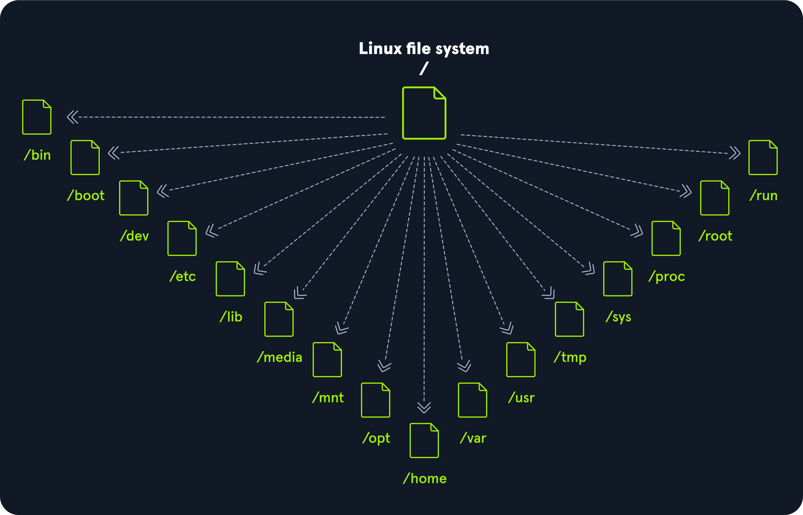

## Table of Contents

1. [Introduction](#1-introduction)
1.1. [Linux Structure](#11-linux-structure)
1.2. [Linux Distributions](#12-linux-distributions)
1.3. [Introduction to Shell](#13-introduction-to-shell)

# 1. Introduction
## 1.1. Linux Structure
**Cấu trúc Linux**

Linux, như bạn có thể đã biết, là một hệ điều hành được sử dụng cho máy tính cá nhân, máy chủ, và thậm chí cả thiết bị di động. Tuy nhiên, Linux đóng vai trò như một trụ cột nền tảng trong an ninh mạng, nổi tiếng với độ ổn định, tính linh hoạt và mã nguồn mở. Trong phần này, chúng ta sẽ tìm hiểu về cấu trúc Linux, lịch sử, triết lý, kiến trúc, và hệ thống phân cấp tệp — những kiến thức thiết yếu đối với bất kỳ chuyên gia an ninh mạng nào. Bạn có thể coi đây như buổi học lái xe đầu tiên với một chiếc xe mới, để hiểu cơ bản về phương tiện, nó gồm những gì, và tại sao nó lại có hình thức như hiện tại.

Trước tiên, hãy định nghĩa Linux là gì. Linux là một hệ điều hành, giống như Windows, macOS, iOS hoặc Android. Hệ điều hành (OS) là phần mềm quản lý tất cả tài nguyên phần cứng của máy tính, giúp giao tiếp giữa các ứng dụng phần mềm và các thành phần phần cứng. Không giống như một số hệ điều hành khác, Linux có nhiều bản phân phối khác nhau — thường được gọi là “distros” — là các phiên bản Linux được tùy chỉnh để phù hợp với nhiều nhu cầu và sở thích khác nhau.

### Lịch sử

Nhiều sự kiện đã dẫn đến việc tạo ra nhân Linux đầu tiên và cuối cùng là hệ điều hành (OS) Linux, bắt đầu từ việc phát hành hệ điều hành Unix bởi Ken Thompson và Dennis Ritchie (cả hai đều làm việc cho AT\&T vào thời điểm đó) vào năm 1970. Berkeley Software Distribution (BSD) được phát hành năm 1977, nhưng do chứa mã nguồn Unix thuộc sở hữu của AT\&T nên một vụ kiện đã hạn chế sự phát triển của BSD. Richard Stallman bắt đầu dự án GNU vào năm 1983 với mục tiêu tạo ra một hệ điều hành miễn phí giống Unix, và một phần công việc của ông dẫn đến việc tạo ra Giấy phép Công cộng GNU (GPL). Các dự án khác trong những năm sau đó đã thất bại trong việc tạo ra một nhân hệ điều hành miễn phí, hoạt động, được chấp nhận rộng rãi cho đến khi nhân Linux ra đời.

Ban đầu, Linux là một dự án cá nhân được bắt đầu vào năm 1991 bởi một sinh viên người Phần Lan tên là Linus Torvalds. Mục tiêu của ông là tạo ra một nhân hệ điều hành mới, miễn phí. Qua nhiều năm, nhân Linux đã phát triển từ một số ít tệp viết bằng C dưới giấy phép cấm phân phối thương mại thành phiên bản mới nhất với hơn 23 triệu dòng mã nguồn (không tính chú thích), được cấp phép theo GNU General Public License v2.

Linux có hơn 600 bản phân phối (hoặc hệ điều hành dựa trên nhân Linux và phần mềm, thư viện hỗ trợ). Một số bản phổ biến và nổi tiếng nhất bao gồm Ubuntu, Debian, Fedora, OpenSUSE, elementary, Manjaro, Gentoo Linux, RedHat và Linux Mint.

Linux thường được coi là an toàn hơn so với các hệ điều hành khác, và mặc dù trước đây đã từng có nhiều lỗ hổng nhân, nhưng điều này ngày càng hiếm gặp. Linux ít bị tấn công bởi phần mềm độc hại hơn so với Windows và thường xuyên được cập nhật. Linux cũng rất ổn định và thường mang lại hiệu suất rất cao cho người dùng cuối. Tuy nhiên, nó có thể khó sử dụng hơn cho người mới bắt đầu và không có nhiều trình điều khiển phần cứng như Windows.

Vì Linux miễn phí và mã nguồn mở, mã nguồn có thể được chỉnh sửa và phân phối thương mại hoặc phi thương mại bởi bất kỳ ai. Các hệ điều hành dựa trên Linux chạy trên máy chủ, máy tính lớn, máy tính để bàn, hệ thống nhúng như bộ định tuyến, TV, máy chơi game và hơn thế nữa. Hệ điều hành Android tổng thể chạy trên điện thoại thông minh và máy tính bảng được xây dựng trên nhân Linux, và vì lý do này, Linux là hệ điều hành được cài đặt rộng rãi nhất.

Linux là một hệ điều hành giống như Windows, iOS, Android hoặc macOS. Hệ điều hành là phần mềm quản lý tất cả tài nguyên phần cứng liên quan đến máy tính của chúng ta, đồng thời quản lý toàn bộ giao tiếp giữa phần mềm và phần cứng. Ngoài ra, còn có nhiều bản phân phối (distro) khác nhau, tương tự như các phiên bản của Windows.

Với các bài thực hành tương tác, chúng ta sẽ truy cập vào Pwnbox, một phiên bản tùy chỉnh của Parrot OS. Đây sẽ là hệ điều hành chính mà chúng ta sẽ làm việc xuyên suốt các mô-đun. Parrot OS là một bản phân phối Linux dựa trên Debian, tập trung vào bảo mật, quyền riêng tư và phát triển.

Hãy tưởng tượng Linux như một công ty thịnh vượng, nơi các bộ phận của nó là những nhân viên tận tụy, mỗi người đảm nhận các vai trò và trách nhiệm cụ thể để duy trì hoạt động trơn tru. Kiến trúc đóng vai trò như cơ cấu tổ chức, phác thảo cách các nhân viên này được sắp xếp thành các phòng ban và cách họ giao tiếp để đạt hiệu quả và năng suất. Triết lý đại diện cho văn hóa và giá trị cốt lõi của công ty, hướng dẫn cách nhân viên làm việc cá nhân và hợp tác, thúc đẩy các nguyên tắc như đơn giản, minh bạch và hợp tác để đạt được mục tiêu chung.

---

### Triết lý

Triết lý của Linux tập trung vào sự đơn giản, tính mô-đun và tính mở. Nó khuyến khích việc xây dựng các chương trình nhỏ, chuyên biệt để thực hiện một nhiệm vụ duy nhất một cách tốt nhất. Các chương trình này có thể được kết hợp theo nhiều cách để thực hiện các thao tác phức tạp, thúc đẩy hiệu quả và tính linh hoạt. Linux tuân theo năm nguyên tắc cốt lõi sau:

| Nguyên tắc                                                                                                                          | Mô tả                                                                                                                                                               |
| ----------------------------------------------------------------------------------------------------------------------------------- | ------------------------------------------------------------------------------------------------------------------------------------------------------------------- |
| **Everything is a file** (Mọi thứ đều là tệp)                                                                                       | Tất cả các tệp cấu hình cho các dịch vụ khác nhau đang chạy trên hệ điều hành Linux đều được lưu trữ trong một hoặc nhiều tệp văn bản.                              |
| **Small, single-purpose programs** (Chương trình nhỏ, chuyên biệt)                                                                  | Linux cung cấp nhiều công cụ khác nhau mà chúng ta sẽ làm việc cùng, có thể kết hợp để hoạt động chung.                                                             |
| **Ability to chain programs together to perform complex tasks** (Khả năng liên kết các chương trình để thực hiện nhiệm vụ phức tạp) | Việc tích hợp và kết hợp các công cụ khác nhau cho phép chúng ta thực hiện nhiều nhiệm vụ lớn và phức tạp, chẳng hạn như xử lý hoặc lọc các kết quả dữ liệu cụ thể. |
| **Avoid captive user interfaces** (Tránh giao diện người dùng bị giới hạn)                                                          | Linux được thiết kế để chủ yếu làm việc với shell (hoặc terminal), giúp người dùng kiểm soát hệ điều hành tốt hơn.                                                  |
| **Configuration data stored in a text file** (Dữ liệu cấu hình được lưu trong tệp văn bản)                                          | Ví dụ về một tệp như vậy là tệp `/etc/passwd`, lưu trữ tất cả người dùng đã được đăng ký trên hệ thống.                                                             |

---

### Thành phần

| Thành phần          | Mô tả                                                                                                                                                                                                                                                                                              |
| ------------------- | -------------------------------------------------------------------------------------------------------------------------------------------------------------------------------------------------------------------------------------------------------------------------------------------------- |
| **Bootloader**      | Một đoạn mã hướng dẫn quá trình khởi động để bắt đầu hệ điều hành. Parrot Linux sử dụng GRUB Bootloader.                                                                                                                                                                                           |
| **OS Kernel**       | Kernel là thành phần chính của hệ điều hành. Nó quản lý tài nguyên cho các thiết bị I/O của hệ thống ở cấp phần cứng.                                                                                                                                                                              |
| **Daemons**         | Các dịch vụ nền được gọi là “daemon” trong Linux. Mục đích của chúng là đảm bảo các chức năng chính như lập lịch, in ấn và đa phương tiện hoạt động đúng cách. Các chương trình nhỏ này được tải sau khi khởi động hoặc đăng nhập vào máy tính.                                                    |
| **OS Shell**        | Trình shell của hệ điều hành hoặc bộ thông dịch ngôn ngữ lệnh (còn gọi là dòng lệnh) là giao diện giữa hệ điều hành và người dùng. Giao diện này cho phép người dùng yêu cầu hệ điều hành thực hiện các tác vụ. Các shell thường dùng gồm Bash, Tcsh/Csh, Ksh, Zsh và Fish.                        |
| **Graphics server** | Cung cấp hệ thống con đồ họa (gọi là “X” hoặc “X-server”) cho phép các chương trình đồ họa chạy cục bộ hoặc từ xa trên hệ thống X-window.                                                                                                                                                          |
| **Window Manager**  | Còn được gọi là giao diện người dùng đồ họa (GUI). Có nhiều tùy chọn như GNOME, KDE, MATE, Unity và Cinnamon. Môi trường desktop thường bao gồm nhiều ứng dụng, như trình duyệt tệp và trình duyệt web, cho phép người dùng truy cập và quản lý các tính năng, dịch vụ cần thiết của hệ điều hành. |
| **Utilities**       | Ứng dụng hoặc tiện ích là các chương trình thực hiện các chức năng cụ thể cho người dùng hoặc cho chương trình khác.                                                                                                                                                                               |

---

### Kiến trúc Linux

Hệ điều hành Linux có thể được chia thành các lớp:

| Lớp                | Mô tả                                                                                                                                                                                                                                                   |
| ------------------ | ------------------------------------------------------------------------------------------------------------------------------------------------------------------------------------------------------------------------------------------------------- |
| **Hardware**       | Các thiết bị ngoại vi như RAM hệ thống, ổ cứng, CPU và các thành phần khác.                                                                                                                                                                             |
| **Kernel**         | Lõi của hệ điều hành Linux, có chức năng ảo hóa và kiểm soát tài nguyên phần cứng như CPU, bộ nhớ được phân bổ, dữ liệu được truy cập… Kernel cung cấp tài nguyên ảo cho mỗi tiến trình và ngăn ngừa/giảm thiểu xung đột giữa các tiến trình khác nhau. |
| **Shell**          | Giao diện dòng lệnh (CLI), còn gọi là shell, cho phép người dùng nhập lệnh để thực thi các chức năng của kernel.                                                                                                                                        |
| **System Utility** | Cung cấp cho người dùng quyền truy cập vào tất cả các chức năng của hệ điều hành.                                                                                                                                                                       |

---

### Cấu trúc hệ thống tệp

Hệ điều hành Linux được tổ chức theo dạng cây phân cấp và được ghi lại trong tiêu chuẩn **Filesystem Hierarchy Standard (FHS)**.
Linux được cấu trúc với các thư mục cấp cao tiêu chuẩn sau:

| **Đường dẫn** | **Mô tả**                                                                                                                                                                                                                                                                                                          |
| ------------- | ------------------------------------------------------------------------------------------------------------------------------------------------------------------------------------------------------------------------------------------------------------------------------------------------------------------ |
| `/`           | Thư mục gốc của hệ thống tệp, chứa tất cả các tệp cần thiết để khởi động hệ điều hành trước khi các hệ thống tệp khác được gắn, cũng như các tệp cần thiết để khởi động các hệ thống tệp khác. Sau khi khởi động, tất cả các hệ thống tệp khác được gắn tại các điểm mount tiêu chuẩn như là thư mục con của root. |
| `/bin`        | Chứa các tệp nhị phân lệnh thiết yếu.                                                                                                                                                                                                                                                                              |
| `/boot`       | Gồm bộ nạp khởi động tĩnh, tệp thực thi nhân (kernel) và các tệp cần thiết để khởi động hệ điều hành Linux.                                                                                                                                                                                                        |
| `/dev`        | Chứa các tệp thiết bị để hỗ trợ truy cập mọi thiết bị phần cứng gắn với hệ thống.                                                                                                                                                                                                                                  |
| `/etc`        | Các tệp cấu hình hệ thống cục bộ. Tệp cấu hình cho ứng dụng đã cài đặt cũng có thể được lưu tại đây.                                                                                                                                                                                                               |
| `/home`       | Mỗi người dùng trên hệ thống có một thư mục con tại đây để lưu trữ dữ liệu.                                                                                                                                                                                                                                        |
| `/lib`        | Các thư viện dùng chung cần thiết cho quá trình khởi động hệ thống.                                                                                                                                                                                                                                                |
| `/media`      | Các thiết bị lưu trữ di động bên ngoài như USB được gắn tại đây.                                                                                                                                                                                                                                                   |
| `/mnt`        | Điểm mount tạm thời cho các hệ thống tệp thông thường.                                                                                                                                                                                                                                                             |
| `/opt`        | Chứa các tệp tùy chọn như các công cụ của bên thứ ba.                                                                                                                                                                                                                                                              |
| `/root`       | Thư mục cá nhân của người dùng root.                                                                                                                                                                                                                                                                               |
| `/sbin`       | Chứa các tệp thực thi dùng cho quản trị hệ thống (các tệp nhị phân hệ thống).                                                                                                                                                                                                                                      |
| `/tmp`        | Hệ điều hành và nhiều chương trình dùng thư mục này để lưu trữ tệp tạm thời. Thư mục này thường bị xóa khi khởi động lại hệ thống và có thể bị xóa bất cứ lúc nào mà không cần cảnh báo.                                                                                                                           |
| `/usr`        | Chứa các tệp thực thi, thư viện, tệp hướng dẫn (man) và các tệp khác.                                                                                                                                                                                                                                              |
| `/var`        | Chứa các tệp dữ liệu thay đổi như tệp nhật ký (log), hộp thư đến, tệp liên quan đến ứng dụng web, tệp cron, và nhiều hơn nữa.                                                                                                                                                                                      |

---

## 1.2. Linux Distributions

**Các bản phân phối Linux**

Các bản phân phối Linux – hay còn gọi là distros – là các hệ điều hành dựa trên nhân Linux. Chúng được sử dụng cho nhiều mục đích khác nhau, từ máy chủ và các thiết bị nhúng cho đến máy tính để bàn và điện thoại di động. Các bản phân phối Linux giống như các nhánh khác nhau của cùng một công ty, mỗi nhánh được điều chỉnh để phục vụ các thị trường hoặc nhóm khách hàng cụ thể. Mặc dù tất cả chúng đều chia sẻ cùng một nhóm thành phần (thành phần nhân), cấu trúc tổ chức và văn hóa công ty, nhưng mỗi bản phân phối lại cung cấp các sản phẩm và dịch vụ riêng biệt (cấu hình và phần mềm), tùy chỉnh trải nghiệm để đáp ứng những nhu cầu đa dạng – tất cả vẫn hoạt động dưới thương hiệu và các nguyên tắc chung của Linux. Mỗi bản phân phối Linux đều khác nhau, có bộ tính năng, gói phần mềm và công cụ riêng. Một số bản phân phối phổ biến bao gồm:

* Ubuntu
* Fedora
* CentOS
* Debian
* Red Hat Enterprise Linux

Nhiều người chọn Linux cho máy tính để bàn vì nó miễn phí, mã nguồn mở và có khả năng tùy biến cao. Ubuntu và Fedora là hai lựa chọn phổ biến dành cho máy tính để bàn và người mới bắt đầu. Nó cũng được sử dụng rộng rãi làm hệ điều hành máy chủ vì tính bảo mật, độ ổn định và khả năng cập nhật thường xuyên và đều đặn. Cuối cùng, với tư cách là các chuyên gia an ninh mạng, họ thường chọn Linux vì nó là mã nguồn mở, đồng nghĩa với việc mã nguồn có thể được kiểm tra và tùy chỉnh. Nhờ sự tùy biến này, chúng ta có thể tối ưu và cấu hình bản phân phối Linux của mình theo cách mong muốn và điều chỉnh cho phù hợp với các trường hợp sử dụng cụ thể nếu cần.

Chúng ta có thể dùng các bản phân phối này ở mọi nơi, bao gồm (máy chủ) web, thiết bị di động, hệ thống nhúng, điện toán đám mây và máy tính để bàn. Đối với các chuyên gia an ninh mạng, một số bản phân phối Linux phổ biến nhất bao gồm nhưng không giới hạn ở:

|                 |        |         |
| --------------- | ------ | ------- |
| ParrotOS        | Ubuntu | Debian  |
| Raspberry Pi OS | CentOS | BackBox |
| BlackArch       | Pentoo |         |

Sự khác biệt chính giữa các bản phân phối Linux nằm ở các gói phần mềm được bao gồm, giao diện người dùng và công cụ sẵn có. Kali Linux là bản phân phối phổ biến nhất dành cho các chuyên gia an ninh mạng, bao gồm nhiều công cụ và gói phần mềm tập trung vào bảo mật. Ubuntu phổ biến với người dùng máy tính để bàn, trong khi Debian phổ biến cho máy chủ và hệ thống nhúng. Cuối cùng, Red Hat Enterprise Linux và CentOS được ưa chuộng cho môi trường điện toán cấp doanh nghiệp.

---

**Debian**

Debian là một bản phân phối Linux được biết đến rộng rãi và được đánh giá cao nhờ tính ổn định và độ tin cậy. Nó được sử dụng cho nhiều mục đích, bao gồm máy tính để bàn, máy chủ và hệ thống nhúng. Debian sử dụng công cụ quản lý gói nâng cao (APT – Advanced Package Tool) để xử lý các bản cập nhật phần mềm và bản vá bảo mật. Hệ thống quản lý gói này giúp hệ thống luôn được cập nhật và bảo mật bằng cách tự động tải xuống và cài đặt các bản cập nhật bảo mật ngay khi có sẵn. Việc này có thể thực hiện thủ công hoặc thiết lập tự động.

Debian có thể khó học hơn so với một số bản phân phối khác, nhưng nó được đánh giá là một trong những bản phân phối Linux linh hoạt và tùy biến nhất. Quá trình cấu hình và cài đặt có thể phức tạp, nhưng nó cũng cung cấp quyền kiểm soát tuyệt đối đối với hệ thống, điều này có thể tốt cho người dùng nâng cao. Càng kiểm soát được nhiều hệ thống Linux, người dùng càng thấy phức tạp hơn. Tuy nhiên, điều đó chỉ có nghĩa là so với các tùy chọn và khả năng mà nó mang lại, việc thực hiện những tác vụ “dễ” có thể mất thời gian hơn so với khi chúng ta học được cách sử dụng một vài lệnh và công cụ cơ bản.

Tính ổn định và độ tin cậy là những điểm mạnh chính của Debian. Bản phân phối này nổi tiếng với các bản hỗ trợ dài hạn, có thể cung cấp các bản cập nhật và bản vá bảo mật trong vòng 5 năm. Điều này đặc biệt quan trọng đối với máy chủ và các hệ thống cần hoạt động liên tục 24/7. Debian có lịch sử lâu dài về bảo mật và độ tin cậy, cùng với cam kết mạnh mẽ đối với quyền riêng tư và an ninh. Debian là một bản phân phối Linux mạnh mẽ và đáng tin cậy, được sử dụng rộng rãi cho nhiều mục đích khác nhau. Nhờ sự ổn định, độ tin cậy và cam kết bảo mật, Debian trở thành lựa chọn hấp dẫn cho nhiều trường hợp sử dụng, bao gồm cả an ninh mạng.

---

## 1.3. Introduction to Shell
**Giới thiệu về Shell**

Việc học cách sử dụng shell của Linux là rất quan trọng, vì có rất nhiều máy chủ được xây dựng dựa trên Linux. Chúng thường được sử dụng vì Linux ít xảy ra lỗi hơn so với máy chủ Windows.

Ví dụ, các máy chủ web thường chạy trên nền tảng Linux. Biết cách sử dụng hệ điều hành để kiểm soát nó một cách hiệu quả đòi hỏi phải hiểu và nắm vững một phần thiết yếu của Linux, đó là **Shell**.

Khi chúng ta lần đầu chuyển từ Windows sang Linux, giao diện sẽ trông giống như thế này:

Một terminal trong Linux, còn được gọi là **shell** hoặc **command line**, cung cấp giao diện nhập/xuất (I/O) dựa trên văn bản giữa người dùng và kernel của hệ điều hành. Thuật ngữ *console* cũng thường được sử dụng nhưng không chỉ một cửa sổ, mà là một màn hình ở chế độ văn bản. Trong cửa sổ terminal, các lệnh có thể được thực thi để điều khiển hệ thống.

Chúng ta có thể coi shell như một giao diện GUI dạng văn bản, nơi ta nhập các lệnh để thực hiện các thao tác như di chuyển đến thư mục khác, làm việc với tệp, và lấy thông tin từ hệ thống nhưng với nhiều khả năng hơn.

---

### Trình giả lập Terminal

Trình giả lập terminal là phần mềm mô phỏng chức năng của một terminal. Nó cho phép sử dụng các chương trình dựa trên văn bản trong môi trường đồ họa (**GUI**). Ngoài ra còn có các giao diện dòng lệnh (**CLI**) chạy như các terminal bổ sung bên trong một terminal. Nói ngắn gọn, terminal đóng vai trò là giao diện tới trình thông dịch shell.

Hãy tưởng tượng bạn đang ở một tòa nhà văn phòng lớn, nơi shell là phòng máy chủ chính xử lý toàn bộ dữ liệu và lệnh của công ty. Terminal giống như bàn tiếp tân, nơi tiếp nhận và chuyển yêu cầu tới phòng máy chủ (shell). Bạn đến bàn tiếp tân (terminal) để gửi hướng dẫn hoặc yêu cầu cho phòng máy chủ.

Bây giờ, giả sử bạn đang làm việc từ xa. Phần mềm giả lập terminal hoạt động như một bàn tiếp tân ảo trên màn hình máy tính của bạn (**GUI**), cho phép bạn tương tác với phòng máy chủ mà không cần có mặt trực tiếp tại văn phòng. Nó mô phỏng chức năng của bàn tiếp tân thật, cho phép bạn sử dụng các chương trình và lệnh dựa trên văn bản trong môi trường đồ họa.

Ngoài ra, các **giao diện dòng lệnh (CLI)** chạy như các terminal bổ sung bên trong một terminal giống như việc bạn có nhiều bàn tiếp tân ảo mở trên màn hình cùng lúc. Mỗi bàn cho phép bạn gửi các hướng dẫn khác nhau tới phòng máy chủ một cách độc lập, nhưng đều thông qua cùng một giao diện chính. Về bản chất, terminal đóng vai trò là cổng giao tiếp để điều khiển các hoạt động cốt lõi do shell quản lý.

Các trình giả lập và công cụ phân luồng terminal là những phần mở rộng hữu ích. Chúng cung cấp nhiều phương pháp và chức năng khác nhau để làm việc với terminal, chẳng hạn như chia terminal thành nhiều cửa sổ, làm việc trong nhiều thư mục, tạo không gian làm việc khác nhau, và nhiều hơn nữa. Một ví dụ về công cụ như vậy là **Tmux**, có thể được sử dụng như sau:

### Shell

Shell được sử dụng phổ biến nhất trong Linux là **Bourne-Again Shell (BASH)**, và là một phần của dự án GNU. Mọi việc chúng ta làm thông qua giao diện đồ họa (GUI) đều có thể thực hiện bằng shell. Shell mang đến cho chúng ta nhiều khả năng hơn để tương tác với các chương trình và tiến trình nhằm lấy thông tin nhanh hơn.

Ngoài ra, nhiều tiến trình có thể được tự động hóa một cách dễ dàng thông qua các script nhỏ hoặc lớn, giúp công việc thủ công trở nên đơn giản hơn nhiều.

Bên cạnh Bash, còn có nhiều loại shell khác như **Tcsh/Csh**, **Ksh**, **Zsh**, **Fish** và các shell khác.

