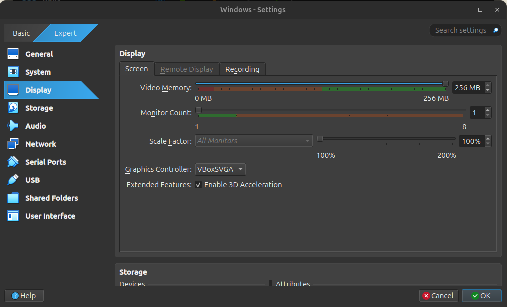
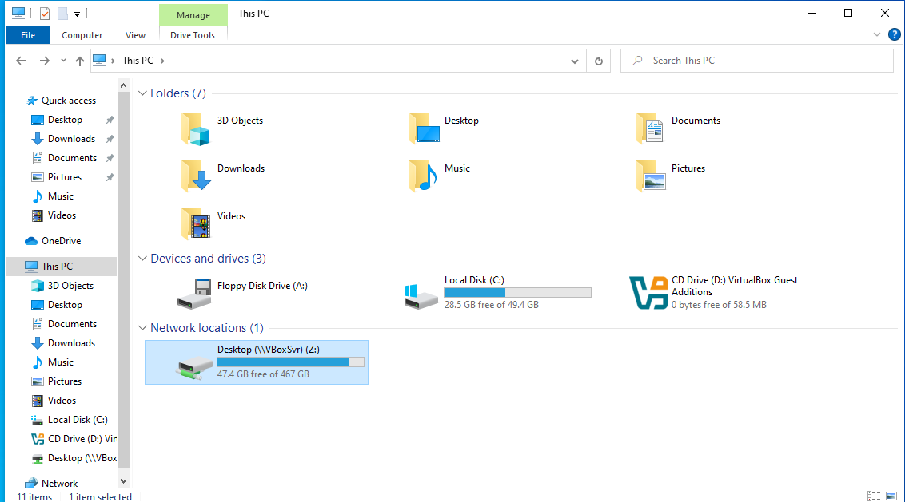

# 1. windows Setup (Windows cannot read the <ProductKey> setting from the unattend answer file.)


- Tắt máy ảo


- Vào setting -> system -> tắt Floppy -> ok


- Vào lại setting -> general -> advanced -> xem đường dẫn


- Sau đó vào đường dẫn và xóa file sau: 


# 2. Phóng to màn hình 

---

### BƯỚC 1: Cài đặt "Guest Additions" cho máy ảo Windows 10

**1.1. Khởi động Windows 10 trong VirtualBox.**

**1.2. Từ menu của VirtualBox (khung ngoài):**

* Chọn **Devices** → **Insert Guest Additions CD image...**


**1.3. Trong Windows 10**, mở File Explorer → ổ đĩa CD mới (thường là `D:` hoặc `E:`), mở file:

```
VBoxWindowsAdditions.exe
```


**1.4. Cài đặt theo hướng dẫn, sau đó khởi động lại Windows 10.**


---

### Bước 2: Tăng độ phân giải màn hình

* Vào trong Windows 10 → **Settings → Display**

  * Kiểm tra độ phân giải màn hình, chọn độ phân giải cao hơn (như 1920×1080).
* Nếu không có độ phân giải lớn:

  * Tắt máy ảo → chọn máy ảo → **Settings → Display → Screen**

    * Tăng **Video Memory** lên tối đa (128 MB)
    * Bật “Enable 3D Acceleration”




### BƯỚC 3: Chuyển sang chế độ toàn màn hình

**2.1. Từ menu của VirtualBox**, nhấn:

```
View → Full-screen Mode (hoặc nhấn phím tắt: Host + F)
```

> *Phím “Host” mặc định là phím **Right Ctrl** (Ctrl bên phải bàn phím).*

---


# 3 Chia sẻ file giữa máy thật (host) và máy ảo (guest)** trong VirtualBox

---

## CÁCH 1: Dùng thư mục chia sẻ (Shared Folder)

### Bước 1: Cài Guest Additions (nếu chưa có)

Trong máy ảo Windows:

* Từ menu VirtualBox (ngoài): **Devices → Insert Guest Additions CD image...**
* Mở file `VBoxWindowsAdditions.exe` và cài đặt → Khởi động lại máy ảo.

---

### Bước 2: Thiết lập thư mục chia sẻ

1. **Tắt máy ảo**
2. Trong VirtualBox Manager → chọn máy ảo → **Settings → Shared Folders**
3. Nhấn dấu **+** bên phải để thêm thư mục:

   * **Folder Path**: chọn thư mục trên máy thật
   * **Folder Name**: đặt tên bất kỳ (VD: `Shared`)
   * ✅ Check **Auto-mount**
   * ✅ Check **Make Permanent**
4. Bấm **OK**

---

### Bước 3: Truy cập trong Windows ảo

1. Mở File Explorer trong máy ảo Windows
2. Truy cập:

   ```
   This PC → Network Locations → \\VBOXSVR\Shared
   ```

   hoặc ổ đĩa mạng mới sẽ tự hiện trong “This PC” nếu Auto-mount bật.



---

## Dùng Drag & Drop hoặc Clipboard

Bạn có thể bật kéo-thả hoặc copy-paste nếu đã cài Guest Additions:

* **Settings → General → Advanced**:

  * **Shared Clipboard** → `Bidirectional`
  * **Drag and Drop** → `Bidirectional`

> Tuy nhiên, chức năng này đôi khi không ổn định bằng cách dùng thư mục chia sẻ.

---

