# 1. windows Setup (Windows cannot read the <ProductKey> setting from the unattend answer file.)


- Tắt máy ảo

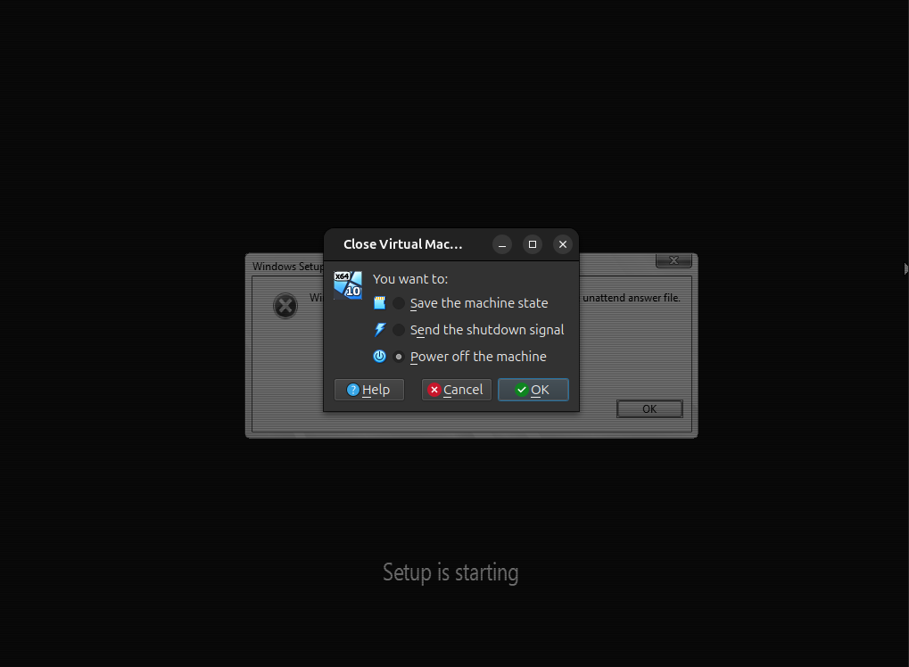

- Vào setting -> system -> tắt Floppy -> ok

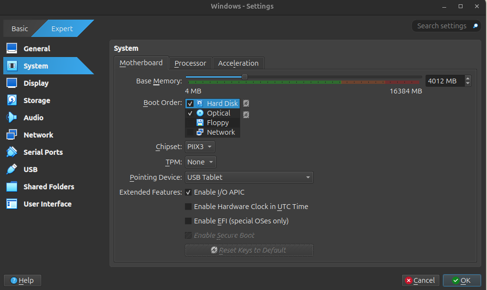

- Vào lại setting -> general -> advanced -> xem đường dẫn

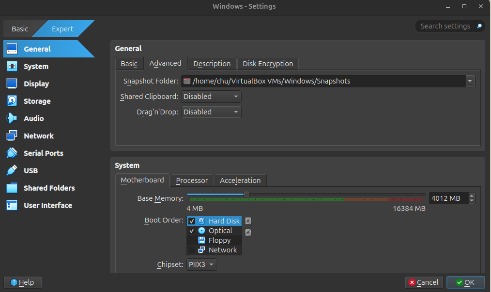

- Sau đó vào đường dẫn và xóa file sau: 

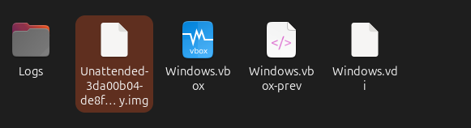

# 2. Phóng to màn hình 

---

### BƯỚC 1: Cài đặt "Guest Additions" cho máy ảo Windows 10

**1.1. Khởi động Windows 10 trong VirtualBox.**

**1.2. Từ menu của VirtualBox (khung ngoài):**

* Chọn **Devices** → **Insert Guest Additions CD image...**

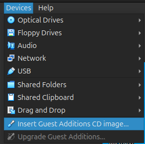

**1.3. Trong Windows 10**, mở File Explorer → ổ đĩa CD mới (thường là `D:` hoặc `E:`), mở file:

```
VBoxWindowsAdditions.exe
```

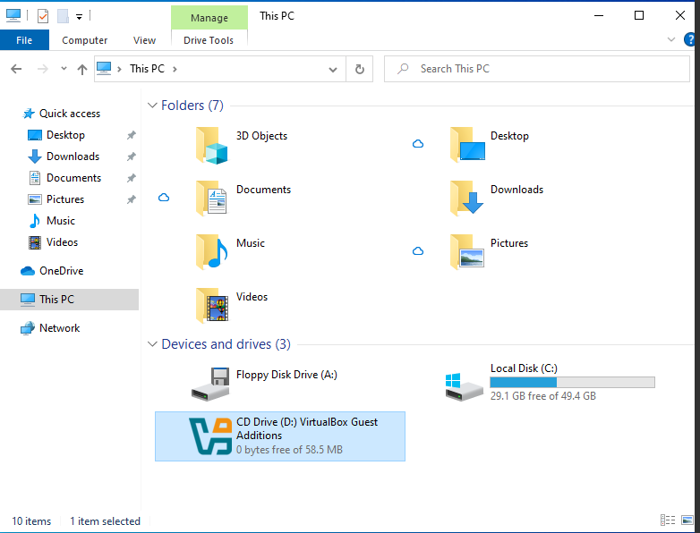

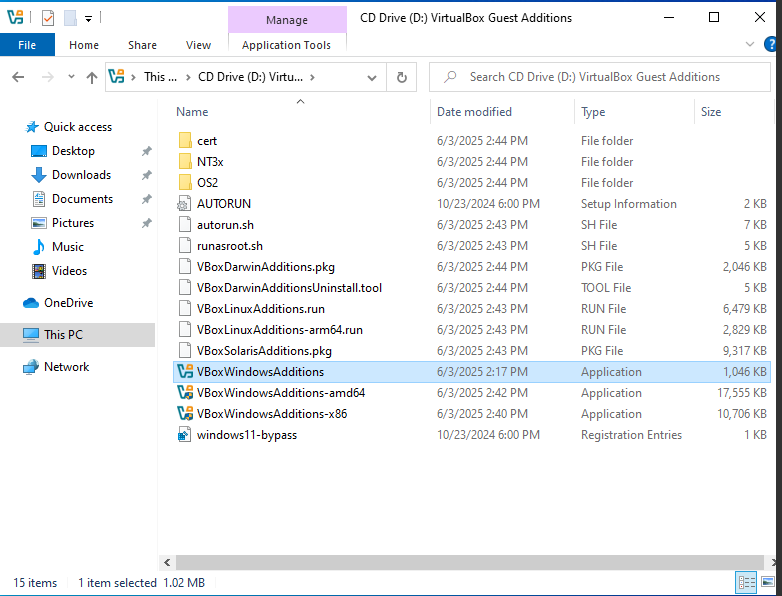

**1.4. Cài đặt theo hướng dẫn, sau đó khởi động lại Windows 10.**

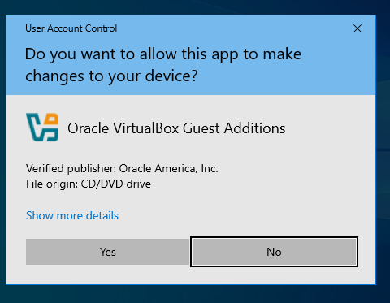

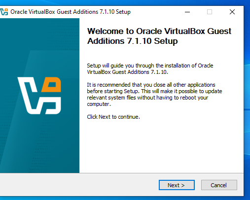

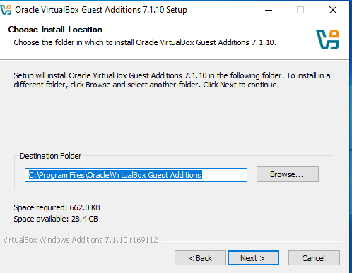

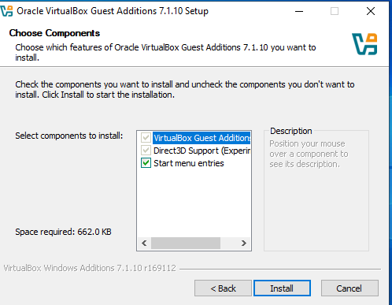

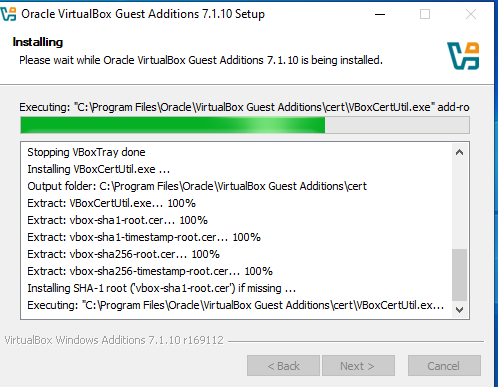

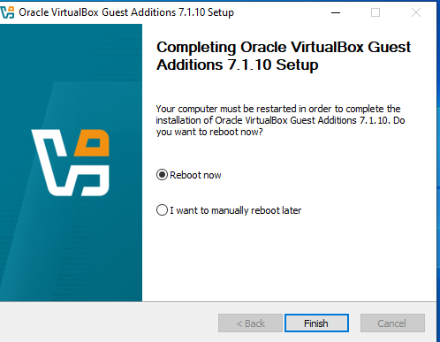


---

### ✅ BƯỚC 2: Chuyển sang chế độ toàn màn hình

**2.1. Từ menu của VirtualBox**, nhấn:

```
View → Full-screen Mode (hoặc nhấn phím tắt: Host + F)
```

> *Phím “Host” mặc định là phím **Right Ctrl** (Ctrl bên phải bàn phím).*

---

### 🔁 Nếu vẫn chưa full sau khi cài Guest Additions:

* Vào trong Windows 10 → **Settings → Display**

  * Kiểm tra độ phân giải màn hình, chọn độ phân giải cao hơn (như 1920×1080).
* Nếu không có độ phân giải lớn:

  * Tắt máy ảo → chọn máy ảo → **Settings → Display → Screen**

    * Tăng **Video Memory** lên tối đa (128 MB)
    * Bật “Enable 3D Acceleration”

---

### 🛠 Nếu không thấy ổ đĩa Guest Additions:

* Từ menu: **Devices → Optical Drives → Choose a disk file…**
* Tải file ISO theo link (nếu chưa có):
  [https://download.virtualbox.org/virtualbox/](https://download.virtualbox.org/virtualbox/)
  → Chọn phiên bản bạn dùng → Tải file: `VBoxGuestAdditions.iso`

---

Nếu làm hết vẫn chưa được, bạn có thể gửi ảnh màn hình hoặc chi tiết lỗi, tôi sẽ hỗ trợ thêm.
