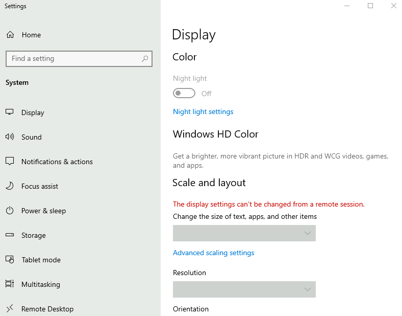
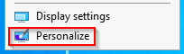
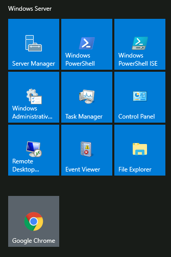
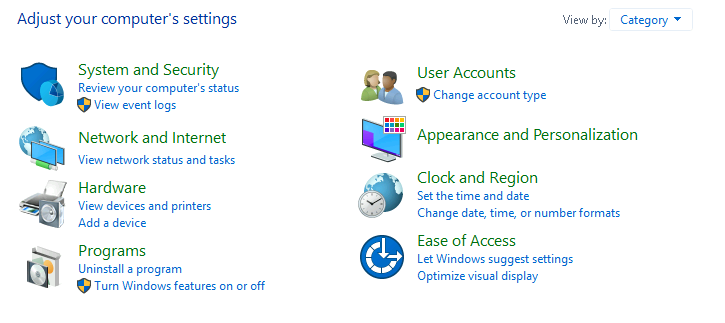

# Windows Fundamentals 1

> Trong phần 1 của mô-đun Cơ bản về Windows, chúng ta sẽ bắt đầu hành trình tìm hiểu về màn hình nền Windows, hệ thống tệp NTFS, UAC, Bảng điều khiển và nhiều nội dung khác.

## Mục Lục

1. [Task 1: Introduction to Windows](#task-1-introduction-to-windows)

2. [Task 2: Windows Editions](#task-2-windows-editions)

3. [Task 3: The Desktop (GUI)](#task-3-the-desktop-gui)

4. [Task 4: The File System](#task-4-the-file-system)

5. [Task 5: The Windows\System32 Folders](#task-5-the-windows-system32-folders)

6. [Task 6: User Accounts, Profiles, and Permissions](#task-6-user-accounts-profiles-and-permissions)

7. [Task 7: User Account Control](#task-7-user-account-control)

8. [Task 8: Settings and the Control Panel](#task-8-settings-and-the-control-panel)

9. [Task 9: Task Manager](#task-9-task-manager)

10. [Task 10: Conclusion](#task-10-conclusion)

## Nội dung

# Task 1: Introduction to Windows

Hệ điều hành (OS) Windows là một sản phẩm phức tạp với nhiều tệp hệ thống, tiện ích, cài đặt, tính năng, v.v.

Mô-đun này sẽ cố gắng cung cấp tổng quan chung về một số ít thành phần tạo nên HĐH Windows, điều hướng giao diện người dùng, thực hiện thay đổi cho hệ thống, v.v. Nội dung này hướng đến những người muốn hiểu và sử dụng HĐH Windows ở mức độ thoải mái hơn.

Máy ảo sẽ mở trong trình duyệt web của bạn.

Nếu bạn muốn truy cập máy ảo qua Remote Desktop, hãy sử dụng thông tin đăng nhập bên dưới.

Machine IP: MACHINE_IP

User: administrator

Password: letmein123!

Chấp nhận Chứng chỉ khi được nhắc và bạn sẽ được đăng nhập vào hệ thống từ xa ngay bây giờ.

Lưu ý: Máy ảo có thể mất tới 3 phút để tải.

# Task 2: Windows Editions

Hệ điều hành Windows có một lịch sử lâu dài, bắt đầu từ năm 1985, và hiện nay, nó là hệ điều hành chiếm ưu thế trong cả việc sử dụng tại gia và trong các mạng lưới công ty. Vì lý do này, Windows luôn là mục tiêu của các hacker và những kẻ viết phần mềm độc hại.

Windows XP là một phiên bản Windows phổ biến và hoạt động lâu dài. Microsoft đã công bố Windows Vista, đây là một cuộc đại tu hoàn toàn của hệ điều hành Windows. Tuy nhiên, Vista gặp phải nhiều vấn đề. Người dùng Windows không đón nhận Vista tốt, và nó nhanh chóng bị loại bỏ.

Khi Microsoft thông báo ngày kết thúc vòng đời của Windows XP, nhiều khách hàng hoảng sợ. Các tập đoàn, bệnh viện, v.v., phải gấp rút thử nghiệm và chuyển sang phiên bản Windows khả dụng tiếp theo, đó là Windows 7, cùng với nhiều phần cứng và thiết bị khác. Các nhà cung cấp phải làm việc hết tốc lực để đảm bảo sản phẩm của họ hoạt động với Windows 7 cho khách hàng của mình. Nếu họ không làm được, khách hàng buộc phải phá vỡ thỏa thuận và tìm nhà cung cấp khác nâng cấp sản phẩm để hoạt động với Windows 7. Điều này là một cơn ác mộng đối với nhiều người, và Microsoft đã lưu ý đến điều này.

Windows 7, được phát hành nhanh chóng ngay sau đó, đã được đánh dấu với một ngày kết thúc hỗ trợ. Windows 8.x xuất hiện và biến mất nhanh chóng, giống như Vista.

Sau đó, [Windows 10](https://www.microsoft.com/en-us/windows/tips?activetab=NewPopular?activetab=NewPopular) ra đời, là phiên bản hệ điều hành Windows hiện tại cho máy tính để bàn.

Windows 10 có hai phiên bản: Home và Pro. Bạn có thể đọc sự khác biệt giữa chúng [tại đây](https://www.microsoft.com/en-us/windows/?r=1).

Mặc dù chúng ta không nói về các máy chủ, phiên bản hệ điều hành Windows hiện tại cho máy chủ là **[Windows Server 2019](https://www.microsoft.com/en-us/windows-server)**.

Nhiều nhà phê bình chỉ trích Microsoft, nhưng họ đã có những bước tiến dài trong việc cải thiện tính khả dụng và bảo mật với mỗi phiên bản mới của Windows.

**Lưu ý:** Phiên bản Windows của máy ảo (VM) đính kèm là Windows Server 2019 Standard, như được thấy trong **System Information**.

**Cập nhật:** Từ tháng 6 năm 2021, Microsoft đã công bố ngày ngừng hỗ trợ cho Windows 10 [tại đây](https://learn.microsoft.com/en-us/lifecycle/products/windows-10-home-and-pro?ranMID=24542&ranEAID=kXQk6*ivFEQ&ranSiteID=kXQk6.ivFEQ-4cKUPfbv9lM_IR2EX7K_hw&epi=kXQk6.ivFEQ-4cKUPfbv9lM_IR2EX7K_hw&irgwc=1&OCID=AID2000142_aff_7593_1243925&tduid=(ir__feexvhocigkfqna9kk0sohznb32xutanagupypus00)(7593)(1243925)(kXQk6.ivFEQ-4cKUPfbv9lM_IR2EX7K_hw)()&irclickid=_feexvhocigkfqna9kk0sohznb32xutanagupypus00).

“Microsoft sẽ tiếp tục hỗ trợ ít nhất một phiên bản Windows 10 Semi-Annual Channel đến ngày 14 tháng 10 năm 2025.”

Kể từ ngày 5 tháng 10 năm 2021 - Windows 11 hiện là hệ điều hành Windows dành cho người dùng cuối. Đọc thêm về Windows 11 [tại đây](https://www.microsoft.com/en-us/windows?wa=wsignin1.0&r=1).

**Câu hỏi: Bạn có thể bật loại mã hóa nào trên Pro mà không thể bật trên Home?**

  

Hiển thị đáp án
  
Đáp án: BitLocker

  

Sự khác biệt chính về khả năng mã hóa giữa Windows **Pro** và **Home** nằm ở tính năng hỗ trợ **BitLocker**:

**Windows Pro:**

- **BitLocker Drive Encryption:** Có sẵn và có thể kích hoạt. BitLocker cung cấp mã hóa toàn bộ ổ đĩa, bảo vệ dữ liệu của bạn ngay cả khi ổ đĩa bị tháo ra khỏi thiết bị. Ngoài ra, BitLocker còn hỗ trợ các tính năng như **BitLocker To Go** (mã hóa USB) và quản lý qua **Group Policy**.

**Windows Home:**

- **BitLocker Drive Encryption:** Không được hỗ trợ một cách chính thức. Tuy nhiên, Windows Home có thể hỗ trợ một dạng mã hóa đơn giản hơn gọi là **Device Encryption** (Mã hóa thiết bị), nếu phần cứng của bạn hỗ trợ. Tính năng này ít tùy chọn và không mạnh mẽ bằng BitLocker.
- Để sử dụng tính năng mã hóa đầy đủ như BitLocker, bạn cần nâng cấp lên phiên bản Windows Pro hoặc sử dụng các công cụ mã hóa của bên thứ ba.

Nếu bạn cần một giải pháp mã hóa mạnh mẽ với khả năng quản lý nâng cao (ví dụ: quản lý qua Group Policy, tích hợp với Active Directory, hoặc mã hóa đồng loạt nhiều ổ đĩa), thì **Windows Pro** là lựa chọn phù hợp hơn.

# Task 3: The Desktop (GUI)

Windows Desktop, hay còn gọi là giao diện người dùng đồ họa hoặc GUI (graphical user interface), là màn hình chào đón bạn sau khi bạn đăng nhập vào máy tính Windows 10.

Theo truyền thống, trước tiên bạn cần phải vượt qua màn hình đăng nhập. Màn hình đăng nhập là nơi bạn cần nhập thông tin đăng nhập tài khoản hợp lệ; thường là tên người dùng và mật khẩu của tài khoản Windows đã tồn tại trước đó trên hệ thống cụ thể đó hoặc trong môi trường Active Directory (nếu đó là máy tính đã tham gia miền).

Ảnh chụp màn hình ở trên là ví dụ về một **Màn hình Desktop Windows** điển hình. Mỗi thành phần tạo nên giao diện người dùng đồ họa (GUI) được giải thích ngắn gọn dưới đây:

1. Màn hình Desktop  
2. Menu Start  
3. Hộp tìm kiếm (Cortana)  
4. Chế độ xem tác vụ (Task View)  
5. Thanh tác vụ (Taskbar)  
6. Thanh công cụ (Toolbars)  
7. Khu vực thông báo (Notification Area)  

## **Màn hình Desktop**

Màn hình Desktop là nơi bạn sẽ có các lối tắt (shortcut) đến chương trình, thư mục, tệp, v.v. Các biểu tượng này sẽ được tổ chức gọn gàng trong các thư mục được sắp xếp theo thứ tự bảng chữ cái hoặc phân tán ngẫu nhiên mà không có tổ chức cụ thể nào trên màn hình. Dù thế nào, các mục này thường được đặt trên màn hình Desktop để truy cập nhanh.

Giao diện và cách bố trí của màn hình Desktop có thể được thay đổi để phù hợp với sở thích của bạn. Bằng cách nhấp chuột phải vào bất kỳ đâu trên màn hình Desktop, một menu ngữ cảnh sẽ xuất hiện. Menu này cho phép bạn thay đổi kích thước các biểu tượng trên màn hình Desktop, sắp xếp chúng theo ý muốn, sao chép/dán các mục vào màn hình Desktop, và tạo các mục mới như thư mục, lối tắt, hoặc tài liệu văn bản.

Dưới **Cài đặt Màn hình** (Display settings), bạn có thể thay đổi độ phân giải và hướng của màn hình. Trong trường hợp bạn có nhiều màn hình máy tính, bạn có thể thực hiện cấu hình cho thiết lập đa màn hình tại đây.

Lưu ý: Trong phiên làm việc **Remote Desktop**, một số cài đặt hiển thị sẽ bị vô hiệu hóa.

Bạn cũng có thể thay đổi hình nền bằng cách chọn **Cá nhân hóa** (Personalize).

Trong mục **Cá nhân hóa** (Personalize), bạn có thể thay đổi hình nền cho Màn hình Desktop, thay đổi phông chữ, chủ đề, bảng màu, v.v.

## **Menu Start**

Trong các phiên bản trước của Windows, từ **Start** xuất hiện ở góc dưới bên trái của giao diện đồ họa (GUI) trên màn hình Desktop. Trong các phiên bản Windows hiện đại, chẳng hạn như Windows 10, từ "Start" không còn xuất hiện nữa, thay vào đó là biểu tượng logo Windows. Mặc dù giao diện của Menu Start đã thay đổi, mục đích chính của nó vẫn giữ nguyên.

Menu Start cung cấp quyền truy cập vào tất cả các ứng dụng/chương trình, tệp, công cụ tiện ích, v.v., hữu ích nhất.

Khi nhấp vào biểu tượng logo Windows, Menu Start sẽ mở ra. Menu Start được chia thành các phần khác nhau. Xem chi tiết bên dưới.

1. Phần này của Menu Start cung cấp các phím tắt nhanh để thực hiện các hành động liên quan đến tài khoản hoặc phiên đăng nhập của bạn, chẳng hạn như thay đổi thông tin tài khoản người dùng, khóa màn hình hoặc đăng xuất khỏi tài khoản. Các phím tắt khác dành riêng cho tài khoản của bạn bao gồm thư mục **Documents** (biểu tượng tài liệu) và thư mục **Pictures** (biểu tượng hình ảnh). Cuối cùng, biểu tượng bánh răng/cơ sẽ đưa bạn đến màn hình **Cài đặt (Settings)**, và biểu tượng nguồn sẽ cho phép bạn **ngắt kết nối khỏi phiên Remote Desktop**, tắt máy tính hoặc khởi động lại máy tính.

Trong hình bên dưới, bạn có thể thấy mỗi biểu tượng đại diện cho chức năng nào. Để mở rộng phần này, hãy nhấp vào biểu tượng giống như một chiếc bánh hamburger ở phía trên.

2. Phần này sẽ hiển thị tất cả các ứng dụng/chương trình **mới được thêm gần đây** (Recently added) ở phía trên cùng và tất cả các ứng dụng/chương trình đã cài đặt (được cấu hình để xuất hiện trong Menu Start). Trong phần này, bạn cũng sẽ thấy các ứng dụng/chương trình được liệt kê theo thứ tự bảng chữ cái. Mỗi chữ cái sẽ có một phần riêng. Xem chi tiết bên dưới.

Trong hình trên, ô đầu tiên là nơi hiển thị các ứng dụng/chương trình **mới được thêm gần đây**. Ô thứ hai là nơi hiển thị tất cả các ứng dụng/chương trình đã được cài đặt.

**Lưu ý:** Trong máy ảo (VM) của bạn, Google Chrome sẽ không còn hiển thị dưới dạng chương trình **Recently Added** nữa.

Nếu bạn có một danh sách **dài** các ứng dụng/chương trình đã cài đặt, bạn có thể nhanh chóng chuyển đến một phần cụ thể trong danh sách bằng cách nhấp vào các chữ cái đầu để hiển thị lưới bảng chữ cái. Xem chi tiết bên dưới.

**Lưu ý:** Các chữ cái màu trắng tương ứng với các tiêu đề chữ cái.

3. Phía bên phải của **Menu Start** là nơi bạn sẽ tìm thấy các biểu tượng cho các ứng dụng/chương trình hoặc tiện ích cụ thể. Các biểu tượng này được gọi là **tiles** (ô vuông). Một số ô vuông được thêm vào phần này theo mặc định. Nếu bạn nhấp chuột phải vào bất kỳ ô vuông nào, một menu sẽ xuất hiện cho phép bạn thực hiện thêm các hành động trên ô được chọn; chẳng hạn như thay đổi kích thước ô, gỡ ghim khỏi Menu Start, xem thuộc tính (Properties) của nó, v.v. Xem chi tiết bên dưới.

Các ứng dụng/chương trình có thể được thêm vào phần này của Menu Start bằng cách nhấp chuột phải vào ứng dụng/chương trình và chọn **Pin to Start**. Xem chi tiết bên dưới.

## **Thanh tác vụ (Taskbar)**

Một số thành phần được kích hoạt và hiển thị theo mặc định. Ví dụ, **Thanh công cụ (Toolbar)** (mục 6), được kích hoạt để minh họa mục đích sử dụng.

Nếu bạn giống tôi và muốn tắt một số thành phần này, bạn có thể nhấp chuột phải vào **Thanh tác vụ** để mở menu ngữ cảnh, cho phép bạn thực hiện các thay đổi.

Bất kỳ ứng dụng/chương trình, thư mục, tệp, v.v., nào mà bạn mở/chạy sẽ xuất hiện trên **Thanh tác vụ** (Taskbar).

Khi di chuột qua biểu tượng, một hình thu nhỏ xem trước sẽ xuất hiện, cùng với một chú thích (tooltip). Chú thích này rất hữu ích nếu bạn có nhiều ứng dụng/chương trình đang mở, chẳng hạn như Google Chrome, và bạn muốn tìm xem phiên bản nào của Google Chrome cần được đưa lên trước.

Khi bạn đóng bất kỳ mục nào trong số này, chúng sẽ biến mất khỏi thanh tác vụ (trừ khi bạn đã ghim chúng vào thanh tác vụ).

## **Khu vực Thông báo (Notification Area)**

Khu vực Thông báo, thường nằm ở góc dưới bên phải của màn hình Windows, là nơi hiển thị ngày và giờ. Các biểu tượng khác có thể hiển thị trong khu vực này bao gồm biểu tượng âm lượng, biểu tượng mạng/không dây, để nêu một vài ví dụ. Các biểu tượng có thể được thêm vào hoặc xóa khỏi Khu vực Thông báo trong cài đặt **Taskbar settings**.

Từ đó, cuộn xuống phần **Khu vực Thông báo** (Notification Area) để thực hiện các thay đổi.

**Câu hỏi:**

**Câu hỏi 1: Tùy chọn nào sẽ ẩn/vô hiệu hóa hộp tìm kiếm?**  

  

Hiển thị đáp án
  
Đáp án: Hidden  

  

**Câu hỏi 2: Tùy chọn nào sẽ ẩn/vô hiệu hóa nút Task View?**  

  

Hiển thị đáp án
  
Đáp án: Show Task View button  

  

**Câu hỏi 3: Ngoài Đồng hồ và Mạng, biểu tượng nào khác hiển thị trong khu vực Thông báo?**  

  

Hiển thị đáp án
  
Đáp án: Action Center  

  

# Task 4: The File System

**Hệ Thống Tệp**

Hệ thống tệp được sử dụng trong các phiên bản hiện đại của Windows là **New Technology File System** hoặc đơn giản là **NTFS**.

Trước NTFS, đã có các hệ thống tệp **FAT16/FAT32** (File Allocation Table) và **HPFS** (High Performance File System).

Bạn vẫn có thể thấy các phân vùng FAT được sử dụng ngày nay. Ví dụ, các phân vùng FAT thường thấy trong thiết bị USB, thẻ MicroSD, v.v., nhưng thường không xuất hiện trên các máy tính cá nhân/laptop Windows hoặc máy chủ Windows.

NTFS được biết đến là một hệ thống tệp ghi nhật ký. Trong trường hợp xảy ra lỗi, hệ thống tệp có thể tự động sửa chữa các thư mục/tệp trên đĩa bằng cách sử dụng thông tin được lưu trữ trong một tệp nhật ký. Chức năng này không khả dụng với FAT.

NTFS khắc phục nhiều hạn chế của các hệ thống tệp trước đây, chẳng hạn như:

- Hỗ trợ tệp có dung lượng lớn hơn 4GB  
- Thiết lập quyền riêng biệt trên thư mục và tệp  
- Nén thư mục và tệp  
- Mã hóa (Hệ thống Mã hóa Tệp - **Encryption File System** hoặc **EFS**)  

Nếu bạn đang sử dụng Windows, hệ thống tệp nào đang được cài đặt trong Windows của bạn? Bạn có thể kiểm tra bằng cách nhấp chuột phải vào ổ đĩa mà hệ điều hành của bạn được cài đặt, thường là ổ đĩa C (C:\), và chọn **Properties**.

**Bạn có thể đọc tài liệu chính thức của Microsoft về FAT, HPFS và NTFS [tại đây](https://learn.microsoft.com/en-us/troubleshoot/windows-client/backup-and-storage/fat-hpfs-and-ntfs-file-systems).**

Hãy nói ngắn gọn về một số tính năng đặc trưng của NTFS.

Trên các phân vùng NTFS, bạn có thể thiết lập quyền để cấp hoặc từ chối quyền truy cập vào tệp và thư mục.

Các quyền bao gồm:

- **Full control** (Toàn quyền kiểm soát)  
- **Modify** (Chỉnh sửa)  
- **Read & Execute** (Đọc và Thực thi)  
- **List folder contents** (Liệt kê nội dung thư mục)  
- **Read** (Đọc)  
- **Write** (Ghi)  

Bảng dưới đây liệt kê ý nghĩa của từng quyền và cách chúng được áp dụng cho tệp và thư mục. *(Nguồn: Microsoft)*

**Quyền** | **Ý nghĩa đối với Thư mục** | **Ý nghĩa đối với Tệp**
---|---|---
**Read (Đọc)** | Cho phép xem và liệt kê các tệp cũng như thư mục con | Cho phép xem hoặc truy cập nội dung của tệp
**Write (Ghi)** | Cho phép thêm tệp và thư mục con | Cho phép ghi vào tệp
**Read & Execute (Đọc và Thực thi)** | Cho phép xem, liệt kê tệp, thư mục con và thực thi tệp; quyền này được kế thừa bởi tệp và thư mục | Cho phép xem nội dung và thực thi tệp
**List Folder Contents (Liệt kê nội dung thư mục)** | Cho phép xem, liệt kê các tệp, thư mục con, cũng như thực thi tệp; quyền này chỉ được kế thừa bởi thư mục | N/A
**Modify (Chỉnh sửa)** | Cho phép đọc, ghi tệp và thư mục con; cho phép xóa thư mục | Cho phép đọc, ghi tệp và xóa tệp
**Full Control (Toàn quyền kiểm soát)** | Cho phép đọc, ghi, chỉnh sửa và xóa tệp, thư mục con | Cho phép đọc, ghi, chỉnh sửa và xóa tệp

**Làm thế nào để bạn xem quyền của một tệp hoặc thư mục?**

- Nhấp chuột phải vào tệp hoặc thư mục mà bạn muốn kiểm tra quyền.  
- Từ menu ngữ cảnh, chọn **Properties** (Thuộc tính).  
- Trong cửa sổ **Properties**, nhấp vào tab **Security** (Bảo mật).  
- Trong danh sách **Group or user names** (Nhóm hoặc tên người dùng), chọn người dùng, máy tính, hoặc nhóm mà bạn muốn xem quyền.  

Trong hình dưới, bạn có thể thấy các quyền của nhóm **Users** đối với thư mục Windows.

**Tham khảo tài liệu của Microsoft để hiểu rõ hơn về quyền NTFS đối với các **Special Permissions** (Quyền đặc biệt).**

Một tính năng khác của NTFS là **Alternate Data Streams** (ADS).

**Alternate Data Streams** (ADS) là một thuộc tính tệp đặc biệt của hệ thống NTFS trên Windows.

- Mỗi tệp có ít nhất một luồng dữ liệu (ví dụ: **$DATA**), và ADS cho phép các tệp chứa nhiều luồng dữ liệu khác nhau.  
- Theo mặc định, **[Window Explorer](https://support.microsoft.com/en-us/windows/file-explorer-in-windows-ef370130-1cca-9dc5-e0df-2f7416fe1cb1)** không hiển thị ADS cho người dùng. Có các công cụ từ bên thứ ba để xem dữ liệu này, nhưng **[Powershell](https://learn.microsoft.com/en-us/powershell/scripting/overview?view=powershell-7.4&viewFallbackFrom=powershell-7.1)** cung cấp khả năng kiểm tra ADS cho các tệp.

Từ góc độ bảo mật, các nhà phát triển mã độc đã lợi dụng ADS để ẩn dữ liệu.

- Tuy nhiên, không phải tất cả các ứng dụng của ADS đều xấu. Ví dụ: khi bạn tải xuống một tệp từ Internet, ADS có thể chứa thông tin xác định rằng tệp đó được tải xuống từ Internet.

Để tìm hiểu thêm về ADS, hãy tham khảo liên kết từ MalwareBytes [tại đây](https://www.malwarebytes.com/blog/101/2015/07/introduction-to-alternate-data-streams).

**Bonus:** Nếu bạn muốn thực hành tương tác với ADS, hãy khám phá **Day 21** của sự kiện **[Advent of Cyber 2](https://tryhackme.com/r/room/adventofcyber2)**.

**Câu hỏi: Ý nghĩa của NTFS là gì?**  

  

Hiển thị đáp án
  
Đáp án: New Technology File System  

  

# Task 5: The Windows\System32 Folders

**Thư mục Windows\System32**

Thư mục Windows (**C:\Windows**) thường được biết đến như là thư mục chứa hệ điều hành Windows.

- Thư mục này không nhất thiết phải nằm trong ổ đĩa C. Nó có thể nằm ở bất kỳ ổ đĩa nào khác và về mặt kỹ thuật có thể được đặt trong một thư mục khác.  

Đây cũng là nơi mà các **biến môi trường** (environment variables), đặc biệt là biến môi trường hệ thống, được áp dụng. Dù chưa được thảo luận chi tiết, biến môi trường hệ thống cho thư mục Windows là **%windir%**.

Theo **Microsoft**, “**Environment variables** lưu trữ thông tin về môi trường hệ điều hành. Thông tin này bao gồm các chi tiết như đường dẫn hệ điều hành, số lượng bộ xử lý được sử dụng bởi hệ điều hành, và vị trí của các thư mục tạm thời.”

Có rất nhiều thư mục con trong thư mục **Windows**. Xem chi tiết bên dưới.

Một trong nhiều thư mục là System32.

Thư mục **System32** chứa các tệp quan trọng đóng vai trò thiết yếu đối với hệ điều hành.

- Bạn nên hết sức cẩn thận khi tương tác với thư mục này. Việc vô tình xóa bất kỳ tệp hoặc thư mục nào trong **System32** có thể khiến hệ điều hành Windows không thể hoạt động. Tìm hiểu thêm về điều này [tại đây](https://www.howtogeek.com/346997/what-is-the-system32-directory-and-why-you-shouldnt-delete-it/).  

**Lưu ý:** Nhiều công cụ sẽ được đề cập trong loạt bài về **Windows Fundamentals** nằm trong thư mục **System32**.

**Câu hỏi: Biến hệ thống cho thư mục Windows là gì?**  

  

Hiển thị đáp án
  
Đáp án: %windir%  

  

# Task 6: User Accounts, Profiles, and Permissions

**Tài khoản Người dùng, Hồ sơ và Quyền**

Tài khoản người dùng trên hệ thống Windows cục bộ thường thuộc một trong hai loại: **Administrator** (Quản trị viên) và **Standard User** (Người dùng thông thường).

Loại tài khoản sẽ quyết định các hành động mà người dùng có thể thực hiện trên hệ thống Windows cụ thể đó:

- **Administrator** có thể thực hiện các thay đổi hệ thống: thêm người dùng, xóa người dùng, sửa đổi nhóm, thay đổi cài đặt hệ thống, v.v.
- **Standard User** chỉ có thể thực hiện các thay đổi đối với tệp/thư mục được gán cho họ và không thể thực hiện các thay đổi cấp hệ thống, chẳng hạn như cài đặt chương trình.

Hiện tại, bạn đang đăng nhập với tư cách là **Administrator**. Có một số cách để xác định tài khoản người dùng nào đang tồn tại trên hệ thống.

Một cách là nhấp vào **Start Menu** và gõ **Other User**. Một lối tắt đến **System Settings > Other users** sẽ xuất hiện.

Nếu bạn nhấp vào đó, cửa sổ Cài đặt sẽ xuất hiện. Xem bên dưới.

**Vì bạn là Administrator (Quản trị viên), bạn sẽ thấy tùy chọn để **Add someone else to this PC** (Thêm người khác vào máy tính này).**

**Lưu ý:** Một **Standard User** (Người dùng thông thường) sẽ không thấy tùy chọn này.

Nhấp vào tài khoản người dùng địa phương. Các tùy chọn khác sẽ xuất hiện: **Change account type** (Thay đổi loại tài khoản) và **Remove** (Xóa).

Nhấp vào **Change account type** (Thay đổi loại tài khoản). Giá trị trong hộp thả xuống (hoặc giá trị được đánh dấu nếu bạn nhấp vào hộp thả xuống) là loại tài khoản hiện tại.

Khi một tài khoản người dùng được tạo, một hồ sơ (profile) cũng được tạo cho người dùng đó. Vị trí của thư mục hồ sơ người dùng sẽ nằm trong **C:\Users**.

- Ví dụ: Thư mục hồ sơ người dùng cho tài khoản có tên Max sẽ là **C:\Users\Max**.

Hồ sơ của người dùng được tạo trong lần đăng nhập đầu tiên. Khi một tài khoản người dùng mới đăng nhập vào hệ thống cục bộ lần đầu, họ sẽ thấy một số thông báo trên màn hình đăng nhập. Một trong những thông báo đó là **User Profile Service**, thể hiện quá trình hệ thống đang tạo hồ sơ người dùng. Xem chi tiết bên dưới.

Khi đã đăng nhập, người dùng sẽ thấy một hộp thoại tương tự như hình bên dưới, thông báo rằng hồ sơ đang được tạo.

Mỗi hồ sơ người dùng sẽ có cùng các thư mục mặc định; một số trong đó là:

- **Desktop**  
- **Documents**  
- **Downloads**  
- **Music**  
- **Pictures**  

Một cách khác để truy cập thông tin này, và nhiều tính năng khác, là sử dụng **Local User and Group Management**.

- Nhấp chuột phải vào **Start Menu** và chọn **Run**.  
- Nhập **lusrmgr.msc** và nhấn Enter. Xem chi tiết bên dưới.

**Lưu ý:** Hộp thoại **Run** cho phép chúng ta mở nhanh các mục.

Khi quay lại **lusrmgr**, bạn sẽ thấy hai thư mục: **Users** (Người dùng) và **Groups** (Nhóm).

- Nếu bạn nhấp vào **Groups**, bạn sẽ thấy tất cả tên của các nhóm người dùng cục bộ cùng với một mô tả ngắn gọn cho từng nhóm.
- Mỗi nhóm có các quyền được thiết lập, và người dùng được gán/thêm vào các nhóm bởi **Administrator** (Quản trị viên). Khi một người dùng được gán vào một nhóm, họ sẽ kế thừa các quyền của nhóm đó. Một người dùng có thể được gán vào nhiều nhóm.

**Lưu ý:** Nếu bạn nhấp vào **Add someone else to this PC** từ **Other users**, nó sẽ mở công cụ **Local Users and Management**.

**Câu hỏi:**

**Câu hỏi 1: Tên tài khoản người dùng khác là gì?**  

  

Hiển thị đáp án
  
Đáp án: tryhackmebilly  

  

**Câu hỏi 2: Người dùng này là thành viên của những nhóm nào?**  

  

Hiển thị đáp án
  
Đáp án: Remote Desktop Users, Users  

  

**Câu hỏi 3: Tài khoản tích hợp nào dùng để truy cập khách vào máy tính?**  

  

Hiển thị đáp án
  
Đáp án: Guest  

  

**Câu hỏi 4: Mô tả của tài khoản là gì?**  

  

Hiển thị đáp án
  
Đáp án: window$Fun1!  

  

# Task 7: User Account Control

Phần lớn người dùng gia đình đăng nhập vào hệ thống Windows của họ với tư cách là **local administrators** (quản trị viên cục bộ). Hãy nhớ rằng bất kỳ người dùng nào có loại tài khoản quản trị viên đều có thể thực hiện thay đổi đối với hệ thống.

Tuy nhiên, người dùng không cần chạy với quyền cao (elevated privileges) trên hệ thống để thực hiện các tác vụ không yêu cầu quyền này, chẳng hạn như duyệt web, làm việc trên tài liệu Word, v.v. Quyền cao này làm tăng nguy cơ hệ thống bị xâm phạm, vì mã độc có thể lợi dụng quyền hạn của tài khoản người dùng đã đăng nhập. Do đó, phần mềm độc hại có thể chạy với quyền hạn của người dùng.

Để bảo vệ người dùng cục bộ với các quyền như vậy, Microsoft đã giới thiệu **User Account Control (UAC)**. Khái niệm này lần đầu được giới thiệu với **Windows Vista** và tiếp tục được áp dụng trong các phiên bản Windows tiếp theo.

**Lưu ý:** UAC (theo mặc định) không áp dụng cho tài khoản quản trị viên cục bộ tích hợp sẵn.

**Cách UAC hoạt động:**  
Khi một người dùng với loại tài khoản quản trị viên đăng nhập vào hệ thống, phiên làm việc hiện tại không chạy với quyền cao. Khi một tác vụ yêu cầu quyền cao cần được thực thi, hệ thống sẽ nhắc người dùng xác nhận nếu họ cho phép tác vụ đó chạy.

Hãy xem xét chương trình trên tài khoản bạn hiện đang đăng nhập. Đối với tài khoản quản trị viên tích hợp sẵn, nhấp chuột phải để xem **Properties** (Thuộc tính).

Trong tab **Security** (Bảo mật), bạn có thể thấy danh sách người dùng/nhóm và quyền của họ đối với tệp. Lưu ý rằng người dùng thông thường không được liệt kê ở đây.

**Đăng nhập với tư cách là người dùng thông thường và thử cài đặt chương trình này.**  

- Để thực hiện việc này, bạn có thể sử dụng **remote desktop** để đăng nhập vào máy tính với tài khoản người dùng thông thường.  

**Lưu ý:** Bạn có tên người dùng và mật khẩu cho tài khoản người dùng thông thường. Thông tin này có thể được xem trong **lusrmgr.msc**.

Trước khi cài đặt chương trình, hãy chú ý đến biểu tượng của chương trình. Bạn có nhận ra sự khác biệt không? Khi bạn đăng nhập bằng tài khoản người dùng thông thường, biểu tượng chiếc khiên xuất hiện trên biểu tượng mặc định của chương trình. Xem chi tiết bên dưới.

Biểu tượng lá chắn này là dấu hiệu cho biết UAC sẽ nhắc cấp quyền cao hơn để cài đặt chương trình.

Nhấp đúp vào chương trình và bạn sẽ thấy lời nhắc UAC. Lưu ý rằng tài khoản quản trị viên tích hợp đã được đặt làm tên người dùng và nhắc nhập mật khẩu của tài khoản. Xem bên dưới.

Sau một thời gian, nếu không nhập mật khẩu, lời nhắc UAC sẽ biến mất và chương trình không được cài đặt. Tính năng này làm giảm khả năng phần mềm độc hại xâm nhập thành công vào hệ thống của bạn. Bạn có thể đọc thêm về UAC [tại đây](https://learn.microsoft.com/en-us/windows/security/application-security/application-control/user-account-control/how-it-works).

**Câu hỏi:UAC có nghĩa là gì?**

  

Hiển thị đáp án
  
Đáp án: User Account Control  

  

# Task 8: Settings and the Control Panel

**Cài đặt và Control Panel**

Trên hệ thống Windows, các vị trí chính để thực hiện thay đổi là **Settings** (Cài đặt) và **Control Panel** (Bảng điều khiển).

- Trong một thời gian dài, **Control Panel** là nơi người dùng thường sử dụng để thay đổi cài đặt hệ thống, chẳng hạn như thêm máy in, gỡ cài đặt chương trình, v.v.
- **Settings menu** được giới thiệu lần đầu trong **Windows 8**, hệ điều hành Windows đầu tiên được thiết kế cho máy tính bảng màn hình cảm ứng, và vẫn có sẵn trong **Windows 10**. Trên thực tế, **Settings menu** hiện là nơi chính mà người dùng tìm đến để thay đổi hệ thống.

Có sự tương đồng và khác biệt giữa hai menu này. Dưới đây là ảnh chụp màn hình của từng menu.

## Settings:

## Control Panel: 

**Lưu ý:** Biểu tượng của **Settings** (Cài đặt) có thể khác nhau tùy thuộc vào phiên bản Windows trên thiết bị cá nhân của bạn.

Cả hai menu **Settings** và **Control Panel** đều có thể truy cập từ **Start Menu**. Xem chi tiết bên dưới.

**Control Panel** là menu nơi bạn có thể truy cập các cài đặt phức tạp hơn và thực hiện các tác vụ nâng cao hơn. Trong một số trường hợp, bạn có thể bắt đầu từ **Settings** và cuối cùng sẽ chuyển đến **Control Panel**.

Ví dụ: Trong **Settings**, nhấp vào **Network & Internet**. Từ đây, chọn **Change adapter options**.

Lưu ý rằng cửa sổ tiếp theo bật lên là từ **Control Panel**.

Nếu bạn không chắc nên mở gì khi muốn thay đổi một cài đặt, hãy sử dụng **Start menu** và tìm kiếm cài đặt đó.

Ví dụ: Trong trường hợp này, tìm kiếm từ khóa **"wallpaper"** (hình nền). Lưu ý rằng có rất ít kết quả được trả về.

Nếu chúng ta nhấp vào mục Phù hợp nhất, một cửa sổ trong menu Cài đặt sẽ xuất hiện để thực hiện thay đổi cho hình nền.

**Câu hỏi: Trong Control Panel, thay đổi chế độ hiển thị sang Small icons. Thiết lập cuối cùng trong chế độ xem Control Panel là gì?**  

  

Hiển thị đáp án
  
Đáp án: Windows Defender Firewall  

  

# Task 9: Task Manager

Chủ đề cuối cùng được đề cập trong module này là **Task Manager**.

**Task Manager** cung cấp thông tin về các ứng dụng và quy trình hiện đang chạy trên hệ thống. Ngoài ra, bạn có thể xem thông tin khác, chẳng hạn như mức sử dụng **CPU** và **RAM**, được liệt kê trong phần **Performance** (Hiệu suất).

Bạn có thể truy cập **Task Manager** bằng cách nhấp chuột phải vào **taskbar** (thanh tác vụ).

**Task Manager** sẽ mở ở chế độ **Simple View** (Chế độ Đơn giản) và sẽ không hiển thị nhiều thông tin.

Nhấp vào **More details** (Chi tiết hơn), và chế độ hiển thị sẽ thay đổi.

Bạn có thể tham khảo [blog post](https://www.howtogeek.com/405806/windows-task-manager-the-complete-guide/) này để biết thêm thông tin chi tiết về **Task Manager**.

Nếu bạn muốn tìm hiểu thêm về các quy trình cốt lõi của Windows và chức năng của từng quy trình, hãy truy cập [Core Windows Processes room](https://tryhackme.com/r/why-subscribe).

**Câu hỏi: Phím tắt nào để mở Task Manager?**  

  

Hiển thị đáp án
  
Đáp án: Ctrl+Shift+Esc  

  

# Task 10: Conclusion

Như đã đề cập, đây là một cái nhìn tổng quan cơ bản về hệ điều hành Windows.

Có các chủ đề ở mức độ trung cấp và nâng cao cho mỗi nội dung (nhiệm vụ) đã được đề cập trong phần này.

Do đó, **Task 9** đã kết thúc với một bài viết chi tiết giải thích **Task Manager** một cách cụ thể.

Trong các module tiếp theo, chúng ta sẽ tìm hiểu các chủ đề như thư mục Windows, bảng điều khiển quản lý, công cụ bảo mật (**Windows Defender**, **Windows Firewall**, v.v.), để kể tên một vài nội dung.
