# Active Directory Basics

> Phòng này sẽ giới thiệu các khái niệm và chức năng cơ bản được cung cấp bởi Active Directory.

## Mục Lục

1. [Task 1: Introduction](#task-1-introduction)

2. [Task 2: Windows Domains](#task-2-windows-domains)

3. [Task 3: Active Directory](#task-3-active-directory)

4. [Task 4: Managing Users in AD](#task-4-managing-users-in-ad)

5. [Task 5: Managing Computers in AD](#task-5-managing-computers-in-ad)

6. [Task 6: Group Policies](#task-6-group-policies)

7. [Task 7: Authentication Methods](#task-7-authentication-methods)

8. [Task 8: Trees, Forests and Trusts](#task-8-trees-forests-and-trusts)

9. [Task 9: Conclusion](#task-9-conclusion)

## Nội dung

# Task 1: Introduction

Microsoft Active Directory là xương sống của thế giới doanh nghiệp. Nó đơn giản hóa việc quản lý các thiết bị và người dùng trong một môi trường doanh nghiệp. Trong phòng này, chúng ta sẽ đi sâu vào các thành phần quan trọng của Active Directory.

#### Mục tiêu của phòng:

Trong phòng này, chúng ta sẽ học về Active Directory và làm quen với các chủ đề sau:
- Active Directory là gì
- Miền (Domain) của Active Directory là gì
- Các thành phần trong một miền Active Directory
- Rừng (Forests) và mối quan hệ tin cậy giữa các miền (Domain Trust)
- Và nhiều nội dung khác!

#### Yêu cầu đầu vào:
- Hiểu biết cơ bản về Windows. Hãy kiểm tra [Windows Fundamentals module](https://github.com/CHu292/SOC/tree/main/Try_Hack_Me/Pre_Security/5_Windows_Fundamentals) để biết thêm thông tin về điều này.

# Task 2: Windows Domains

Hãy tưởng tượng bạn đang quản lý một mạng của một doanh nghiệp nhỏ chỉ với năm máy tính và năm nhân viên. Trong một mạng nhỏ như vậy, bạn có thể cấu hình từng máy tính một cách riêng lẻ mà không gặp vấn đề gì. Bạn sẽ đăng nhập thủ công vào từng máy tính, tạo người dùng cho những ai cần sử dụng chúng và thực hiện các cấu hình cụ thể cho từng tài khoản nhân viên. Nếu máy tính của một người dùng gặp sự cố, bạn có thể đến chỗ họ và sửa máy tính tại chỗ.

Mặc dù điều này nghe có vẻ như một cuộc sống rất thư thả, nhưng giả sử doanh nghiệp của bạn đột nhiên phát triển và bây giờ có 157 máy tính và 320 người dùng khác nhau, nằm rải rác tại bốn văn phòng khác nhau. Liệu bạn có thể tiếp tục quản lý từng máy tính như một thực thể riêng biệt, cấu hình thủ công các chính sách cho từng người dùng trên toàn bộ mạng và cung cấp hỗ trợ tại chỗ cho tất cả mọi người? Câu trả lời có khả năng cao là không.

Để vượt qua những hạn chế này, chúng ta có thể sử dụng một miền Windows (Windows domain). Nói đơn giản, một **miền Windows** là một nhóm người dùng và máy tính dưới sự quản lý của một doanh nghiệp nhất định. Ý tưởng chính của một miền là tập trung hóa việc quản trị các thành phần chung của một mạng máy tính Windows trong một kho lưu trữ duy nhất gọi là **Active Directory (AD)**. Máy chủ chạy dịch vụ Active Directory được gọi là **Domain Controller (DC)**. 


Những lợi ích chính của việc có một miền Windows được cấu hình bao gồm:

- **Quản lý danh tính tập trung:** Tất cả người dùng trên mạng có thể được cấu hình từ Active Directory với nỗ lực tối thiểu.  
- **Quản lý chính sách bảo mật:** Bạn có thể cấu hình các chính sách bảo mật trực tiếp từ Active Directory và áp dụng chúng cho người dùng và máy tính trên toàn mạng khi cần.

## Một ví dụ thực tế

Nếu điều này nghe có vẻ hơi khó hiểu, có khả năng bạn đã từng tương tác với một miền Windows ở trường học, đại học hoặc nơi làm việc của bạn.

Trong mạng lưới trường học/đại học, bạn thường sẽ được cung cấp một tên người dùng và mật khẩu mà bạn có thể sử dụng trên bất kỳ máy tính nào có sẵn trong khuôn viên. Thông tin xác thực của bạn hợp lệ cho tất cả các máy vì bất cứ khi nào bạn nhập chúng vào một máy, quá trình xác thực sẽ được chuyển đến Active Directory, nơi thông tin xác thực của bạn sẽ được kiểm tra. Nhờ Active Directory, thông tin xác thực của bạn không cần tồn tại trên từng máy riêng lẻ mà vẫn có thể sử dụng được trên toàn mạng.

Active Directory cũng là thành phần cho phép trường học/đại học của bạn hạn chế bạn truy cập vào bảng điều khiển (control panel) trên các máy của trường học/đại học. Các chính sách thường sẽ được triển khai trên toàn mạng để bạn không có quyền quản trị trên các máy tính đó.

## Chào mừng đến với THM Inc.

Trong nhiệm vụ này, chúng ta sẽ đảm nhận vai trò của một quản trị viên IT mới tại THM Inc. Nhiệm vụ đầu tiên của chúng ta là xem xét miền hiện tại "THM.local" và thực hiện một số cấu hình bổ sung. Bạn sẽ có thông tin đăng nhập quản trị để truy cập Domain Controller (DC) đã được cấu hình sẵn để thực hiện các nhiệm vụ.

Nếu bạn muốn kết nối với máy này qua **RDP**, bạn có thể sử dụng thông tin đăng nhập sau đây: 


**Lưu ý:** Khi kết nối qua **RDP**, sử dụng **THM\Administrator** làm tên người dùng để chỉ định rằng bạn muốn đăng nhập với tài khoản **Administrator** trong miền **THM**.

Vì chúng ta sẽ kết nối đến máy mục tiêu qua **RDP**, đây cũng là thời điểm thích hợp để khởi động **AttackBox** (trừ khi bạn đang sử dụng máy của chính mình). 

**Câu hỏi 1: Trong một miền Windows, thông tin xác thực được lưu trữ trong kho lưu trữ tập trung được gọi là gì?**  
<details>  
<summary>Hiển thị đáp án</summary>  
Đáp án: Active Directory  
</details>  

**Câu hỏi 2: Máy chủ chịu trách nhiệm vận hành các dịch vụ Active Directory được gọi là gì?**  
<details>  
<summary>Hiển thị đáp án</summary>  
Đáp án: Domain Controller  
</details>  

# Task 3: Active Directory

Trung tâm của bất kỳ Miền Windows nào là **Active Directory Domain Service (AD DS)**. Dịch vụ này hoạt động như một danh mục chứa thông tin về tất cả các "đối tượng" tồn tại trên mạng của bạn. Trong số nhiều đối tượng được hỗ trợ bởi **AD**, chúng ta có người dùng, nhóm, máy tính, máy in, chia sẻ và nhiều đối tượng khác. Hãy xem một số trong số đó:

## Người dùng (Users)  

Người dùng là một trong những loại đối tượng phổ biến nhất trong Active Directory. Người dùng là một trong những đối tượng được gọi là **security principals** (nguyên tắc bảo mật), có nghĩa là họ có thể được xác thực bởi miền và có thể được cấp quyền đối với **resources** (tài nguyên) như tệp hoặc máy in. Bạn có thể nói rằng một nguyên tắc bảo mật là một đối tượng có thể hành động trên các tài nguyên trong mạng.

Người dùng có thể được sử dụng để đại diện cho hai loại thực thể:  

- **People**: Người dùng thường đại diện cho các cá nhân trong tổ chức của bạn cần truy cập vào mạng, chẳng hạn như nhân viên.  
- **Services**: Bạn cũng có thể xác định người dùng để được sử dụng bởi các dịch vụ như IIS hoặc MSSQL. Mỗi dịch vụ riêng lẻ yêu cầu một người dùng để chạy, nhưng người dùng dịch vụ khác với người dùng thông thường vì họ chỉ có quyền cần thiết để chạy dịch vụ cụ thể của họ.  

## Máy tính (Machines)  

Máy tính là một loại đối tượng khác trong Active Directory; đối với mỗi máy tính tham gia miền Active Directory, một đối tượng máy tính sẽ được tạo. Máy tính cũng được xem là **"security principals"** (nguyên tắc bảo mật) và được chỉ định một tài khoản giống như bất kỳ người dùng thông thường nào. Tài khoản này có quyền hạn chế hơn trong chính miền đó.

Bản thân tài khoản máy tính là quản trị viên cục bộ trên máy tính được chỉ định, chúng thường không được phép truy cập bởi bất kỳ ai ngoài chính máy tính, nhưng giống như bất kỳ tài khoản nào khác, nếu bạn có mật khẩu, bạn có thể sử dụng nó để đăng nhập.

**Lưu ý**: Mật khẩu của tài khoản máy tính được tự động thay đổi và thường bao gồm 120 ký tự ngẫu nhiên.  

Việc xác định tài khoản máy tính tương đối đơn giản. Chúng tuân theo một quy ước đặt tên cụ thể. Tên tài khoản máy tính là tên của máy tính, theo sau là ký hiệu đô la ($). Ví dụ: một máy tính có tên **DC01** sẽ có tài khoản máy tính được gọi là **DC01$**.  

## Nhóm bảo mật (Security Groups)

Nếu bạn quen thuộc với Windows, bạn có thể biết rằng bạn có thể định nghĩa các nhóm người dùng để gán quyền truy cập vào tệp hoặc tài nguyên khác cho toàn bộ nhóm thay vì từng người dùng. Điều này giúp quản lý dễ dàng hơn vì bạn có thể thêm người dùng vào một nhóm hiện có, và họ sẽ tự động kế thừa tất cả các quyền của nhóm đó. Nhóm bảo mật cũng được xem là **security principals** (nguyên tắc bảo mật) và, do đó, có thể có quyền đối với các tài nguyên trong mạng.

Các nhóm có thể có cả người dùng và máy tính làm thành viên. Nếu cần, nhóm có thể bao gồm các nhóm khác.

Một số nhóm được tạo mặc định trong một miền có thể được sử dụng để cấp các quyền cụ thể cho người dùng. Ví dụ, dưới đây là một số nhóm quan trọng nhất trong một miền:

| **Nhóm bảo mật (Security Group)** | **Mô tả (Description)** |
|----------------------------------|--------------------------|
| **Domain Admins**               | Người dùng trong nhóm này có quyền quản trị trên toàn bộ miền. Theo mặc định, họ có thể quản trị bất kỳ máy tính nào trong miền, bao gồm cả Domain Controllers (DCs). |
| **Server Operators**            | Người dùng trong nhóm này có thể quản trị Domain Controllers. Họ không thể thay đổi tư cách thành viên của các nhóm quản trị. |
| **Backup Operators**            | Người dùng trong nhóm này được phép truy cập bất kỳ tệp nào, bất kể quyền hạn. Họ được sử dụng để thực hiện sao lưu dữ liệu trên máy tính. |
| **Account Operators**           | Người dùng trong nhóm này có thể tạo hoặc sửa đổi các tài khoản khác trong miền. |
| **Domain Users**                | Bao gồm tất cả tài khoản người dùng hiện có trong miền. |
| **Domain Computers**            | Bao gồm tất cả máy tính hiện có trong miền. |
| **Domain Controllers**          | Bao gồm tất cả các Domain Controllers (DCs) hiện có trong miền. |

Bạn có thể tham khảo danh sách đầy đủ các nhóm bảo mật mặc định từ [tài liệu của Microsoft](https://learn.microsoft.com/en-us/windows-server/identity/ad-ds/manage/understand-security-groups).

## **Active Directory Users and Computers**

Để cấu hình người dùng, nhóm hoặc máy tính trong Active Directory, chúng ta cần đăng nhập vào Domain Controller và chạy **"Active Directory Users and Computers"** từ menu Start.


Điều này sẽ mở một cửa sổ nơi bạn có thể thấy được hệ thống phân cấp của người dùng, máy tính và nhóm tồn tại trong miền. Các đối tượng này được tổ chức trong **Organizational Units (OUs)**, là các đối tượng chứa (**container objects**) cho phép bạn phân loại người dùng và máy tính. OUs chủ yếu được sử dụng để định nghĩa các nhóm người dùng với các yêu cầu chính sách tương tự. Ví dụ, nhân viên trong bộ phận Kinh doanh của tổ chức bạn có thể có một bộ chính sách khác với những người trong bộ phận IT. Lưu ý rằng một người dùng chỉ có thể thuộc một OU duy nhất tại một thời điểm.

Kiểm tra máy của chúng ta, ta có thể thấy đã có một OU được gọi là **THM** với bốn OU (Organizational Unit) con cho các bộ phận IT, Quản lý, Tiếp thị và Kinh doanh. Đây là một mô hình phổ biến vì nó cho phép triển khai hiệu quả các chính sách cơ bản áp dụng cho toàn bộ các phòng ban. Hãy nhớ rằng, mặc dù đây sẽ là mô hình dự kiến hầu hết thời gian, bạn cũng có thể định nghĩa OUs theo ý muốn. Cứ thoải mái nhấp chuột phải vào OU **THM** và tạo một OU mới bên trong gọi là **Students** chỉ để thử nghiệm. 


Nếu bạn mở bất kỳ OU nào, bạn có thể thấy người dùng mà chúng chứa và thực hiện các tác vụ đơn giản như tạo, xóa hoặc chỉnh sửa chúng khi cần thiết. Bạn cũng có thể đặt lại mật khẩu nếu cần (rất hữu ích cho bộ phận hỗ trợ kỹ thuật).

Chắc hẳn bạn đã nhận ra rằng có một số container mặc định khác ngoài OU **THM**. Những container này được Windows tự động tạo ra và bao gồm các nội dung sau:

- **Builtin**: Chứa các nhóm mặc định có sẵn trên bất kỳ máy chủ Windows nào.
- **Computers**: Bất kỳ máy nào tham gia vào mạng sẽ được đưa vào đây theo mặc định. Bạn có thể di chuyển chúng nếu cần.
- **Domain Controllers**: OU mặc định chứa các DC (Domain Controller) trong mạng của bạn.
- **Users**: Người dùng và nhóm mặc định áp dụng trong toàn bộ bối cảnh của miền (domain-wide).
- **Managed Service Accounts**: Chứa các tài khoản được sử dụng bởi các dịch vụ trong miền Windows của bạn.

## So sánh giữa Security Groups và OUs

Có lẽ bạn đang tự hỏi tại sao lại có cả **nhóm bảo mật** (Security Groups) và **OUs**. Mặc dù cả hai đều được sử dụng để phân loại người dùng và máy tính, mục đích của chúng hoàn toàn khác nhau:

- **OUs** rất hữu ích để **áp dụng chính sách** cho người dùng và máy tính, bao gồm các cấu hình cụ thể áp dụng cho các nhóm người dùng dựa trên vai trò của họ trong doanh nghiệp. Lưu ý rằng, một người dùng chỉ có thể là thành viên của **một OU duy nhất** tại một thời điểm, vì không có lý do hợp lý để áp dụng hai tập hợp chính sách khác nhau cho một người dùng duy nhất.

- **Security Groups**, mặt khác, được sử dụng để **cấp quyền truy cập vào các tài nguyên**. Ví dụ: bạn sẽ sử dụng các nhóm nếu bạn muốn một số người dùng có quyền truy cập vào một thư mục được chia sẻ hoặc một máy in mạng. Một người dùng có thể là thành viên của nhiều nhóm, điều này rất cần thiết để cấp quyền truy cập vào nhiều tài nguyên khác nhau.

**Câu hỏi:**

---

**Câu hỏi 1: Nhóm nào thường quản lý tất cả các máy tính và tài nguyên trong một miền?**  
<details>  
<summary>Hiển thị đáp án</summary>  
Đáp án: Domain Admins  
</details>  

---

**Câu hỏi 2: Tên của tài khoản máy được liên kết với một máy có tên TOM-PC sẽ là gì?**  
<details>  
<summary>Hiển thị đáp án</summary>  
Đáp án: TOM-PC$  
</details>  

Trong môi trường **Active Directory (AD)**, tài khoản máy tính (**machine account**) được tạo tự động khi một máy tính được tham gia vào miền (**domain**). Tên của tài khoản máy tính thường tuân theo quy tắc:  

**Tên máy + ký tự "$"**  

**Tài khoản máy tính dùng để làm gì?**
1. **Xác thực (Authentication)** – Máy tính sử dụng tài khoản này để xác thực với bộ điều khiển miền (**Domain Controller**).  
2. **Áp dụng Group Policy** – Cho phép máy tính nhận các chính sách bảo mật và cấu hình từ hệ thống.  
3. **Giao tiếp bảo mật** – Đảm bảo kết nối an toàn giữa máy tính và các dịch vụ trên mạng nội bộ.

---

**Câu hỏi 3: Giả sử công ty chúng ta tạo một bộ phận mới dành cho Đảm bảo Chất lượng (Quality Assurance). Chúng ta nên sử dụng loại container nào để nhóm tất cả người dùng Quality Assurance sao cho chính sách có thể được áp dụng nhất quán với họ?**  
<details>  
<summary>Hiển thị đáp án</summary>  
Đáp án: Organizational Units  
</details>  

Để nhóm tất cả người dùng thuộc bộ phận **Đảm bảo Chất lượng (Quality Assurance - QA)** và áp dụng chính sách một cách nhất quán, bạn nên sử dụng **Đơn vị Tổ chức (Organizational Units - OUs)** trong **Active Directory (AD)** hoặc **Azure AD** nếu sử dụng môi trường đám mây.  

**Tại sao nên sử dụng Đơn vị Tổ chức (OU)?**

1. **Áp dụng chính sách nhất quán** – OUs cho phép bạn triển khai **Chính sách Nhóm (Group Policies - GPOs)** trong Active Directory, đảm bảo rằng tất cả người dùng QA đều có chung cài đặt bảo mật, quyền truy cập và tuân thủ quy định.  
2. **Quản lý tập trung** – Quản trị viên có thể dễ dàng quản lý tài khoản người dùng, quyền hạn và cài đặt bảo mật cho toàn bộ nhóm QA trong một vị trí duy nhất.  
3. **Phân quyền quản trị** – Nếu trưởng nhóm QA hoặc nhân viên IT cần quyền kiểm soát cụ thể đối với người dùng QA, có thể cấp quyền quản lý trực tiếp trên OU.  
4. **Khả năng mở rộng** – Khi bộ phận QA phát triển, bạn chỉ cần thêm người dùng mới vào OU và họ sẽ tự động kế thừa các chính sách đã thiết lập.  

**Các phương pháp thay thế**

- **Nhóm Bảo mật (Security Groups)**: Hữu ích để kiểm soát quyền truy cập vào tài nguyên hệ thống và ứng dụng.  
- **Nhóm Động (Dynamic Groups - Azure AD)**: Nếu sử dụng môi trường đám mây, có thể thiết lập nhóm động để tự động thêm người dùng vào nhóm QA dựa trên thông tin như chức danh công việc hoặc phòng ban.  
---

# Task 4: Managing Users in AD

**Quản lý Người dùng trong Active Directory (AD)**

Nhiệm vụ đầu tiên của bạn với tư cách là quản trị viên miền mới là kiểm tra các OU (Organizational Units) và người dùng hiện có trong **Active Directory (AD)**, vì một số thay đổi gần đây đã xảy ra trong doanh nghiệp. Bạn đã được cung cấp sơ đồ tổ chức sau đây và dự kiến sẽ thực hiện các thay đổi trong **AD** để phù hợp với nó.

> **Active Directory** là một dịch vụ thư mục được Microsoft phát triển cho các mạng miền Windows. Nó lưu trữ thông tin về các đối tượng trong mạng như máy tính, người dùng và nhóm. Dịch vụ này cung cấp khả năng xác thực và ủy quyền, đồng thời cho phép quản trị viên quản lý tài nguyên mạng tập trung.

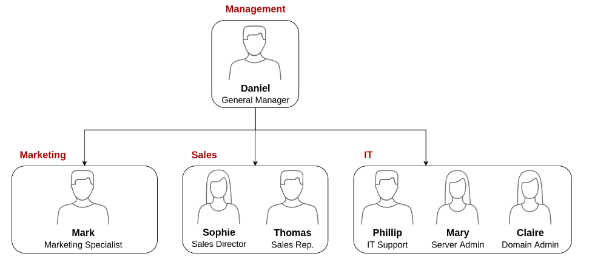

## Xóa các OU và người dùng dư thừa

Điều đầu tiên bạn nên nhận thấy là có một **OU (Organizational Unit)** bổ sung trong cấu hình **AD (Active Directory)** hiện tại của bạn mà không xuất hiện trong sơ đồ tổ chức. Chúng tôi được thông báo rằng bộ phận này đã bị đóng do cắt giảm ngân sách và cần được xóa khỏi miền. Nếu bạn cố nhấp chuột phải và xóa **OU**, bạn sẽ gặp lỗi sau:


> Trong các miền Windows, **Organizational Unit (OU)** đề cập đến các **container** chứa người dùng, nhóm và máy tính mà các chính sách tương tự nên được áp dụng.  
Trong hầu hết các trường hợp, **OU** sẽ tương ứng với các **phòng ban** trong một doanh nghiệp.

Theo mặc định, các **OU** được bảo vệ khỏi việc xóa nhầm. Để xóa **OU**, chúng ta cần kích hoạt **Advanced Features** trong menu **View**.


Điều này sẽ hiển thị cho bạn một số container bổ sung và cho phép bạn tắt tính năng bảo vệ khỏi việc xóa nhầm. Để thực hiện, nhấp chuột phải vào **OU**, chọn **Properties**. Bạn sẽ tìm thấy một hộp kiểm trong tab **Object** để tắt bảo vệ.


Hãy chắc chắn bỏ chọn hộp kiểm và thử xóa lại **OU**. Bạn sẽ được nhắc xác nhận rằng bạn muốn xóa **OU**, và kết quả là, bất kỳ người dùng, nhóm hoặc **OU** nào bên dưới nó cũng sẽ bị xóa.

Sau khi xóa **OU** dư thừa, bạn nên nhận thấy rằng đối với một số phòng ban, người dùng trong **AD** không khớp với những người trong sơ đồ tổ chức của chúng ta. Hãy tạo và xóa người dùng khi cần để khớp với sơ đồ.

## **Ủy quyền (Delegation)**

Một trong những điều hữu ích mà bạn có thể làm trong **AD** là cấp quyền kiểm soát một số **OU** nhất định cho một số người dùng cụ thể. Quá trình này được gọi là **ủy quyền (delegation)** và cho phép bạn cấp quyền đặc biệt để thực hiện các tác vụ nâng cao trên **OU** mà không cần Quản trị viên miền (Domain Administrator) can thiệp.

Một trong những trường hợp sử dụng phổ biến nhất cho điều này là cấp quyền cho nhóm **IT support** để đặt lại mật khẩu của người dùng có quyền hạn thấp hơn. Theo sơ đồ tổ chức của chúng ta, Phillip phụ trách **IT support**, vì vậy có thể chúng ta sẽ muốn ủy quyền kiểm soát việc đặt lại mật khẩu cho các **OU** của bộ phận **Sales, Marketing và Management** cho anh ta.

Trong ví dụ này, chúng ta sẽ ủy quyền kiểm soát **OU Sales** cho Phillip. Để ủy quyền kiểm soát một **OU**, bạn có thể nhấp chuột phải vào nó và chọn **Delegate Control**.


Điều này sẽ mở một cửa sổ mới, nơi bạn sẽ được yêu cầu chọn người dùng mà bạn muốn ủy quyền kiểm soát:

**Lưu ý:** Để tránh nhập sai tên người dùng, hãy nhập **"phillip"** và nhấp vào nút **Check Names**. Windows sẽ tự động hoàn thành tên người dùng cho bạn.


Nhấp vào **OK**, và trong bước tiếp theo, chọn tùy chọn sau:


Nhấp vào **Next** vài lần, và bây giờ Phillip sẽ có thể đặt lại mật khẩu cho bất kỳ người dùng nào trong bộ phận bán hàng. Mặc dù bạn có thể muốn lặp lại các bước này để ủy quyền đặt lại mật khẩu cho các bộ phận Marketing và Quản lý, nhưng chúng ta sẽ dừng lại ở đây cho nhiệm vụ này. Bạn có thể tiếp tục cấu hình phần còn lại của các **OU** nếu muốn.

Bây giờ hãy sử dụng tài khoản của Phillip để thử đặt lại mật khẩu của Sophie. Dưới đây là thông tin đăng nhập của Phillip để bạn đăng nhập qua **RDP**:


**Lưu ý:** Khi kết nối qua **RDP**, sử dụng `THM\phillip` làm tên người dùng để đăng nhập bằng tài khoản **phillip** trên miền **THM**.

Mặc dù bạn có thể muốn mở **Active Directory Users and Computers** để kiểm tra các quyền mới của Phillip, nhưng thực tế anh ta không có đủ quyền để mở nó. Vì vậy, bạn sẽ cần sử dụng phương pháp khác để đặt lại mật khẩu. Trong trường hợp này, chúng ta sẽ sử dụng **Powershell** để thực hiện:

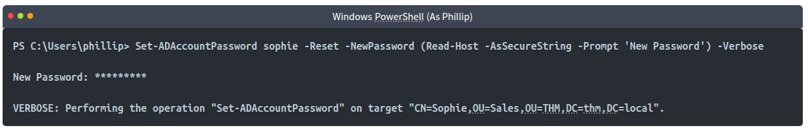

Vì chúng ta không muốn Sophie tiếp tục sử dụng một mật khẩu mà chúng ta biết, nên chúng ta cũng có thể ép buộc đặt lại mật khẩu vào lần đăng nhập tiếp theo bằng lệnh sau:

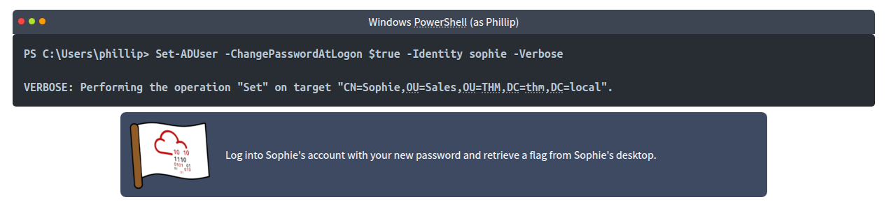

**Lưu ý:** Khi kết nối qua **RDP**, sử dụng **THM\sophie** làm tên người dùng để xác định bạn muốn đăng nhập bằng người dùng **sophie** trên miền **THM**.

https://www.youtube.com/watch?v=C9UaUzrXGXE

# Task 5: Managing Computers in AD

Quản lý Máy tính trong Active Directory (AD)

Theo mặc định, tất cả các máy tham gia vào miền (trừ Domain Controllers - DCs) sẽ được đặt trong một container có tên là "Computers". Nếu chúng ta kiểm tra DC của mình, chúng ta sẽ thấy rằng một số thiết bị đã có sẵn trong đó.


Trong mạng, có thể có các loại thiết bị khác nhau như máy chủ, máy tính xách tay và PC dành cho người dùng. Việc đặt tất cả thiết bị vào cùng một vị trí không phải là ý tưởng tốt, vì bạn có thể muốn áp dụng các chính sách khác nhau cho máy chủ và thiết bị mà người dùng sử dụng hàng ngày.

Một phương pháp tổ chức hợp lý là phân loại thiết bị theo mục đích sử dụng. Thông thường, các thiết bị có thể được chia thành ba danh mục chính:

## 1. Workstations (Máy trạm)
- Đây là loại thiết bị phổ biến nhất trong một miền Active Directory.
- Người dùng miền sẽ đăng nhập vào máy trạm để làm việc hoặc duyệt web.
- Các thiết bị này không nên có tài khoản có quyền cao đăng nhập vào.

## 2. Servers (Máy chủ)
- Máy chủ là loại thiết bị phổ biến thứ hai trong Active Directory.
- Chúng được sử dụng để cung cấp dịch vụ cho người dùng hoặc các máy chủ khác.

## 3. Domain Controllers (Bộ điều khiển miền)
- Đây là loại thiết bị phổ biến thứ ba trong Active Directory.
- Domain Controllers giúp quản lý miền Active Directory.
- Chúng chứa mật khẩu băm của tất cả tài khoản người dùng, khiến chúng trở thành thiết bị nhạy cảm nhất trong hệ thống.

## Tổ chức OUs trong AD
Để sắp xếp AD một cách gọn gàng, chúng ta có thể tạo hai OU (Organizational Units) riêng biệt:
- **Workstations**
- **Servers**

Domain Controllers đã có một OU mặc định do Windows tạo sẵn. Hai OU trên sẽ được tạo trực tiếp dưới **thm.local** trong cấu trúc miền.


**Trả lời các câu hỏi dưới đây**  

1. **Sau khi sắp xếp các máy tính có sẵn, có bao nhiêu máy đã được đưa vào Workstations OU?**  

Tạo một Organizational Unit (OU) trong Active Directory Users and Computers (ADUC).


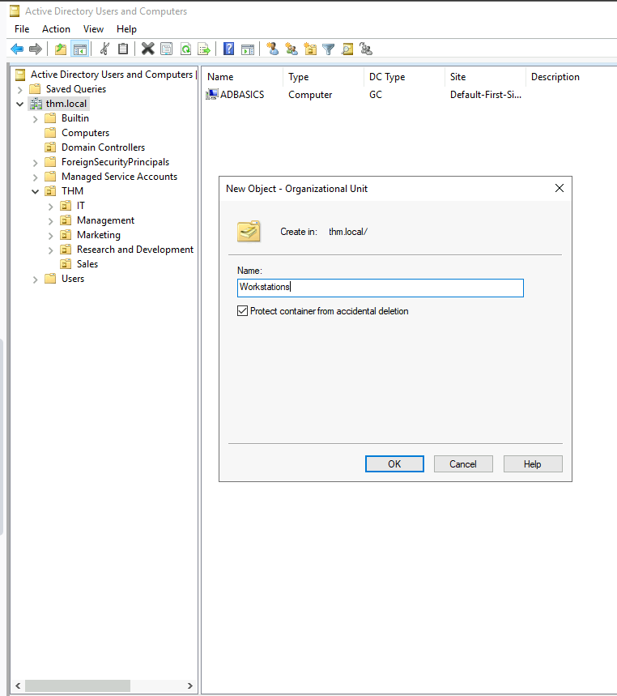

Sau đó chúng ta sẽ di chuyển các máy trạm vào workstations


<details>  
<summary>Hiển thị đáp án</summary>  
Đáp án: 7  
</details>  

2. **Có nên tạo các OU riêng biệt cho Servers và Workstations không? (yay/nay)**  
<details>  
<summary>Hiển thị đáp án</summary>  
Đáp án: yay 
</details>  

# Task 6: Group Policies

Chính sách Nhóm (Group Policies)

Cho đến nay, chúng ta đã tổ chức người dùng và máy tính vào các OU (Organizational Units), nhưng mục đích chính của việc này là để có thể triển khai các chính sách khác nhau cho từng OU một cách riêng biệt. Bằng cách này, chúng ta có thể áp dụng các cấu hình và tiêu chuẩn bảo mật khác nhau cho người dùng tùy theo bộ phận của họ.

Windows quản lý các chính sách này thông qua Group Policy Objects (GPO).
GPO thực chất là một tập hợp các thiết lập có thể áp dụng cho các OU. GPO có thể chứa các chính sách dành cho người dùng hoặc máy tính, giúp thiết lập các tiêu chuẩn trên các thiết bị và danh tính cụ thể.

Để cấu hình GPO, bạn có thể sử dụng công cụ Group Policy Management, có sẵn trong menu Start.


Khi mở công cụ Group Policy Management, điều đầu tiên bạn sẽ thấy là cấu trúc OU đầy đủ của mình, như đã được thiết lập trước đó.

Để cấu hình Group Policies (Chính sách nhóm), trước tiên bạn cần tạo một GPO (Group Policy Object) trong mục Group Policy Objects, sau đó liên kết nó với OU mà bạn muốn áp dụng chính sách.

Ví dụ: bạn có thể thấy rằng trong hệ thống của mình đã có một số GPO được tạo sẵn.

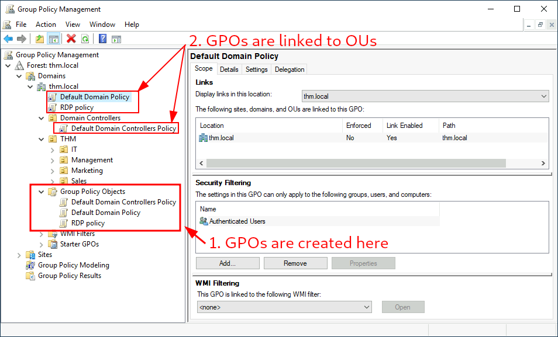

Chúng ta có thể thấy trong hình ảnh trên rằng đã có 3 GPO được tạo. Trong số đó, Default Domain Policy và RDP Policy được liên kết với toàn bộ miền thm.local, còn Default Domain Controllers Policy chỉ được liên kết với OU Domain Controllers.

Một điều quan trọng cần lưu ý là bất kỳ GPO nào được liên kết với một OU sẽ áp dụng cho cả OU đó và tất cả các sub-OU bên dưới nó. Ví dụ, OU Sales vẫn sẽ bị ảnh hưởng bởi Default Domain Policy.

Bây giờ, hãy kiểm tra Default Domain Policy để xem bên trong một GPO có gì. Tab đầu tiên khi bạn chọn một GPO sẽ hiển thị phạm vi (scope), tức là nơi GPO được liên kết trong Active Directory.

Với chính sách hiện tại, chúng ta có thể thấy rằng nó chỉ được liên kết với miền thm.local.


Như bạn có thể thấy, bạn cũng có thể áp dụng Security Filtering (Lọc bảo mật) cho GPO, để chúng chỉ áp dụng cho các người dùng/máy tính cụ thể trong một OU.

Theo mặc định, GPO sẽ áp dụng cho nhóm Authenticated Users, nhóm này bao gồm tất cả người dùng và máy tính.

Tab Settings chứa nội dung thực tế của GPO và cho chúng ta biết các cấu hình cụ thể mà nó áp dụng. Như đã đề cập trước đó, mỗi GPO có thể chứa các cấu hình áp dụng riêng cho máy tính hoặc người dùng.

Trong trường hợp này, Default Domain Policy chỉ chứa các cấu hình dành cho máy tính.


Bạn có thể tự do khám phá GPO và mở rộng các mục có sẵn bằng cách sử dụng các liên kết "show" ở bên phải của từng cấu hình.

Trong trường hợp này, Default Domain Policy chứa các cấu hình cơ bản nhất, thường áp dụng cho hầu hết các miền, bao gồm chính sách mật khẩu và khóa tài khoản.


Vì GPO này áp dụng cho toàn bộ miền, nên bất kỳ thay đổi nào đối với nó sẽ ảnh hưởng đến tất cả các máy tính.

Hãy thay đổi chính sách độ dài mật khẩu tối thiểu, yêu cầu người dùng phải đặt mật khẩu có ít nhất 10 ký tự.

Để thực hiện việc này, chuột phải vào GPO và chọn Edit.


Thao tác này sẽ mở một cửa sổ mới, nơi chúng ta có thể điều hướng và chỉnh sửa tất cả các cấu hình có sẵn.

Để thay đổi độ dài mật khẩu tối thiểu, hãy điều hướng đến:
Computer Configurations → Policies → Windows Setting → Security Settings → Account Policies → Password Policy

Sau đó, thay đổi giá trị chính sách theo yêu cầu.


Như bạn có thể thấy, có rất nhiều chính sách có thể được thiết lập trong một GPO.

Việc giải thích từng chính sách một trong một phiên duy nhất là không khả thi, nhưng bạn có thể tự do khám phá, vì một số chính sách khá dễ hiểu.

Nếu bạn cần thêm thông tin về bất kỳ chính sách nào, bạn có thể nhấp đúp vào chính sách đó và đọc tab Explain để biết chi tiết.


## **Phân phối GPO (GPO distribution)**  

Các **GPO** được phân phối trong mạng thông qua một **network share** có tên là **SYSVOL**, được lưu trữ trên **Domain Controller (DC)**.  
Tất cả người dùng trong miền thường có quyền truy cập vào thư mục chia sẻ này qua mạng để **đồng bộ GPO định kỳ**.  

Thư mục chia sẻ **SYSVOL** theo mặc định trỏ đến thư mục:  
➡ **C:\Windows\SYSVOL\sysvol\** trên mỗi **Domain Controller (DC)** trong mạng.

Sau khi thực hiện bất kỳ thay đổi nào đối với **GPO**, có thể mất **tối đa 2 giờ** để các máy tính cập nhật thay đổi.  

Nếu bạn muốn buộc một máy tính cụ thể **đồng bộ GPO ngay lập tức**, bạn có thể chạy lệnh sau trên máy đó.

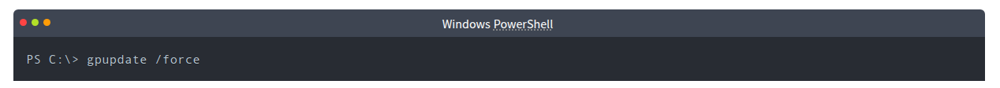


## **Tạo một số GPO cho THM Inc.**  

Trong công việc mới của chúng ta, chúng ta được giao nhiệm vụ triển khai một số **GPO** để thực hiện các yêu cầu sau:  

1. Chặn những người không thuộc bộ phận IT truy cập **Control Panel**.  
2. Cấu hình **máy trạm và máy chủ tự động khóa màn hình sau 5 phút không hoạt động**, tránh trường hợp người dùng để lộ phiên làm việc của họ.  

Bây giờ, chúng ta sẽ tập trung vào từng mục trên, xác định các **chính sách cần kích hoạt trong mỗi GPO** và nơi chúng nên được liên kết.

---

## **Hạn chế truy cập Control Panel**  

Chúng ta muốn **hạn chế quyền truy cập Control Panel trên tất cả các máy tính**, chỉ cho phép những người thuộc bộ phận IT sử dụng. Người dùng thuộc các bộ phận khác không được phép thay đổi cài đặt hệ thống.

Hãy tạo một **GPO mới** có tên **Restrict Control Panel Access** và mở nó để chỉnh sửa.  
Vì GPO này áp dụng cho **người dùng cụ thể**, chúng ta sẽ tìm trong phần **User Configuration** để thiết lập chính sách phù hợp.


Hãy lưu ý rằng chúng ta đã kích hoạt chính sách Prohibit Access to Control Panel and PC settings (Cấm truy cập vào Control Panel và cài đặt máy tính).

Sau khi GPO được cấu hình, chúng ta cần liên kết nó với tất cả các OU chứa những người dùng không nên có quyền truy cập vào Control Panel trên máy tính của họ.

Trong trường hợp này, chúng ta sẽ liên kết GPO với các OU Marketing, Management và Sales bằng cách kéo và thả GPO vào từng OU đó.

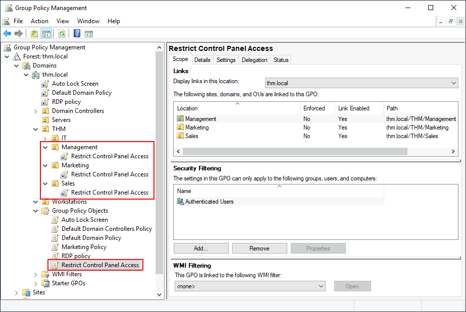


## **GPO Khóa Màn Hình Tự Động (Auto Lock Screen GPO)**  

Đối với **GPO đầu tiên**, liên quan đến việc **khóa màn hình** cho **máy trạm (workstations) và máy chủ (servers)**, chúng ta có thể **áp dụng trực tiếp** GPO này cho các **OU Workstations, Servers và Domain Controllers** mà chúng ta đã tạo trước đó.

Mặc dù giải pháp này có thể hoạt động, nhưng một **cách tiếp cận thay thế** là **áp dụng GPO này cho miền gốc**. Vì chúng ta muốn GPO ảnh hưởng đến **tất cả các máy tính**, và vì các OU **Workstations, Servers và Domain Controllers** đều là **OU con** của miền gốc, chúng sẽ kế thừa các chính sách của miền.

**Lưu ý:**  

Nếu chúng ta áp dụng **GPO này** cho miền gốc, nó cũng sẽ được **kế thừa bởi các OU khác** như **Sales hoặc Marketing**. Tuy nhiên, vì những OU này **chỉ chứa người dùng**, bất kỳ **cấu hình dành cho máy tính** trong GPO của chúng ta sẽ bị **bỏ qua** bởi chúng.

Bây giờ, hãy tạo một **GPO mới** có tên **Auto Lock Screen** và chỉnh sửa nó.  
Chính sách chúng ta cần thiết lập được tìm thấy theo đường dẫn sau:


Sau khi các GPO đã được áp dụng cho các OU phù hợp, chúng ta có thể đăng nhập với tư cách bất kỳ người dùng nào trong Marketing, Sales hoặc Management để kiểm tra.

Đối với nhiệm vụ này, hãy kết nối qua RDP bằng thông tin đăng nhập của Mark để xác minh.

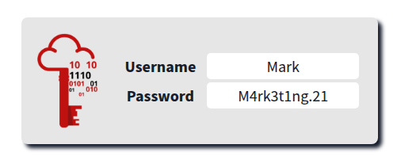


**Lưu ý:**  

Khi kết nối qua **RDP**, sử dụng **THM\Mark** làm tên người dùng để đăng nhập với tài khoản **Mark** trong miền **THM**.  

Nếu chúng ta thử mở **Control Panel**, một thông báo sẽ xuất hiện, cho biết thao tác này bị quản trị viên từ chối. Bạn cũng có thể đợi **5 phút** để kiểm tra xem màn hình có tự động khóa hay không.  

Vì chúng ta **không áp dụng GPO hạn chế Control Panel cho bộ phận IT**, bạn vẫn có thể đăng nhập vào máy với tư cách bất kỳ người dùng nào trong nhóm này và truy cập **Control Panel** bình thường.  

 **Lưu ý:**  

Nếu bạn đã **tạo và liên kết các GPO**, nhưng vì lý do nào đó chúng vẫn không hoạt động, hãy chạy lệnh sau để **cưỡng chế cập nhật GPO**:  
```powershell
gpupdate /force
```

**Trả lời các câu hỏi dưới đây**  

1. **Tên của thư mục chia sẻ mạng được sử dụng để phân phối GPOs đến các máy trong miền là gì?**  

Tên của **thư mục chia sẻ mạng** được sử dụng để **phân phối GPOs** đến các máy trong miền là **SYSVOL**.  

SYSVOL là một **thư mục chia sẻ** trên mỗi **Domain Controller (DC)**, nơi chứa các **chính sách nhóm (GPOs)** và các tập tin quan trọng khác mà **máy tính trong miền** sử dụng để đồng bộ hóa chính sách.  

Thư mục này có đường dẫn mặc định trên DC:  
➡ **C:\Windows\SYSVOL\sysvol\\[tên miền]**  


<details>  
<summary>Hiển thị đáp án</summary>  
Đáp án: SYSVOL  
</details>  

2. **GPO có thể được sử dụng để áp dụng cài đặt cho người dùng và máy tính không? (yay/nay)**  
<details>  
<summary>Hiển thị đáp án</summary>  
Đáp án: yay  
</details>  

**GPO (Group Policy Object)** có thể được sử dụng để áp dụng **cài đặt cho cả người dùng và máy tính** trong miền.  

 **Cấu trúc của GPO:**

GPO có **hai phần chính** trong **Group Policy Management Editor**:
1. **Computer Configuration** 🖥️  
   - Áp dụng cho **máy tính**, bất kể người dùng nào đăng nhập.  
   - Các cài đặt phổ biến bao gồm:
     - Chính sách bảo mật (mật khẩu, khóa màn hình, tường lửa)
     - Cấu hình mạng (DNS, Proxy, Wi-Fi)
     - Cài đặt phần mềm (triển khai ứng dụng, chặn ứng dụng)
     - Script khởi động/tắt máy

2. **User Configuration** 👤  
   - Áp dụng cho **người dùng**, bất kể họ đăng nhập vào máy nào.  
   - Các cài đặt phổ biến bao gồm:
     - Hạn chế truy cập Control Panel
     - Cấu hình Desktop (hình nền, màn hình chờ)
     - Mô tả menu Start và Taskbar
     - Script đăng nhập/đăng xuất  

 **Khi nào nên sử dụng từng loại?**

✅ **Computer Configuration:** Khi bạn muốn kiểm soát **toàn bộ máy tính** (áp dụng cho mọi người dùng đăng nhập).  
✅ **User Configuration:** Khi bạn muốn kiểm soát **trải nghiệm của người dùng** (áp dụng trên bất kỳ máy nào họ đăng nhập).  


# Task 7: Authentication Methods

**Phương thức Xác thực**  

Khi sử dụng miền Windows, tất cả thông tin xác thực được lưu trữ trong Domain Controllers. Bất cứ khi nào một người dùng cố gắng xác thực vào một dịch vụ bằng thông tin đăng nhập miền, dịch vụ sẽ cần hỏi Domain Controller để xác minh xem thông tin đó có đúng không. Có hai giao thức có thể được sử dụng để xác thực mạng trong miền Windows:  

- **Kerberos**: Được sử dụng bởi bất kỳ phiên bản Windows nào gần đây. Đây là giao thức mặc định trong bất kỳ miền hiện đại nào.  
- **NetNTLM**: Giao thức xác thực cũ, được giữ lại vì mục đích tương thích.  

Mặc dù NetNTLM được coi là lỗi thời, hầu hết các mạng sẽ có cả hai giao thức được bật. Hãy xem xét kỹ hơn cách từng giao thức này hoạt động.  

---

## **Xác thực Kerberos**  

Xác thực **Kerberos** là giao thức xác thực mặc định trong bất kỳ phiên bản Windows nào gần đây. Người dùng đăng nhập vào một dịch vụ bằng Kerberos sẽ được cấp vé (ticket). Hãy coi vé như bằng chứng của một lần xác thực trước đó. Người dùng có thể trình vé cho một dịch vụ để chứng minh rằng họ đã được xác thực vào mạng trước đó và do đó được phép sử dụng nó.  

Khi **Kerberos** được sử dụng để xác thực, quá trình sau diễn ra:  

1. Người dùng gửi tên đăng nhập của họ và một dấu thời gian được mã hóa bằng khóa dẫn xuất từ mật khẩu của họ đến **Key Distribution Center (KDC)**, một dịch vụ thường được cài đặt trên Domain Controller, chịu trách nhiệm tạo vé Kerberos trong mạng.  

   **KDC** sẽ tạo và gửi lại một **Ticket Granting Ticket (TGT)**, cho phép người dùng yêu cầu các vé bổ sung để truy cập các dịch vụ cụ thể.  

   Việc yêu cầu vé có thể nghe có vẻ rườm rà, nhưng nó cho phép người dùng yêu cầu vé dịch vụ mà không cần gửi lại thông tin đăng nhập của họ mỗi lần muốn kết nối với một dịch vụ. Cùng với **TGT**, một **Session Key** sẽ được cung cấp cho người dùng, khóa này cần thiết để tạo các yêu cầu tiếp theo.  

   Hãy lưu ý rằng **TGT** được mã hóa bằng **mật khẩu băm của tài khoản krbtgt**, và do đó **người dùng không thể truy cập nội dung của nó**. Điều quan trọng cần biết là **TGT được mã hóa** chứa một bản sao của **Session Key** như một phần của nội dung của nó, và **KDC không cần lưu trữ Session Key**, vì nó có thể khôi phục một bản sao bằng cách giải mã **TGT** nếu cần.


2. Khi một người dùng muốn kết nối đến một dịch vụ trên mạng như một thư mục chia sẻ, trang web hoặc cơ sở dữ liệu, họ sẽ sử dụng **TGT** để yêu cầu **KDC** cấp **Ticket Granting Service (TGS)**. **TGS** là các vé cho phép kết nối chỉ đến dịch vụ cụ thể mà chúng được tạo ra.  

   Để yêu cầu **TGS**, người dùng sẽ gửi tên người dùng và một dấu thời gian được mã hóa bằng **Session Key**, cùng với **TGT** và một **Service Principal Name (SPN)**, cho biết dịch vụ và tên máy chủ mà họ muốn truy cập.  

Kết quả là, **KDC sẽ gửi lại một TGS kèm theo một Service Session Key**, mà chúng ta sẽ cần để xác thực với dịch vụ mong muốn. **TGS** được mã hóa bằng một khóa được tạo từ **Service Owner Hash**.  

**Service Owner** là tài khoản người dùng hoặc tài khoản máy tính mà dịch vụ đang chạy dưới quyền của nó. **TGS chứa một bản sao của Service Session Key** trong nội dung đã mã hóa, để **Service Owner có thể truy cập bằng cách giải mã TGS**.


3. Sau đó, **TGS** có thể được gửi đến dịch vụ mong muốn để xác thực và thiết lập kết nối. Dịch vụ sẽ sử dụng **mật khẩu băm của tài khoản được cấu hình** để giải mã **TGS** và xác thực **Service Session Key**.

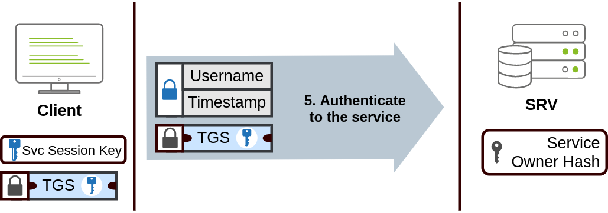

## **Xác thực NetNTLM**  

**NetNTLM** hoạt động bằng cách sử dụng **cơ chế thử thách - phản hồi (challenge-response)**. Toàn bộ quá trình diễn ra như sau:

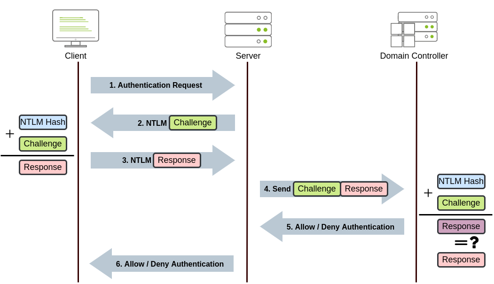


**NetNTLM** hoạt động dựa trên **cơ chế thử thách - phản hồi (challenge-response)** để xác thực người dùng mà không cần gửi mật khẩu qua mạng. Quy trình xác thực diễn ra như sau:

---

### **1️⃣ Bước 1: Client gửi yêu cầu xác thực**  
- Người dùng muốn truy cập một **máy chủ hoặc dịch vụ** trên mạng.  
- **Client** (máy của người dùng) gửi một yêu cầu xác thực đến **Server**.

---

### **2️⃣ Bước 2: Server tạo thử thách (Challenge)**  
- Máy **Server** tạo ra một **số ngẫu nhiên (nonce)** và gửi nó như một thử thách (Challenge) đến **Client**.  
- Mục đích của Challenge này là đảm bảo rằng người dùng thực sự sở hữu thông tin xác thực hợp lệ.

---

### **3️⃣ Bước 3: Client phản hồi (Response)**  
- **Client** kết hợp **NTLM Hash (băm mật khẩu của người dùng)** với **Challenge** vừa nhận từ **Server**.  
- Sử dụng thông tin này, **Client** tạo một **Response (phản hồi)** và gửi lại cho **Server**.  
- **Lưu ý:** Mật khẩu thực của người dùng **không bao giờ được gửi qua mạng**, thay vào đó chỉ có **Response** dựa trên mật khẩu băm được gửi đi.

---

### **4️⃣ Bước 4: Server chuyển Response đến Domain Controller để xác minh**  
- **Server** gửi **Challenge** và **Response** của Client đến **Domain Controller (DC)** để xác thực.  
- **DC** có bản sao **NTLM Hash của mật khẩu người dùng**, được lưu trữ trong **SAM (Security Account Manager)** hoặc **Active Directory**.

---

### **5️⃣ Bước 5: Domain Controller kiểm tra Response**  
- **Domain Controller** sử dụng **NTLM Hash** đã lưu để **tạo lại Response** từ **Challenge**.  
- Sau đó, **DC so sánh Response được tạo ra với Response do Client gửi đến**.  
  - Nếu **Response khớp**, xác thực **thành công**.  
  - Nếu **Response không khớp**, xác thực **bị từ chối**.  
- Kết quả xác thực (thành công hoặc thất bại) được gửi lại **Server**.

---

### **6️⃣ Bước 6: Server gửi kết quả cho Client**  
- Máy **Server** nhận kết quả từ **Domain Controller** và gửi phản hồi về **Client**.  
  - Nếu xác thực thành công, **Client được cấp quyền truy cập vào dịch vụ**.  
  - Nếu thất bại, **Client bị từ chối truy cập**.

---

## **🔥 Tóm tắt quan trọng về NetNTLM**
✅ **Bảo mật mật khẩu:** Mật khẩu thực của người dùng **không bao giờ được truyền qua mạng**, thay vào đó chỉ có phản hồi băm được gửi.  
✅ **Cơ chế Challenge-Response:** Mỗi lần xác thực, **Challenge ngẫu nhiên** được tạo để **ngăn chặn tấn công phát lại (Replay Attack)**.  
✅ **Domain Controller đóng vai trò xác thực:** Server không thể tự xác thực mà phải gửi Response đến **DC để kiểm tra**.  
✅ **Tài khoản cục bộ không cần DC:** Nếu người dùng sử dụng **tài khoản cục bộ**, máy chủ có thể xác thực **mà không cần kết nối với DC**, vì **NTLM Hash** của tài khoản đó đã được lưu trữ trong **SAM** của chính máy chủ.

---

### **📌 Hạn chế của NetNTLM**
⚠ **Dễ bị tấn công Pass-the-Hash (PtH):** Nếu kẻ tấn công đánh cắp **NTLM Hash**, chúng có thể sử dụng nó để xác thực mà **không cần biết mật khẩu thực**.  
⚠ **Không hỗ trợ xác thực đa yếu tố (MFA):** NetNTLM **chỉ dựa trên mật khẩu**, không hỗ trợ các phương thức xác thực mạnh hơn như **MFA**.  
⚠ **Dễ bị tấn công Relay Attack:** Nếu không sử dụng **SMB Signing** hoặc các cơ chế bảo mật bổ sung, kẻ tấn công có thể chặn Challenge và Response để thực hiện tấn công **NTLM Relay**.  

---

## **🔍 So sánh NetNTLM và Kerberos**
| **Tiêu chí**       | **NetNTLM** | **Kerberos** |
|-------------------|------------|-------------|
| **Phương thức xác thực** | Challenge-Response | Ticket-based |
| **Truyền mật khẩu** | Không, chỉ gửi phản hồi băm | Không, sử dụng vé (ticket) |
| **Cần Domain Controller** | Có (với tài khoản miền) | Có |
| **Bảo mật** | Thấp, dễ bị tấn công PtH và Relay | Cao hơn, hỗ trợ mã hóa mạnh |
| **Hỗ trợ MFA** | Không | Có |
| **Hiệu suất** | Chậm hơn do nhiều bước Challenge-Response | Nhanh hơn do sử dụng Ticket |

---

### **🔥 Kết luận**
- **NetNTLM** là giao thức xác thực **lỗi thời**, chủ yếu được sử dụng để duy trì **tương thích ngược** với hệ thống cũ.  
- **Kerberos** là phương thức **mạnh hơn, an toàn hơn**, được khuyến nghị sử dụng trong **các môi trường hiện đại**.  
- **NetNTLM chỉ nên được sử dụng khi bắt buộc phải hỗ trợ các hệ thống không tương thích với Kerberos**.  

---

**Trả lời các câu hỏi dưới đây**  

1. **Phiên bản Windows hiện tại có sử dụng NetNTLM làm giao thức xác thực mặc định không? (yay/nay)**  
<details>  
<summary>Hiển thị đáp án</summary>  
Đáp án: nay  
</details>  

Phiên bản Windows hiện tại **không sử dụng NetNTLM làm giao thức xác thực mặc định**.  

 **✅ Giao thức xác thực mặc định trên Windows hiện tại**  
Microsoft sử dụng **Kerberos** làm **giao thức xác thực mặc định** cho tất cả các phiên bản Windows hiện đại khi thiết bị tham gia vào **miền Active Directory (AD)**.  

- **Kerberos** được sử dụng cho hầu hết các kịch bản xác thực trong **Windows Domain**.  
- **NetNTLM** (NTLMv1 & NTLMv2) vẫn tồn tại nhưng **chỉ để tương thích ngược** với các hệ thống cũ.  

---

 **🛑 Khi nào Windows vẫn sử dụng NetNTLM?**  
Windows **chỉ sử dụng NetNTLM (NTLM)** nếu **Kerberos không thể được sử dụng**. Một số tình huống bao gồm:  

1️⃣ **Máy tính không thuộc miền AD**  
   - Nếu máy tính không tham gia vào miền, nó sẽ không có **KDC (Key Distribution Center)** để sử dụng Kerberos.  
   - Khi đó, Windows sẽ mặc định sử dụng **NTLM** để xác thực.  

2️⃣ **Máy chủ hoặc dịch vụ không hỗ trợ Kerberos**  
   - Một số dịch vụ hoặc ứng dụng cũ **chỉ hỗ trợ NTLM**.  
   - Trong trường hợp này, Windows buộc phải sử dụng **NTLM** thay vì **Kerberos**.  

3️⃣ **Xác thực qua IP thay vì DNS tên miền**  
   - Kerberos yêu cầu **DNS tên miền** để xác định danh tính dịch vụ (**SPN - Service Principal Name**).  
   - Nếu người dùng kết nối đến máy chủ bằng **địa chỉ IP thay vì tên miền**, Kerberos **sẽ không thể hoạt động** và Windows sẽ chuyển sang **NTLM**.  

4️⃣ **Không có kết nối trực tiếp đến Domain Controller**  
   - Kerberos yêu cầu liên hệ với **Domain Controller (DC)** để lấy vé (ticket).  
   - Nếu máy khách không thể liên hệ với DC (ví dụ: làm việc từ xa không có VPN), Windows sẽ **fallback** sang **NTLM**.  

---

 **🛠 Cách kiểm tra hệ thống có đang sử dụng NTLM không?**  
Bạn có thể kiểm tra xem hệ thống có đang sử dụng NTLM bằng cách:  

🔹 **Kiểm tra các xác thực NTLM đang diễn ra trên máy tính**  
Mở **Event Viewer** và kiểm tra nhật ký:  
1. **Mở Event Viewer** (`eventvwr.msc`)  
2. Điều hướng đến:  
   ```
   Applications and Services Logs → Microsoft → Windows → NTLM → Operational
   ```
3. Bật **Logging** để theo dõi xem hệ thống có đang sử dụng NTLM hay không.  

🔹 **Dùng PowerShell để kiểm tra NTLM**  
Chạy lệnh sau để kiểm tra chính sách NTLM trên hệ thống:  
```powershell
Get-WmiObject -namespace root\Microsoft\Windows\Lsa -class MS_NTLM_Provider
```

---

 **🛡 Cách vô hiệu hóa NTLM để tăng cường bảo mật**  
Microsoft khuyến nghị **tắt NTLM** nếu không cần thiết, để tránh các lỗ hổng bảo mật như **Pass-the-Hash (PtH) Attack** và **NTLM Relay Attack**.  

✅ **Tắt NTLM thông qua Group Policy:**  
1. Mở **Group Policy Management Editor** (`gpedit.msc` nếu dùng máy độc lập hoặc `gpmc.msc` nếu dùng Domain Controller).  
2. Điều hướng đến:  
   ```
   Computer Configuration → Windows Settings → Security Settings → Local Policies → Security Options
   ```
3. Tìm và đặt các chính sách sau về **Deny all accounts**:  
   - **Network security: LAN Manager authentication level** → Chọn **Send NTLMv2 response only. Refuse LM & NTLM**  
   - **Network security: Restrict NTLM: Incoming NTLM traffic** → **Deny all accounts**  
   - **Network security: Restrict NTLM: Outgoing NTLM traffic** → **Deny all accounts**  

---


2. **Khi nói về Kerberos, loại vé nào cho phép chúng ta yêu cầu các vé khác, được gọi là TGS?**  
<details>  
<summary>Hiển thị đáp án</summary>  
Đáp án: Ticket Granting Ticket
</details>  

Trong Kerberos, loại vé cho phép chúng ta yêu cầu các vé khác (TGS - Ticket Granting Service) được gọi là TGT (Ticket Granting Ticket).

📌 TGT - Ticket Granting Ticket
TGT là vé cấp quyền truy cập vào hệ thống vé (TGS) mà không cần nhập lại thông tin đăng nhập.
Khi người dùng đăng nhập vào hệ thống, Key Distribution Center (KDC) cấp cho họ một TGT.
TGT được sử dụng để yêu cầu các vé dịch vụ (TGS) cho các dịch vụ cụ thể trên mạng mà không cần xác thực lại với mật khẩu.
🔍 Cách hoạt động của TGT trong Kerberos
1️⃣ Người dùng gửi tên đăng nhập và dấu thời gian được mã hóa bằng mật khẩu băm của họ đến KDC.
2️⃣ KDC kiểm tra thông tin đăng nhập, nếu đúng, cấp phát một TGT cho người dùng.
3️⃣ Người dùng có thể sử dụng TGT để yêu cầu TGS khi họ muốn truy cập một dịch vụ trên mạng (như chia sẻ tệp, cơ sở dữ liệu...).
4️⃣ KDC sử dụng TGT để xác thực yêu cầu, nếu hợp lệ, nó cấp TGS để người dùng có thể truy cập dịch vụ.

3. **Khi sử dụng NetNTLM, mật khẩu của người dùng có được truyền qua mạng tại bất kỳ thời điểm nào không? (yay/nay)**  
<details>  
<summary>Hiển thị đáp án</summary>  
Đáp án: nay  
</details>  

 mật khẩu của người dùng không bao giờ được truyền qua mạng khi sử dụng NetNTLM.

🔍 Cách NetNTLM bảo vệ mật khẩu
NetNTLM sử dụng cơ chế Challenge-Response để xác thực mà không gửi mật khẩu thô qua mạng. Thay vào đó, nó hoạt động như sau:

1️⃣ Máy chủ gửi một "challenge" (số ngẫu nhiên) đến client
2️⃣ Client sử dụng NTLM Hash của mật khẩu, kết hợp với challenge để tạo ra response (phản hồi)
3️⃣ Response được gửi đến máy chủ, máy chủ chuyển nó đến Domain Controller (DC) để xác minh
4️⃣ DC tính toán lại response dựa trên NTLM Hash đã lưu, nếu khớp thì xác thực thành công

📌 Điểm quan trọng:

Chỉ có NTLM Hash của mật khẩu được sử dụng để tạo response
Mật khẩu thực tế không bao giờ được gửi trực tiếp qua mạng
Mật khẩu hoặc NTLM Hash không bao giờ hiển thị dưới dạng văn bản thuần túy
⚠ Nhưng NetNTLM vẫn có rủi ro bảo mật!
Mặc dù mật khẩu không được truyền qua mạng, NetNTLM vẫn dễ bị tấn công Pass-the-Hash (PtH) và NTLM Relay nếu NTLM Hash của người dùng bị đánh cắp.

🚨 Tấn công Pass-the-Hash (PtH):

Nếu kẻ tấn công có được NTLM Hash, chúng có thể sử dụng nó để xác thực thay vì cần mật khẩu thực tế.
🚨 Tấn công NTLM Relay:

Kẻ tấn công chặn Challenge và Response rồi phát lại để xác thực với một dịch vụ khác mà không cần biết mật khẩu.

# Task 8: Trees, Forests and Trusts

Cây, Rừng và Mối Quan Hệ Tin Cậy

Cho đến nay, chúng ta đã thảo luận về cách quản lý một miền đơn lẻ, vai trò của Domain Controller và cách nó kết nối máy tính, máy chủ và người dùng.

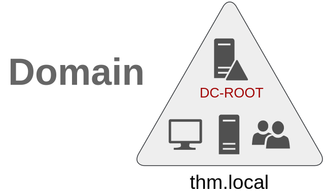

Khi các công ty phát triển, mạng của họ cũng vậy. Việc có một miền duy nhất cho một công ty là đủ để bắt đầu, nhưng theo thời gian, một số nhu cầu bổ sung có thể khiến bạn phải có nhiều hơn một miền.  

## **Cây (Trees)**  

Hãy tưởng tượng công ty của bạn mở rộng sang một quốc gia mới. Quốc gia mới có các luật và quy định khác nhau, yêu cầu bạn cập nhật GPO để tuân thủ. Ngoài ra, bạn có đội ngũ IT ở cả hai quốc gia và mỗi nhóm IT cần quản lý các tài nguyên riêng mà không ảnh hưởng đến nhóm còn lại.  

Mặc dù bạn có thể tạo một cấu trúc **OU** phức tạp và sử dụng ủy quyền để đạt được điều này, nhưng việc có một **cấu trúc Active Directory (AD) quá lớn có thể khó quản lý và dễ xảy ra lỗi.**  

May mắn thay, Active Directory hỗ trợ tích hợp nhiều miền để bạn có thể phân vùng mạng thành các đơn vị có thể quản lý độc lập. Nếu bạn có hai miền **chia sẻ cùng một không gian tên** (**thm.local** trong ví dụ này), các miền đó có thể được **kết hợp thành một cây (Tree)**.  

Nếu miền **thm.local** của bạn được chia thành hai miền con cho các chi nhánh ở **Anh và Mỹ**, bạn có thể tạo một **cây** với miền gốc là **thm.local** và hai miền con **uk.thm.local** và **us.thm.local**, mỗi miền có **Active Directory, máy tính và người dùng riêng**.


Cấu trúc phân vùng này giúp chúng ta kiểm soát tốt hơn ai có quyền truy cập vào đâu trong miền. Nhóm IT từ Vương quốc Anh sẽ có **DC** riêng để quản lý các tài nguyên của Vương quốc Anh. Ví dụ, một người dùng ở Vương quốc Anh sẽ không thể quản lý người dùng ở Mỹ. Theo cách đó, **Domain Administrators** của mỗi chi nhánh sẽ có **toàn quyền kiểm soát DC của họ**, nhưng không phải DC của các chi nhánh khác. Các chính sách cũng có thể được cấu hình **độc lập** cho từng miền trong cây.  

Một nhóm bảo mật mới cần được giới thiệu khi nói về **trees và forests**. Nhóm **Enterprise Admins** sẽ cấp cho người dùng quyền **quản trị trên tất cả các miền trong doanh nghiệp**. Mỗi miền vẫn sẽ có **Domain Admins** với quyền quản trị trên miền riêng lẻ của họ, và **Enterprise Admins** có thể kiểm soát mọi thứ trong toàn bộ doanh nghiệp.  

## **Forests**  

Các miền mà bạn quản lý cũng có thể được cấu hình trong **các không gian tên khác nhau**. Giả sử công ty của bạn tiếp tục phát triển và cuối cùng mua lại một công ty khác có tên là **MHT Inc.**. Khi cả hai công ty hợp nhất, bạn có thể có **các cây miền khác nhau** cho từng công ty, mỗi công ty được quản lý bởi **phòng IT riêng** của họ.  

Sự kết hợp của **nhiều cây miền với các không gian tên khác nhau** trong cùng một mạng được gọi là **forest**.


## **Trust Relationships**  

Việc tổ chức nhiều miền thành **trees và forests** giúp bạn có một mạng được phân vùng hợp lý về mặt **quản lý và tài nguyên**. Nhưng vào một thời điểm nào đó, một người dùng tại **THM UK** có thể cần truy cập một tệp chia sẻ trên một trong các máy chủ của **MHT ASIA**.  

Để điều này có thể xảy ra, các miền được sắp xếp trong **trees và forests** được kết nối với nhau thông qua **trust relationships**.  

Nói một cách đơn giản, việc có một **mối quan hệ tin cậy (trust relationship) giữa các miền** cho phép bạn **ủy quyền cho một người dùng từ miền THM UK để truy cập tài nguyên từ miền MHT EU**.  

Mối quan hệ tin cậy đơn giản nhất có thể được thiết lập là **one-way trust relationship**.  

Trong **one-way trust**, nếu **Domain AAA** tin cậy **Domain BBB**, điều này có nghĩa là một **người dùng trên BBB có thể được ủy quyền để truy cập tài nguyên trên AAA**.

Hướng của **one-way trust relationship** ngược với hướng truy cập tài nguyên.  

**Two-way trust relationships** cũng có thể được thiết lập để cho phép cả hai miền **ủy quyền truy cập lẫn nhau**. Theo mặc định, khi nhiều miền được tham gia vào một **tree hoặc forest**, chúng sẽ hình thành một **two-way trust relationship**.  

Điều quan trọng cần lưu ý là **việc có một trust relationship giữa các miền không tự động cấp quyền truy cập vào tất cả tài nguyên** của các miền khác. Khi mối quan hệ tin cậy được thiết lập, bạn có thể **ủy quyền cho người dùng trên các miền khác nhau**, nhưng việc **cấp quyền cụ thể cho tài nguyên nào là tùy thuộc vào bạn**.


**Trả lời các câu hỏi dưới đây**  

1. **Một nhóm các miền Windows chia sẻ cùng một không gian tên được gọi là gì?**  
<details>  
<summary>Hiển thị đáp án</summary>  
Đáp án: Tree  
</details>  

✅ Một nhóm các miền Windows **chia sẻ cùng một không gian tên (namespace)** được gọi là **Tree (Cây)** trong **Active Directory**.  

---

### **📌 Giải thích về Tree trong Active Directory**
- **Tree** là tập hợp **các miền con (child domains) được tổ chức theo hệ thống phân cấp**.  
- Tất cả các miền trong **Tree** **chia sẻ cùng một không gian tên DNS (namespace)**.  
- **Miền con kế thừa không gian tên từ miền gốc**, ví dụ:  
  - **thm.local** (miền gốc)  
  - **uk.thm.local** (miền con của thm.local)  
  - **us.thm.local** (miền con của thm.local)  

🔥 **Mỗi miền trong cây có thể có Active Directory riêng**, nhưng chúng **tự động thiết lập quan hệ tin cậy hai chiều (Two-Way Trust) với nhau**.  

---

### **🌳 Khác biệt giữa Tree và Forest**
| **Đặc điểm**        | **Tree**                                   | **Forest**                                   |
|---------------------|-----------------------------------------|----------------------------------------------|
| **Không gian tên**  | Chung một không gian tên (namespace)   | Các miền có không gian tên khác nhau       |
| **Ví dụ**          | `thm.local`, `uk.thm.local`             | `thm.local` và `mht.com`                   |
| **Quan hệ tin cậy**| Two-Way Trust giữa các miền con        | Trust giữa nhiều cây miền khác nhau        |
| **Mục đích**       | Tổ chức các miền có cùng namespace     | Kết hợp nhiều công ty hoặc tổ chức khác nhau |

---

### **📌 Kết luận**
✔ **Tree** là một nhóm **các miền Windows chia sẻ cùng một không gian tên** và có **mối quan hệ tin cậy hai chiều** trong Active Directory.  


2. **Cần cấu hình gì giữa hai miền để một người dùng trong Domain A có thể truy cập tài nguyên trong Domain B?**  
<details>  
<summary>Hiển thị đáp án</summary>  
Đáp án: A Trust Relationship
</details>  

✅ **Cần cấu hình một Trust Relationship giữa Domain A và Domain B** để người dùng trong **Domain A có thể truy cập tài nguyên trong Domain B**.  

---

 **📌 Các bước cấu hình Trust Relationship giữa hai miền**
1️⃣ **Xác định loại Trust phù hợp**  
   - **One-Way Trust**: Domain A tin cậy Domain B → Người dùng từ **Domain B có thể truy cập tài nguyên trong Domain A**, nhưng không ngược lại.  
   - **Two-Way Trust**: Domain A và Domain B tin cậy lẫn nhau → Người dùng từ **cả hai miền có thể truy cập tài nguyên của nhau**.  

2️⃣ **Mở Active Directory Domains and Trusts**  
   - Trên **Domain Controller**, mở **Active Directory Domains and Trusts** (`domain.msc`).  
   - Nhấp chuột phải vào **Domain A**, chọn **Properties** → Chuyển đến tab **Trusts**.  

3️⃣ **Thiết lập Trust Relationship**  
   - Nhấp vào **New Trust** và làm theo trình hướng dẫn.  
   - Chọn loại Trust phù hợp (**One-Way hoặc Two-Way**).  
   - Chọn kiểu xác thực:
     - **Forest Trust**: Nếu Domain A và Domain B nằm trong các Forest khác nhau.  
     - **External Trust**: Nếu Domain B không phải là một phần của cùng một Forest.  

4️⃣ **Cấu hình quyền trên tài nguyên của Domain B**  
   - Trên **Domain B**, gán quyền cho **người dùng hoặc nhóm từ Domain A** bằng cách:  
     - Thêm tài khoản từ **Domain A** vào **Group có quyền truy cập tài nguyên**.  
     - **Gán quyền NTFS** trên thư mục chia sẻ hoặc tài nguyên mong muốn.  

5️⃣ **Kiểm tra xác thực**  
   - **Từ Domain A**, đăng nhập bằng tài khoản đã được cấp quyền.  
   - Thử truy cập tài nguyên từ Domain B (`\\ServerB\SharedFolder`).  

---

 **📌 Kết luận**
✔ **Cần thiết lập Trust Relationship giữa Domain A và Domain B** để cấp quyền truy cập.  
✔ **Phải gán quyền trên tài nguyên của Domain B** để người dùng từ Domain A có thể truy cập.  
✔ **Có thể chọn One-Way hoặc Two-Way Trust tùy theo yêu cầu bảo mật**.  

# Task 9: Conclusion 

Trong phòng này, chúng ta đã trình bày các thành phần và khái niệm cơ bản liên quan đến **Active Directory và Windows Domains**. Hãy nhớ rằng phòng này chỉ đóng vai trò là một phần **giới thiệu** về các khái niệm cơ bản, vì vẫn còn rất nhiều điều cần khám phá để triển khai **một môi trường Active Directory sẵn sàng cho sản xuất**.  

Nếu bạn quan tâm đến việc **bảo mật hệ thống Active Directory**, hãy theo dõi **Active Directory Hardening Room** (sẽ sớm ra mắt).  

Mặt khác, nếu bạn muốn tìm hiểu cách **kẻ tấn công lợi dụng các lỗi cấu hình phổ biến trong Active Directory** và các kỹ thuật tấn công **AD**, thì **[Compromising Active Directory module](https://tryhackme.com/module/hacking-active-directory)** là lựa chọn phù hợp.